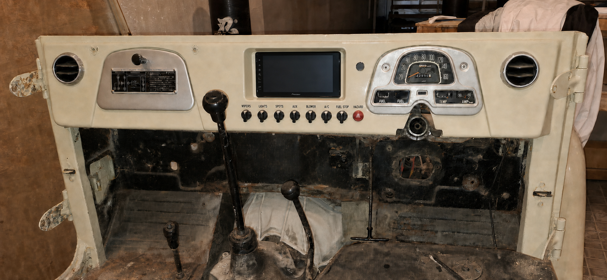

# J40 dashboard Rev I V36 — recessed Pioneer screen binnacle

**Status: REJECTED / superseded by V37.** This pocket-style interpretation was rejected after the owner clarified that “recessed” means the screen front is coplanar with the dashboard, not set behind it. Use [V37](dashboard_rev_i_v37_flush_inset_screen_proposal.md) instead.

V36 replaces the surface-mounted screen treatment in V35. The Pioneer display is set behind the dashboard face so that the original-height dashboard forms a shallow anti-glare hood around it. The glovebox, cluster, steering-column relationship, two outer vents, full-width lower edge and single row of controls remain unchanged.

The dimensioned concept and centre section are in [dashboard_rev_i_v36_recessed_screen_binnacle_diagram.svg](dashboard_rev_i_v36_recessed_screen_binnacle_diagram.svg).

## Recommended geometry

All dimensions below are cassette-local millimetres and are provisional until checked against the physical DMH-AP6650BT.

| Feature | Proposal | Purpose |
| --- | ---: | --- |
| Existing removable cassette envelope | 350 W × 210 H | Preserves the V35 zero-drop centre-only strategy |
| Pioneer published display/nose envelope | 229 W × 131 H × 13 D | Actual purchased unit controls the final trace |
| Pioneer published chassis envelope | 188 W × 108 H × 37 D | Shallow body makes a recessed installation plausible |
| Front recess mouth | 247 W × 149 H; X=51.5…298.5, Y=5…154 | Body-colour opening in the main dashboard plane |
| Inner reveal at screen plane | 233 W × 135 H; X=58.5…291.5, Y=17…152 | Gives a nominal 2 mm shadow gap around the 229 × 131 nose |
| Screen nose position | 229 W × 131 H; X=60.5…289.5, Y=19…150 | Centred in the inner reveal |
| Target glass setback | 15 mm behind the finished dashboard face | A real recess without unnecessarily consuming rear space |
| Prototype adjustment | 12, 15 and 18 mm positions | Select after glare, reach and depth-buck tests |
| Controls | Existing centres X=35…315 at 40 mm pitch, Y=177; nominal Ø30 heads | Leaves 8 mm between the recess mouth and control-head envelope |

The recess is deliberately asymmetric in section. The top wall has a 12 mm face-plane setback to form a useful brow, each side has about 7 mm, and the lower wall has only 2 mm of vertical rise. The lower shelf is therefore visually quiet and does not mask the bottom touch targets.

The 5 mm nominal top strip in this front layout is not to be used as an unsupported structural bridge. Continue the pocket into a hidden folded top return or tie it into the cassette's rear top rail. The actual vehicle trace decides that return.

## Support and service construction

1. Form the visible cassette from 1.5 mm CR4 mild steel with a body-colour, low-gloss finish.
2. Make the tapered recess throat as a separate 1.0–1.2 mm CR4 pressing/folded fabrication, welded or structurally bonded from the rear. Radius and finish the four visible transitions before paint.
3. Fit two rear horizontal carrier rails to the cassette, clear of the display and chassis ventilation areas.
4. Mount a removable 1.5 mm CR4 U-cradle to those rails with four M4 captive fasteners. Put the fore/aft adjustment slots in the cradle-to-rail joints, not in the Pioneer screw holes.
5. Pick up the receiver only at its four manufacturer mounting points using the supplied M3 × 8 mm screws. Do not load the glass, plastic nose or touch border.
6. Add small closed-cell EPDM snubbers at two lower chassis corners for vibration control. They are anti-rattle stops, not primary mounts.
7. Keep the rear of the cradle open. Provide loom strain relief on the cassette and preserve the manufacturer's ventilation space and connector bend radius.
8. Service by removing the complete centre cassette into the cabin, disconnecting the labelled loom, then releasing the receiver from the cradle on the bench. No screen-retaining screw should be visible from the finished face.

## Depth decision

Recessing the glass consumes behind-dashboard depth, so V36 uses an adjustable cradle rather than fixing the deepest position immediately. If the published 13 mm display depth and 37 mm chassis depth are additive, a 15 mm glass setback gives a nominal 65 mm physical stack from the dashboard face before connectors, cable bends and ventilation. This is an intentionally conservative packaging inference, not a manufacturer overall-depth drawing.

The existing 115 mm quotation buck therefore remains useful but is not yet a production clearance. The received unit, its fully mated loom and the manufacturer's ventilation requirement must be tested at the 12, 15 and 18 mm positions. Choose 15 mm if it passes; fall back to 12 mm if rear service space is marginal. Use 18 mm only if the buck proves it and the lower screen edge remains easy to touch from the driving position.

## Mock-up and release sequence

- Print the front diagram 1:1 and cut the 247 × 149 mm mouth in foamboard or 3 mm MDF.
- Make a sliding dummy block representing the screen nose and rear chassis; test glass setbacks of 12, 15 and 18 mm.
- Check visibility from the driver's normal eye point, sunlight reflection, touch access to every edge and interference with the full selector lever sweep.
- On receipt, trace the actual nose corner radii, button/touch-border keep-outs, chassis position and all four mounting points. Replace every nominal V36 opening and cradle coordinate with that trace.
- Install the actual loom in the full-depth buck and prove removal, ventilation, connector bends, glovebox operation, cluster clearance and the complete steering/stalk sweep simultaneously.
- Release a production DXF only after the mock-up and M4/M5/M9 checks are signed.

## Decision

**Recommended direction:** build the three-position recessed mock-up around a **15 mm nominal glass setback**, body-colour upper brow, narrow side cheeks and minimal lower lip. This uses the Pioneer unit's shallow architecture for a clearly integrated recess while keeping the existing zero-drop dashboard and control layout.
