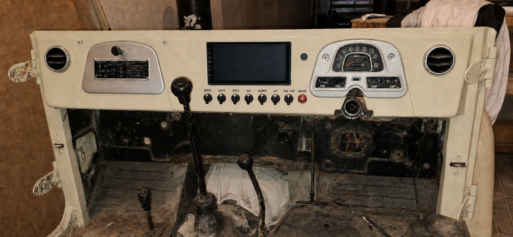

# J40 dashboard Rev I V37 — flush-inset Pioneer screen

**Status: support geometry retained, but the free centre-cassette perimeter is superseded by the V39 glovebox-line centre-bay insert. Production remains HOLD pending the received-unit trace, M1/M2 vehicle trace and full-depth buck.**

V37 embeds the Pioneer screen nose into the removable centre cassette so the black front face and the surrounding cream dashboard occupy the same local plane. There is no projecting trim and no recessed pocket, hood or tunnel. Only a fine black perimeter reveal separates the two surfaces.

Manufacturer basis: [Pioneer DMH-AP6650BT product page](https://www.pioneer.com.au/shop/car/multimedia-receivers/wireless-receivers/dmh-ap6650bt/) and [official Quick Start Guide](https://www.pioneer.com.au/wp-content/uploads/2024/12/DMHAP6650BT-Quick-Start-Guide.pdf).

See the [front elevation and support section](dashboard_rev_i_v37_flush_inset_screen_diagram.svg).

## Finished geometry

All coordinates are provisional cassette-local millimetres. The physical DMH-AP6650BT controls the production drawing.

| Feature | V37 proposal | Result |
| --- | ---: | --- |
| Removable centre cassette | 350 W × 210 H | Retains the zero-drop V35 architecture |
| Published Pioneer front/nose | 229 W × 131 H × 13 D | Entire black front is inlaid into the cassette |
| Provisional face aperture | 232 W × 134 H | Nominal 1.5 mm dark reveal on all four sides |
| Screen nose location | X=60.5…289.5, Y=12…143 | Centred horizontally; leaves the controls below |
| Aperture location | X=59…291, Y=10.5…144.5 | Final corner radii come only from the actual unit trace |
| Finished front-plane target | `Z_SCREEN = Z_DASH` | Straightedge passes from cream metal across the black screen front without a step |
| Flushness acceptance | target 0.0 mm; acceptable 0.0 to 0.5 mm behind; never proud | Protects the screen edge while reading visually as flush |
| Existing control row | centres X=35…315 at 40 mm pitch, Y=177; nominal Ø30 heads | Nominal 17.5 mm clear from aperture bottom to control-head envelope |

“Flush” refers to the local tangent plane of the centre cassette. The retained dashboard end contours and upper/lower folds do not need to be flattened.

## Rear support proposal

1. Cut only the 232 × 134 mm provisional face aperture in the 1.5 mm CR4 removable cassette. Do not form a visible step around it.
2. Add a hidden 1.5 mm CR4 doubler ring behind the aperture, at least 15 mm wide where space permits. Tie its narrow top zone into the cassette's hidden top return so the opening is not carried by the small visible strip alone.
3. Add two rear rails to the doubler/cassette structure. Mount a removable U-cradle to the rails with four M4 captive fasteners.
4. Use the receiver's four manufacturer mounting points and supplied M3 × 8 mm screws to connect the Pioneer to the cradle. Keep these holes round and exact.
5. Put depth adjustment in the cradle-to-rail joints. Use 0.5 mm stainless shim packs or stepped slots to set the screen front plane; do not elongate the Pioneer mounting holes.
6. Support the receiver through its metal mounting points only. The aperture edge, plastic nose and glass do not carry weight.
7. Back the 1.5 mm perimeter reveal with a recessed black closed-cell EPDM light seal. It must sit behind the front plane and must not squeeze the display nose or leave a proud bead.
8. Add two small non-load-bearing EPDM snubbers at the lower chassis corners and a separate loom strain-relief clamp on the cassette.
9. Keep the rear cradle open for cooling. Do not fabricate a sealed bucket around the chassis.

## Installation and service

The screen and cassette are assembled together on the bench. With the cassette face protected on a flat checking table, adjust the M4 rail joints until the cream face and screen front are coplanar. Check with a straightedge at the top, bottom and both sides, then lock the fasteners and witness-mark them.

The complete cassette, screen and controls install as one cabin-side service module. To service the receiver, remove the cassette, support it, disconnect the labelled loom and then release the Pioneer from the rear cradle. No screen fastener is visible on the finished face.

## Mock-up gates

- Make a 1:1 MDF or 3 mm plastic cassette with a 232 × 134 mm trial aperture.
- First use a 229 × 131 × 13 mm dummy nose and 188 × 108 × 37 mm dummy chassis; set the front surfaces exactly flush.
- On receipt, trace the real nose outline, corner radii, buttons/touch keep-outs, chassis offset and all four screw locations. Replace the dummy with the actual receiver before committing metal.
- Prove that the physical unit can pass through the intended assembly/removal route. The front nose is larger than the chassis, so the cradle sequence and cassette opening must be rehearsed.
- Install the real connectors and service loops, then verify ventilation and the complete 115 mm quotation buck. The published chassis depth does not include plugs, bends or removal clearance.
- Check touch access, reflection and visibility from the driver position; check that all selector levers clear the screen and reveal.
- Release production CNC only after the straightedge flushness check and M4/M5/M9 rear-package proof pass.

## Decision

Retain the V37 flush-screen details for the V39 mock-up: 232 × 134 mm provisional aperture, 1.5 mm nominal screen reveal, screen front targeted exactly at the local dashboard plane, and an adjustable rear U-cradle. The visible insert perimeter and vehicle cut strategy now come from the [V39 glovebox-line centre-insert proposal](dashboard_rev_i_v39_glovebox_line_insert_proposal.md).
