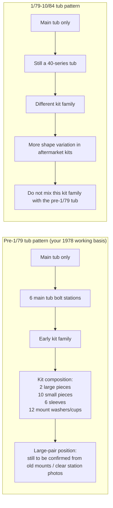
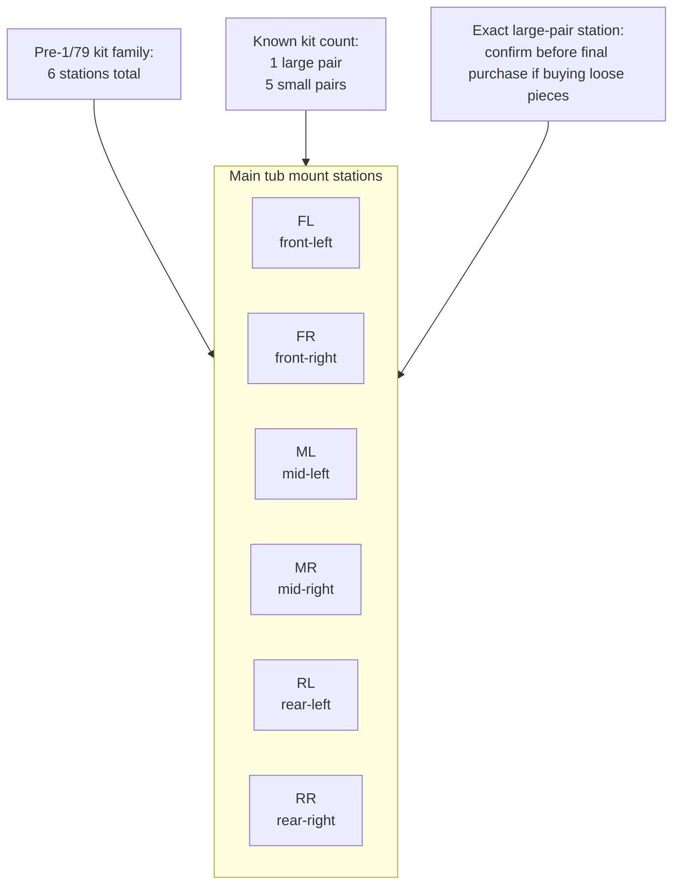

# J40 Tub Refit Body-Mount Pack

Date: 2026-04-27

Vehicle basis:
- `1978 Toyota Land Cruiser J40`
- Treat this as the pre-`1/79` `BJ40/FJ40` tub-mount pattern unless one of the six stations proves otherwise on the thread gauge.

Scope:
- This pack is for the **main tub-to-chassis body mounts only**.
- It does **not** include radiator/grille support pads, general panel hardware, or suspension bushes.

## 1. Locked Decision

This refit is locked to the **pre-`1/79` `BJ40/FJ40` six-station tub mount pattern**.

What is locked now:
- Buy or reproduce the **pre-`1/79` main tub mount kit only**.
- Do **not** buy any `1/79-1984` kit.
- Keep the mount system as **one matched set**. Do not mix random old cushions, mixed durometers, or half one-brand / half local copies.
- Use **class `8.8` minimum** structural hardware for the mount bolts.

Preferred ready-made kit reference:
- `SOR 105-105A-BLK` firm-ride polyurethane kit for `1958-12/78 FJ40/BJ40`, with hardware.

Acceptable fallback imported references:
- `BTB 20-2154` body mount kit with metric hardware for `BJ40/FJ40`.
- `Cruiser Corps 517-103` body mount set for `1958-12/78 FJ40/BJ40`.

Local reproduction target if buying in Bilal Ganj:
- One matched pre-`1/79` `BJ40/FJ40` tub set equivalent to:
  - `2` large mount pieces
  - `10` small mount pieces
  - `6` sleeves
  - `12` heavy mount washers/cups
  - hardware for `6` main tub bolt stations

## 2. The Two Tub Patterns

The confusing part is that the 40-series gets sold online as one long `1958-1984` family, but the **main tub mount pattern splits into two different groups**:

| Pattern | Date Range | What Changes | Why It Matters |
| --- | --- | --- | --- |
| Pre-late tub | `1958` to `12/78` | Early main tub mount geometry | Uses the early kit family and early cushion stack |
| Late tub | `1/79` to `10/84` | Revised tub/floor/mount stack geometry | Uses a different kit family even though it is still a 40-series body |

What that means in practical terms:
- The **earlier tub** and the **later tub** are close enough to look like the same vehicle family, but not close enough to buy body-mount parts blindly across the split.
- Vendors often hide this by saying `58-79` or `58-84`, but the safer split is:
  - **up to December 1978**
  - **January 1979 onward**
- That is why some vendor pages list one kit for `1958-12/78` and a different kit for `1/79-10/84`.

What changes between them for your purchase:
- mount cushion shape mix
- sleeve and washer stack details
- hardware package assumptions
- fit at the tub floor access wells / mount seats

Why I locked your pack to the early pattern:
- the project baseline is a `1978` J40
- the early-pattern sources are the ones that match `BJ40/FJ40` pre-`1/79`
- nothing in the current body-off evidence proves a later `1979-1984` tub swap

What would overturn that assumption:
- if your old mounts, access wells, or tub seats physically match the `1/79-10/84` kit family instead
- if a previous owner replaced the tub with a later shell

### 2.1 Pattern Diagram



### 2.2 Main Tub Station Diagram

This is the safe **station map** for the main tub. It shows the six bolt stations, but it does **not** pretend the large-pair station is proven yet.



### 2.3 Rail-Accurate Chassis Diagram

This is the practical **chassis-shaped top view** for refit planning.

Legend:
- `O` = main tub-to-chassis connection point used in this pack
- `X` = front support point visible on chassis but **not** part of this main tub mount pack
- `[ ]` = rail-side mount pedestal / seat / outrigger where the rubber stack lands

```text
TOP VIEW - MAIN TUB CONNECTIONS ON THE CHASSIS RAILS

                                  FRONT
                                    ^
                                    |
                    front support X     X front support
                         (separate radiator / grille pads)
                          \                         /
                           \_______________________/

        LEFT CHASSIS RAIL  =================================  RIGHT CHASSIS RAIL
                           [ FL ] O                 O [ FR ]
                             |                           |
                             |-- tub front floor / firewall braces land here --|

                           [ ML ] O                 O [ MR ]
                             |                           |
                             |-- tub center floor / seat-box region lands here --|

                           [ RL ] O                 O [ RR ]
                             |                           |
                             |-- tub rear floor / wheelhouse support lands here --|

                           =================================
                                 rear crossmember zone
                                    |
                                    v
                                   REAR
```

The six **used** main tub connection points are:
- `FL`
- `FR`
- `ML`
- `MR`
- `RL`
- `RR`

Plain-English rule:
- **yes**, the main tub is carried by the **left and right chassis rails**
- practically this means **3 mount stations on the left rail side** and **3 mount stations on the right rail side**
- the tub is **not** hung from the gearbox / transfer case centerline
- the tub is **not** primarily mounted to the very front radiator support points in this pack

The two `X` points at the very front are shown only so the chassis shape makes sense.
- They are **not** included in the six-station main tub mount pack.
- Treat them separately as front support / radiator support related mounts.

### 2.3A Rear-Looking-Forward Diagram

This is the same logic, but drawn more like your current **body-off chassis photo angle**.

```text
REAR-LOOKING-FORWARD VIEW - TUB REMOVED

                 FRONT OF VEHICLE
                        ^
                        |
            FL seat [ ]     engine bay gap     [ ] seat FR
               |                                     |
LEFT RAIL  ====+=====================================+====  RIGHT RAIL
               |                                     |
            ML seat [ ]   gearbox / floor gap    [ ] seat MR
               |                                     |
LEFT RAIL  ====+=====================================+====  RIGHT RAIL
               |                                     |
            RL seat [ ]    rear floor support    [ ] seat RR
               |                                     |
LEFT RAIL  ====+=====================================+====  RIGHT RAIL

                 rear crossmember / tow end
                        |
                        v
                       REAR
```

What this is trying to show:
- the **rails are the main support lines**
- the tub does **not** bolt all along the rail length
- it lands only on **six small rail-mounted seats / pedestals / outriggers**
- the tub floor then spans across the chassis from left seat to right seat at each row

Why the rail attachment is easy to miss in the wide chassis photo:
- the real mount seats are relatively **small**
- they sit low against the rail and can disappear under dust, shadows, or angle
- some are more like **pads or short brackets** than obvious tall towers
- the drivetrain in the middle draws the eye, but it is **not** what carries the tub

### 2.3B One-Station Physical Picture

If you isolate one station, this is the support path you are actually building:

```text
ONE USED BODY-MOUNT STATION

      tub floor brace / reinforced seat
                   ||
             upper cup / washer
                   ||
               upper rubber
                   ||
               steel sleeve
                   ||
               lower rubber
                   ||
             lower cup / washer
                   ||
          shim pack only if needed
                   ||
      small mount seat / pedestal / outrigger
          welded to left or right chassis rail
                   ||
               chassis rail
```

This is the key correction to the earlier abstract sketch:
- the tub is **absolutely attached to the rail structure**
- it is just attached through **small localized seats welded to the rails**, not by sitting directly on the whole rail top

### 2.3C Exact Bracket Classification On Your Chassis

The missing distinction in the earlier diagrams was that your chassis shows **two different bracket families**:

- **large gusseted front extensions** with a top-face hole
- **smaller pad / pedestal mount seats** with a single top hole

Those are **not** the same job.

```text
TOP VIEW - BRACKET TYPES ON YOUR CURRENT CHASSIS

                           FRONT
                             ^
                             |
                  [ FSL ]         [ FSR ]
                large gusseted   large gusseted
                front support    front support
                bracket only     bracket only

LEFT RAIL   ===== [ FL ] ===== [ ML ] ===== [ RL ] =====
RIGHT RAIL  ===== [ FR ] ===== [ MR ] ===== [ RR ] =====

            small mount seat   small mount seat   small mount seat
            used by tub        used by tub        used by tub

                             |
                             v
                            REAR
```

Legend:
- `FSL` / `FSR` = front support brackets only, separate from the six-point main tub pack
- `FL/FR/ML/MR/RL/RR` = the six **main tub** mount seats

Working classification from your current photo set:

| What You Can See | Use In Refit | Part Of Main Tub 6-Point Pack | What Goes There |
| --- | --- | --- | --- |
| Large gusseted outboard extension with a hole in the **top face** at the nose of the chassis | Yes | No | Separate front support / radiator-grille-front clip mount pad stack |
| Smaller square or rectangular **pad / pedestal / seat** with one centered hole in the top face, welded off the rail | Yes | Yes | Full tub mount stack: cup, rubber, sleeve, rubber, cup, shim if needed, `M10 x 1.25` hardware |
| Rear row top pad / pedestal with one hole near the rear floor / wheelhouse row | Yes | Yes | Rear tub mount stack at `RL` or `RR` |
| Large round holes in the rail web | No | No | Nothing; these are not body-mount stations |
| Plain rail top or rail side with no pad | No direct body mount | No | Nothing; the tub does not land on the bare rail everywhere |

This is the exact answer to the extension question:
- the **big front gusseted extensions** are **used**, but as **front supports only**
- the **small single-hole pads / pedestals** are the ones used for the **main tub attachment**

What that means for your photo where both appear together:
- the **small square pedestal halfway down the rail** is a **main tub seat**
- the **larger gusseted bracket above / ahead of it** is a **front support bracket**, not one of the six main tub stations
- the **large round web hole in the side of the rail** is **not** a mount point

### 2.3D The Middle Side Extensions Are Not All Front Supports

The correction to lock in is this:
- **side extension** does **not** automatically mean **front support**
- some outboard brackets in the **middle** of the chassis are the actual `M` and `R` tub rows

Use this right-side profile rule:

```text
RIGHT-SIDE CHASSIS PROFILE

FRONT                                                            REAR
  |                                                                |
  v                                                                v

  [ FSR ] ---- separate front support extension
              uses front-support pad / isolator, not main tub rubber

  [ FR ]  ---- front-right main tub seat
              uses early main-tub rubber stack

  [ MR ]  ---- middle-right main tub seat
              uses early main-tub rubber stack
              this is the one that often looks like "another side extension
              in the middle" when viewed from the front quarter

  [ RR ]  ---- rear-right main tub seat
              uses early main-tub rubber stack
```

Practical identification rule on your chassis:
- if the bracket is the **big forward nose extension** under the radiator / front clip area, treat it as **front support only**
- if the bracket is an **outboard pad or pedestal with one vertical mounting hole** under the floor / seat-box / rear wheelhouse rows, treat it as a **main tub station**

So yes, there **are** more outboard brackets in the middle of the chassis, and those are **not extra oddball mounts**. They belong to the normal six-point main tub system and use the **same early main-tub rubber family** as the other tub rows.

### 2.4 What Goes At Each Used Station

Every one of the six used stations gets the same **basic stack order**:

```text
body brace / tub reinforcement
-> upper washer or cup
-> upper rubber cushion
-> steel sleeve through the center
-> lower rubber cushion
-> lower washer or cup
-> rail-side pedestal / seat / outrigger
-> M10 x 1.25 hardware
```

What changes by station:
- final bolt length
- original shim thickness
- possible large-cushion versus small-cushion assignment at one station pair

What does **not** change:
- the mount still lands on a **left-rail or right-rail seat**
- the sleeve still controls crush
- shims stay at the **metal-to-metal seat interface**, not inside the rubber stack

Working station map:

| Station | Side | Chassis Region | What To Fit There |
| --- | --- | --- | --- |
| `FL` | Left rail | Front tub / firewall row | One complete mount stack, original shim pack returned by station, final measured `M10 x 1.25` bolt |
| `FR` | Right rail | Front tub / firewall row | One complete mount stack, original shim pack returned by station, final measured `M10 x 1.25` bolt |
| `ML` | Left rail | Center floor / seat-box row | One complete mount stack, original shim pack returned by station, final measured `M10 x 1.25` bolt |
| `MR` | Right rail | Center floor / seat-box row | One complete mount stack, original shim pack returned by station, final measured `M10 x 1.25` bolt |
| `RL` | Left rail | Rear floor / wheelhouse row | One complete mount stack, original shim pack returned by station, final measured `M10 x 1.25` bolt |
| `RR` | Right rail | Rear floor / wheelhouse row | One complete mount stack, original shim pack returned by station, final measured `M10 x 1.25` bolt |

### 2.5 Cross-Section Diagram

This is the physical stack you should picture at each used mount point.

```text
TUB / BODY MOUNT CROSS-SECTION

  tub floor reinforcement / body brace
            ||
      upper washer / cup
            ||
        upper rubber
            ||
        steel sleeve
            ||
        lower rubber
            ||
      lower washer / cup
            ||
  shim pack only if original or needed for alignment
            ||
   frame mount pedestal / outrigger / seat
            ||
      left or right chassis rail
```

Important clarification:
- the tub does **not** usually bolt to the bare flat rail with no bracket
- it bolts to a **mount pedestal / outrigger / seat** that is part of, or welded to, the left/right rail structure
- so when you look at the chassis, the rails are the main support lines, but the actual connection is at the **mount seats on those rails**

## 3. Why This Is The Correct Basis

This is the strongest source-backed fit basis available right now:
- Specter Off-Road lists the pre-`12/78` `FJ40` OEM mount count as `2` large body mounts and `10` small body mounts.
- Daystar installation instructions for the early `FJ40` body mount kit explicitly warn to preserve shim position and to watch the front grille support and shift boot during body lift/refit.
- Toyota frame bracket listings for the 40-series distinguish **`2` front body support brackets** from **`6` body-mount brackets** on the frame. That matches what your chassis photos are showing: the big nose outriggers are separate front supports, while the six smaller rail seats carry the tub.
- Toyota 40-series inside-cabin body-mount inspection plug listings call for `6` plugs per vehicle on the later shell pattern, which matches the working assumption of `6` through-floor tub mount stations.

Inference:
- The **main tub** is being treated as `6` primary bolt stations using `12` cushion pieces total.
- The front radiator/grille support is kept **out of this pack** because the current body-off photos show the radiator/support still on the chassis and not part of the tub return stack.

## 4. Exact Pack To Freeze

### 4.1 Mount Cushion Kit

Locked geometry:

| Item | Spec | Qty |
| --- | --- | ---: |
| Large mount pieces | Pre-`12/78` `BJ40/FJ40` pattern | 2 |
| Small mount pieces | Pre-`12/78` `BJ40/FJ40` pattern | 10 |
| Steel sleeves | One per main tub station | 6 |
| Heavy mount washers/cups | Upper/lower matched set per station | 12 |

Material rule:
- If you buy a complete imported kit, keep the set matched as supplied.
- If you buy local-only, ask for **OEM-pattern rubber first** or a **matched soft-flex / OEM-firm polyurethane set** from one maker only.
- Do not mix rubber on one side and polyurethane on the other.

### 4.2 Hardware

Locked hardware schedule for the **main tub mounts only**:

| Item | Spec | Installed Qty | Buy Qty |
| --- | --- | ---: | ---: |
| Main body-mount bolts | `M10 x 1.25`, class `8.8` minimum, JIS head preferred | 6 | 8 |
| Main body-mount nuts | `M10 x 1.25`, all-metal lock nut preferred | 6 | 8 |
| Heavy flat / formed mount washers | To suit mount kit seats | 12 | 12-16 |
| Sleeves | To suit cushion kit | 6 | 6 |

What is locked:
- Thread family: `M10 x 1.25` is the working standard for the tub mounts.
- Grade: `8.8` minimum.
- Station count: `6`.

What is still measurement-gated:
- Final **bolt lengths** by station.
- Whether any station has been altered in the past and no longer matches `M10 x 1.25`.

Do not use:
- Unmarked scrap bolts.
- `4.6` / `5.8` mild-steel hardware.
- Mixed thread pitch.
- Spring/split washers inside the rubber stack.
- Tall towers of generic washers instead of proper shims.

## 5. Shim And Spacer Plan

### 5.1 Station Naming

Label the six tub stations before cleaning:
- `FL`, `FR` = front left / front right
- `ML`, `MR` = middle left / middle right
- `RL`, `RR` = rear left / rear right

### 5.2 Shim Rule

The shim plan is:
- Preserve every original shim pack by station.
- First dry set uses the **original shim stack only**, returned to the same station it came from.
- New shims are only for final leveling/alignment after the dry set proves what changed.

Allowed new shims:
- Flat steel shims only
- Thickness mix: `1 mm`, `2 mm`, `3 mm`, `5 mm`
- ID: suit `M10`
- OD: large enough to support the seat properly

Placement rule:
- Reinstall shims at the same **metal-to-metal interface** where the old shim was found.
- Do **not** insert shims inside the rubber sandwich.
- Do **not** use loose standard washers as stack height spacers.

Stop rules:
- If a station needs more than `5 mm` of **new** shim beyond its original pack, stop and check bracket height, tub repair geometry, or previous accident distortion.
- If one station ends up more than `8 mm` total away from its opposite-side partner, stop and check the frame/tub before tightening.
- If a mount pedestal or nut repair starts driving the shim requirement, fix the bracket/thread first. Do not hide a geometry problem with shims.

### 5.3 Practical Trial-Fit Sequence

1. Clean all six pedestal tops and all six cabin bolt access wells.
2. Bag and label the old shims by station.
3. Set the tub down with all six stations loose.
4. Refit original shims only.
5. Center the tub on the frame.
6. Check steering column, pedal box, shift openings, firewall-to-engine clearance, and rear tub position.
7. Only then add or subtract flat steel shims.
8. Final-tighten only after all six stations sit square with no forced twist.

### 5.4 Body-Side Prep To Match The Six Chassis Seats

The body has to be prepared to meet the **six smaller rail seats**, not the whole rail and not the two big front support brackets.

Body-side prep by row:

| Row | Body-Side Structure To Prep | What Must Be True Before Set-Down |
| --- | --- | --- |
| `FL` / `FR` | front floor / firewall brace seats | body hole clear, reinforcement flat, no crushed lip, access from inside the tub still open |
| `ML` / `MR` | center floor / seat-box brace seats | repair patches must not change seat height, sleeve path must stay square, no seam sealer trapped under the cup seat |
| `RL` / `RR` | rear floor / wheelhouse support seats | rust must be repaired before loading the mount, hole must stay centered in the reinforced seat, no soft thin metal left at the landing |

Body-side rules:
- Do not let the rubber stack hide weak tub metal. The **metal seat** on the body side has to be solid first.
- Do not weld a patch that changes one body-mount landing height and then try to compensate with a random washer stack.
- Keep the cabin access wells usable so each mount can be installed and checked from above.
- On any repaired seat, dry-fit the sleeve and cup before paint or seam sealer closes the hole shape.
- The body only wants to see **six clean reinforced landing points** that match `FL/FR/ML/MR/RL/RR`; everything else is just floor structure around them.

### 5.5 Chassis Fixing Control: Rubber, Sleeve, Shim, and Front-Support Spec

This is the chassis-fixing control sheet for the body-mount system.

Use it as the single procurement rule for:
- local rubber reproduction
- Bilal Ganj sourcing
- imported kit fallback
- tub dry-set and final tighten

| Item | Locked Requirement | Qty / Positions | Acceptance Gate | Still Open |
| --- | --- | ---: | --- | --- |
| Main tub rubber set | Pre-`1/79` early `BJ40/FJ40` six-station pattern, matched set only | `6` stations | `NEW_ONLY`; keep one maker / one hardness across the set; no mixed random bushes | Exact large-pair station if buying loose pieces instead of a matched kit |
| Main tub large pieces | OEM-pattern large body-mount cushions | `2` pieces | Must match old large sample OD / thickness / sleeve fit | Sample dimensions still need caliper confirmation if reproducing locally |
| Main tub small pieces | OEM-pattern small body-mount cushions | `10` pieces | Must match old small sample OD / thickness / sleeve fit | Sample dimensions still need caliper confirmation if reproducing locally |
| Front support rubber set | Separate front radiator / grille support isolator pair for the nose side extensions | `2` positions | `NEW_ONLY`; treat as separate from the six main tub mounts | Exact bracket style / stack height at the nose still needs sample check |
| Main tub sleeves / crush tubes | Steel sleeves matched to the main tub rubber stack | `6` minimum | Sleeve ID must match bolt; sleeve OD must match rubber bore; sleeve length must stop over-crush | Final sleeve length still needs sample measurement |
| Main tub cup washers / seats | Heavy upper/lower matched mount washers or cups | `12` | Must seat the rubber properly and match body/pedestal landing area | Final OD only needs checking if local cups are fabricated |
| Main tub hardware | `M10 x 1.25`, class `8.8` minimum, JIS-style structural hardware preferred | `6` installed, buy `8` | Marked structural hardware only; no unmarked scrap bolts | Final bolt lengths by station |
| Shim / spacer pack | Flat steel shims only, `1/2/3/5 mm`; `M10` ID for tub rows, keep `M12` option available if a front support or prior repair needs it | `1` assorted pack | Do not put shims inside the rubber sandwich; do not use random washer towers | Final per-station add/subtract only after first dry set |
| Captive-thread repair contingency | `M10 x 1.25` weld nuts / repair nuts plus `3 mm` steel repair tabs | `2` nuts + `2` tabs minimum | Repair the thread or seat first; do not hide damage with shims | Depends on what cleaning reveals under each pedestal |

Recovered acceptance rules from the earlier buy packs and mechanic notes:
- Carry one old mount sample with sleeve when buying or fabricating.
- Match **sleeve ID, sleeve OD, sleeve length, rubber OD, rubber thickness, and total stack height**.
- Keep rubber hardness consistent across the full set.
- Reject mixed old/new, mixed hard/soft, or mixed one-side-only replacement sets.
- Preserve every original shim pack by station before cleaning or blasting.
- Existing flat steel shims can be reused only if they stay flat and rust-free after cleanup.

Hard no-go rules:
- no random washer stacks used as body-height spacers
- no spring washers inside the rubber mount stack
- no mounting offset fabricated just to make wrong rubbers fit
- no mixing the separate front-support rubbers into the six main tub stations

### 5.6 Recovered Custom-Rubber Vendor Brief

The repo does **not** currently preserve the original named `Akka` message text, but the requirement set below is the recovered brief that matches the earlier Bilal Ganj size sheet, mechanic checklist, active buy rows, and current body-off chassis evidence.

Use this if sending the job to a local rubber fabricator:

```text
Need a complete early Toyota Land Cruiser BJ40/FJ40 body-mount rubber set for a pre-1/79 tub pattern.

Main tub requirement:
- 6 main tub mount stations
- one matched set only
- 2 large mount pieces
- 10 small mount pieces
- 6 steel sleeves / crush tubes
- 12 heavy cup washers / seat washers
- this set is for the main tub only

Separate front support requirement:
- 2 front support isolators / pads for the nose side extensions
- separate from the 6 main tub mounts

Fit-critical requirements:
- match old sample sleeve inner diameter to bolt size
- match sleeve outer diameter to rubber center bore
- match sleeve length to mount stack height
- match rubber outer diameter to the original cup / seat
- match rubber thickness and total stack height to keep OEM body height
- keep hardness consistent across the full set
- do not mix different hardnesses or mixed leftover patterns

Hardware interface:
- main tub bolts are M10 x 1.25
- use sleeves that stop over-crush when tightened

Shim rule:
- body alignment shims are separate flat steel pieces only
- 1 mm / 2 mm / 3 mm / 5 mm thickness mix
- no random washer stacks in place of shims

Condition rule:
- new replacement only
- no used donor rubbers
- no cracked, crushed, or uneven old pieces reused as part of the final set
```

## 6. What Still Needs Measuring On The Vehicle

These are the remaining gates before final bolt lengths and any local reproduction order are truly closed:

| Measure / Check | Qty | Why It Still Matters |
| --- | --- | --- |
| Old large mount OD / thickness / sleeve length | 1 sample | Confirms the large-piece geometry locally |
| Old small mount OD / thickness / sleeve length | 1 sample | Confirms the small-piece geometry locally |
| Sleeve ID / OD / length | 6 stations or 2 sample types | Confirms sleeve fit and crush control |
| Actual thread pitch at each station | 6 | Confirms `M10 x 1.25` everywhere and catches prior repairs |
| Final bolt length by station | 6 | This is the main hardware dimension still open |
| Original shim thickness by station | 6 packs | Needed for first dry-set baseline |
| Pedestal top seat diameter and condition | 6 | Confirms washer/cup size and whether any bracket needs repair |
| Thread/nut condition below each station | 6 | Tells you if repair nuts/plates are needed before refit |
| Tub-to-frame gap after first set-down | 6 | Drives final shim adds/subtracts |
| Left-right row height difference (`F`, `M`, `R`) | 3 rows | Prevents masking twist with random shimming |

If one station is damaged badly enough to need fabrication, add this measurement:
- pedestal height from top of frame rail to mount seat on the good side, then mirror it to the repaired side.

## 7. Wire-Cup / Grinder Note For Your Current Chassis Work

Use the angle grinder with wire cup now on:
- pedestal tops
- the underside seating lips
- the access-well witness areas
- the visible nut/thread repair zones

Do not use it to:
- thin the top lip of a mount pedestal
- flatten a formed seat
- eat into the bolt threads or nut faces
- polish away the witness marks that tell you where the old shim sat

Best use here:
- clean each seat just far enough to expose solid parent metal, old shim witness lines, and any crack at the bracket edge.
- hold final coating off the exact mount seat until after the dry fit is proven.

## 8. Key Photo References

Consolidated chassis shortlists created for this refit:
- [chassis_body_mount_station_context](</Users/davidpridmore/IdeaProjects/J40/photos/index/by_specific_component/chassis_body_mount_station_context>)
- [chassis_body_mount_seat_closeups](</Users/davidpridmore/IdeaProjects/J40/photos/index/by_specific_component/chassis_body_mount_seat_closeups>)
- [chassis_body_mount_body_side_pairing](</Users/davidpridmore/IdeaProjects/J40/photos/index/by_specific_component/chassis_body_mount_body_side_pairing>)
- [chassis_body_mount_rubber_context](</Users/davidpridmore/IdeaProjects/J40/photos/index/by_specific_component/chassis_body_mount_rubber_context>)

### 8.1 Primary Layout References

Use these to understand **where the tub lands on the rails**.

Current thread evidence from `2026-04-27`:
- rear-looking-forward full chassis photo: best overall orientation for the two chassis rails and the three front/mid/rear rows
- tub shell on its side: best overall orientation for the underside braces and channels that eventually land on the mount seats
- body off and chassis rolling, with drivetrain and radiator still on chassis

Repo photo references:
- [20260423_232202_gp_ryYH6xZg.jpg](/Users/davidpridmore/IdeaProjects/J40/photos/20260423_232202_gp_ryYH6xZg.jpg) - clearest rail-side chassis context in the repo; use for rail cleaning and bracket-condition orientation
- [20260405_234541.jpg](/Users/davidpridmore/IdeaProjects/J40/photos/20260405_234541.jpg) - rear crossmember / rear rail-end context
- [20260405_234802.jpg](/Users/davidpridmore/IdeaProjects/J40/photos/20260405_234802.jpg) - underside row context showing the body-side landing path above the rail structure

### 8.2 Tub-Side References

Use these to understand **what on the tub is landing on the mount stack**.

- [20260405_234652.jpg](/Users/davidpridmore/IdeaProjects/J40/photos/20260405_234652.jpg) - tub floor seam and body-mount rust zone; use to inspect body-side reinforcement and repair risk
- [20260423_183704_gp_a5qmyeOA.jpg](/Users/davidpridmore/IdeaProjects/J40/photos/20260423_183704_gp_a5qmyeOA.jpg) - body-side reinforcement area with corrosion exposure
- [20260423_183712_gp_46OsAntA.jpg](/Users/davidpridmore/IdeaProjects/J40/photos/20260423_183712_gp_46OsAntA.jpg) - second body-side reinforcement view; use to cross-check how much structure is really carrying the mount

Important reading of the tub photo set:
- the long underside braces and channels are structural
- **not every channel rib is a mount point**
- only the reinforced seats that line up with `FL/FR/ML/MR/RL/RR` become actual body-mount stations

### 8.3 Context-Only Mount Detail Photos

Keep these as **supporting evidence only**, not as station-accurate proof.

- [20260405_234546.jpg](/Users/davidpridmore/IdeaProjects/J40/photos/20260405_234546.jpg) - very tight mount / crossmember close-up; useful for rust context, not for station naming
- [20260405_234542_gp_hucEa1CQ.jpg](/Users/davidpridmore/IdeaProjects/J40/photos/20260405_234542_gp_hucEa1CQ.jpg) - general frame / mount-point context, but too blurred for exact station assignment
- [20260405_234547_gp_3iX5cWQQ.jpg](/Users/davidpridmore/IdeaProjects/J40/photos/20260405_234547_gp_3iX5cWQQ.jpg) - blurred mount detail; context only
- [20260405_234654_gp_P3KYxxIA.jpg](/Users/davidpridmore/IdeaProjects/J40/photos/20260405_234654_gp_P3KYxxIA.jpg) - blurred bracket detail; context only
- [20260405_234802.jpg](/Users/davidpridmore/IdeaProjects/J40/photos/20260405_234802.jpg) - usable for general underside geometry, not for exact row/side naming
- [20260405_234812_gp_twNBeWvQ.jpg](/Users/davidpridmore/IdeaProjects/J40/photos/20260405_234812_gp_twNBeWvQ.jpg) - useful to visualize the body-side landing above the rail, but still not strong enough for exact station naming by itself
- [20260405_234839.jpg](/Users/davidpridmore/IdeaProjects/J40/photos/20260405_234839.jpg) - blurred underside context only
- [20260405_234840_gp_IoFfvLNw.jpg](/Users/davidpridmore/IdeaProjects/J40/photos/20260405_234840_gp_IoFfvLNw.jpg) - blurred underside context only
- [20260423_232345_gp_jFn65JBQ.jpg](/Users/davidpridmore/IdeaProjects/J40/photos/20260423_232345_gp_jFn65JBQ.jpg) - later teardown rail photo; use as context only unless paired with a clearer wide shot

### 8.3A Rubber Context Photos

These are the best current photo links for the body-mount rubber discussion. They are useful for context and vendor briefing, but they are **not** sharp enough to replace caliper measurement.

- [20260405_234546.jpg](/Users/davidpridmore/IdeaProjects/J40/photos/20260405_234546.jpg) - chassis-side mount and crossmember detail; use as context for rubber seat geometry
- [20260405_234652.jpg](/Users/davidpridmore/IdeaProjects/J40/photos/20260405_234652.jpg) - tub-side seam / mount rust context; use to explain why stack height and seat integrity matter

### 8.4 Photos Still Worth Taking Before Final Tighten

These would close the remaining ambiguity fast:
- one straight-down photo of each pedestal top at `FL`, `FR`, `ML`, `MR`, `RL`, `RR`
- one matching underside photo of each tub seat at `FL`, `FR`, `ML`, `MR`, `RL`, `RR`
- one photo of the removed old mounts laid out in exact removal order by station

## 9. Practical Shopping List

### 9.1 Buy Now Without Waiting For Final Bolt Lengths

| Item | Exact Ask | Qty |
| --- | --- | ---: |
| Main tub body-mount kit | Pre-`1/79` `BJ40/FJ40` six-station kit, matched set | 1 |
| Front support mount set | Front radiator / grille support frame mount pair, matched left/right | 1 pair |
| Front support shims / pads | Core-support shims or pads to suit the front support pair | 2 |
| Large mount pieces if buying loose | OEM-pattern large mounts | 2 |
| Small mount pieces if buying loose | OEM-pattern small mounts | 10 |
| Sleeves | To match the kit geometry | 6 |
| Heavy mount washers/cups | Matched upper/lower seat washers | 12 |
| Flat steel shim pack | `1/2/3/5 mm`, `M10` ID or blank stock to cut | 1 assortment |
| Repair contingency | `M10 x 1.25` weld nuts or repair nuts | 2 |
| Repair contingency | `3 mm` steel tabs/plates for nut or bracket repair | 2 small pieces |

Recommended shim quantity if buying individual pieces:
- `1 mm x12`
- `2 mm x12`
- `3 mm x8`
- `5 mm x8`

### 9.2 Buy Right After Measurement

| Item | Exact Ask | Qty |
| --- | --- | ---: |
| Main body-mount bolts | `M10 x 1.25`, class `8.8`, final measured lengths | 8 |
| Main body-mount nuts | `M10 x 1.25`, all-metal lock nuts | 8 |
| Extra heavy flat washers | `M10`, heavy body-mount use | 4-6 |

## 10. Vendor Message Block

Use this verbatim if you want to send one short message to a vendor:

```text
Need a pre-1/79 Toyota Land Cruiser BJ40/FJ40 main tub body-mount kit only.

Pattern required:
- 6 main tub mount stations
- 2 large mount pieces
- 10 small mount pieces
- 6 sleeves
- 12 heavy mount washers/cups

Hardware required:
- M10 x 1.25 body-mount hardware
- class 8.8 minimum
- 6 installed positions plus 2 spare bolts/nuts
- final bolt lengths will be confirmed from my samples

Also need a flat steel shim pack:
- M10 ID
- 1 mm / 2 mm / 3 mm / 5 mm
- enough for body alignment during tub refit

Do not offer 79-84 kit. Do not offer random mixed bushes.
```

Use this follow-on line for the separate nose supports:

```text
Also need the separate front radiator / grille support mount pair for the frame nose extensions:
- 2 front support isolators / pads
- 2 matching shims / pads
- this is separate from the 6 main tub mounts
```

Use this if ordering custom reproduction rubber locally:

```text
Need early BJ40/FJ40 pre-1/79 body-mount rubbers reproduced from sample.

Supply required:
- 2 large main-tub cushions
- 10 small main-tub cushions
- 6 sleeves matched to the rubber bores
- 2 separate front-support isolators for the frame nose extensions

Critical dimensions to copy from sample:
- sleeve ID
- sleeve OD
- sleeve length
- rubber OD
- rubber thickness
- total installed stack height

Rules:
- keep hardness consistent across the full set
- do not mix different patterns or leftover pieces
- this is for original OEM body height, not a lift
- shims are separate flat steel pieces, not part of the rubber
```

## 11. Source Notes

External fitment and count references used to lock this pack:
- Specter Off-Road `FJ40 and FJ55 Body Mounts`: pre-`12/78` `FJ40` OEM count shown as `LG BODY MOUNT` `2 REQ` and `SM BODY MOUNT` `10 REQ`; pre-`12/78` polyurethane kits listed with hardware.
- BTB Products `20-2154`: `BJ40/FJ40` body mount kit with metric hardware.
- Daystar / Suspension.com `KT04003BK`: early `FJ40` body mount kit listed with hardware; installation instructions say to preserve shim quantity/position.
- Mr Landcruiser genuine Toyota inspection plug listing: `6` plugs per vehicle on the 40-series inside-cab body-mount access pattern.
- Bilal Ganj detailed size sheet and mechanic checklist already in this repo: these are the strongest local procurement sources for sleeve, rubber, shim, and hardware acceptance gates.
- Current repo evidence does **not** preserve the original named `Akka` vendor message text; the custom-fabricator brief above is reconstructed from the stored size sheet, mechanic checklist, buy-list rows, and current chassis evidence.

Important inference callout:
- The exact **station count** and **piece count** above are strong working assumptions for this `1978` tub and are good enough to buy the correct family of kit now.
- The only dimensions that still block final hardware closure are the **bolt lengths**, **sample cushion dimensions**, and any **repair-created deviation** at a damaged station.
