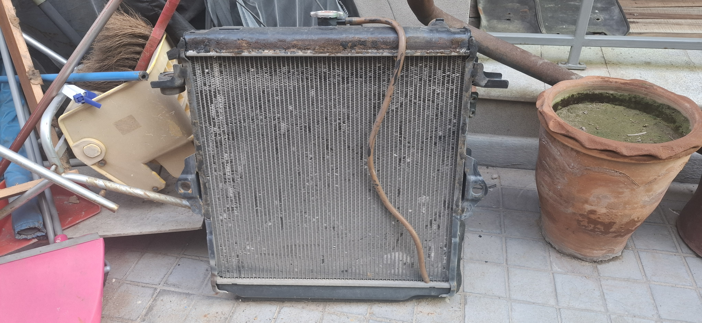
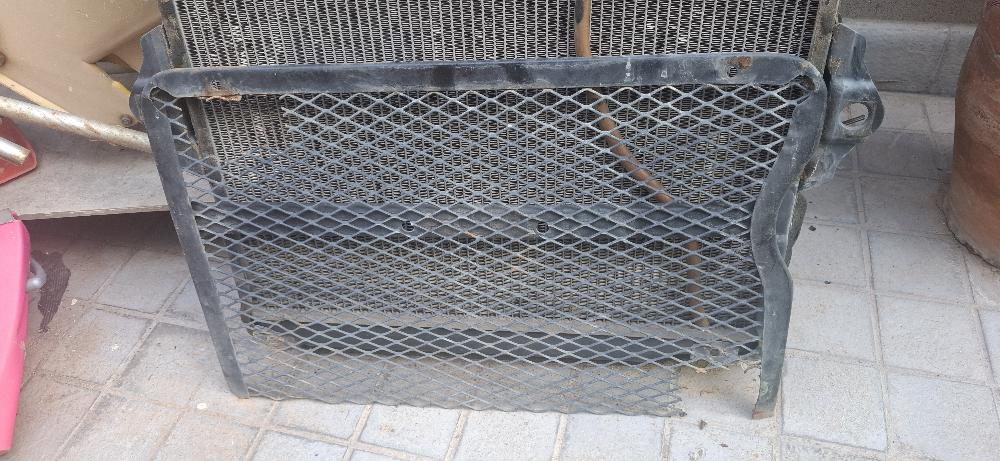
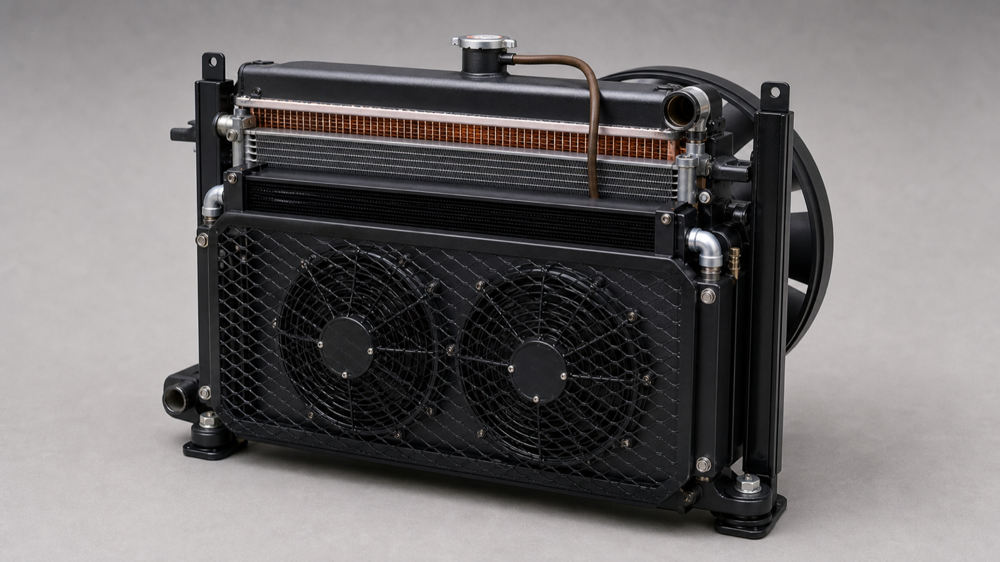
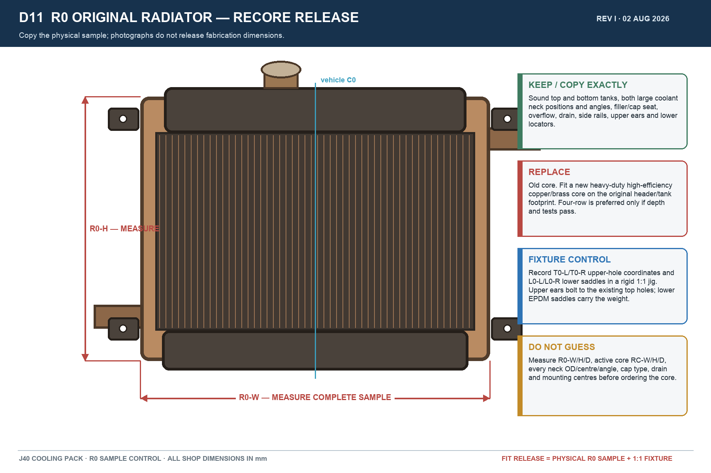
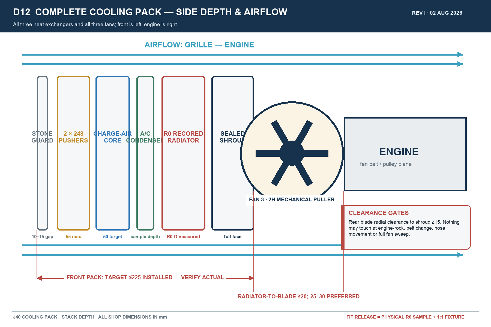
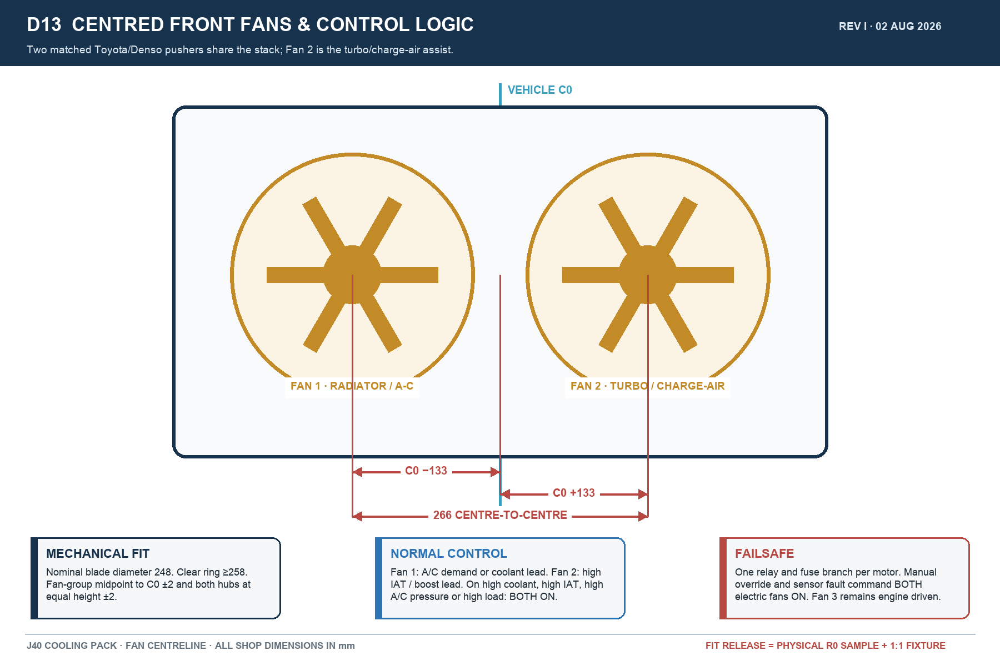
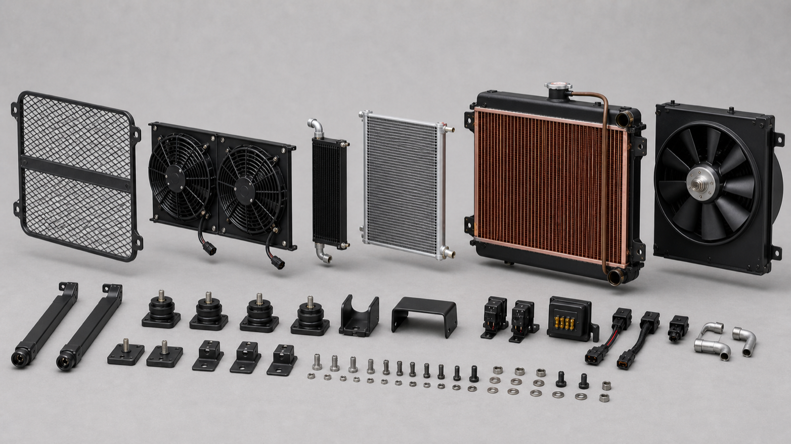
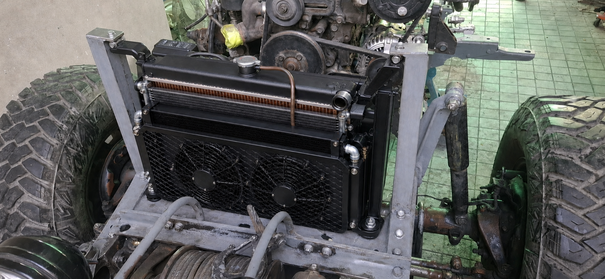
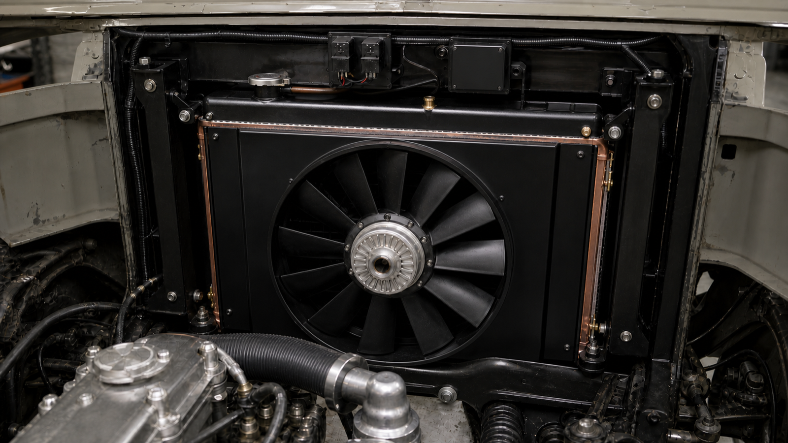

# J40 Original-Radiator Refurbishment + Turbo-Fan Cooling Pack

**Fabricator issue Rev I — 2 August 2026** 
**Design ambient:** 50 °C 
**Engine basis:** Toyota 2H with planned turbo ceiling of 150 bhp / 112 kW 
**Fit master:** the actual removed copper/brass radiator, identified below as **R0**

> **Take R0 to the radiator shop. Do not fabricate the radiator from photographs or old drawing dimensions.** Measure it before dismantling, fit a new core, and preserve—or exactly copy—its tanks, coolant-neck positions, filler/cap seat, overflow, drain, side rails, upper mounting ears and lower locators.

The earlier `530 × 435 × 64 mm` radiator concept is no longer a fit-release dimension. The physical R0 sample and a rigid 1:1 fixture made from the vehicle mounting points now control fit.

## 1. Simple description for the workshop

Build one compact cooling pack in this order:

**grille → removable stone guard → two centred electric pusher fans → charge-air cooler → A/C condenser → recored R0 radiator → full-face shroud → large 2H mechanical fan → engine**

There are exactly:

- three heat exchangers: charge-air cooler, A/C condenser and engine radiator;
- two matched front Toyota/Denso electric pusher fans; and
- one large rear Toyota 2H engine-driven mechanical puller.

Fan 2 is called the **turbo fan** because high intake-air temperature or boost is its lead electrical trigger. It blows outside air through the charge-air core and the shared cooling stack. It does **not** blow directly onto the turbocharger housing, and it is not a fourth fan.

Both front fans are horizontally centred on the vehicle. Their hubs are equally spaced about the vehicle centreline and sit at the same height.

## 2. Parts retained, rebuilt or added

| Part | Quantity | Work required |
| --- | ---: | --- |
| Original R0 engine radiator | 1 | Dismantle, inspect and recore. Retain exact vehicle interfaces. Old core is rejected. |
| Original expanded-mesh stone guard | 1 | Clean and repair, or reproduce its frame. Keep independently removable and at least 70% open area. |
| Charge-air cooler | 1 | Add a slim core with exactly two 57 mm beaded air ports. |
| A/C condenser | 1 | The thin aluminium archive sample is the A/C condenser, not the engine radiator. Reuse only after identification, pressure test, flush and fit check; otherwise use a checked replacement. |
| Front electric pusher fans | 2 | Use a matched pair of Toyota/Denso Prado 120 / GX470 nominal 248 mm fans, centrally mounted. |
| Rear mechanical puller | 1 | Retain the Toyota 2H engine-driven fan behind a full-face shroud. |
| Relay box | 1 | Closed/sealed box on its own high/rear bracket, inside the available width. |
| MIDI-fuse box | 1 | Closed box with cover on a separate high/rear bracket, inside the available width. |

## 3. Radiator-shop work on R0

1. Tag and photograph R0 before dismantling.
2. Record every field in the measurement sheet in section 4.
3. Strip paint and scale, dismantle, and chemically clean it.
4. Pressure- and flow-check the top and bottom tanks, seams, filler neck, both large coolant necks, overflow, drain, side rails and mounting ears.
5. Reject any pitted, cracked or thinned tank, neck, seam, rail or ear. If an original piece is unsafe, reproduce its external geometry from R0 before discarding it.
6. Fit a new heavy-duty, high-efficiency copper/brass core on the original header/tank footprint. A four-row core is preferred only if depth, airflow and fan clearances pass; verified performance controls acceptance.
7. Preserve the original coolant-neck centres, angles and outside diameters. Preserve the filler/cap position, cap-seat type, overflow route and drain position.
8. Use only a thin fin-safe black coating. Do not bury fins or soldered joints in thick paint.
9. Pressure-test at a shop pressure agreed from the actual engine system and cap neck. Do not guess the cap rating.
10. Flow-test, hot-recirculation test and leak-test after final soldering. Record results.

## 4. Measurement and fit-release sheet

All `MEASURE` fields are filled from the physical vehicle or R0 before the core or brackets are ordered.

| Code | What to record | Release rule / workshop value |
| --- | --- | --- |
| `R0-W` | Maximum complete radiator width, including tanks, seams, side rails and ears | **MEASURE R0:** ______ mm |
| `R0-H` | Maximum height, including filler/cap, necks, drain and locators | **MEASURE R0:** ______ mm |
| `R0-D` | Maximum depth, including seams, neck beads and anything projecting fore/aft | **MEASURE R0:** ______ mm |
| `RC-W/H/D` | Existing active-core width, height and depth | **MEASURE:** ______ × ______ × ______ mm; new core matches header/tank footprint |
| `T0-L / T0-R` | Left/right upper chassis-hole 3D coordinates and centre-to-centre | Copy in a rigid 1:1 fixture; both radiator ears bolt through these existing holes |
| `L0-L / L0-R` | Lower saddle/tab coordinates and span | Copy in the same fixture; lower EPDM saddles carry the radiator weight |
| `N1 / N2` | Each large coolant-neck OD, centre and angle | Copy R0 exactly; record OD ______ / ______ mm |
| `FILL / OV / DR` | Filler neck/cap seat, overflow and drain location/type | Copy R0 exactly |
| `W0-T/M/B` | Clear chassis opening at top, middle and bottom | ______ / ______ / ______ mm; every component stays inside the smallest value |
| `P0` | Available grille-to-engine/fan depth at the tightest point | ______ mm; prove the whole pack before steel cutting |
| `F1` | Two front fan hub centres | `C0 − 133 mm` and `C0 + 133 mm`; exactly 266 mm centre-to-centre |
| `F2` | Rear radiator-to-mechanical-blade static clearance | ≥20 mm; 25–30 mm preferred |
| `F3` | Rear blade radial clearance to shroud | ≥15 mm throughout the sweep |
| `F4` | Fan/belt/engine movement clearance | No contact during engine rock, belt change, hose movement or complete fan sweep |

Fabricator tolerances:

- electric-fan group midpoint to vehicle centreline: ±2 mm;
- left/right electric-fan hub height difference: ≤2 mm;
- hard clearance between metal parts: ≥5 mm;
- top ears must align without pulling or twisting the radiator;
- no component, tab, plug, wire bend, fuse box or relay box may extend beyond `W0`.

## 5. Mounting to the existing chassis

- Use the two existing upright radiator side rails.
- The upper R0 radiator ears must visibly bolt to the existing holes in the inward top returns. Use M8 hardware, sleeves and rubber isolation.
- Lower EPDM saddles carry the radiator weight. Upper bolts locate and retain; they must not crush or twist a tank.
- Make the core stack removable without cutting the welded chassis posts.
- Do not add an outside side tower or widen the front pack to carry electrical parts.
- Put relay and covered MIDI-fuse boxes on independent high/rear brackets with rain hoods, within `W0` and away from heat, water traps, necks, hoses and service paths.
- The stone guard remains independently removable, 10–15 mm ahead of the front fan/shroud face. It must not rub either fan.

## 6. Fan layout and control

### Mechanical layout

- Two matched nominal 248 mm Toyota/Denso front pushers.
- Minimum clear ring around each nominal blade: 258 mm.
- Fan hubs at `C0 − 133 mm` and `C0 + 133 mm`, exactly 266 mm apart.
- Both hubs at the same height within 2 mm.
- Use the complete donor frame, tabs, plugs, guards and wire-bend envelope for final checking—not blade diameter alone.
- Front fans push grille-to-engine.
- Rear mechanical fan sits behind the R0 radiator and pulls in the same grille-to-engine direction through the entire stack.

### Electrical roles

| Fan | Normal lead trigger | High-load / failsafe behaviour |
| --- | --- | --- |
| Fan 1 — radiator/A/C pusher | A/C demand or coolant-temperature lead | Both electric fans run on high coolant, high IAT, high A/C pressure, high load, sensor fault or manual override |
| Fan 2 — turbo/charge-air-assist pusher | Intake-air temperature or boost lead | Same shared-stack high/failsafe command as Fan 1 |
| Fan 3 — 2H mechanical puller | Engine-driven | Remains physically behind the radiator and draws air toward the engine |

Use one relay and one closed MIDI-fuse branch per electric fan. Size cable, fuse and relay from the measured installed current with allowance for motor starting current. Provide a single manual override that commands both front fans on.

## 7. Heat-exchanger requirements

### Recored R0 engine radiator

- Minimum heat rejection: 115 kW continuous at 50 °C ambient.
- Short-duration heat rejection: 130 kW for 10 minutes at 50 °C ambient.
- Construction: new heavy-duty high-efficiency copper/brass core fitted to the R0 tank/header footprint.
- Exactly two large coolant necks, plus filler/cap, overflow and drain, all copied from R0.
- Full-face rear shroud with sealed edges so the mechanical fan draws through the core rather than around it.

### Charge-air cooler

- Provisional target active core: 500 mm wide × 180 mm high × 50 mm deep, but only after `W0` and `P0` are measured.
- Exactly two 57 mm beaded charge-air ports.
- Minimum duty: 15 kW.
- Complete charge-air route pressure drop: ≤10 kPa at design flow.
- Post-cooler intake-air-temperature release: ≤80 °C at the agreed full-load 50 °C test.

### A/C condenser

- First identify and bench-measure the existing thin aluminium unit.
- Reuse only after pressure testing, flushing, fin condition check, refrigerant fitting check and physical mock-up.
- If it fails, use a physically checked common 14 × 22 inch R134a parallel-flow condenser or equivalent that remains inside `W0`.
- Its small connections are refrigerant fittings. They are not engine-coolant or turbo-charge pipes.

## 8. Depth allowance

The old provisional front-stack calculation was:

| Layer | Provisional depth |
| --- | ---: |
| Two front-fan frames | ≤55 mm |
| Fan-to-charge-core working gap | 5 mm |
| Charge-air cooler | 50 mm target |
| Charge-core to condenser gap | 10 mm |
| A/C condenser | Existing sample to be measured; 21 mm planning allowance only |
| Condenser-to-radiator gap | 10 mm |
| R0 radiator | `R0-D`; must be measured |

The **preferred installed front-pack envelope is ≤225 mm**, but `P0` and actual donor assemblies control. Do not add these provisional values and call the result released until R0, the condenser and the donor fan frames have been measured.

## 9. Standard Toyota / commonly available donor parts

These are search references, not permission to buy unseen parts. Bring samples or templates and measure before paying.

| Item | Preferred donor / reference | Acceptance rule |
| --- | --- | --- |
| Front fan assemblies ×2 | Prado 120 / Lexus GX470 Toyota/Denso 248 mm; `88590-60040`, `88590-60050`, `88590-60051`, `88590-60060` search references | Matching pair, complete frames, plugs and pigtails; verify direction and outside envelope |
| Fan motor | Toyota/Denso `88550-12160` search reference | Two matching working motors with correct connector and pusher rotation |
| Fan blade | Toyota `88453-60010` search reference | Confirm nominal 248 mm and correct rotation |
| Rear mechanical blade | Toyota `16361-68030` / `16361-68031` candidates | Use only after hub, fan sweep, blade count and engine clearance check |
| Rear shroud | Toyota `16711-47040` candidate | Use only if it seals the R0 active face and passes all clearances; otherwise fabricate a full-face shroud |
| A/C condenser | Existing sample after test, or common 14 × 22 inch parallel-flow | Measure fittings, receiver/drier, frame and `W0` before purchase |
| Receiver/drier | Toyota `88471-34010` candidate or common #6 | Refrigerant and port compatibility must be checked |
| Relays | Toyota `90987-02027` or sealed ISO 40 A | One per fan; final rating from measured current |
| Fuses | Closed dual MIDI box with cover | One protected branch per fan; no exposed fuses |

The design source is the original R0 radiator. A Toyota radiator part number such as `16400-68030` may be used only as a comparison/search reference; it does not override R0 fit.

## 10. 50 °C validation

The radiator and turbo are not released by appearance alone. Test the completed vehicle with recorded instruments.

1. Pressure and flow test the recored radiator before installation.
2. Measure installed electric-fan airflow. Aggregate target: ≥3,000 m³/h; 3,300 m³/h preferred.
3. Run hot-idle soak with A/C on.
4. Run repeated low-speed loaded pulls and a sustained loaded road test.
5. Record ambient, coolant-in, coolant-out, pre-cooler IAT, post-cooler IAT, fan states, system voltage and each fan current.
6. Confirm no boiling, coolant loss, hose collapse, fan/shroud contact, belt interference, electrical overheating or progressive temperature rise.
7. Confirm post-cooler IAT ≤80 °C and the agreed coolant-temperature limit at the full-load test condition.
8. Repeat inspection after the first complete heat cycle and again after 100 km.

If a true 50 °C day is unavailable, use an agreed instrumented thermal-load simulation and repeat the hottest available road test. Mark the release sheet with the actual test ambient; do not label it “50 °C tested” unless it was.

## 11. Fabricator sign-off

| Check | Requirement | Result / initials / date |
| --- | --- | --- |
| R0 measured before dismantling | All `R0`, `RC`, `T0`, `L0`, `N1`, `N2`, `W0` and `P0` fields complete | |
| Core and tanks | New core; tanks, rails and necks sound or exact-copy replacements | |
| Top-hole mounting | Both ears bolt through the existing upper holes without strain | |
| Lower mounting | Both EPDM saddles carry the weight and cannot walk out | |
| Electric-fan centring | `C0 ±133`, exactly 266 mm centre-to-centre, midpoint/height within ±2 mm | |
| Rear fan clearances | ≥20 mm axial, 25–30 preferred; ≥15 mm radial | |
| Width and depth | Everything inside `W0`; preferred front pack ≤225 mm; no electrical side growth | |
| Pressure / flow / wiring | Leak-free, flow pass and voltage/current/fuse/relay records complete | |
| 50 °C thermal release | Recorded pass at the stated test condition | |

## 12. Visual references

The photoreal views are for relationship, appearance and workshop communication. They do not replace the physical sample or measurement sheet.

