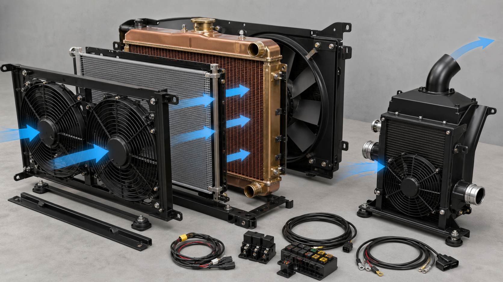
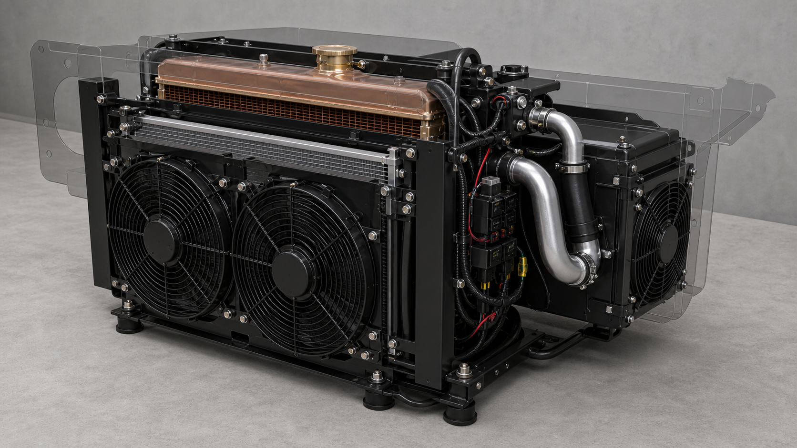
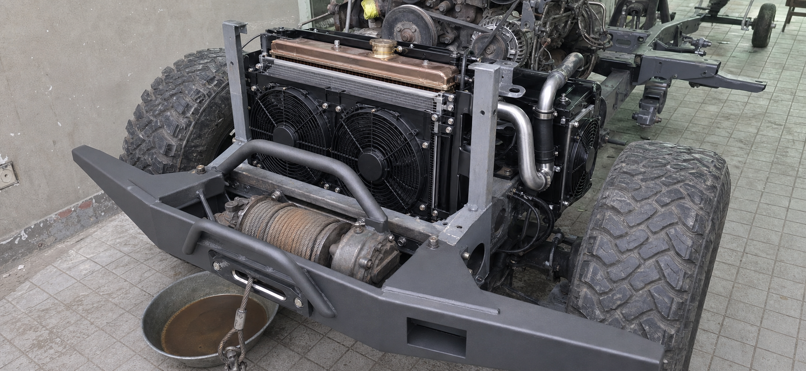

# J40 Integrated Radiator and Cooling System

## Pakistan fabricator specification — Rev D

**Vehicle:** 1978 Toyota Land Cruiser J40  
**Engine:** Toyota 2H diesel  
**Gearbox basis:** H55F / 5-speed manual candidate  
**Cooling design ceiling:** 150 bhp / 112 kW at the crankshaft  
**Turbo commissioning:** start at 5–7 psi; 8–10 psi is not pre-approved and requires logged tuning evidence  
**Air conditioning:** R134a, operating during the hot-weather tests  
**Design ambient:** 50°C dry-bulb air measured at the grille/cooling-pack inlet  
**Heat-soak margin:** 52°C for the short-duration test  
**Issue date:** 30 July 2026  
**Units:** millimetres unless stated otherwise

> **SHOP RULE / KARIGAR KE LIYE:** 50°C grille-air, A/C ON aur approved full-load fuelling par coolant temperature stable rehna chahiye — lagatar barhna FAIL hai. Sirf “4-row” ya free-air CFM claim PASS nahin. Pehle gaari naapain, complete dummy fit karein, phir written approval ke baad final cores banayen.

## 1. What Rev D changes

Rev D supersedes the previous lower-front triple stack. The charge-air cooler must not sit in front of the condenser or radiator.

- **Main front pack:** entirely between the existing welded uprights/original central grille aperture: grille → electric A/C pusher fan assembly → condenser → sealed gap → radiator → full shroud → engine-driven puller fan.
- **Charge-air pack:** independently mounted aft and outboard of one upright, turned approximately 90° into a side/inner-wing bay: separate fresh-air inlet → sealed duct → charge cooler → dedicated high-static fan → separate hot-air outlet.
- The two circuits must not share hot outlet air or recirculate engine-bay air.

> **NO EXTRA FRONT WIDTH:** The radiator, condenser and front-pusher frame finish at the inner faces of the existing welded uprights and use only front-to-rear depth within the central opening. The charge-air cooler is not bolted beside that rectangle and does not widen the grille, front panel or radiator. Its side, angle, ducts and brackets are provisional until the complete full-size M8 template passes on the actual vehicle.

This change is required because the previous 500 × 180 intercooler masked about 39% of the nominal radiator face and preheated/restricted the radiator and condenser airflow.

Rev D explicitly supersedes older project instructions for one 12-inch fan, one 14-inch fan, optional 12–14-inch fans, and two nominal 9-inch fans in an upper strip. Fan size and quantity are now selected by **installed airflow and static-pressure performance**, not nominal diameter.

### 1.1 Packaging visual — split-out component groups

### 1.2 Packaging visual — complete assembly

### 1.3 Packaging visual — proposed later-stage installation with new bumper

PH01–PH03 explain component grouping, assembly and location only. PH03 is a generated proposed composite based on the latest factual winch/crossmember photograph plus the documented bumper design reference; it is **not evidence that the bumper or cooling pack has been fabricated or installed**. None of these images is to scale or releases a core, bracket, fan position or duct. D01–D07, the measured vehicle, the accepted full-size mock-up and the signed M/F gates control manufacture.

## 2. Release status

Released now:

- vehicle measurements and evidence;
- quotation against the performance requirements;
- supplier thermal and fan-curve review;
- full-size radiator, condenser, fan, shroud, duct and charge-cooler dummies;
- removable bracket and duct fabrication/tack fitting; and
- instrument and test planning.

**Final heat-exchanger manufacture and fan purchase remain on HOLD** until:

1. M1–M8 and F1–F7 are measured and pass;
2. the actual component envelopes are mock-fitted with bonnet, grille, guard, A/C and engine accessories represented;
3. the radiator supplier provides the required thermal/pressure-drop evidence, or a prototype is instrumented and tested;
4. fan suppliers provide pressure-versus-flow and electrical data;
5. the owner approves the as-measured Rev D drawing; and
6. the final installed vehicle passes the 50°C acceptance test before the cooling pack is described as 50°C-capable.

Rev D is a **design and acceptance requirement**, not a claim that untested hardware is already proven.

## 3. Duty and non-derate requirement

### 3.1 Cooling design duty

| Item | Required duty |
|---|---|
| Ambient definition | 50°C dry-bulb air measured at the grille/cooling-pack inlet; this is air temperature, not coolant temperature |
| Vehicle condition | bonnet closed; final grille, guard, bumper/winch and under-bonnet seals fitted; loaded operating weight |
| Engine condition | final approved turbo, fuelling and exhaust configuration, up to the 150 bhp crankshaft cooling-design ceiling |
| A/C condition | ON and stabilised, with final condenser, refrigerant charge and cabin blower |
| Continuous definition | at least 60 minutes after temperatures stabilise, with no continuing coolant-temperature rise |
| Short overload | 130 kW radiator heat-rejection condition for 10 minutes, starting from the stabilised continuous condition |
| Heat-soak margin | 52°C controlled inlet-air check for 10 minutes, followed by hot restart |

### 3.2 Turbo relationship

The cooling and charge-air system must require **no cooling-related boost reduction or derate within the approved 150 bhp crankshaft thermal-design envelope**.

This does not approve 150 bhp, 8–10 psi, unlimited boost or extra fuel. Start commissioning at 5–7 psi. Engine condition, turbo compressor/turbine maps, pre-turbine EGT, exhaust drive pressure, smoke, oil pressure/temperature, fuelling, clutch and driveline limits still govern the released tune.

If later work exceeds 150 bhp crankshaft, changes the turbo/fuelling materially, or raises measured heat load above this basis, repeat the thermal review and the complete 50°C test.

## 4. Shop build summary

| Part | Rev D requirement |
|---|---|
| Engine radiator | Maximum practical core in M1/M2; net finned frontal area ≥0.250 m² unless a smaller installed-envelope core is independently certified to the full duty |
| Radiator capacity | ≥115 kW continuous heat rejection at the declared test point; ≥130 kW for 10 minutes |
| A/C condenser | Existing nominal 559 W × 356 H × 21 D R134a parallel-flow basis, subject to actual-part measurement and 50°C A/C acceptance |
| Front electric fans | One full-width assembly or multiple matched sealed pushers that deliver ≥3,000 m³/h **installed at 75 Pa** and 13.5 V |
| Main radiator fan | Retain/rebuild engine-driven puller; full-face sealed shroud; ≥9,000 m³/h **installed at 125 Pa** at 1,500 engine rpm |
| Charge cooler | Separate side/wing air-to-air unit; ≥15 kW at the defined charge-air test point; 57 mm / 2.25 in beaded connections unless final turbo routing requires a larger verified size |
| Charge-cooler fan | Dedicated sealed high-static fan; ≥2,500 m³/h **installed at 75 Pa** with its complete inlet duct, core, shroud and hot-air outlet |
| Cabin evaporator | Cabin blower is required and remains A/C-installer scope |

> **Simple rule:** Main radiator/condenser ka airflow alag; side intercooler ka inlet aur hot-air exit alag. Har component apni rubber-isolated bracket par ho aur bina cutting alag nikal sakay.

## 5. Engine radiator

### 5.1 Core and construction

1. Recore the original copper/brass tanks first only if the tanks, headers, filler neck, drain, overflow and brackets pass inspection and the completed radiator can meet the performance requirement.
2. A new copper/brass or serviceable aluminium radiator is acceptable. Material and row count do not release the part; verified performance, repairability and fit do.
3. Target net finned face is at least 0.250 m², for example 540 × 465, 560 × 450, or another shape that fits M1/M2.
4. The previous 530 × 435 × 64 four-row core is not accepted merely because it is four-row. It may be used only if its certified curve or an instrumented prototype proves the full Rev D duty.
5. Keep the core cleanable from both sides. Fit removable stone/insect protection that does not materially restrict airflow.
6. Allow for Pakistan dust and fin fouling: the vehicle acceptance test is performed with the normal grille/guard/screens fitted, and the clean-core result must retain at least 10% thermal/airflow margin over the minimum requirement.

### 5.2 Required supplier or bench evidence

The radiator report/curve must state:

- ≥115 kW continuous heat rejection with 50°C dry-bulb grille ambient and the A/C condenser heat/restriction represented;
- ≥130 kW for 10 minutes, beginning after the 115 kW condition is stable;
- radiator air-inlet temperature downstream of the operating condenser;
- coolant inlet and outlet temperatures;
- coolant mixture (50/50 water and approved coolant unless the final fill differs);
- coolant flow rate and coolant-side pressure loss;
- installed airflow or face-velocity grid and the pressure at which it was measured;
- air-side pressure loss through the final grille/fan/condenser/radiator/shroud arrangement;
- test voltage, fan/engine speed, clean-core condition and test duration; and
- no continuing coolant-temperature rise during the continuous period.

SAE J1994 or an equivalent documented heat-exchanger method is preferred. If the local supplier cannot provide a valid curve, do not invent a rating: build an instrumented prototype and pass section 13.

### 5.3 Tanks, coolant circuit and tests

- Copy the physical original for tank form, mounting datums, upper/lower neck centres and angles, filler seat, overflow and drain unless an approved as-measured drawing changes them.
- Target hose-neck OD remains 38, but the actual hose and engine connection control.
- Use only the verified 2H cap pressure. A higher-pressure cap is not a cooling upgrade.
- Verify thermostat specification and bypass operation. Provide a high-point bleed and fill method that does not trap air.
- The lower hose must resist suction collapse at hot rated flow; use a formed hose or proper internal anti-collapse spring where required.
- Record coolant flow and radiator pressure drop. Reject a core that meets heat rejection only by causing unacceptable water-pump restriction or cavitation.
- No automatic-transmission oil cooler is required on the present manual-gearbox basis.
- Pressure-test at the verified system test pressure for at least five minutes with no leak, sweating or attributable pressure loss; then flow-test for uniform tube flow.
- Protect necks and fins during transport; apply only a thin radiator coating that does not bridge fins.

## 6. Main airflow system

### 6.1 Mechanical puller fan and shroud

- Retain the engine-driven fan unless inspection rejects it.
- Reject cracked, loose, distorted, contact-marked or weld-repaired blades.
- Check the hub, pulley, water-pump bearing, fan run-out and engine mounts before setting the radiator plane.
- Record outside diameter, full swept circle, blade depth, centre X/Y and nearest fore/aft point through a full hand rotation and engine-movement check.
- Fit a rigid removable full-face shroud sealed to the radiator perimeter. All radiator face air must pass through the fan opening rather than around the core.
- Place 35–50% of blade depth inside the shroud opening.
- Keep ≥15 radial clearance through the verified engine-movement envelope.
- Keep ≥20 static from radiator rear face to the nearest fan point; 25–30 preferred.
- Installed-system requirement: ≥9,000 m³/h at 125 Pa at 1,500 engine rpm with final grille, condenser, radiator and shroud represented. Record a face-velocity grid; do not add catalog mechanical-fan flow to electric-fan CFM.

### 6.2 Electric A/C pusher fan assembly

- Select one full-width module or multiple matched sealed automotive pushers to use as much condenser face as practical.
- Required combined installed duty: ≥3,000 m³/h at 75 Pa and 13.5 V through the final grille/guard and condenser/radiator restriction.
- Free-air CFM is not acceptance evidence. Supplier pressure-versus-flow curves, motor current, starting current and complete outside dimensions are mandatory.
- Provide a close frame/shroud so air does not bypass the condenser.
- Mount the assembly independently; no ties through cores and no fan load on the condenser.
- If multiple motors are used, provide separately fused/relayed branches so one fault does not stop all airflow.
- Both/all pusher motors switch ON with A/C compressor command; approved trinary/high-pressure control protects the compressor and may also command fans.
- Prove alternator output at hot idle with A/C, cabin blower, lights and all cooling fans on. Battery voltage, motor voltage, current and connector temperature must remain acceptable.
- One-electric-fan-failed test: the control must indicate the fault; A/C pressure protection must operate; coolant must not boil. Full 50°C/A/C performance need not be retained with a failed fan, but the vehicle must fail safe.

## 7. A/C condenser and receiver-drier

- Nominal basis: 559 W × 356 H × 21 D, R134a parallel-flow. Measure the actual body, seams, manifolds, ports and ears before manufacture.
- Mount on four independent rubber-isolated tabs. It carries no fan, radiator or structural load.
- Keep 15 clear to radiator where practical; 10 is the absolute minimum only with proven installed airflow.
- Seal the perimeter so hot discharge air cannot return to the front face.
- Mount the receiver-drier vertically in a removable rubber-lined clamp outside the primary airflow and keep it sealed until final evacuation/charging.
- An A/C technician verifies hoses, trinary switch, refrigerant charge, high/low pressures and 50°C vent performance.

## 8. Separate side/wing charge-air system

### 8.1 Architecture

The charge cooler is not permitted ahead of the radiator or condenser. It is a separately mounted module that begins aft and outboard of one main-pack upright and turns approximately 90° to run rearward in a side/inner-wing bay. It must remain behind the main-pack front plane and must not intrude across the original central aperture. Select the left or right side only after the actual turbo, steering, suspension movement, battery, air cleaner, A/C compressor, bonnet, wing/body envelope, downpipe and service paths are trial-fitted with a full-size template.

The complete side pack requires:

1. a fresh-air inlet separated from engine-bay hot air;
2. stone, dust and water protection;
3. a sealed inlet duct;
4. the air-to-air charge cooler;
5. a close full-core shroud and dedicated sealed fan;
6. a separate, low-restriction hot-air exit to wheel-well/underbody/outside air;
7. recirculation seals between inlet and outlet;
8. a drain at the low point; and
9. removable access for cleaning both faces.

Do not discharge onto the turbo, exhaust, battery, wiring, brake parts or the main radiator inlet. Do not use engine-bay air as the normal inlet.

### 8.2 Charge cooler rating

| Parameter | Rev D requirement |
|---|---|
| Continuous heat rejection | ≥15 kW after heat soak |
| Ambient | 50°C dry-bulb fresh air at the side-pack inlet |
| Engine/charge airflow | 0.20 kg/s at the 150 bhp crankshaft cooling-design ceiling |
| Compressor discharge | 130°C nominal rated test point; record actual pressure ratio/boost |
| Manifold IAT | ≤80°C during the stabilised rated-full-load test at 50°C ambient; idle heat soak is recorded separately |
| Complete charge-route pressure loss | ≤10 kPa / 1.45 psi from compressor outlet to intake plenum; target ≤7 kPa |
| Intercooler core pressure loss | target ≤5 kPa at rated airflow |
| Fan installed duty | ≥2,500 m³/h at 75 Pa through the complete inlet/guard/core/shroud/outlet path |
| Pressure proof | ≥2 × declared maximum boost and never less than 30 psi, using a guarded safe test method |
| Connections | beaded, properly clamped and supported; 57 mm / 2.25 in baseline, enlarged only by approved flow/packaging review |

The supplier/test report must state compressor-inlet air, pressure ratio/boost, charge-air mass flow, compressor-out and intercooler-out temperatures, ambient, fan voltage/current, installed airflow/static pressure, pressure drop and duration.

## 9. Electrical and controls

- Each electric motor branch has its own correctly sized fuse, sealed relay, weatherproof connector and equal-capacity ground.
- Fuse and wire sizes are based on measured running/start current, conductor temperature rating and voltage drop. Do not copy a generic fuse size.
- Use a clean structural/engine ground stud, not a loose sheet-metal screw.
- Protect wiring from fan blades, belts, exhaust/turbo heat, sharp edges, water traps and A/C pipe vibration.
- Use grommets, loom, strain relief and service disconnects.
- Bench-test polarity. Main pushers blow grille → engine. The side fan follows fresh inlet → core → separate hot outlet.
- The side charge-cooler fan runs whenever the engine is running unless a documented fail-safe boost/IAT controller is fitted. A controller failure must command the fan ON and must provide a driver-visible fault warning.
- At full hot-idle electrical load, each motor must remain within 0.5 V of the battery/alternator voltage, unless its supplier specifies a tighter limit.
- Provide status/fault indication for the charge-cooler fan and multi-motor condenser assembly.

## 10. Packaging gates

All dimensions below are evidence gates. Measure with the body settled, bonnet closed, final grille/guard/winch represented, engine fan present, and actual accessory locations represented.

| ID | Measurement | PASS criterion |
|---|---|---|
| M1 | minimum clear main-pack width at top/middle/bottom | net core ≥0.250 m² preferred and complete tanks/ears/ports/removal path fit; minimum 5 side clearance; smaller core only with valid 115/130 kW proof |
| M2 | lower saddle to bonnet/latch obstruction | selected radiator overall height + 10 and all hose/filler/service paths fit |
| M3 | nearest front obstruction to radiator front face | actual fan depth + ≥5 fan/condenser clearance + condenser depth + 15 preferred radiator gap + 10 build/plane allowance |
| M4 | nearest front obstruction to radiator rear face | M3 requirement + actual radiator depth; add 10 fabrication/vehicle tolerance; record smallest value |
| M5 | radiator rear to mechanical fan | ≥20 static through full rotation/movement; 25–30 preferred |
| M6 | lowest main-pack edge | ≥25 above protected frame/bumper line unless a stronger guard is approved |
| M7 | radiator/condenser service removal | each item removes separately without cutting, draining unrelated systems or removing body structure |
| M8 | complete side charge-pack template, envelope and duct path | full-size core, fan, shroud, 90° inlet/outlet ducts, charge pipes, brackets, fasteners, plugs and tool/removal sweeps fit aft/outboard of the selected upright, behind the main-pack front plane and wholly inside the body/inner-wing envelope; zero intrusion across the central aperture; no conflict through steering/suspension/engine movement or with battery, A/C, air cleaner, bonnet/wing, turbo/downpipe or service tools; fresh inlet and separate hot outlet each proven |
| F1 | mechanical fan OD/swept circle | recorded and shroud based on actual sweep |
| F2 | blade depth/insertion | 35–50% in shroud; ≥15 radial movement clearance |
| F3 | main fan centre X/Y | recorded on as-built drawing |
| F4 | front electric module complete envelope | actual frame, guards, tabs, plugs and wire bends fit M1–M4 |
| F5 | front fan installed curve/test | ≥3,000 m³/h at 75 Pa, 13.5 V |
| F6 | mechanical installed airflow | ≥9,000 m³/h at 125 Pa, 1,500 engine rpm |
| F7 | side-pack fan installed curve/test | ≥2,500 m³/h at 75 Pa through complete duct/core/outlet |

The current front-opening estimate is not a manufacture dimension. Put a tape/ruler in each evidence photograph and issue an as-measured sketch before buying cores or fans.

## 11. Fabrication and mounting

- Retain the existing formed upright and handed/mirrored mate if welds, attachment, alignment and strength pass inspection.
- Use removable side rails, lower weight-bearing saddles and rubber/EPDM isolation.
- Upper radiator tabs restrain; they do not carry full radiator weight.
- Each exchanger, fan, shroud, duct and drier has independent mounts and removes separately.
- The side charge-air pack mounts to its own approved structure aft/outboard of the selected upright; it must not hang from, widen or transfer load into the radiator, condenser or front-pusher frame.
- No welding or drilling into tanks, headers, tubes, cores or fins.
- No plastic ties through any heat exchanger.
- No forced bolt alignment.
- No unprotected metal edge against a tank, hose, pipe, wire or fin.
- Keep final cores away from welding/grinding and protect all faces during transport.

## 12. Required build sequence

1. Inspect and measure the vehicle, accessories and engine fan; complete M1–M8 and F1–F3.
2. Obtain supplier radiator, fan and charge-cooler performance curves.
3. Select the largest practical radiator geometry and the side-pack location.
4. Make full-size dummies including tanks, seams, ports, fan motors, guards, plugs, cable bends, ducts, outlet paths and hose/tool clearances.
5. Fit the main radiator/condenser/fans and side charge pack independently.
6. Close the bonnet and fit/represent the final grille, guard, bumper/winch, A/C, battery, intake, steering, turbo and downpipe.
7. Prove engine movement, stone/water protection, cleaning access and separate removal paths.
8. Photograph every gate and prepare the as-measured/as-selected drawing and evidence pack.
9. Obtain written owner release.
10. Manufacture/recore, bench-test, install and instrument.
11. Perform section 13. Do not call the system 50°C-rated until all tests pass.

## 13. 50°C commissioning and acceptance

Testing must be supervised by a competent vehicle/turbo/A/C technician on a controlled dyno, proving ground or safe loaded route. Do not improvise a full-load public-road test.

### 13.1 Instrumentation

Log at least once per second:

- 50°C grille ambient and air temperature immediately behind the operating condenser;
- cylinder-head/engine-out coolant, radiator inlet and radiator outlet temperatures;
- coolant pressure where practical;
- oil temperature and hot oil pressure;
- compressor-out, post-intercooler and intake-manifold temperatures;
- boost and pressure immediately before the intake plenum;
- pre-turbine EGT and turbine drive pressure;
- fan speed where available, fan voltage/current and battery/alternator voltage;
- A/C high/low pressures and centre-vent temperature;
- road/engine speed, load and vehicle weight; and
- smoke/visible fault observations.

### 13.2 Test sequence

1. Bench leak/pressure/flow tests; static fit, full fan rotation and electrical checks.
2. Warm-up and bleed verification with bonnet closed.
3. **Hot idle:** 50°C grille ambient, A/C maximum, cabin blower maximum, lights and all normal loads, 30 minutes.
4. **Loaded low-speed climb:** 50°C, A/C ON, loaded vehicle weight, final approved turbo/fuelling, 20 minutes after stabilisation.
5. **Sustained road/load:** 50°C, A/C ON, repeatable high-load condition including a nominal 60 km/h pull where safe, 20 minutes after stabilisation.
6. **Continuous thermal proof:** demonstrate at least 60 minutes stable at the 115 kW radiator duty or equivalent instrumented vehicle heat load.
7. **Overload:** from the stable condition, 130 kW equivalent for 10 minutes.
8. **Heat soak:** 52°C inlet for 10 minutes, engine OFF as defined by the test plan, then hot restart and five-minute stabilisation.
9. Repeat inspection for coolant/charge/A/C leaks, hose collapse, wiring/relay heating, fan contact, fin damage and loose mounts.

### 13.3 PASS criteria

- No coolant, oil, charge-air or A/C leak; no boiling, coolant loss, hose collapse or pressure instability.
- Engine-out/head coolant is stable with no upward trend. Continuous target is ≤100°C and transient target ≤105°C, or the verified Toyota/engine-builder limit if lower.
- Coolant remains at least 10°C below the pressure-adjusted boiling point of the verified fill/cap system.
- Intake-manifold temperature is ≤80°C during stabilised rated full load at 50°C ambient.
- Complete charge-route pressure loss is ≤10 kPa at rated airflow.
- Pre-turbine EGT, drive pressure, oil temperature and oil pressure remain inside the limits agreed for the exact engine/turbo/instrument positions.
- A/C pressures stay inside component limits and agreed cabin/vent performance is achieved.
- No cooling-related boost reduction or derate is required inside the approved 150 bhp cooling-design envelope.
- Fans achieve their installed duties; no abnormal current, voltage drop, connector/relay heating or recirculation.
- No abnormal vibration, rubbing, structural movement or fin damage.

**Automatic FAIL:** coolant or manifold-air temperature continues to rise after the stated stabilisation period, even if coolant has not boiled.

## 14. Handover record

| Record | Result / evidence |
|---|---|
| M1–M8 and F1–F7 as-measured sheet |  |
| Radiator manufacturer/model/core/tank envelope |  |
| 115 kW / 130 kW thermal report and pressure drops |  |
| Coolant flow, mixture, cap, thermostat, bleed and lower-hose details |  |
| Condenser model/complete envelope |  |
| Front fan models, installed airflow/static, run/start current |  |
| Mechanical-fan installed airflow at engine speed |  |
| Charge-cooler model, test point, heat rejection and pressure drop |  |
| Side fan/duct installed airflow/static and recirculation proof |  |
| Alternator hot-idle output and voltage-drop record |  |
| 50°C and 52°C raw logs, graphs and technician report |  |
| A/C pressures and vent performance |  |
| As-built drawings and photographs |  |

**Radiator fabricator:** ____________________  **Date:** __________  
**A/C technician:** _________________________  **Date:** __________  
**Turbo/engine tuner:** _____________________  **Date:** __________  
**Owner final release:** ____________________  **Date:** __________

## 15. Controlled references

- [SAE J1994 — Laboratory Testing of Vehicle and Industrial Heat Exchangers](https://saemobilus.sae.org/standards/j1994_202004-laboratory-testing-vehicle-industrial-heat-exchangers-heat-transfer-pressure-drop-performance)
- [SAE J1339 — Engine Cooling Fan Performance](https://saemobilus.sae.org/standards/j1339_202409-test-method-measuring-performance-engine-cooling-fans)
- [SAE J1393 — Heavy-Duty Vehicle Cooling Test Procedures](https://saemobilus.sae.org/standards/j1393_202302-heavy-duty-vehicle-cooling-test-procedures)
- [SAE J819 — Engine Cooling System Field Test](https://saemobilus.sae.org/standards/j819_198003-engine-cooling-system-field-test-air-to-boil)
- [Pakistan Meteorological Department, Pakistan Climate 2024](https://cdpc.pmd.gov.pk/Pakistan_Climate_2024.pdf)
- [BorgWarner MatchBot turbo matching method](https://www.borgwarner.com/aftermarket/boosting-technologies/news/2022/05/20/matchbot-a-shortcut-method)
- [Garrett Turbo Tech 103](https://www.garrettmotion.com/wp-content/uploads/2018/06/Turbo-Tech-103.pdf)
- [2H turbo suitability and options](2h-turbo-suitability-and-options-20260717.md)
- [Radiator workstream](radiator-workstream.md)
