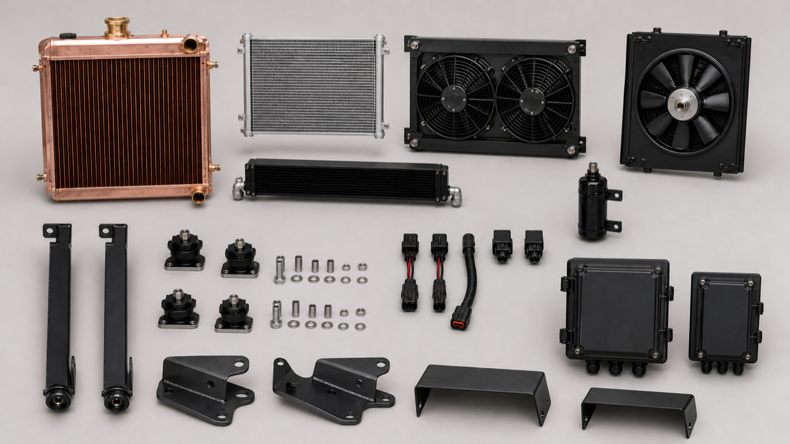
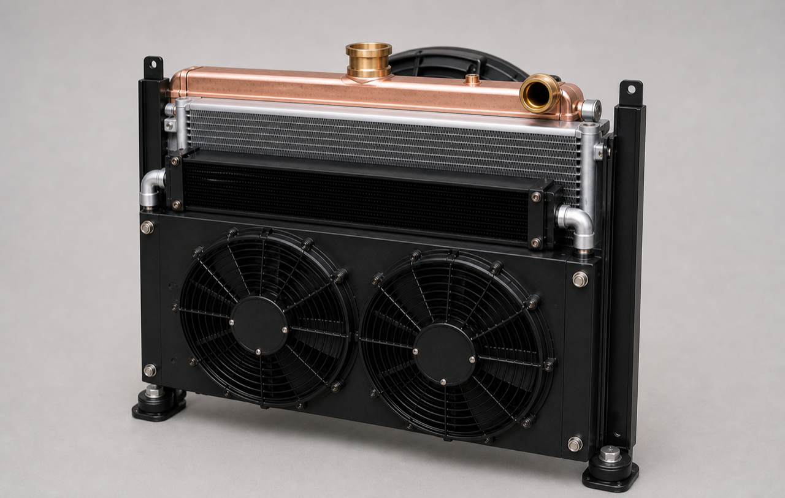
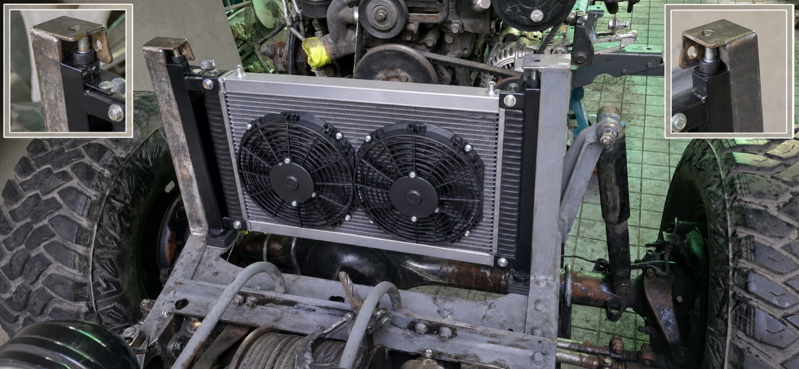
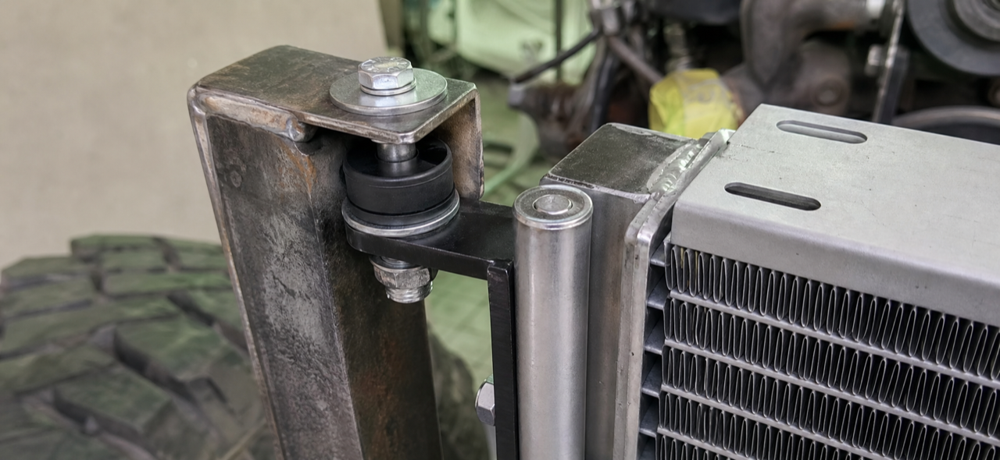
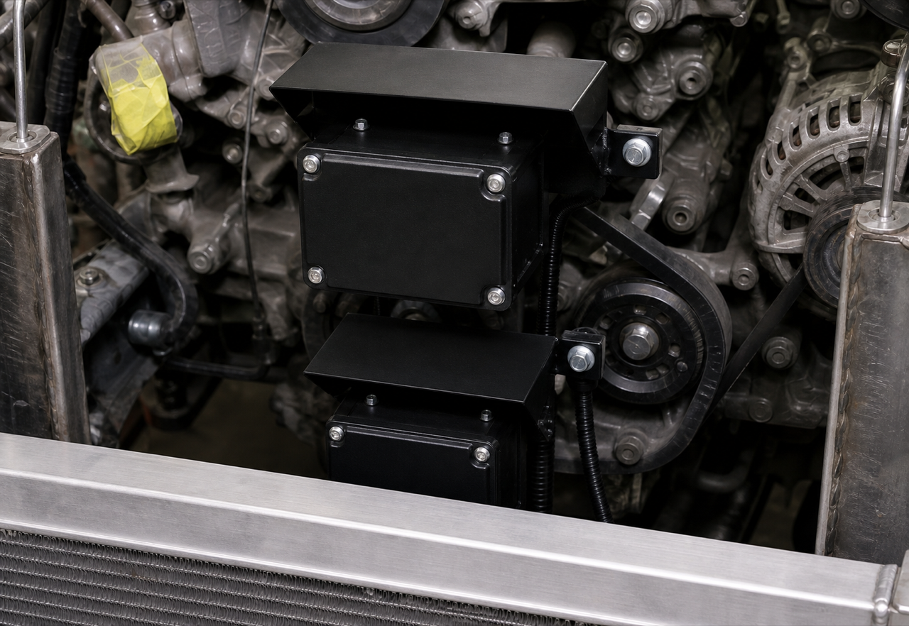

# J40 Integrated Radiator and Cooling System

## Pakistan fabricator specification — Rev G, Toyota-donor-led all-front package

- **Vehicle:** 1978 Toyota Land Cruiser J40
- **Engine:** Toyota 2H diesel
- **Gearbox basis:** H55F / 5-speed manual candidate
- **Cooling design ceiling:** up to 150 bhp / 112 kW at the crankshaft, subject to tuning limits
- **Turbo commissioning:** start at 5–7 psi; consider 8–10 psi only after logged evidence
- **Air conditioning:** R134a, operating during hot-weather tests
- **Design target:** 50°C dry-bulb air measured at the grille/cooling-pack inlet
- **Short heat-soak target:** 52°C
- **Issue date:** 1 August 2026
- **Units:** millimetres unless stated otherwise

> **KARIGAR KE LIYE — SIMPLE RULE:** Teenon cores aik seedhi central line mein lagain: **front fans → intercooler → condenser → radiator → engine fan**. Kul **teen fans** hain: do electric pushers samnay aur aik engine-driven puller radiator ke peechay. Radiator ka wazan neeche ke do saddles uthayen. Radiator ki apni left/right side rail se aik chhota 4 mm ka ear seedha har puranay top hole ke neeche aaye; beech mein koi cross-bar/carrier nahin. Dono M8 bolts haath se poori tarah lagain, radiator ko kheench kar line mein na layein. Relay aur fuse ke **do alag band dabbe**, do alag chhotay structural brackets aur apni apni rain hood par upper/rear lagain—radiator ya top-return brackets par nahin. Pehle **B0/H0-L/H0-R/W0/P0/R0** naapain aur BRKT full-size dummy fit karein; final radiator us ke baad banayen.

## 1. Rev G decision

Rev G adopts a **best-effort, simple and clean-looking all-front cooling package** with Toyota/HJ47/Prado donor service parts wherever they actually fit and can prove the required duty. It replaces the Rev E side/wing charge-cooler system; the donor radiator and donor full shroud are not assumed to fit.

Airflow order, front to rear:

**Grille → centred removable twin electric-pusher module → slim charge-air cooler → 10 mm minimum gap → A/C condenser → 15 mm target gap (10 mm absolute minimum) → engine radiator → sealed full-face shroud → retained engine-driven puller fan.**

**Fan count: exactly three system fans in Rev G—two front electric pushers plus one rear engine-driven mechanical puller. Do not fit a third electric fan or any fourth fan in this release.**

- The radiator, condenser, charge cooler and both front fans remain inside the existing upright silhouette.
- The two electric fan centres are level and symmetric about the measured active-fin centreline.
- The receiver-drier sits behind an upright. The covered **Relay Rev D box** and closed, gasketed **MIDI Rev D fuse box** sit on two independent upper/rear structural accessory brackets, each with its own hood and service sweep. Both complete envelopes stay inside W0 and the existing uprights' front-view silhouette. Stagger them vertically and/or in depth, with the MIDI projected width wholly inside the Relay box's 360 mm base envelope; never place them side-by-side across vehicle width. They do not attach to the radiator, its side rails, lower saddles or the existing top returns. Every fuse, fuse holder and live fuse stud is inside the MIDI box; both lids remain shut in operation. The master cutoff/breaker remains battery-side.
- Charge pipes turn rearward at the lower corners. They must not create a visible side tower or widen the front panel.
- There is no separate charge-cooler fan. The front pusher pair and rear mechanical fan move air through the complete three-core stack.
- Each heat exchanger has its own removable, rubber-isolated mounts. No core carries another core or fan.

### 1.1 Appearance requirement

From the front, the finished package should look like one tidy rectangular factory-style assembly:

- two equal black fan rings, level and horizontally centred;
- equal left/right uncovered fin bands;
- black satin side rails, local brackets and shrouds, with uniform zinc-plated or black fasteners;
- no visible side annex, loose wiring, unsupported hose, exposed fuse/live stud, open relay plate or unmatched brackets;
- drier, wiring and service fittings hidden behind/above the uprights where they remain reachable; and
- a removable black stone screen aligned with the central aperture, without covering unnecessary fin area.

Appearance never overrides airflow, service access or safe clearance.

### 1.2 Split-out component visual

### 1.3 Off-vehicle cooling-module assembly

PH02 intentionally omits the chassis posts and both electrical boxes. PH03/PH04 alone illustrate the existing-hole radiator attachment; PH05/D09 and E2/E2a separately control the upper/rear electrical installation. This prevents an off-vehicle product image from implying a false frame connection or extra side packaging.

### 1.4 Installed visual — existing top holes

### 1.5 Existing-hole fastener detail

### 1.6 Independent Relay/MIDI mounts

PH01–PH05 are AI design visualisations, not measured evidence. Do not scale them. PH01 and PH02 show all three fans; PH03 is a front installation view, so the rear mechanical fan is mostly hidden. PH03/PH04 show the required attachment logic: at each side, the same M8 through-bolt passes through the original frame top-return hole, sleeved EPDM isolator and short direct radiator ear; that ear is fixed directly to its removable radiator side rail, with a weight-carrying lower saddle beneath the same rail. PH03's two enlarged insets show this continuous frame-to-rail path. There is no transverse radiator carrier or intermediate bracket. PH05 is a tight electrical-placement appearance proposal only: the two boxes are above/rear of the top tank, clear of the fin/fan aperture and on visibly separate brackets. D09 requires their complete projected envelopes to nest inside W0/upright width and does not establish dimensions or an IP rating. D08–D10, the actual vehicle, the physical boxes, the rigid two-hole template, the full-size dummy and the signed dimensions control manufacture.

## 2. Release status — best effort, not a guarantee

This revision is released for:

- quotation and sourcing of physical sample parts;
- vehicle measurement and a full-size cardboard/plywood/foam dummy;
- supplier review of radiator, charge-cooler and fan performance;
- direct radiator ears, lower saddles, independent electrical brackets, shrouds and duct mock-up; and
- instrument and commissioning planning.

**Final radiator/core manufacture, final fan purchase, bracket drilling and finish coating remain on HOLD** until the rigid two-hole fixture and complete dummy prove B0/H0-L/H0-R/W0/P0/R0/BRKT, depth, pipe routes, direct top ears, lower saddles, bonnet, grille, bumper/guard, engine-fan clearance, E2/E2a cover/lid sweeps, cable exits, weather protection and separate removal.

This is a best-effort design target. It is **not proof** that the unbuilt package already fits or will operate at 50°C. The 50°C, A/C, intake-temperature and no-cooling-derate statements become valid only after the final installed vehicle passes section 13.

## 3. Required duty

| Item | Rev G target |
|---|---|
| Ambient | 50°C dry-bulb at the grille inlet; short 52°C heat-soak check |
| Vehicle | Bonnet closed; final grille, bumper/guard/winch and normal dust screen fitted; loaded operating weight |
| Engine | Final approved turbo, fuel and exhaust configuration, up to the 150 bhp cooling-design ceiling |
| A/C | ON and stabilised, with final condenser, refrigerant charge and cabin blower |
| Radiator | ≥115 kW continuous target and ≥130 kW for 10 minutes, with upstream charge-cooler and condenser heat/restriction represented |
| Charge cooler | ≥15 kW at 50°C inlet, 0.20 kg/s charge flow and 130°C nominal compressor outlet |
| Intake manifold | ≤80°C during stabilised rated full load |
| Charge-route pressure loss | ≤10 kPa; ≤7 kPa preferred |
| Baseline fan count | Exactly 3 total: 2 front electric pushers + 1 rear engine-driven mechanical puller |
| Front electric airflow | ≥3,000 m³/h installed at 13.5 V through the final grille and all three cores |
| Mechanical-fan airflow | ≥9,000 m³/h installed through the final grille and all three cores at 1,500 engine rpm |
| Continuous vehicle proof | At least 60 minutes after stabilisation, with no continuing coolant-temperature rise |

The all-front layout adds heat and restriction ahead of the radiator. A free-air CFM figure, “four-row” description or Toyota logo does not prove this duty. Use supplier curves for the complete operating point or test the finished package.

## 4. Shop build schedule

| Part | Preferred working basis | Release condition |
|---|---|---|
| Engine radiator | Toyota HJ47/2H pattern; **530 W × 435 H × 64 D is the active-core thermal basis only**, not finished radiator size | Record R0 as complete W × H × D including tanks, seams, filler, drain, ears and lower locators. R0 must fit signed W0/H0-L/H0-R/P0 and the full-size dummy. If the active-core basis cannot be packaged inside R0, repackage and re-prove thermal duty; ≥115 kW continuous and ≥130 kW/10 min target |
| A/C condenser | Common 14 × 22 inch nominal R134a parallel-flow unit; 559 W × 356 H × 21 D basis | Complete body, manifolds, ports, ears and tool envelope fit inside M1/M2/M3; A/C test passes |
| Charge cooler | One new common bar-and-plate body exactly 500 W × 180 H × 50 D; 57 mm / 2.25 in beaded outlets | Complete tanks, outlets and pipe bends remain between uprights; ≥15 kW, ≤80°C IAT and ≤10 kPa route loss proven |
| Front electric fans | Two matched Prado 120/GX470-family Toyota/Denso 248 mm blades, motors, connectors and pigtails in one custom sealed shroud | Two ≥258 mm clear rings, exactly 266 mm motor C-C; on 559 mm datum x=146.5/412.5, y=178; ≥3,000 m³/h installed through all three cores |
| Rear radiator fan | Retained/rebuilt engine-driven Toyota puller with full-face sealed shroud | ≥9,000 m³/h installed through all three cores at 1,500 engine rpm; movement clearances pass |
| Relay and fuse boxes | Covered Relay Rev D and closed, gasketed MIDI Rev D on **two independent local brackets**, each with its own hood | Both complete envelopes remain inside W0/upright front-view width. Stagger vertically/depth-wise so MIDI's projected width lies wholly within the Relay 360 mm base envelope; never side-by-side across vehicle width. Every fuse/holder/live stud stays inside MIDI; lids shut; downward/rearward exits; E2/E2a prove the real parts, sweeps and ≥25 mm service clearance. No shared tray, cross-car carrier or radiator/post-return load |
| Cabin evaporator | A/C installer scope | Cabin blower is required and must pass the A/C test |

> **NO EXTRA WIDTH:** Every complete exchanger body, tank, manifold, fan frame, guard, plug, wire bend and fixed bracket must sit between the inner upright control planes unless an as-measured drawing is approved. Pipes may pass rearward through measured corner routes; they must not widen the grille or bumper silhouette. The Relay and MIDI boxes, individual hoods, brackets, cable bends and service sweeps must also remain inside W0/upright front-view width. Nest their projected widths and stagger vertically and/or in depth—never arrange the two boxes side-by-side across the car. E2/E2a set their exact final positions.

## 5. Standard parts first

“Toyota candidate” means bring the physical part to the vehicle, measure it and test it. A catalogue name does not release cutting.

| System | Preferred standard/service part | Local custom work |
|---|---|---|
| Radiator and coolant | Toyota HJ47/2H radiator pattern **16400-68030**, or sound original tanks recored; upper hose **16571-68020**; lower hose **16572-68020**; cap candidate **16401-41021**; Toyota-pattern constant-tension clamps | Core only if the catalogue/sample route cannot meet fit and duty; copy physical neck centres/angles and verify cap seat/pressure |
| Front fan pair | Matched Toyota Prado 120 / Lexus GX470-family references: assemblies **88590-60040 / -60050 / -60051 / -60060**, motor **88550-12160**, blade **88453-60010**; published-equivalent blade diameter 248 mm | One shallow full-face, between-uprights sealed symmetric shroud and vehicle-specific removable ears; do not force-fit a donor shroud |
| Condenser | New common 14 × 22 inch nominal R134a parallel-flow condenser, preferably common #8 inlet / #6 outlet O-ring ports | Four isolated tabs and only the short adapters required by the measured hose route |
| Drier and A/C parts | New Toyota receiver-drier **88471-34010** only if ports suit; otherwise new common #6 O-ring R134a drier with trinary-switch provision; new barrier hose, HNBR seals and service ports | Rubber-lined vertical clamp behind an upright and measured hose links; never reuse an old drier |
| Fan electrical | Matching Toyota/Denso/Sumitomo connectors with new terminals/seals; Toyota relay candidate **90987-02027** or verified sealed ISO 40 A relay; one fuse/relay branch per motor | Put every branch fuse, fuse holder and live fuse stud inside the closed MIDI Rev D box; no external/in-line/exposed operating fuse holder. Size cable/fuse/relay from measured hot running and starting current |
| Relay Rev D | Existing covered relay package on **360 × 245 × 3 mm** aluminium base with **300 × 197 × 3 mm** insulating sheet | Reuse complete assembly on its own E2-approved structural accessory bracket and hood; cover shut in operation; preserve cover sweep, boots, heat/splash clearance and downward/rearward exits |
| MIDI Rev D | Existing hinged five-fuse enclosure, body **210 × 165 × 65 mm**, lid envelope **230 × 185 mm**, **140 × 85 × 5 mm** insulating subplate; one input and five output grommets, far-side 28 mm doubled-cable exit | Reuse as the closed, gasketed fuse box; every fuse/holder/live stud inside; lid shuts/latches with final cables; preserve lid sweep, glands, bend radii, fuse access and protected disconnect |
| Charge-air core and pipe | First try a physically available Toyota/Denso charge-cooler sample if it fits the stated envelope and duty; otherwise use one common locally replaceable bar-and-plate core. Use 57 mm beaded aluminium/steel tube, silicone couplers and T-bolt clamps | Only measured pipe bends, support tabs, short sealing panels and brackets |
| Fasteners/isolation | M6/M8 class 8.8 metric hardware, large washers, locking nuts, crush sleeves, EPDM isolators and rubber-lined clamps | Two direct 4 mm radiator ears, two lower saddles and two independent electrical brackets/hoods |

**Custom-only list:** one removable radiator side rail per side, two short direct top ears, two lower saddles, two optional independent rubber-isolated adapter plates if the radiator sample ears cannot reach, twin-pusher shroud, mechanical-fan shroud if the Toyota part does not fit, simple air seals/stone screen, measured hose/pipe adapters, and two small site-fit electrical brackets/hoods with P-clips. Do not make a transverse radiator carrier or a shared electrical plate.

## 6. Packaging dimensions and fit rules

### 6.1 Existing bracket interface — measure before buying the radiator

The retained bracket reference geometry is **48 mm main face, 410 mm upright/post height and 58 mm inward top return**. These values identify the existing chassis brackets; **410 mm is not radiator height**. Confirm all three on the vehicle and record:

| ID | Measure with the vehicle at rest | Release requirement |
|---|---|---|
| B0 | Both original top-hole diameters/condition/edge distance/tab thickness and centre-to-centre, copied with one rigid 1:1 two-hole template | Chassis holes stay unchanged; template marked L/R and front/rear |
| H0-L / H0-R | Each top-hole plane to its lower-saddle seat | Both lower saddles support the same radiator side rails that carry the upper ears |
| W0 | Minimum clear width between post inner faces at top/middle/bottom, including weld beads | Complete R0 plus side rails fits with at least 5 mm hard clearance per side |
| P0 | Existing return/post plane to each radiator side rail | Direct ears land below the holes without bending, packing or pulling the radiator |
| R0 | **Complete radiator W × H × D**, including tanks, seams, filler, drain, ears and lower locators | Signed R0 fits W0/H0-L/H0-R/P0, bonnet/bridge and the full-size dummy |

The final radiator remains on **MANUFACTURE HOLD** until B0/H0-L/H0-R/W0/P0/R0 are signed and the BRKT rigid fixture/full-size dummy passes. A 530 × 435 × 64 active core, catalogue drawing or AI image does not prove bracket fit.

### 6.2 Width and height

1. Measure clear width between the upright inner faces at top, centre and bottom. The smallest value is M1.
2. Measure clear height with bonnet latch, grille and lower protection represented. The smallest value is M2.
3. Every complete part—not only its fin core—must fit M1/M2 with at least 5 mm hard clearance per side where movement can occur.
4. The 559 mm condenser basis requires at least 569 mm clear width including 5 mm per side. If the vehicle has less, select a narrower standard condenser; do not spread the uprights or notch a core.
5. The exact 530 mm radiator active-core width does not include tanks, seams, necks or ears. Measure the complete sample.
6. Keep the charge-cooler tanks and outlets inside the same upright control planes. Turn outlets rearward/inboard using gentle, bead-ended routes.

### 6.3 Front-to-rear depth

Record M3 at several heights from the inner grille/guard plane to the locked radiator plane. The radiator plane is controlled by the rear mechanical-fan clearance.

Required package depth is:

`front fan complete depth + charge-cooler depth + IC/condenser gap + condenser depth + condenser/radiator gap + radiator depth`

The **absolute component basis is 215 mm**: `55 fan + 5 fan/charge-cooler clearance + 50 charge cooler + 10 gap + 21 condenser + 10 gap + 64 radiator`. The **preferred basis is 225 mm** using a 10 mm fan/charge-cooler gap and 15 mm condenser/radiator gap. Neither number includes the stone screen, guard, plugs, seams, brackets, pipe bends, service-tool path or vibration clearance. Add every measured extra to M3; neither number is a fit claim.

If M3 is smaller than the complete dummy, stop and select a thinner standard fan/core or revise the radiator plane with a full fan-clearance review. Do not remove the gaps, bend fins or pull the radiator/side rails into place with bolts.

### 6.4 Fan geometry

- Put both 248 mm motor centres at the same height, exactly 266 mm apart. On the 559 mm condenser-body datum use x=146.5 and 412.5, y=178. On the centred 530 mm radiator active-face datum use x=132 and 398, y=217.5.
- Use clear ring diameter at least 258 mm. Two rings occupy about 524 mm overall, leaving equal nominal 17.5 mm side bands on the 559 mm datum.
- The shroud must seal the useful frontal area so both pusher and puller airflow passes through all three cores rather than around them.
- Front fan guard, motor, plug, wire and blades require at least 5 mm no-contact clearance to the charge cooler through vibration; 10 mm preferred.
- Mechanical fan blade depth must be 35–50% inside its shroud opening, with at least 15 mm radial clearance through engine movement.
- Radiator rear face to nearest mechanical blade is at least 20 mm static; 25–30 mm preferred.

### 6.5 Closed relay/fuse boxes on independent brackets

- Use **two independent boxes**: the existing covered Relay Rev D assembly and the closed, gasketed MIDI Rev D fuse enclosure. Do not combine them into one large sealed hot box. Both lids are shut and positively retained whenever the vehicle operates.
- Put every fuse element, fuse holder and live fuse stud inside MIDI Rev D. No external, in-line or exposed operating fuse holder is permitted. Put terminal boots inside the applicable box.
- Mock up the actual **360 × 245 mm Relay Rev D base** and the complete **210 × 165 × 65 mm MIDI Rev D body with its 230 × 185 mm lid envelope**. Keep both complete envelopes inside W0/upright front-view width. Stagger vertically and/or in depth so the MIDI projected width lies wholly within the Relay box's 360 mm base envelope; never put the boxes side-by-side across vehicle width.
- Fabricate **two local brackets** from 3 mm 5052-H32 aluminium with 20 mm folded returns. Give each box its own shallow 1.2–1.5 mm aluminium rain hood with 25 mm turned edges and an open/baffled lower drain; cable exits face downward/rearward through suitable glands.
- E2 and E2a each prove the corresponding real box: lid/cover shut and latched with final cables, full service opening, at least 25 mm cable/cover clearance, cable bends, P-clips at 150–200 mm, service loop, disconnect and tool path.
- Fix each bracket only to proven non-radiator structural accessory points. Keep both high/rear, outside active fins and the sealed air path, inside W0 and the existing upright front-view silhouette, and clear of both fans and module removal. Neither may load the radiator, its side rails/saddles, the original top returns or the battery stand. A common plate or any side-by-side cross-width arrangement is prohibited. E2/E2a prove the exact mounting points and lid/tool sweeps with the real boxes.
- Keep the master cutoff/breaker battery-side and provide a protected removable heavy-conductor connector. Perform a hose-spray/dust check and open both boxes afterward: interiors must be dry and clean. Make **no formal IP claim** unless the purchased boxes, glands and complete installed assembly carry and pass that rating.

## 7. Mounting to the existing vehicle

1. Keep the two existing welded posts and original inward top-return holes. Reference geometry is 48 mm face / 410 mm upright / 58 mm return; verify it. Do not add, slot, enlarge or ream a chassis hole.
2. Make one rigid 1:1 template spanning both holes. Mark left/right and front/rear, then record B0/H0-L/H0-R/W0/P0.
3. Measure the complete radiator sample as R0. Add one removable structural side rail to each radiator side if required.
4. Set two rubber-lined lower saddles first, directly below those same side rails. The saddles carry radiator mass.
5. Make one short **4 mm direct ear** from each radiator side rail to immediately below its original top hole. If a donor ear cannot reach, use one small independent rubber-isolated adapter plate per side; never join the sides with a crossbar.
6. Provisional fixing is one vertical M8 × 1.25 class 8.8 bolt per side only if the measured original hole accepts it safely: large washer above; original return; 6 mm EPDM 60–65 Shore A with hard crush sleeve; direct ear; washer and prevailing-torque nut below.
7. With the radiator resting naturally on its saddles, both bolts must enter fully by hand with zero pull. Maintain at least 5 mm hard side-rail/post clearance. Never use bolts to drag the radiator up or sideways.
8. Prove bonnet, cap, hose, tool, fan and engine-movement clearances. Finish-weld removable parts off the vehicle and coat only after inspection.
9. The radiator, condenser, charge cooler, fan modules and each electrical box/bracket must remove separately without cutting, opening another pressure circuit or disturbing the chassis posts.

## 8. Heat exchangers

### 8.1 Radiator

- Recore sound original copper/brass tanks first if they pass pressure/condition inspection and the finished unit can meet duty.
- New copper/brass or serviceable aluminium is acceptable. Row count and material do not replace performance evidence.
- Copy the original/sample neck centres, angles, filler seat, overflow, drain and bracket datums. Target neck OD is 38 mm only until the actual hose/engine connection is measured.
- Use the verified 2H cap pressure; a higher-pressure cap is not a cooling upgrade.
- Verify thermostat, bypass, bleed/fill method and lower-hose suction stability.
- Pressure-test for at least five minutes at the verified system test pressure with no leak, sweating or attributable loss; then flow-test for uniform tube flow.
- Supplier evidence should state coolant flow/temperatures, coolant pressure loss, full-stack air inlet temperature, installed airflow/face velocity, air-side restriction, voltage/engine speed and test duration.

### 8.2 Charge-air cooler

- Use one simple horizontal core ahead of the condenser. Keep pipe runs short, supported and away from sharp/heat/moving parts.
- Use beaded 57 mm outlets unless the final turbo map and measured pressure loss require another verified size.
- Pressure-test the complete cooler and pipework to at least twice declared maximum boost, minimum 30 psi, without exceeding the maker's rating.
- Provide drain/cleaning access and a removable stone screen. Seal edge bypass so cooling air cannot avoid the active core.
- The thermal target is ≥15 kW at the section 3 point. Manifold IAT must be ≤80°C and complete turbo-to-manifold pressure loss ≤10 kPa at rated airflow.

### 8.3 Condenser and drier

- Mount the condenser on four independent rubber-isolated tabs; never through-core ties.
- Confirm actual body, manifolds, seams, ears, ports and service-tool paths before tabs or hose crimps.
- Keep the new drier vertical in a rubber-lined clamp behind an upright, sealed until final evacuation/charge work.
- A competent R134a technician must confirm fittings, trinary-switch set-points, oil/refrigerant plan, evacuation, charge, high/low pressures and cabin vent performance.

## 9. Fans, shrouds and electrical system

### 9.1 One shared airflow system

Rev G has **exactly three fans**: two front electric pushers and the retained rear engine-driven mechanical puller. They serve all three cores. Do not fit a third electric fan or any additional fan in this release; a fan-count change requires a separately issued controlled revision before procurement or fabrication.

- Front pair: ≥3,000 m³/h aggregate installed through the final grille, stone screen, charge cooler, condenser and radiator at 13.5 V.
- Mechanical puller: ≥9,000 m³/h installed through the same complete stack at 1,500 engine rpm.
- Record the test method, pressure/flow basis, fan speed where available, voltage, hot running current and starting current.
- If installed airflow is low, first seal bypasses, correct polarity/voltage drop and improve shrouds. Next select a lower-restriction standard core or better matched fan pair. Do not add another fan under Rev G; any fan-count change requires a separately issued controlled revision.

### 9.2 Electrical

- One fuse and one relay branch per electric motor; failure of one branch must not stop the other. Both fuse holders, both fuse elements and every live fuse stud are inside the closed MIDI Rev D box.
- Use sealed connectors, new terminals/seals and automotive cable. No twisted/taped joints.
- Trigger both front fans from A/C request and a coolant-temperature control. Provide a manual test/override that cannot bypass fuses.
- A trinary switch must protect the compressor and request fan operation at high head pressure.
- Each running motor should be within 0.5 V of battery/alternator voltage unless the motor supplier requires tighter.
- Prove hot-idle alternator capacity with A/C, cabin blower, lights and both front fans on.
- Mount the covered Relay Rev D box and closed, gasketed MIDI Rev D fuse box on their own E2/E2a-approved staggered structural brackets and hoods. No exposed or external fuse holder is permitted in the operating installation. Both lids remain shut/latched; cables exit down/rear through suitable glands.
- Each bracket must remain outside active fin faces and the sealed air path and must not load the radiator, side rails, saddles, original top returns or battery stand. Verify dry, clean interiors after the hose-spray/dust check; do not claim an IP rating without a rated and tested complete installation.
- Keep the master cutoff/breaker battery-side. Recalculate main-feed and branch cable lengths, protection and voltage drop for the new box positions; use protected boots, grommets, strain relief, P-clips, service loops and accessible disconnects.

## 10. Simple measurement and release sheet

| ID | Measure/check | PASS requirement |
|---|---|---|
| M1 | Clear width at top/middle/bottom | Every complete core, tank, bracket and front-fan part fits between uprights with required clearance |
| M2 | Clear height | Complete radiator and all front layers fit with bonnet/latch/lower protection represented |
| M3 | Grille/guard to locked radiator plane at several heights | Complete depth formula, guards, plugs, gaps and vibration clearance fit |
| M4 | Charge-pipe, A/C port, hose and tool routes | No extra front width, sharp bend, rubbing, heat conflict or blocked service path |
| M5 | Rear radiator face to mechanical fan/belt/engine | ≥20 mm static axial blade clearance; ≥15 mm radial through engine movement; full hand rotation clear |
| M6 | Full-size dummy with final exterior parts | Bonnet, grille and bumper/guard close; all modules remove separately; appearance is central and symmetric |
| B0 | Original top-hole pattern | One rigid 1:1 two-hole template; record both hole sizes/condition/edge distance/tab thickness and C-C; chassis holes unchanged |
| H0-L / H0-R | Left/right top-hole plane to lower saddle seat | Saddles under the same radiator side rails as direct top ears; no twist |
| W0 | Minimum clear width between post inner faces | Complete R0 plus rails has ≥5 mm hard clearance per side at top/middle/bottom |
| P0 | Return/post plane to radiator side rail | Direct ears reach without packing, bending or forced alignment |
| R0 | Complete radiator W × H × D plus ears/lower locators | Signed envelope fits W0/H0-L/H0-R/P0, bonnet/bridge and full-size dummy; active-core size alone is not accepted |
| BRKT | D08 direct-ear fixture/dry fit | One ear per side directly below original hole, no crossbar; lower saddles carry weight; both upper bolts fully hand-enter with zero pull |
| F1 | Front twin-fan envelope and centring | Two equal 248 mm candidates; ≥258 mm rings; 266 mm C-C; same height; equal side bands; no contact |
| F2 | Mechanical fan and sealed shroud | Blade/shroud geometry and movement clearances pass |
| F3 | Front electric installed airflow | ≥3,000 m³/h at 13.5 V through the final complete three-core stack |
| F4 | Mechanical installed airflow | ≥9,000 m³/h at 1,500 engine rpm through the final complete three-core stack |
| E1 | Hot-idle electrical test | Correct polarity; independent branches; voltage drop, current, relay/connector temperature and alternator output acceptable |
| E2 | Relay Rev D independent bracket gate | Actual covered relay assembly, own bracket/hood, shut/open sweep, down/rear exits, boots, ≥25 mm service clearance and tools pass; no airflow, width, radiator-load or removal conflict |
| E2a | MIDI Rev D independent bracket/weather gate | Actual closed MIDI box, own bracket/hood, lid sweep, final cables/glands, fuse withdrawal and ≥25 mm service clearance pass; post hose-spray/dust inspection is dry/clean; no formal IP claim unless rated/tested |
| T1 | 50°C hot idle, A/C maximum | 30 minutes; coolant and A/C pressures stable; no recirculation, leak or electrical heating |
| T2 | 50°C loaded operation | Low-speed climb and sustained load pass; 60-minute equivalent radiator duty stable; 130 kW equivalent for 10 minutes |
| T3 | Charge-air performance | ≥15 kW target, manifold IAT ≤80°C, full-route loss ≤10 kPa, no leak |

## 11. Build sequence

1. Confirm the existing post reference geometry (48 face / 410 upright / 58 return). Copy both original holes with one rigid 1:1 template and record B0/H0-L/H0-R/W0/P0 plus M1–M5.
2. Obtain the actual radiator-pattern sample, condenser, two matching fan sets, charge-cooler candidate, Relay Rev D and MIDI Rev D. Record complete R0 and every other outside/service envelope.
3. Make the lower-saddle fixture and D08 direct ears. Prove the radiator rests on both saddles and both top bolts fully hand-enter with zero pull; do not add a crossbar.
4. Make one full-size stack dummy including tanks, fan motors/guards/plugs, pipe bends, ports, seams, brackets, both electrical enclosures, separate brackets/hoods, cover/lid sweeps, cable exits/bend radii and tool space.
5. Stack the dummy in Rev G order. Centre the fan pair and confirm the complete assembly stays inside the posts.
6. Close bonnet, grille and bumper/guard. Rotate the mechanical fan by hand and represent engine movement.
7. Photograph B0/H0-L/H0-R/W0/P0/R0, BRKT, M1–M6, F1/F2 and E2/E2a with a tape/ruler visible. Include both electrical lids shut, fully open and the cable exits. Prepare the as-measured drawing.
8. Obtain owner approval before final radiator/core manufacture, final drilling or coating.
9. Build the two independent electrical brackets/hoods, then pressure/flow test and install the pack. Wire and test each fan branch independently with every fuse enclosed.
10. Measure F3/F4/E1/E2/E2a through the complete stack, then perform T1–T3.

## 12. Fabrication rules

- No welding, drilling, screws, cable ties or plastic rods through a tank, header, tube, core or fin.
- No fan, condenser or charge cooler supported from another heat exchanger.
- No electrical enclosure, plate, loom or cable load attached to the radiator, a core, tank, neck, seam, through-core rod or rubber-isolated radiator mount.
- No exposed fuse, fuse holder or live fuse stud; no lid propped open in operation; no upward-facing unprotected cable gland or water trap.
- No guessed neck, port thread, cap pressure, pipe route, fan current or airflow.
- No forced alignment, hard metal-to-tank contact or unsupported long flat tabs.
- Use rubber isolation, crush sleeves where required, locking hardware, deburred edges and corrosion protection.
- Protect cores from welding/grinding and keep both fin faces cleanable.
- Do not hide fasteners needed for normal removal, cap access, hose clamps, A/C service or electrical testing.

## 13. Commissioning and acceptance

Use a competent vehicle/turbo/A/C technician and a controlled dyno, proving ground or safe repeatable route. Do not improvise a full-load public-road test.

Log at least once per second where practical:

- grille air, post-charge-cooler, post-condenser and radiator-inlet air temperatures;
- engine-out/head coolant, radiator inlet/outlet, oil temperature and hot oil pressure;
- compressor-out, post-charge-cooler and intake-manifold temperatures;
- boost, pre-turbine EGT and turbine drive pressure;
- fan voltage/current and battery/alternator voltage;
- A/C high/low pressure and centre-vent temperature; and
- engine/road speed, load, vehicle weight, smoke and visible faults.

Test sequence:

1. Leak, pressure, flow, static fit, fan rotation and branch tests.
2. Warm-up and bleed check with bonnet closed.
3. 50°C hot idle, A/C and cabin blower maximum, normal electrical loads, 30 minutes.
4. 50°C loaded low-speed climb, A/C on, 20 minutes after stabilisation.
5. 50°C sustained load, A/C on, 20 minutes after stabilisation.
6. Demonstrate 60 minutes stable at the 115 kW radiator target or equivalent instrumented vehicle heat load.
7. From stable condition, demonstrate 130 kW equivalent for 10 minutes.
8. 52°C short heat soak for 10 minutes, then hot restart and five-minute stabilisation.
9. Reinspect leaks, hoses, wiring, closed/latched Relay Rev D cover and MIDI Rev D lid, both independent brackets/hoods, glands, disconnect, fan contact, mounts and fin damage. Open both electrical boxes after the weather check and confirm dry, clean interiors.

PASS requires:

- no coolant, oil, charge-air or A/C leak; no boiling, coolant loss or hose collapse;
- coolant stable with no upward trend; continuous target ≤100°C and transient target ≤105°C, or the verified Toyota/engine-builder limit if lower;
- manifold IAT ≤80°C and charge-route loss ≤10 kPa at rated full load;
- EGT, drive pressure, oil temperature/pressure and A/C pressures within limits for the exact installed parts;
- installed fan duties achieved without abnormal current, voltage drop, heating, rubbing or recirculation;
- every fuse/live stud remains enclosed, both electrical lids shut and latch normally with final cables, and both interiors remain dry/clean after the agreed weather check; and
- no cooling-related boost reduction required inside the approved 150 bhp cooling-design envelope.

**Automatic FAIL:** coolant or manifold-air temperature continues rising after the stated stabilisation period, even if nothing has boiled.

If Rev G does not pass, record the failing condition and change the smallest necessary item. The preferred correction order is sealing/ducting, voltage/polarity/shroud, lower-restriction standard core, larger radiator within the measured envelope, then fan or layout change. Re-test after every material change.

## 14. Handover record

| Record | Result / evidence |
|---|---|
| B0/H0-L/H0-R/W0/P0/R0, BRKT, M1–M6, F1–F4 and E1–E2a as-measured sheet |  |
| Full-size dummy and central/symmetric front photo |  |
| Radiator manufacturer/model/core/tank envelope |  |
| Radiator thermal target, coolant flow and pressure-drop evidence |  |
| Condenser and charge-cooler complete envelopes |  |
| Charge-cooler heat rejection, IAT and pressure-drop evidence |  |
| Front fan models, installed complete-stack airflow and electrical record |  |
| Closed Relay/MIDI boxes: two independent brackets/hoods, E2/E2a fit, shut/open lid sweeps, cable/gland clearance, protected feed/disconnect and separate-removal photographs |  |
| Electrical-box hose-spray/dust checks and dry/clean interior photographs |  |
| Mechanical-fan complete-stack airflow and speed |  |
| A/C pressures, vent performance and drier/switch details |  |
| 50°C / 52°C raw logs, graphs and technician report |  |
| As-built drawings and photographs |  |

**Radiator fabricator:** ____________________  **Date:** __________  
**A/C technician:** _________________________  **Date:** __________  
**Turbo/engine tuner:** _____________________  **Date:** __________  
**Owner final release:** ____________________  **Date:** __________

## 15. Controlled references

- [SAE J1994 — Laboratory Testing of Vehicle and Industrial Heat Exchangers](https://saemobilus.sae.org/standards/j1994_202004-laboratory-testing-vehicle-industrial-heat-exchangers-heat-transfer-pressure-drop-performance)
- [SAE J1339 — Engine Cooling Fan Performance](https://saemobilus.sae.org/standards/j1339_202409-test-method-measuring-performance-engine-cooling-fans)
- [SAE J1393 — Heavy-Duty Vehicle Cooling Test Procedures](https://saemobilus.sae.org/standards/j1393_202302-heavy-duty-vehicle-cooling-test-procedures)
- [SAE J819 — Engine Cooling System Field Test](https://saemobilus.sae.org/standards/j819_198003-engine-cooling-system-field-test-air-to-boil)
- [Pakistan Meteorological Department, Pakistan Climate 2024](https://cdpc.pmd.gov.pk/Pakistan_Climate_2024.pdf)
- [BorgWarner MatchBot turbo matching method](https://www.borgwarner.com/aftermarket/boosting-technologies/news/2022/05/20/matchbot-a-shortcut-method)
- [Garrett Turbo Tech 103](https://www.garrettmotion.com/wp-content/uploads/2018/06/Turbo-Tech-103.pdf)
- [2H turbo suitability and options](2h-turbo-suitability-and-options-20260717.md)
- [Radiator workstream](radiator-workstream.md)
- [Rev G Toyota-donor cooling-pack purchase list](j40-rev-g-toyota-donor-cooling-pack-purchase-list-20260801.md)
- [Rev G AI visual prompt and output record](../data/manual/fabrication/front_cooling_stack_rev_c/rev_g_toyota_donor_visual_prompts.md)
