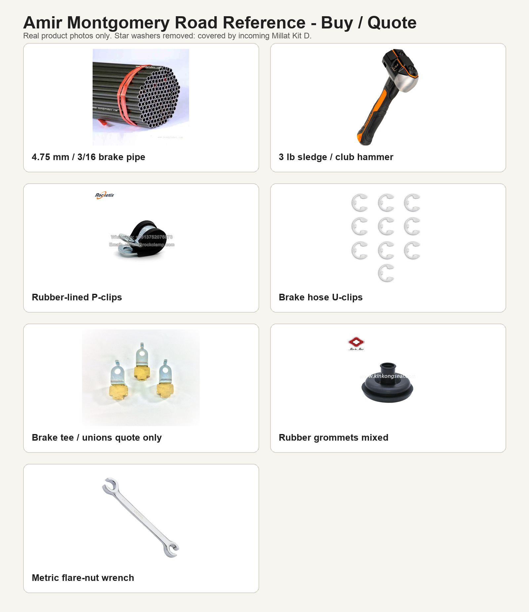
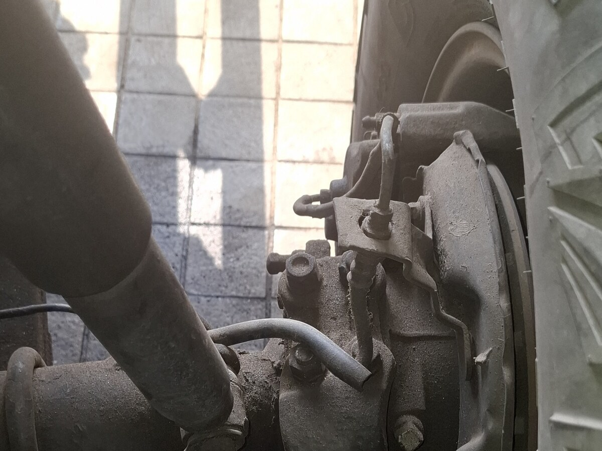
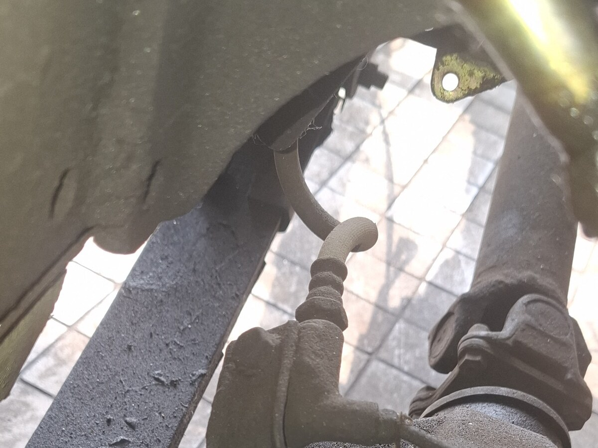
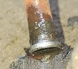

# Amir Montgomery Road Market List - 2026-05-27

Purpose: give Amir simple runner tasks while he is on Montgomery Road: collect prices, shop cards, packet photos, simple counter items, and exact-spec purchases. He is office support, not a mechanic, so he must not approve brake fit or sample-match parts himself; payment for safety-critical brake parts is allowed only when the mechanic/user has already provided a written spec, a labelled old sample, or explicit approval for the exact item.

Safety rule: brake hydraulic parts must be automotive brake-rated. If the item affects braking and the mechanic/user has not already approved the exact sample/spec, Amir should send photos and price only. Once a written spec card or labelled sample exists, his job is only to buy that exact match or call before paying. Spec capture guide: [brake-runner-spec-capture-20260528.md](brake-runner-spec-capture-20260528.md).

## Photo Reference

This sheet uses real product/project photos, not drawn representations. Use product photos for recognition only; brake fittings and hoses still need old-sample matching.

Actual J40 brake fitting references:

## Procured By Amir - Receipt Check

User clarification 2026-05-28: mark these items as procured by Amir. They are no longer open shopping-list buys, but they still need receipt/spec checks before use.

| Priority | Item | Quantity | Exact ask | Accept | Reject / call first |
| --- | ---: | ---: | --- | --- | --- |
| P0 | M6 star / lock washers | 120 | M6 serrated/star lock washer pack | Plated or stainless, sharp/clean bite teeth | Flat washers, split spring washers sold as star washers, rusty stock |
| P0 | M8 star / lock washers | 60 | M8 serrated/star lock washer pack | Plated or stainless, sharp/clean bite teeth | Flat washers, split spring washers sold as star washers, rusty stock |
| P0 | M10 star / lock washers | 30 | Treat the user's `M2-` entry as the existing M10 grounding-washer line | Plated or stainless, sharp/clean bite teeth | M2 hardware unless explicitly re-confirmed; rusty stock |
| P0 | 3 lb sledge / club hammer | 1 | 3 lb short-handle sledge hammer | Tight head, solid fiberglass/steel/wood handle | Loose head, cracked handle, toy/light hammer |
| P0 | Brake hard-line tube | 25 ft | `4.75 mm / 3/16 in` automotive brake pipe, double-wall Bundy steel, zinc/PVF/galvanized coated | Brake-rated steel Bundy tube; CuNi/Cunifer if good and brake-rated | Bare copper, plumbing tube, unknown tube, stainless if shop cannot flare it |
| P0 | Raptor hardener / activator | 1 L | Genuine/compatible U-POL Raptor hardener for the on-hand Raptor coating | Sealed, in-date, correct product family and mix ratio | Generic 2K hardener for a different product |
| P0 | Rear drum hardware kit | 1 axle kit | Centric `116971-05110530`, 1960-1980 Toyota Land Cruiser drum brake hardware kit | Contents match opened-drum layout, spring hooks, hold-down pins/cups, adjuster hardware, clips | Incomplete kit, wrong spring layout, wrong hold-down pin length, mismatched side-to-side hardware |
| P0 | Brighto Extreme Paint Remover | 3 L | Brighto Extreme Paint Remover, sealed 3 L container | Correct product, no leaks, label intact | Unknown stripper, leaking/open container, product for a different coating system |
| P0 | Blow torch | 1 | Blow torch suitable for heating seized suspension pins; gas canister included or compatible | Sound valve/trigger/hose if fitted, correct canister fit, no leaks | Kitchen-only low-output torch if pin is heavily seized, leaking valve/hose, unknown canister fit |

## Still Buy If Missing

| Priority | Item | Quantity | Exact ask | Accept | Reject / call first |
| --- | ---: | ---: | --- | --- | --- |
| P0 | Tube deburrer / reamer | 1 | Compact internal/external deburrer or reamer for `4.75 mm / 3/16 in` brake tube | Tool deburrs inside and outside of small tube cleanly | File/knife-only workaround; tool too large for 3/16 tube |

## Buy If Available At Sensible Price

| Priority | Item | Quantity target | Instructions |
| --- | ---: | ---: | --- |
| P0 | 4.75 mm rubber-lined P-clips | 25-30 | For brake/clutch hard-line support. Must grip 3/16 pipe without crushing it. |
| P0 | Brake flex-hose retaining U-clips | 8-12 | Flat spring U-clips for brake hose brackets. Buy mixed if exact size uncertain. |
| P0 | Brake-line / axle support clips | 10-20 mixed | For axle and chassis hard-line retaining points. Take photos before paying if sizes vary. |
| P0 | Rubber grommets small/medium | 6, 8, 10, 12 mm ID mixed | For firewall/pass-through and anti-chafe points. |
| P0 | Rubber grommets large | 16, 20, 25 mm ID mixed | Useful for power cable and larger firewall openings. |
| P0 | Edge trim / anti-chafe sleeve | 1-2 m | Rubber or plastic edge protection where pipe/wire passes metal. |
| P0 | Hydraulic line caps/plugs | 1 mixed set | For master cylinder, wheel cylinder, caliper, hard-line, and flex-hose ports. |
| P0 | Brake cleaner | 4 cans | Non-residue brake cleaner for drums, calipers, fittings, and leak checks. |
| P0 | Catch bottle/tray and clean rags | 1 set | Brake-fluid catch setup and lint-free rags. |
| P0 | Metric flare-nut wrench set | 1 set | Must cover likely sizes around 10, 11, 12, 14, 17 mm. |
| P0 | 3/16 brake pipe bender | 1 | Must explicitly fit `3/16 in / 4.75 mm`. |
| P1 | Small tube cutter | 1 | Only if cheap and rated down to 3/16 or 4.75 mm. We may already have one, so not urgent. |
| P1 | Thread pitch gauge | 1 | Metric pitch gauge for M10x1.0, M10x1.25, M12x1.0 checking. |
| P1 | M6/M8 captive nuts, speed clips, clip nuts | Mixed pack | Body panel and bracket fastening. |
| P1 | R-clips, hairpins, cotter pins, circlips | Mixed pack | Body retainers, pins, linkages, and small hardware. |
| P1 | Penetrating oil | 1 can | For old brake fittings and seized hardware. |
| P1 | Punch/drift set | 1 set | Useful with the sledge for stuck pins and brackets. |
| P1 | Safety glasses | 1 pair | For hammering, cutting, and wire brushing. |

## Air Compressor Hose / Adapter Fix

Current issue: the compressor hose/fittings do not fit either side. Do not buy a random small hose; standardize the compressor, hose, and tools to one quick-coupler family.

Already ordered:

- Almiraj bundle included INGCO `AH1151` / `AH1151-3` air hose. This is a small-bore hose: `15 m`, `5 mm ID x 8 mm OD`, usually Nitto-type on `AH1151-3`.
- ToolsMart order `TM25776` includes a Licota `9 m` PU hose roll with Nitto-type quick couplers. This is the intended larger-bore follow-up, but it is still pending delivery.

If Amir is buying locally now, ask for:

| Item | Exact ask | Quantity | Notes |
| --- | --- | ---: | --- |
| Nitto/Japanese air quick-coupler matched set | `1/4 inch` air-line quick coupler set, Nitto/Japanese industrial type | 1 full set | Must include male plugs and female sockets/couplers so compressor, hose, blow gun, tire inflator, and impact wrench all use the same standard. |
| Thread adapters | `1/4 inch BSP` male/female adapters, plus `1/4 inch NPT` only if the tool thread proves NPT | mixed set | Pakistan/INGCO/TOTAL stock is often BSP-style, but the actual tool/compressor threads control. Take parts to shop if possible. |
| Larger air hose if the ToolsMart hose is not arriving soon | `8-10 mm ID` / `3/8 inch` air hose, `9-15 m`, Nitto/Japanese quick couplers, minimum `12 bar` working pressure | 1 | Needed for 1/2 inch impact wrench airflow. The `5 mm ID x 8 mm OD` hose is fine for blow gun/tire inflator/light tools but may choke the impact. |
| PTFE tape or air-thread sealant | For threaded air fittings | 1 roll/tube | Use on threaded joints only; do not tape quick-coupler noses. |

Market instruction:

> Make the compressor outlet, hose ends, blow gun, tire inflator, and 1/2 inch impact wrench all fit one Nitto/Japanese quick-coupler standard. Use `1/4 inch` threaded air fittings/adapters. If the thread does not start by hand, stop and send photos; do not force BSP into NPT or NPT into BSP.

Photos Amir should send:

- Compressor outlet close-up.
- Both ends of the current air hose.
- Air inlet on the blow gun / tire inflator / impact wrench.
- Any fitting packets with `1/4`, `BSP`, `NPT`, `Nitto`, `Japan`, `Euro`, or `USA` label visible.

## Quote Now / Buy Only Against Written Spec Or Sample

Do not pay for these unless Amir has the old sample in hand, a written spec card, explicit mechanic/user approval, or the seller agrees it can be returned after thread/seat mismatch.

If the written spec is missing, capture it first using [Brake Runner Spec Capture](brake-runner-spec-capture-20260528.md): installed photo, labelled old sample, ruler/caliper measurements, close-ups of ends/clips/threads/seats, and bagged parts by position.

Rear parking-brake/back-section note: the existing photo set already covers route and installed layout for the rear cable, backing-plate lever, return spring/clip area, axle hard-line route, and rear center hose/T area. Do not ask Amir to judge from photos alone; finish the spec with measured/labelled old parts or received-cable comparison before payment.

| Item | What to ask | What Amir should send back |
| --- | --- | --- |
| Brake hydraulic hose/line package | Ask whether the shop can make complete crimped front-left, front-right, and rear-center automotive brake flex hose assemblies from written spec or old samples; ask about brake-rated `4.75 mm / 3/16 in` tube/fittings only if the separate tube-stock row is not already covered | Shop card, hose marking, fitting examples, price, whether DOT/SAE J1401 or OEM-equivalent; buy only exact written-spec/sample match |
| Rear drum spring / hold-down / adjuster hardware | Ask for upper/lower return springs, hold-down pins/cups/springs, adjuster hardware, retaining clips, and parking-brake lever clips by opened-drum sample/layout/spec | Photos, price, whether kit matches old samples/spec; buy only after opened-drum spec and PakWheels shoe delivery check |
| Rear parking-brake cable attachment hardware | Ask for clevis pins, equalizer/intermediate cable pieces, adjuster nut, cable-end clips, return springs, and retaining clips by received cable/old sample/spec | Photos, price, dimensions; buy only after received-cable/old-sample spec and cable package check |
| Brake flare nuts / tube nuts | Brake-rated `3/16 / 4.75 mm` double/inverted flare tube nuts, likely Toyota metric | Close photo of thread, seat side, hex size, packet/label, price |
| Inline unions | Brake-rated double/inverted flare unions for 3/16 tube | Photo of both ends and label; no plumbing/compression union |
| Rear axle T / tee fitting | Brake-rated T fitting matching rear axle union style | Photo of port arrangement, mounting hole/bracket, label, price |
| Front and rear flex brake hoses | Covered by the buy-now hose/line package above; do not pay unless the shop can make complete crimped automotive brake hose assemblies from old samples | Shop card, hose marking, fitting examples, whether DOT/SAE J1401 or OEM-equivalent |
| Rear parking brake cable set | Ask by 1978 Toyota Land Cruiser J40 rear drum brake cable; Toyota reference candidate `46410-60092` | Photos, price, whether left/right complete set, hardware included |
| Compact covered fuse/relay box | Small OEM-style cabin fuse box with cover and pigtails | Photo, number of fuse ways, cover, wire tails, price |

## Script For Shops

Brake pipe shop:

> Need 4.75 mm / 3/16 in automotive brake hard-line tube for old Toyota Land Cruiser. Prefer double-wall Bundy steel with zinc/PVF/galvanized coating. Need 25 ft minimum, or 10-12 m if price is good. Also need quote for matching brake-rated double/inverted flare tube nuts, unions, and rear T fitting after old sample confirms thread and seat. No copper plumbing tube and no compression fittings.

Brake hose shop:

> Need quote for complete crimped automotive brake hose assemblies for old Toyota Land Cruiser: front left, front right, and rear center. Hose must be brake-fluid rated, DOT/SAE J1401 or OEM-equivalent. If we give a labelled sample or written spec card, make/order that exact match only. No generic rubber hose cut from roll.

Brake hose spec card fields we can define before payment:

- Position: front left, front right, or rear center.
- Free length and fitted route clearance.
- End fitting type at each end, including male/female, banjo if applicable, thread, seat/flare, and hex.
- Bracket groove/retaining-clip width and any locating flats, spring guards, sleeves, or grommets.
- Hose marking/rating: DOT/SAE J1401 or OEM-equivalent brake hydraulic hose.
- Old sample or labelled photo reference controlling the match.

Fastener shop:

> M6/M8/M10 star or serrated grounding washers are now procured by Amir; Millat/MTL Fastener Kit D remains a separate in-flight stock row. Reconcile counts after both are physically checked. Only quote M6/M8 captive nuts, speed clips, clip nuts, R-clips, hairpins, cotter pins, and circlips.

## Photos Amir Must Send Before Paying If Uncertain

- Photo of the item in the seller's hand with size label visible.
- Photo of any brake fitting from the thread side and seat side.
- Photo of brake pipe packaging or coil label showing `3/16`, `4.75 mm`, or brake rating.
- Photo of shop card/signboard and phone number for brake pipe/hose shops.
- Price, quantity, and whether return/exchange is allowed.

## Hard Rejects

- No bare copper pipe for brake lines.
- No household/plumbing tube.
- No compression fittings.
- No single flare or ISO bubble flare unless old sample proves that exact seat.
- No unmarked generic rubber hose for brake flex lines.
- No open bottles of brake fluid.
- No expensive brake fittings without old-sample thread/seat confirmation.

## Photo Sources

- Brake pipe: Bundy Tubes 4.75 mm PVF coated brake line tube.
- Brake fittings: The Stop Shop 3/16 inverted flare tee.
- Brake hose U-clips: Russell brake hydraulic hose clip via PerformanceParts.
- Rubber-lined P-clips: RockClamp DIN 3016 rubber-lined clamp photo.
- 3 lb sledge: Klein Tools H80603 3-pound sledge hammer.
- J40 front hose, rear union, and removed flare: current project photos in this repo.
