# Amir Montgomery Road Market List - 2026-05-27

Purpose: give Amir simple runner tasks while he is on Montgomery Road: collect prices, shop cards, packet photos, simple counter items, and exact-spec purchases. He is office support, not a mechanic, so he must not approve brake fit or sample-match parts himself; payment for safety-critical brake parts is allowed only when the mechanic/user has already provided a written spec, a labelled old sample, or explicit approval for the exact item.

Safety rule: brake hydraulic parts must be automotive brake-rated. If the item affects braking and the mechanic/user has not already approved the exact sample/spec, Amir should send photos and price only. Once a written spec card or labelled sample exists, his job is only to buy that exact match or call before paying. Spec capture guide: [brake-runner-spec-capture-20260528.md](brake-runner-spec-capture-20260528.md).

Refurbishment rule added 2026-05-29: radiator and brake booster refurbishment can go through Amir, but payment is blocked until the video gates in [amir-refurbishment-video-gates-20260529.md](amir-refurbishment-video-gates-20260529.md) are complete and approved. Amir can collect quotes freely; he must not approve the technical repair himself.

Front disc rule added 2026-05-29: Amir can collect local quotes/photos for the visible Sumitomo front disc setup, but this is runner work only. Pads, calipers, rotors, and front hoses are safety-critical parts; payment is allowed only against labelled old samples, written mechanic specs, or explicit user/mechanic approval for the exact item.

Evidence refresh, 2026-05-30:

- Gmail MCP direct search was attempted on 2026-05-30, but the Gmail MCP account is not authorized in this session (`No access, refresh token, API key or refresh handler callback is set`). Use the latest local Gmail import until auth is restored.
- Latest local Gmail import `data/processed/generated/comms_ingest_2026-05-30_categorized.csv`: `15` messages read, `8` categorized after `2026/05/29`.
- WhatsApp import rerun from `scripts/import_whatsapp_mcp_j40.py` at `2026-05-29T22:01Z` / `2026-05-30 03:01 PKT`: `11` selected chats, `1787` messages, `294` media items. The extra recent live messages were general TLC group chatter/media, not a new Amir parts lead.
- The runner list still changes from the Gmail evidence: do not duplicate the ToolsMart `TM25805` air/flaring order, AliExpress `3073111533377489` Nitto male-coupler order, Daraz `242695068680938` blow-torch order, PakWheels `1076462` clutch-master order, or Autohub `1762694` / `62694` engine-oil order. Amir should receipt-check those when they arrive, not rebuy them locally unless explicitly told they are urgent duplicates.
- Front disc local quote snapshot added in [front-disc-local-quotes-20260530.md](front-disc-local-quotes-20260530.md) and `data/manual/front_disc_local_quote_snapshot_20260530.csv`. No Pakistan online listing proved exact J40/Sumitomo fit; Autostore, PakWheels, and Daraz prices are local quote anchors only.

Evidence refresh, 2026-06-18:

- Gmail OAuth/import was restored through the repo workflow. New artifacts: `data/processed/generated/comms_ingest_2026-06-18_categorized.csv`, `data/processed/generated/gmail_project_messages_2026-06-18.json`, and `data/processed/generated/comms_ingest_2026-06-18_status.json`; `53` messages read and `27` categorized.
- ToolsMart `TM25776` now has Gmail fulfillment/review evidence for `LICOTA MADE IN TAIWAN FLARE NUT WRENCH 12 X 14`. Do not buy a duplicate `12 x 14` flare-nut wrench; shelf-check it and only buy missing line-wrench sizes such as `10/11/17 mm` if not covered.
- AliExpress `3/16 in` flaring-tool reminder is marketing/browsing evidence only, not an order.
- User update 2026-06-18 says two flaring kits are on hand and the copper-coloured tube has arrived. Follow-up image clarification identifies the wheel pipe-entry part as a rear wheel cylinder, not a loose brake-line fitting. Amir should not rebuy these blind; his job is receipt/spec photos and sample-match proof. The copper-coloured tube is usable for brake hydraulics only if it proves brake-rated CuNi/Cunifer or automotive brake tube, not bare/plumbing copper.
- Current brake focus is rear brakes first. Front disc parts remain documented but parked for now. Booster/servo route is to service/rebuild the removed old booster as a parallel job, with exchange/refurbished replacement only if service is not viable and the sample match is proven.

## 2026-05-30 Exact Shop Requests For Amir

Use this section first. Amir should read the exact ask to the shop, then send the required proof before payment. For brake, steering, fuel, A/C refrigerant, radiator, and booster work, he is collecting quote/proof only unless the buy gate says the exact match is released.

Every shop response must include: shop card/location, phone number, quoted price, brand/box label, clear part-number photo if any, return/exchange terms, and whether the seller accepts sample comparison before final payment.

| Task | Exact ask to shop | Amir must send back | Buy gate |
| --- | --- | --- | --- |
| Front disc pad axle set | "I need front disc brake pads for an old Toyota Land Cruiser fixed Sumitomo caliper. Please check `04491-60010`, `04491-60030`, `04465-35170`, or `04465-YZZC0`. The reference pad shape is about `107 x 65.7 x 15.5 mm`. Do not give Prado/Fortuner/J200 pads." | Box label, pad face and backing plate, backing-ear shape, thickness measurement, price, return terms, and photo beside the removed pad if available. | Buy only after removed pad outline, backing ears, thickness, and caliper/rotor clearance match. |
| Front pad retaining hardware kit | "I need the Sumitomo front disc pad pin hardware kit like `BR06158K` / `MT 12342`: exactly 4 pad retaining pins, 2 anti-rattle springs, and 2 pin clips." | Count all three groups separately in one photo, plus pin length/diameter, spring shape, clip shape, packet/part number, price, return terms. | Buy only if old pins/springs/clips match length, diameter, shape, and installed retention. |
| Front pad shims / abutment pieces | "Do these pads need separate shims, abutment plates, or contact pieces? If yes, show the exact pieces for this Sumitomo pad shape." | Photos of the seller's shim/contact pieces and the removed old backing/shim/abutment pieces. | Quote only until one side is opened and old pieces prove the need. |
| Front flexible brake hoses | "Can you supply or make complete crimped automotive brake hoses for old Land Cruiser front disc brakes? Lower wheel hose reference `553-102`, about `9 1/4 in`; upper/frame hose reference `553-101`, about `10 3/8 in`, only if fitted. Must be DOT/SAE J1401 or OEM-equivalent." | Hose marking/rating, both end fittings, thread/seat/banjo if any, bracket groove, retaining clip, free length, price, and photo beside labelled old hose/spec card. | Buy only complete crimped assemblies matched to old sample or written spec. No roll hose or substitute fittings. |
| Front Sumitomo calipers | "Quote rebuilding our original fixed Sumitomo 4-piston calipers, and also quote direct-match rebuilt/new replacements if available. Reference family Toyota `47730-60021` RH / `47750-60021` LH, `34/43 mm` piston catalog reference, `20 mm` disc family." | Casting marks, RH/LH orientation, mounting ears, inlet/bridge pipe, bleeders, piston/boot condition, rebuild contents, bench test terms, price. | Payment only after side-by-side match or rebuild proof with clean bores, usable/new pistons, new seals/boots, free bleeders, sound bridge pipes, and bench leak/function test. |
| Front rotors | "I need a pair of new front rotors for old Land Cruiser front disc/Sumitomo setup. Toyota reference `43512-60011`: vented, `302 mm` OD, `20 mm` nominal, `19 mm` minimum, `100 mm` center bore, `139.7 mm` PCD, `48 mm` height, 6 holes plus 2 service holes." | Box label, OD, thickness/min-thickness marking, center bore, height, stud pattern, service holes, price, return terms. | Buy only after old rotor measurements, hub/register, dust-shield, caliper, and wheel clearance match. |
| Brake booster / servo | "Service/rebuild our old booster first. Quote direct-match refurbished exchange only if our old booster cannot be rebuilt. Do not quote a raw used booster. It must match firewall studs, master studs, pushrod/clevis, shell depth/diameter, check valve/grommet, and vacuum hold." | Videos required by `docs/amir-refurbishment-video-gates-20260529.md`: old sample identity, before/after or side-by-side match, interface close-ups, vacuum hold, assist movement, contamination check, final acceptance. | Quote freely; no deposit/payment/exchange until video gate is approved. |
| Engine radiator recore/new build | "Here is the old radiator sample. Pressure/flow test it. Recore it if tanks, necks, drain, cap seat, and brackets are sound; otherwise build a new copper/brass radiator by sample. Do not copy the extra bad support leg as the main mount." | Videos required by `docs/amir-refurbishment-video-gates-20260529.md`: sample identity, measurements, shop decision, pressure/leak test, core/build proof, corrected mounting proof, final acceptance. | Quote freely; no deposit/payment/collection until video gate is approved. |
| Radiator right-side post metal | "Need `50 x 50 x 4 mm` mild-steel 90-degree angle/L-section, 1 m, plus small `3-5 mm` EPDM/SBR rubber sheet offcut. Optional fallback: 4 mm mild-steel plate offcut around `700 x 450 mm`." | Tape/caliper on angle leg width/thickness, length, surface condition, rubber thickness, price, shop card. | Buy if dimensions and material are exact; reject thin 2 mm angle, aluminium angle, twisted/rust-pitted stock, foam rubber. |
| Fuel filter | "Need a 2H/HJ47 diesel fuel-filter element. Candidate Toyota numbers `23303-54071` / `04234-68010`. Please show element, gasket/seal, thread/seat, and box number." | Box, element top/bottom, seal/gasket, part number, price, return terms, old-sample comparison if available. | Buy only exact old-sample/manual/part-number match. |
| Glow plugs | "Need six new glow plugs for Toyota 2H diesel. Primary target Toyota `19850-68030 x6`. Only quote `19850-68060 x6` if the old plug/system proves the later 24V/superglow setup." | Box, plug marking, thread/tip length, voltage marking, count x6, price, return terms. | Buy sealed Toyota-labelled or trusted new equivalent only; reject used/refurbished/substitute plugs. |
| Accessory belts | "Need belts by old belt code or measured belt profile and effective length for this engine layout. Prefer Bando, Mitsuboshi, Gates, or trusted equivalent." | Belt code, profile, length, width, brand sleeve, price, old-belt photo if available. | Buy only same profile and effective length as old belt/spec. |
| Radiator cap | "Need Toyota `16401-41021` or exact pressure-equivalent radiator cap, but only after this radiator neck and pressure are confirmed. Candidate pressure is `0.9 bar` only if the neck/manual supports it." | Cap underside, pressure marking, neck size/style, box label, price. | Buy only after fitted radiator neck/sample confirms size and pressure. |
| Heater hose | "Need `1000 mm` of `16 mm / 5/8 in` EPDM heater hose, SAE J20R3 or better. Final cuts will be `400 mm` and `280 mm`." | Hose marking showing EPDM/heater/coolant rating, ID measurement, price per metre. | Buy exact rated stock only. |
| Vacuum and breather hose | "Need reinforced `10-12 mm ID` vacuum hose x `2000 mm` that will not collapse, plus oil-resistant `16-19 mm ID` breather/oil-mist hose x `1000 mm`." | Hose markings, ID measurement, wall/reinforcement photo, price. | Buy only if rating is visible or seller can prove engine-bay vacuum/oil-mist suitability. |
| Diesel fuel hoses and clamps | "Need diesel-rated hose: `8 mm ID x 1500 mm`, `6 mm ID x 2000 mm`, `3.2-3.5 mm` injector leak-off x `1000 mm`, plus rolled-edge fuel clamps for those sizes." | Hose rating/marking, ID measurement, clamp edge photo, price. | Buy only diesel-rated hose and rolled-edge clamps. Reject sharp perforated clamps for fuel hose. |
| Radiator hoses / formed coolant pipe | "Need HJ47/2H upper hose reference `16571-68020` / Dayco `DMH1342`, lower hose reference `16572-68020` / Dayco `DMH1343`, overflow hose `1000 mm`, two `28-30 mm ID` connector blanks, and a copied formed coolant pipe from old sample using `28-30 mm OD`, `1.2-1.6 mm` wall tube with bead ends." | Hose shape/marking, connector ID, pipe tube OD/wall, bend/offset/bead proof, price, sample comparison. | Buy standard hoses if shape/rating match. Fabricate pipe only if shop can copy sample, bead ends, and allow dry-fit/pressure test. |
| Gearbox oil quote | "Only quote H55F candidate oil after case/top-cover marks confirm the gearbox: SAE 75W-90 API GL-4/GL-5 candidate, 4.9 L capacity, buy 5 L." | Gearbox mark photo first, oil label/spec, price. | Do not buy until gearbox identity, grade, quantity, and plug washer needs are confirmed. |
| Hidden A/C evaporator core/case/plenum | "Need a compact cabin evaporator/cooling coil in a small sealed case or plenum for an old Land Cruiser. We will use our own blowers, so no blower is required. Prefer no-blower/removable-blower `BEU-202`, low-profile `BEU-404`, short `BEU-848`, or equivalent. Must have TXV/expansion valve provision, fittings, drain pan/nipple, and outlet spigots or a flat plenum face." | All-side tape photos, overall dimensions, coil face size, core depth, inlet/fitting side, TXV, drain pan/nipple, outlet/plenum dimensions, duct spigot OD/count, price, leak-test plan. | Buy only after cardboard under-dash mock-up and bench airflow/leak test prove it works with owner blowers. Reject bare coil unless shop can fabricate sealed plenum and drain pan. |
| A/C vents, duct, controls, return/filter, drain pieces | "Quote matching vents/outlet panel, return grille/filter, control panel, duct/demist hose, drain hose, grommet, and mounts for the selected evaporator plenum and external blower layout." | Outlet count/OD, vent dimensions, control type, duct OD, drain hose ID, mounting photos, price. | Do not buy random vents first; buy only after evaporator outlet geometry and under-dash position are confirmed. |
| A/C condenser, drier, trinary, barrier hose, bulkheads, O-rings/service | "Quote a parallel-flow condenser sized to the core support, receiver-drier matched to R134a fittings and bracket, trinary switch matched to drier/high-side port, R134a barrier hose/fittings, firewall bulkhead fittings/grommets, HNBR O-rings, correct oil, vacuum/leak/charge service." | Condenser dimensions/fitting side, drier ports/flow/bracket, trinary thread, hose sizes/fitting angles, bulkhead/grommet photos, service price. | Quote now; final hose crimp and charge only after compressor, condenser, drier, bulkhead, and evaporator positions are locked. |
| Brake tube nuts / unions / rear T | "Buy a spare set of brake-rated `3/16 in / 4.75 mm` double/inverted-flare tube nuts anyway. No separate flare-nut connector order is confirmed. The Altivox brake-line kit may include `28` fittings; please check those too. Thread and seat must match old sample. No plumbing/compression fittings." | Received kit fittings beside old sample if available, count, thread side, seat side, hex size, port arrangement, mounting hole/bracket, packet label, price for a spare tube-nut set. | Buy spare brake-rated tube nuts now, but use them only if old sample confirms thread and seat. Quote/buy missing unions/T only after mismatch. |
| Rear handbrake splitter/equalizer cable | "This is not an import/catalog hunt. Need the rear cable section at the back where one handbrake pull splits to both rear wheels. Take the old section to a local auto-control-cable maker and copy it: cable, outer sheath, stops, adjuster, splitter/equalizer/yoke, clevis ends, pins, clips, and all return/assist springs." | Old cable beside new cable, splitter/equalizer/yoke photos, swaged ends, sheath stop sizes, adjuster thread, free lengths, spring dimensions, price. | Buy/fabricate only from old sample. Reject wire-rope clamps, light motorcycle cable, solder-only ends, or fixed/welded splitter. |
| Rear drum and parking-brake hardware | "Need sample-matched handbrake hard parts: equalizer/yoke pieces, clevises, clevis pins, R/split clips, adjuster nut/rod pieces, cable-end clips, backing-plate/lever clips, and all return/assist springs. Replace all handbrake springs; do not reuse weak old springs." | Photos of each piece, dimensions, price, whether it duplicates the Centric kit or cable kit. | Buy only after opened-drum/received-cable sample/spec confirms missing pieces. |
| Compact cabin fuse add-on | "Need one compact old-OEM under-dash fuse carrier for the third feed group. Six usable fused outputs minimum; 8/10/12-way is acceptable if compact. Prefer Toyota/Suzuki/Daihatsu/Hyundai/Honda donor style with cover and pigtails." | Front/back, cover, terminal style, number of ways, input grouping/continuity if known, size, price. | Buy only compact OEM-style block; reject bulky marine/RV/universal boxes. |
| On-hand P-clips, U-clips, and brake tees | "Do not buy more P-clips, U-clips, or brake tees right now. We already have stock. The job is to copy the original brake/fuel/clutch line support and tee locations, then choose the on-hand piece that best fits each old location." | Photos of every original support/tee location before removal, old clip/tee beside the on-hand replacement, line OD, bracket hole/tab thickness, tee port orientation, thread/seat evidence, and final selected part by location. | Use on-hand stock only where it fits the same location and route. If no on-hand part matches, stop and sample-match one part; do not move lines or hoses to suit available stock. |
| Grommets, edge trim, caps/plugs, brake cleaner, catch tray, flare-nut wrenches | "Need only the remaining small consumables/tools if missing: grommets `6/8/10/12 mm` and `16/20/25 mm`; edge trim; hydraulic caps/plugs; brake cleaner; catch bottle/tray/rags; metric flare-nut wrench set covering `10/11/12/14/17 mm`." | Pack/count/size photos, price, and one photo showing the grommet/tool beside a ruler. | Buy only missing consumables/tools. Do not duplicate P-clips, U-clips, or brake tees. |
| Tube deburrer / reamer | "Need compact internal/external deburrer or reamer for `4.75 mm / 3/16 in` brake tube. Do not sell another flaring kit or cutter unless the PARD kit lacks this tool." | Tool tip/size photo, packaging, price. | Buy one only if the delivered PARD kit does not include a usable deburrer. |
| Air couplers/adapters | "Need local air-thread adapters only if urgent: standardize compressor, hose, blow gun, tire inflator, and 1/2 inch impact wrench to one Nitto/Japanese quick-coupler standard. Use `1/4 inch` threaded fittings/adapters; BSP first unless the tool proves NPT." | Compressor outlet, current hose ends, tool air inlets, fitting packets showing `1/4`, `BSP`, `NPT`, `Nitto`, `Japan`, `Euro`, or `USA`, price. | Do not duplicate ToolsMart `TM25805` or AliExpress Nitto male couplers unless the thread/sample is in hand and urgent. |
| Receipt-check procured Amir items | "These are not new buys. Please verify what was already bought/arrived: M6 x120/M8 x60/M10 x30 star washers, 3 lb sledge, copper-coloured 25 ft 3/16 brake tube, rear wheel-cylinder candidates that now appear to match, new rear brake shoes, Raptor hardener 1 L, Centric rear drum kit `116971-05110530`, Brighto Extreme Paint Remover 3 L, blow torch." | Receipt/packet photos, counts, labels, sizes, sealed/in-date condition, material/rating marks, and safety/function check photos. | Mark as received-candidate only until spec/condition check passes. |

## 2026-05-29 Image-Backed Runner Cards

Use this card sheet on Amir's phone before the longer tables below.

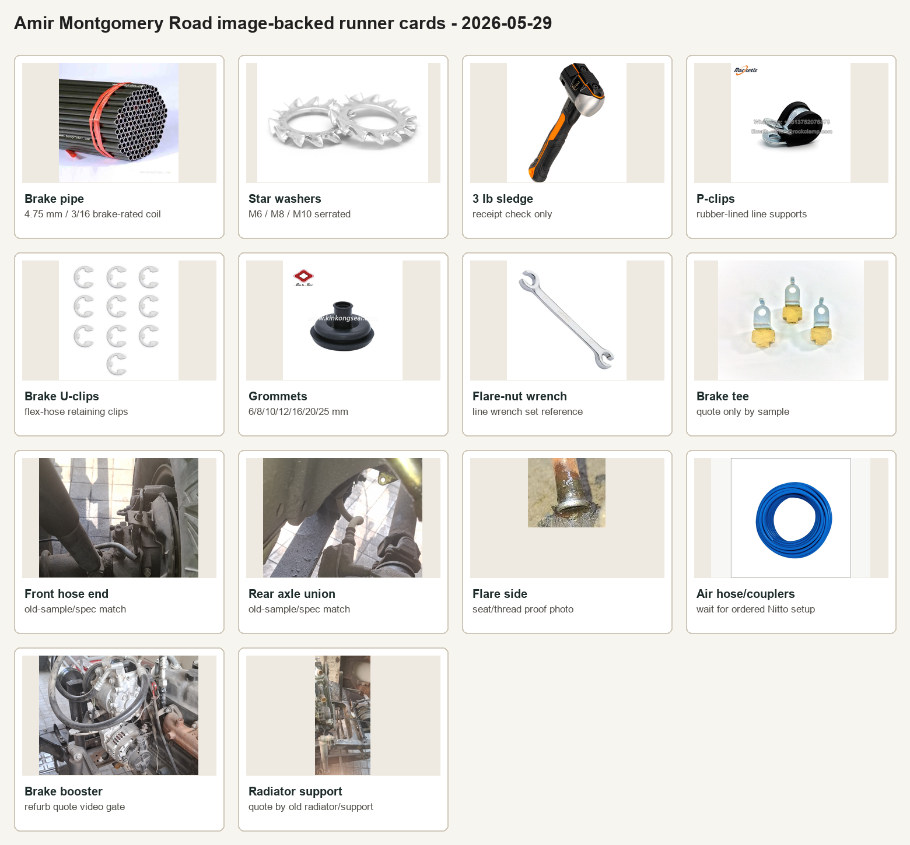

| Image | Item | Current action | Exact instruction |
| --- | --- | --- | --- |
| 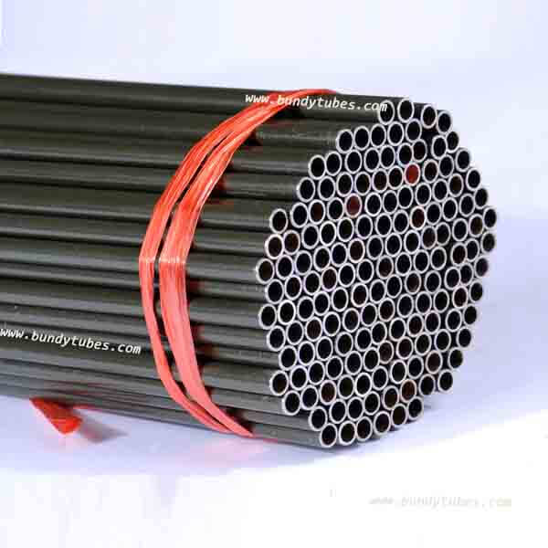 | Brake pipe coil | Receipt-check arrived tube first | User reports the copper-coloured tube arrived. Must be `4.75 mm / 3/16 in` automotive brake-rated Bundy/PVF/zinc-coated steel or good brake-rated CuNi/Cunifer. No bare copper, plumbing tube, refrigeration tube, or compression tube. Do not duplicate if the arrived coil passes check. |
| 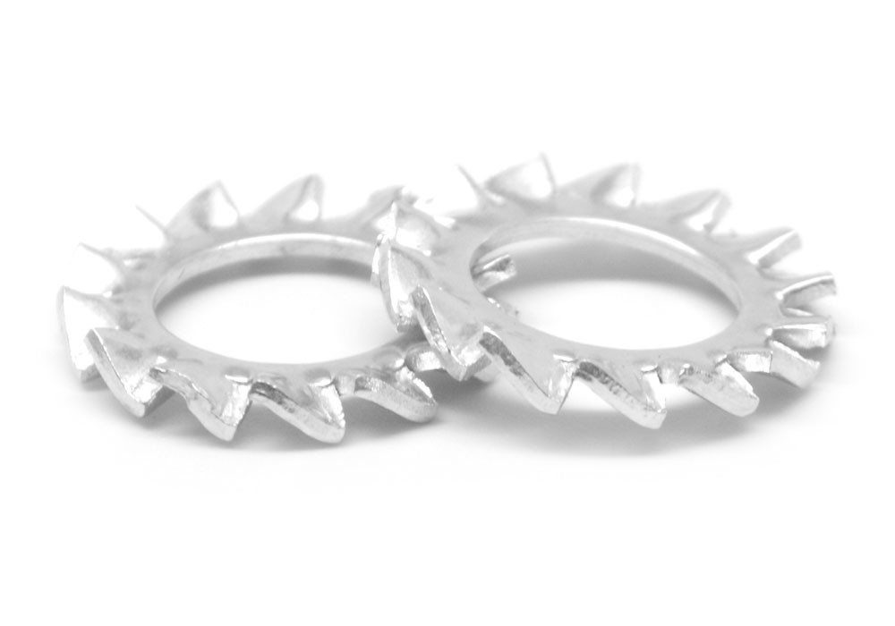 | Serrated/star grounding washers | Receipt-check existing Amir purchase | Confirm M6 x120, M8 x60, and M10 x30 intent. Reject M2 washers, flat washers, or split spring washers sold as star washers. |
| 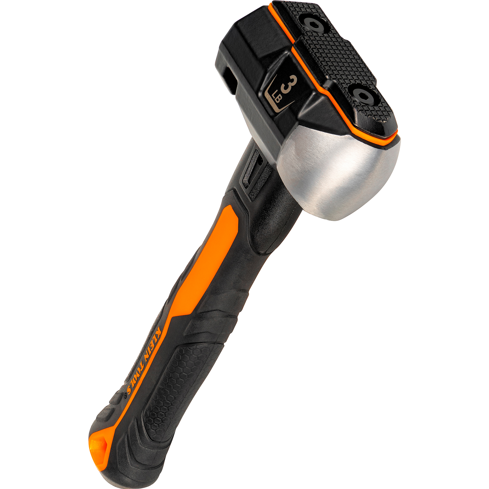 | 3 lb sledge / club hammer | Receipt-check existing Amir purchase | Confirm real 3 lb short-handle hammer, tight head, safe handle. |
| 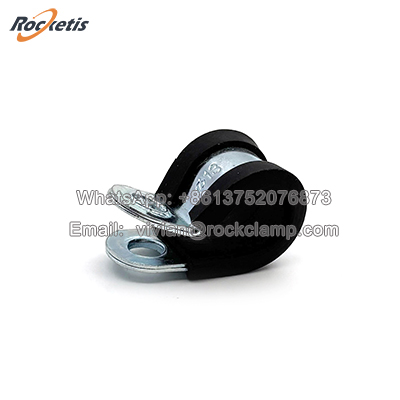 | Rubber-lined P-clips | Use existing stock by original location | Do not buy more now. Photograph old support locations, line OD, and bracket hole first; use the on-hand P-clip that holds the same route without metal-on-metal rub. |
| 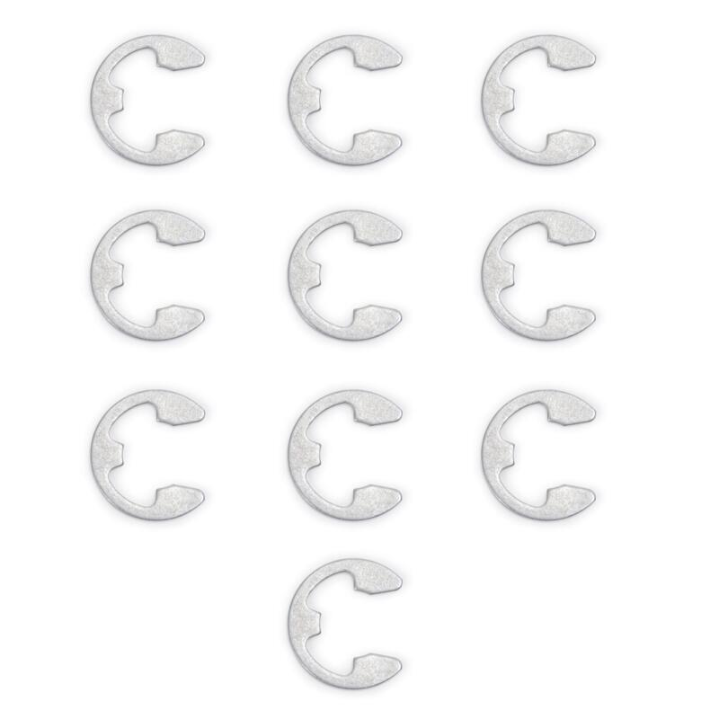 | Brake flex-hose U-clips | Use existing stock by original hose bracket | Do not buy more now. Match the selected hose groove and original bracket tab thickness with on-hand U-clips; stop if no clip locks tightly. |
| 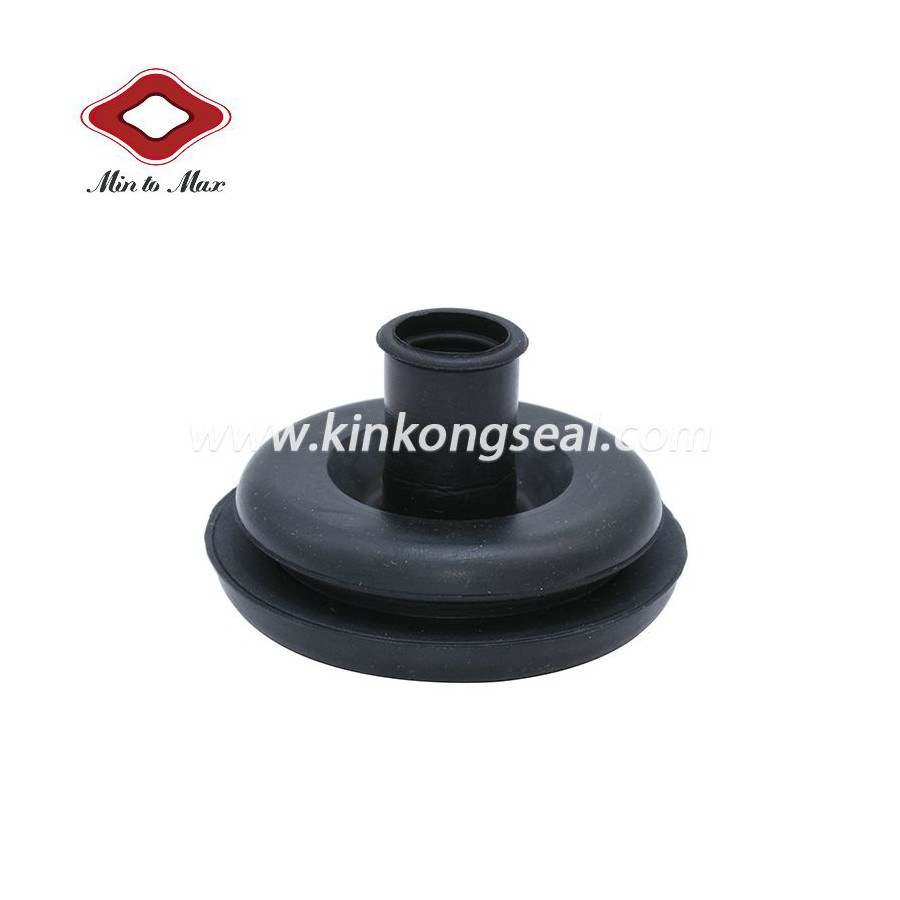 | Rubber grommets | Buy if missing | Buy 6/8/10/12 mm ID plus 16/20/25 mm ID mixed. Use for firewall/pass-through and anti-chafe points. |
| 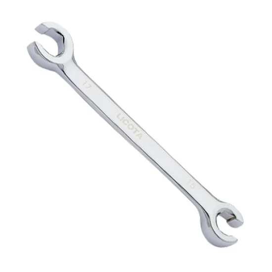 | Metric flare-nut wrench set | Shelf-check first; buy only missing sizes | Gmail now supports a received-candidate Licota `12 x 14` flare-nut wrench. Must still cover likely brake-line hex sizes around 10, 11, 12, 14, and 17 mm. This is a line wrench set, not a normal open spanner. |
| 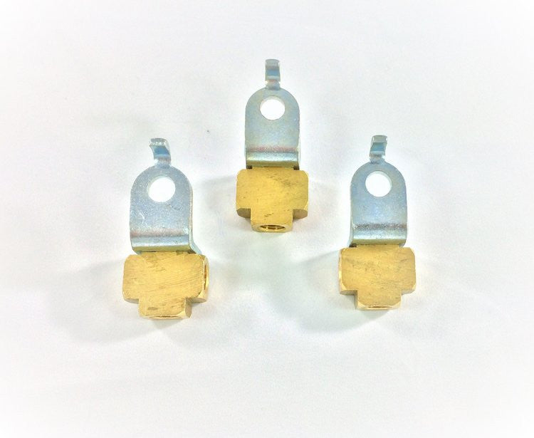 | Brake tee / inline unions / tube nuts | Buy spare brake tube nuts; count Altivox kit fittings | Buy a spare brake-rated `3/16 in / 4.75 mm` flare tube-nut set anyway. Brake tees/unions are on hand; the wheel pipe-entry part clarified on 2026-06-18 is a rear wheel cylinder, not a loose tube nut/union. Match old thread, flare seat, port orientation, mounting hole, and tube entry angles before use; quote only if no on-hand part matches. |
|  | Front brake flex hose ends | Quote/photo only | Complete crimped automotive brake hose assemblies only, DOT/SAE J1401 or OEM-equivalent. No generic hose cut from roll. |
|  | Rear axle union / T area | Quote/photo only | Use installed photo for recognition only. Final purchase needs removed old sample or written spec. |
|  | Brake flare side view | Spec evidence | This supports a Toyota-style double/inverted-flare working basis, but straight-on seat/thread confirmation still controls purchase. |
| 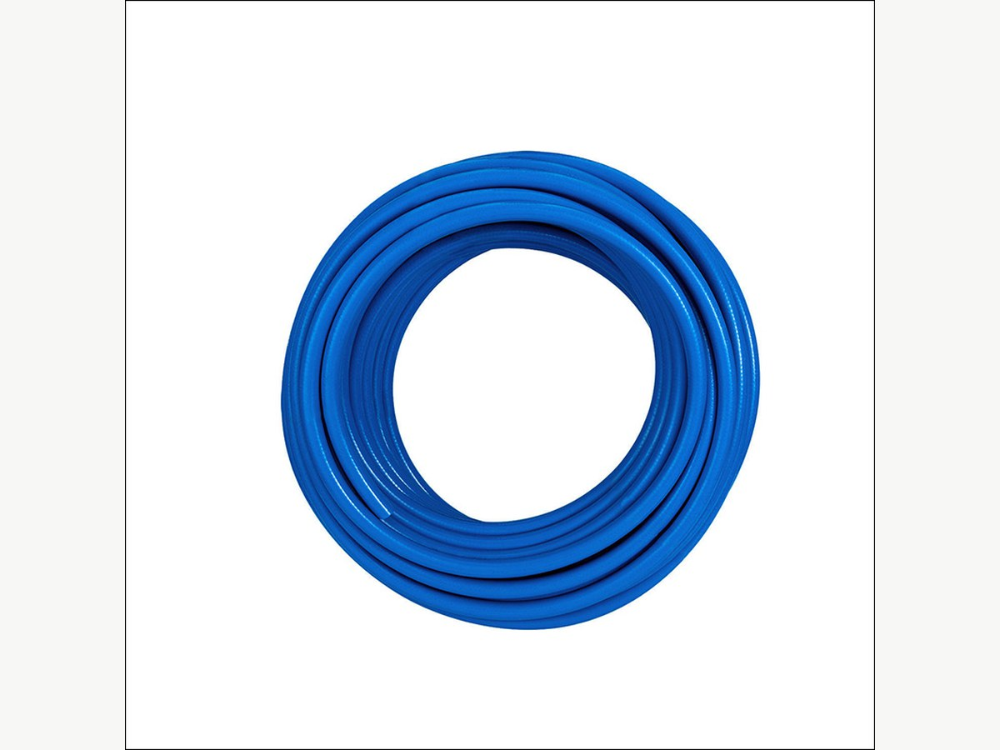 | Air hose / Nitto couplers | Wait for ordered setup unless urgent | ToolsMart `TM25805` already includes Licota `9 m` PU hose with Nitto couplers, Licota `1/4 in` quick coupler, and PARD flaring/cutting set. AliExpress `3073111533377489` has 5 Nitto male couplers shipped. Amir may buy local adapters only if the exact compressor/tool thread is in hand. |
| 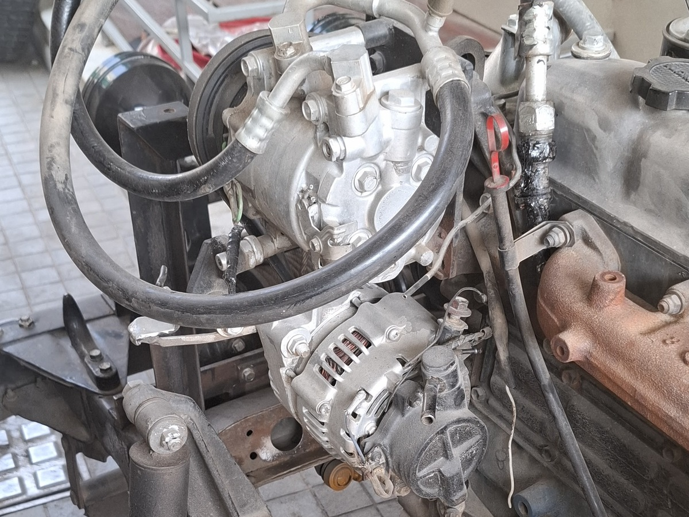 | Brake booster / servo | Service/rebuild quote first | Take old booster as sample. Preferred route is servicing/rebuilding our old booster; exchange/refurbished replacement is fallback only. Payment waits for the video gate: sample identity, before/after or side-by-side match, vacuum hold, assist movement, contamination check, and final acceptance video. |
| 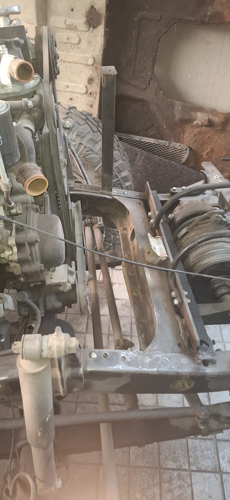 | Radiator / support route | Refurb quote only | Take old radiator/support context. Payment waits for the video gate: sample identity, shop decision, pressure/leak test, core/build proof, proper mounting proof, and final acceptance video. |

## Do Not Duplicate After Gmail Refresh

| Evidence | Item | Amir instruction |
| --- | --- | --- |
| Gmail `TM25805`, 2026-05-27, ToolsMart, PKR `24,320` | Licota `1/4 in` quick coupler, PARD double flaring/cutting set `3/16-5/8`, Licota `9 m` PU hose with Nitto quick couplers | Do not buy another flaring kit or air hose locally. Only buy a small deburrer/reamer if the delivered PARD kit does not include a usable one. |
| Gmail `TM25776`, 2026-06-18 import, ToolsMart fulfillment/review evidence | Licota `12 x 14` flare-nut wrench | Do not buy another `12 x 14` line wrench. Shelf-check this wrench, then buy only missing sizes if the available line-wrench coverage does not include likely `10/11/12/14/17 mm` brake nuts. |
| User update `2026-06-18` | Two flaring kits on hand | Do not buy another flaring kit. Receipt-check both kits and release only one that makes clean `3/16 in / 4.75 mm` double/inverted practice flares. |
| User update `2026-06-18` | Copper-coloured brake tube arrived | Do not buy duplicate brake tube unless this coil fails spec. Accept only brake-rated CuNi/Cunifer or automotive brake tube; reject bare/plumbing copper. |
| User update `2026-06-18` | Wheel-end connectors/fittings arrived | Do not buy duplicate tube nuts/connectors until these are checked against old wheel-cylinder/line-end thread and seat. |
| Gmail `3073111533377489`, 2026-05-28 shipped, AliExpress, PKR `3,072` | 5PCS Nitto male coupling air fittings | Do not duplicate Nitto male couplers unless urgent local adapters are needed and the thread is proven by sample. |
| Gmail `242695068680938`, 2026-05-27, Daraz, PKR `3,194` | Multi-purpose blow torch head | Treat blow torch as ordered. Receipt-check on arrival; do not rebuy on Montgomery Road unless this order fails. |
| Gmail `1076462`, 2026-05-29, PakWheels, PKR `3,794` | Trupart clutch master cylinder for Toyota BJ40/BJ60/HJ60, `FM-1246` | Treat as ordered candidate stock. Receipt-check only; do not buy a random clutch master locally without old-sample fit confirmation. |
| Gmail `1762694` / Autohub order `62694`, 2026-05-29, PKR `12,499` | Liqui Moly Touring High Tech SHPD-Motor Oil `15W-40`, 5 L | Treat engine oil as ordered. Do not buy duplicate engine oil locally; the Guard `GDO-135` oil filter remains a separate open item until order evidence or receipt appears. |

## Refurbishment Jobs Assigned To Amir

| Item | Route | Video gate before payment |
| --- | --- | --- |
| Engine radiator | Take the old radiator as the sample; quote recore if tanks/brackets are sound, otherwise new copper/brass build by sample. If the bought aluminium radiator is used, quote only a removable rubber-isolated adapter/cradle if the radiator is otherwise correct. The extra fabricated support leg is evidence of the bad previous installation, not a feature to copy blindly. | Old sample identity, measurements, shop decision, pressure/leak test, core/build proof, proof it mounts on proper lower pads/side/top mounts without the extra leg, adapter/cradle proof if the aluminium radiator is used, final acceptance video. |
| Brake booster / servo | Take the old booster as the sample; quote service/rebuild of our old booster first. Quote direct-match refurbished exchange only if the old booster cannot be rebuilt. | Old sample identity, before/after or side-by-side match, interface close-ups, vacuum hold test, assist movement test, contamination check, final acceptance video. |

## Front Disc Brake Quote Pack Assigned To Amir - 2026-05-29

Use this for Montgomery Road, Land Cruiser parts counters, Bilal Ganj sample-match shops, or a brake hydraulic specialist. Amir may collect shop cards, prices, packet photos, casting/part-number photos, and return/exchange terms. He must not approve fit, rebuild quality, or payment unless the exact old sample or written spec is already in hand.

| Priority | Item | Amir action | Buy / payment gate |
| --- | --- | --- | --- |
| P0 | Front disc brake pad axle set | Ask Toyota/Land Cruiser parts counters for the Sumitomo fixed-caliper pad family: `04491-60010`, `04491-60030`, `04465-35170`, `04465-YZZC0`; catalog pad shape is about `107 x 65.7 x 15.5 mm`. Reference links/prices are in `data/manual/front_disc_component_order_options.csv`; BTB `04491-60010-A` was checked at USD `39.99` as an import reference. Autostore Pakistan pad listings at PKR `6,600` and PKR `17,200` are seller leads only because the visible references/fitments are later-family or `04465-60020`, not the target J40 pad family. | Buy only if the removed pad outline, backing ears, thickness, and rotor/caliper clearance match. Reject Prado/J200/Fortuner/V8 pads and seller-led catalog guesses. |
| P0 | Front brake pad retaining pin kit | Ask for `BR06158K` / `MT 12342` style hardware, or local equivalent, containing exactly 4 pad retaining pins, 2 anti-rattle springs, and 2 pin clips. CruiserTeq `BR06158K` was checked at USD `8.00` as an import reference. | Buy only if the removed retaining pins, anti-rattle springs, and pin clips match in length, diameter, shape, and installed retention. Receipt must count the three component groups separately. |
| P0 | Front pad shims / abutment pieces if fitted | Quote only after one front pad set is removed and the old backing/shim/abutment pieces are photographed. | Do not invent this purchase. Replace only if present and worn/missing, or if the selected pad set requires separate shims/contact pieces. |
| P0 | Front flexible brake hoses | Take labelled old front hoses or a written hose spec to SNA Industries, a Montgomery Road brake hydraulic hose shop, or another brake-rated hose crimper. Quote two lower wheel hoses using `553-102` as the reference (`9 1/4 in`, DOT rubber) plus the front frame/upper hose using `553-101` as the reference (`10 3/8 in`, DOT rubber with retaining clip) only if that hose is actually fitted. Collect end-fitting, thread/seat, bracket-groove, hose-marking, and free-length photos. | Buy only complete crimped automotive brake hose assemblies, DOT/SAE J1401 or OEM-equivalent, with matching end fittings, bracket groove, free length, and lock-to-lock/droop clearance. No generic rubber hose or substitute fittings. |
| P0 | Front Sumitomo calipers | Take both old calipers as cores/samples to a Land Cruiser or brake-caliper specialist. Quote professional rebuild of the originals and quote matched rebuilt/new Sumitomo-family replacements if available. Use Toyota `47730-60021` RH / `47750-60021` LH as the reference family; catalog design reference is fixed Sumitomo 4-piston with `34/43 mm` piston diameters on a `20 mm` disc family. No confirmed Pakistan online caliper price was found; CruiserTeq loaded pair is only an import reference. Collect casting marks, side orientation, inlet/bridge-pipe/bleeder photos, and shop test terms. | Pay only after mechanic/user approves side-by-side match or rebuild proof: clean bores, usable/new pistons, new seals and dust boots, free bleed screws, sound bridge pipes, correct mounting ears, and bench leak/function test. Raw used calipers are cores only. |
| P0 | Front rotors | Ask Land Cruiser/Toyota parts shops for a new rotor pair using Toyota `43512-60011` as the reference. Catalog design reference: vented disc, `302 mm` OD, `20 mm` nominal thickness, `19 mm` minimum, `100 mm` center bore, `139.7 mm` PCD, `48 mm` height, 6 mounting holes plus 2 service/auxiliary holes. ToyotaPartsDeal was checked at USD `78.10` each as an import reference; Daraz Prado/GX/V8 rotor hits are wrong-family price anchors only. Collect rotor diameter, nominal thickness, minimum thickness marking, hub/register dimensions, stud pattern, box label, and return terms. | Buy two only after old rotor diameter/thickness, hub/register fit, stud pattern, dust-shield clearance, Sumitomo caliper clearance, and wheel clearance match. Old rotors are measurement samples only, not reuse candidates. |
| P1 | Front disc quote packet | For every quote, send shop card/location, price, brand/box label, part-number photos, close-ups of the matching feature, and whether return/exchange is allowed after sample comparison. | No payment if any safety-critical match point is uncertain; collect quote/photos and call. |

## Mechanical Baseline Shopping Split - 2026-05-29

These lines separate the two approved online click-to-buy items from the local Amir runner list. Amir should not rebuy the online items unless the online order fails.

### Online Click-To-Buy

| Item | Link | Check before payment |
| --- | --- | --- |
| Diesel engine oil | [Liqui Moly Touring High Tech SHPD-Motor Oil 15W-40 5L - Autohub](https://autohub.pk/products/liqui-moly-touring-high-tech-shpd-motor-oil-15w-40) | Confirm final quantity covers the 2H service fill plus top-up allowance. This is engine oil, not gearbox/transmission oil. |
| Oil filter | [Guard Oil Filter GDO-135 - Automize](https://automize.pk/products/guard-oil-filter-gdo-135) | Confirm `GDO-135` / `15600-41010` / `15601-41010` basis is acceptable for the fitted filter head. |

### Amir / Local Runner

| Priority | Item | Amir action | Buy rule |
| --- | --- | --- | --- |
| P0 | Fuel filter | Ask Toyota diesel/Land Cruiser parts counters for a 2H/HJ47 fuel-filter element. | Buy only exact old-sample/manual match or candidate `23303-54071` / `04234-68010`; otherwise send box/element/part-number photos and price. |
| P0 | Glow plugs | Ask verified Toyota diesel parts counter for Toyota `19850-68030 x6`. | Buy sealed exact Toyota-labelled/new trusted equivalent only. Use `19850-68060 x6` only if old plug/system proves 24V/superglow. Reject used/refurbished/substitute plugs. |
| P0 | Accessory belts | Take old belt sample or clear belt-code/measurement to a belt supplier. | Buy only same profile and effective length for the fitted alternator/fan/accessory layout. Prefer Bando, Mitsuboshi, Gates, or trusted equivalent. |
| P0 | Radiator cap | Take old radiator/cap or final radiator neck details to a radiator/Toyota parts shop. | Buy Toyota `16401-41021` or exact pressure-equivalent only after neck size and pressure are confirmed. Treat 0.9 bar as candidate, not automatic. |
| P0 | Heater hose | Use Longman/local hose supplier. | Buy `1000 mm` of `16 mm / 5/8 in` EPDM heater hose, SAE J20R3 or better; final cuts are `400 mm` and `280 mm`. |
| P0 | Vacuum/breather hose | Use Longman/local hose supplier. | Buy reinforced `10-12 mm ID` vacuum hose x `2000 mm` plus oil-resistant `16-19 mm ID` breather hose x `1000 mm`; send hose markings if uncertain. |
| P0 | Diesel fuel hose and clamps | Use Longman/local diesel hose supplier. | Buy diesel-rated `8 mm ID x 1500 mm`, `6 mm ID x 2000 mm`, `3.2-3.5 mm` leak-off hose x `1000 mm`, and rolled-edge fuel clamps; reject sharp perforated clamps for fuel hose. |
| P0 | Radiator hose / formed coolant pipe pack | Use Longman/radiator hose shop/pipe fabricator. | Use the existing replacement-pipe spec: molded upper/lower hoses, overflow hose, formed pipe copied by sample, and `28-30 mm ID` connector hose blanks. |
| P1 | Gearbox oil service pack | WhatsApp history confirms 2H engine with 5-speed gear. Quote H55F candidate oil only after case/top-cover marks confirm: SAE75W-90 API GL-4/GL-5, 4.9 L capacity, buy 5 L. | Do not buy until fitted gearbox, oil grade, fill quantity, fill-plug access, and drain/fill plug washers are confirmed. If case marks prove a different 5-speed swap, use that matching manual row instead. No differential/hypoid substitute unless the matched manual allows it. |

### Amir / Local A/C Supplier

These are local A/C-shop lines, not blind online buys.

| Priority | Item | Amir action | Buy rule |
| --- | --- | --- | --- |
| P1 | Hidden evaporator core/case + outlet plenum for custom blowers | Quote from Coolsun/Snow Cool/Arsalan or another automotive A/C supplier. Ask for a compact evaporator core/cooling coil inside a small case or plenum; no blower is required if it has TXV/expansion valve, fittings, drain pan/nipple, and outlet spigots or a flat plenum face. | This is the missing cabin-side A/C package. Do not pay extra for a bulky complete hang-on blower box. Buy a no-blower/removable-blower compact case only if the owner's blowers can seal to the coil and airflow can be bench-tested. Ask for coil face, core depth, inlet/fitting side, TXV, drain pan/nipple, outlet/plenum dimensions, and duct spigot photos. Reject a bare coil unless a shop can fabricate the sealed plenum and drain pan. |
| P1 | Cabin outlets, return grille/filter, controls, duct/demist, and drain mounting pieces | Quote only with the selected evaporator plenum and external blower geometry. | Do not buy random vents first. Buy the matching outlet panel/vents, return grille/filter, control panel, duct/demist hose, drain hose, grommet, and mounts only after outlet count/OD, intake side, drain side, selected blower flow, and under-dash position are confirmed. |
| P1 | A/C evaporator purchase/inquiry links | Start with Snow Cool `https://snow-cool.com/product-category/evaporators/?filter_product_cat=83%2C86%2C15%2C85%2C94%2C92%2C93&orderby=menu_order`, Arsalan `https://arsalanautos.com/`, and Cool Sun `https://coolsun.enic.pk/`. Use online links in `docs/hvac-evaporator-blower-sourcing-20260514.md` only as fallback/reference. | Do not order online blindly. Online BEU-404/432/848 links mostly include blowers; use them only if the case/core/plenum dimensions work and the blower section can be removed, bypassed, or ignored. |
| P1 | Parallel-flow condenser | Quote from Coolsun/local automotive A/C supplier. | Size to core support/grille opening and radiator clearance before payment. |
| P1 | Receiver-drier | Quote with the selected condenser/hose layout. | Match R134a compatibility, fittings, bracket, flow direction, and trinary/service port needs. |
| P1 | Trinary switch | Quote with drier/high-side line. | Match thread/port and final relay/fuse plan. |
| P1 | A/C barrier hose and fittings | Quote after component positions are locked. | Use R134a-compatible barrier hose; final crimp lengths and fitting angles wait for compressor, condenser, drier, bulkhead, and evaporator position. |
| P1 | Firewall bulkhead fittings/grommets | Quote after evaporator and hose route are locked. | Use proper refrigerant bulkhead fittings or protected pass-throughs, not raw hose through sheet metal. |
| P1 | HNBR O-rings, refrigerant oil, vacuum/leak/charge setup | Quote as A/C service consumables. | Use refrigerant-compatible HNBR O-rings, correct compressor oil, deep vacuum, leak test, and measured R134a charge after assembly. |

## Metal Stock / Right Radiator Strap

The right-side radiator strap/post is a prerequisite before final radiator installation. This is a metal-stock/fabrication item, not a Toyota parts-counter item.

Controlling stock list: [fabrication-metal-stock-list-20260514.md](fabrication-metal-stock-list-20260514.md).

Ask a steel stockholder, sheet-metal shop, or fabricator for:

| Priority | Item | Quantity | Exact ask | Accept | Reject / call first |
| --- | ---: | ---: | --- | --- | --- |
| P0 | Radiator right-side post angle | 1 m | `50 x 50 x 4 mm` mild-steel `90-degree` angle/L-section | Straight stock, one leg close to the measured `48-50 mm` radiator-post face, clean enough to prime, cut-to-length available | Thin 2 mm angle, badly rust-pitted stock, aluminium angle, twisted stock, or shop wants to weld a leg directly to the radiator |
| P0 | Radiator isolator sheet | Small offcut | `3-5 mm` EPDM/SBR rubber sheet for washers/bushes/anti-rub pads | Automotive/industrial rubber, not crumbly, oil/weather tolerant | Foam, soft packing rubber, tyre sidewall strips unless explicitly used only as a temporary mock-up |
| P1 | 4 mm plate fallback | Offcut or small plate | `4.0 mm` mild-steel plate, about `700 x 450 mm` or nearest offcut | Clean plate for tabs, adapters, and fallback bracket forming | Thin body sheet, galvanized unknown scrap if welding/cutting will be messy, badly pitted scrap |
| P1 | Crush-tube/spacer stock | Short offcut | Mild-steel tube/sleeve after final M8/M10 bolt size is known | ID/OD matches through-bolt and boxed support width | Buy before bolt size/support width is confirmed |

Before paying, send a video/photo with tape or caliper on the angle leg width and thickness, the length, surface condition, and the shop card/location.

## Photo Reference

This sheet uses real product/project photos, not drawn representations. Use product photos for recognition only; brake fittings and hoses still need old-sample matching.

Actual J40 brake fitting references:

## Procured By Amir - Receipt Check

User clarification 2026-05-28: mark these items as procured by Amir. They are no longer open shopping-list buys, but they still need receipt/spec checks before use.

| Priority | Item | Quantity | Exact ask | Accept | Reject / call first |
| --- | ---: | ---: | --- | --- | --- |
| P0 | M6 star / lock washers | 120 | M6 serrated/star lock washer pack | Plated or stainless, sharp/clean bite teeth | Flat washers, split spring washers sold as star washers, rusty stock |
| P0 | M8 star / lock washers | 60 | M8 serrated/star lock washer pack | Plated or stainless, sharp/clean bite teeth | Flat washers, split spring washers sold as star washers, rusty stock |
| P0 | M10 star / lock washers | 30 | Treat the user's `M2-` entry as the existing M10 grounding-washer line | Plated or stainless, sharp/clean bite teeth | M2 hardware unless explicitly re-confirmed; rusty stock |
| P0 | 3 lb sledge / club hammer | 1 | 3 lb short-handle sledge hammer | Tight head, solid fiberglass/steel/wood handle | Loose head, cracked handle, toy/light hammer |
| P0 | Brake hard-line tube | 25 ft arrived candidate | Receipt-check the arrived copper-coloured `4.75 mm / 3/16 in` automotive brake pipe candidate | Brake-rated steel Bundy tube or brake-rated CuNi/Cunifer with label/printing and clean practice flares | Bare copper, plumbing tube, refrigeration tube, unknown tube, stainless if shop cannot flare it |
| P0 | Raptor hardener / activator | 1 L | Genuine/compatible U-POL Raptor hardener for the on-hand Raptor coating | Sealed, in-date, correct product family and mix ratio | Generic 2K hardener for a different product |
| P0 | Rear drum hardware kit | 1 axle kit | Centric `116971-05110530`, 1960-1980 Toyota Land Cruiser drum brake hardware kit | Contents match opened-drum layout, spring hooks, hold-down pins/cups, adjuster hardware, clips | Incomplete kit, wrong spring layout, wrong hold-down pin length, mismatched side-to-side hardware |
| P0 | Brighto Extreme Paint Remover | 3 L | Brighto Extreme Paint Remover, sealed 3 L container | Correct product, no leaks, label intact | Unknown stripper, leaking/open container, product for a different coating system |
| P0 | Blow torch | 1 | Blow torch suitable for heating seized suspension pins; gas canister included or compatible | Sound valve/trigger/hose if fitted, correct canister fit, no leaks | Kitchen-only low-output torch if pin is heavily seized, leaking valve/hose, unknown canister fit |

## Still Buy If Missing

| Priority | Item | Quantity | Exact ask | Accept | Reject / call first |
| --- | ---: | ---: | --- | --- | --- |
| P0 | Tube deburrer / reamer | 1 only if PARD kit lacks it | Compact internal/external deburrer or reamer for `4.75 mm / 3/16 in` brake tube | Tool deburrs inside and outside of small tube cleanly | File/knife-only workaround; tool too large for 3/16 tube; duplicate cutter/flaring kit while ToolsMart `TM25805` is pending |

## Replacement Pipe / Hose Quote Pack

Use [replacement-pipes-workstream.md](replacement-pipes-workstream.md) and [longman-pipe-hose-order-spec-20260512.md](longman-pipe-hose-order-spec-20260512.md) as the controlling spec. Amir can take this to Longman, a radiator hose shop, a pipe fabricator, or a certified brake hose/pipe shop. He should collect prices, shop cards, packet photos, and return/exchange terms.

Runner rule: buy only the non-safety stock if it exactly matches the written spec. For brake/clutch hydraulic items, or anything where the shop wants to decide from memory, Amir should quote/photo only until there is a labelled old sample, written mechanic spec, or explicit approval.

| Priority | Line | Item | Quantity / buy length | Exact ask | Amir action |
| --- | --- | --- | --- | --- | --- |
| P0 | `HLS-01` | Upper radiator hose | 1 molded hose, published `355 mm` free length | HJ47/2H molded EPDM upper radiator hose; Toyota `16571-68020` and Dayco `DMH1342` / `CH1342` are shape references only | Quote/buy if molded shape and coolant rating match; send packet/hose photos |
| P0 | `HLS-02` | Lower radiator hose | 1 molded hose, published `480 mm` free length | HJ47/2H molded EPDM lower radiator hose; Toyota `16572-68020` and Dayco `DMH1343` / `CH1343` are shape references only | Quote/buy if molded shape and coolant rating match; send packet/hose photos |
| P0 | `HLS-03` | Radiator overflow hose | `1000 mm` | Small EPDM coolant overflow hose from radiator neck to reserve bottle | Quote/buy if coolant/overflow rated |
| P0 | `HLS-04` | Heater hose stock | `1000 mm` | `16 mm / 5/8 in` ID EPDM heater hose, SAE J20R3 or better; final cuts are `400 mm` and `280 mm` | Quote/buy exact stock hose |
| P0 | `HLS-05A/B` | Formed coolant pipe connector hoses | `2 x 500 mm` blanks | New EPDM radiator/coolant connector hose, `28-30 mm` ID exact order basis; old connectors are patterns only | Quote/buy if hose can grip safely and will not kink; send hose marking/photos |
| P0 | `HLS-12` | Formed metal coolant/radiator pipe | 1 new pipe; `1000 mm` stock preferred, `750 mm` absolute minimum blank | Fabricate/copy old physical pipe from `28-30 mm OD`, `1.2-1.6 mm` wall coolant-compatible tube; match bends, offsets, bead ends, and clamp lands; old pipe is a pattern only | Quote/fabricator check; buy/fabricate only if shop can copy sample, bead ends, and allow dry-fit/pressure test before coating |
| P0 | `HLS-06` | Low-pressure diesel feed hose | `8 mm ID x 1500 mm` | Diesel-rated SAE J30R9/J30R14T2/DIN 73379-3E or equivalent | Quote/buy if diesel-rated marking is visible |
| P0 | `HLS-07` | Low-pressure diesel return/bleed hose | `6 mm ID x 2000 mm` | Diesel-rated hose, same rating family as feed hose | Quote/buy if diesel-rated marking is visible |
| P0 | `HLS-08` | Injector leak-off hose | `3.2-3.5 mm ID x 1000 mm` | Braided diesel injector leak-off hose | Quote/buy if diesel leak-off rated |
| P0 | `HLS-09` | Fuel clamp pack | Minimum 20 mixed clamps | Rolled-edge fuel-injection clamps for `3.2/3.5 mm`, `6 mm`, and `8 mm` hose OD ranges | Quote/buy if rolled-edge; reject sharp perforated worm clamps for fuel hose |
| P0 | `HLS-10` | Brake-booster vacuum hose | `10-12 mm ID x 2000 mm` | Reinforced vacuum hose that will not collapse | Quote/buy if reinforced and oil/engine-bay suitable |
| P0 | `HLS-11` | Crankcase breather/oil-mist hose | `16-19 mm ID x 1000 mm` | Oil-resistant breather/oil-mist hose | Quote/buy if oil/fuel/NBR or oil-mist rated |
| P1 | `HLS-13` | Low-pressure fuel feed hard-line stock | Conditional `8 mm OD x 5000 mm` | Automotive bundy steel or CuNi/Cunifer only; buy only if a separate rigid feed line exists beyond the flexible feed hose | Quote/photo only unless old rigid feed line presence is confirmed |
| P1 | `HLS-14` | Low-pressure fuel return hard-line stock | `6 mm OD x 5000 mm` | Automotive bundy steel or CuNi/Cunifer only; no bare copper | Quote/buy if automotive line stock and old route can be copied |
| P0 | `HLS-15` | Brake hard-line tube and fittings | Arrived tube and connector/fitting candidates; quote extra only if needed | `4.75 mm / 3/16 in` brake-rated tube and double/inverted flare fittings after old sample confirms thread/seat | Do not duplicate purchase if existing tube/fittings are correct; collect fitting photos/prices only for mismatches |
| P0 | `HLS-16` | Rubber-lined P-clips and edge protection | On-hand mixed stock plus fasteners | Clips for `4.75 mm`, `6 mm`, and `8 mm` line OD; edge/pass-through protection | Do not buy another mixed pack now. Use old clips and brackets as size/location patterns; fit on-hand clips at the same route points and buy only if a required original location has no matching stock. |
| P0 | `HLS-17` | Brake flex hose assemblies | 3 complete assemblies | Front left, front right, rear center complete crimped brake hose assemblies, DOT/SAE J1401 or OEM-equivalent, copied from sample/spec | Quote/photo only until labelled samples or written spec are available |
| P0 | `HLS-18` | Clutch flex hose assembly | 1 complete assembly | Complete crimped brake/clutch hydraulic-rated hose copied from sample/spec | Quote/photo only until sample/spec is available |
| P1 | `HLS-19` | Clutch hard-line blank | `4.75 mm / 3/16 in OD x 1500 mm` | Brake/clutch-rated bundy steel or CuNi/Cunifer with correct hydraulic fittings after flare/thread confirmation | Quote/photo only unless old sample/spec is confirmed; combine with brake tube only if more stock is needed |
| P1 | `HLS-20` | 2H vacuum pump oil outlet molded hose | 1 if fitted | Oil-compatible molded hose; Toyota/OEM `90923-02079` reference only | Quote only after fitted presence and sample shape are confirmed |
| P1 | `HLS-21` | Engine air-cleaner intake duct/couplers | 1 set by sample | New intake duct/coupler material, not coolant/heater/fuel hose | Quote/buy only by sample/OD match |

## Buy If Available At Sensible Price

| Priority | Item | Quantity target | Instructions |
| --- | ---: | ---: | --- |
| P0 | On-hand 4.75 mm rubber-lined P-clips | As required by old locations | Do not buy more now. Use on-hand P-clips to replace corroded/missing supports at the same brake/clutch line locations. Must grip 3/16 pipe without crushing it. |
| P0 | On-hand brake flex-hose retaining U-clips | As required by hose brackets | Do not buy more now. Use on-hand flat spring U-clips only where they lock the selected hose groove tightly in the original bracket. |
| P0 | Brake-line / axle support clips | Only if on-hand stock has no match for a counted original location | For axle and chassis hard-line retaining points. Take photos of old location and on-hand mismatch before paying. |
| P0 | Rubber grommets small/medium | 6, 8, 10, 12 mm ID mixed | For firewall/pass-through and anti-chafe points. |
| P0 | Rubber grommets large | 16, 20, 25 mm ID mixed | Useful for power cable and larger firewall openings. |
| P0 | Edge trim / anti-chafe sleeve | 1-2 m | Rubber or plastic edge protection where pipe/wire passes metal. |
| P0 | Hydraulic line caps/plugs | 1 mixed set | For master cylinder, wheel cylinder, caliper, hard-line, and flex-hose ports. |
| P0 | Brake cleaner | 4 cans | Non-residue brake cleaner for drums, calipers, fittings, and leak checks. |
| P0 | Catch bottle/tray and clean rags | 1 set | Brake-fluid catch setup and lint-free rags. |
| P0 | Metric flare-nut wrench set | Buy only missing sizes after shelf check | Gmail supports a received-candidate Licota `12 x 14` line wrench. Overall coverage must include likely sizes around 10, 11, 12, 14, 17 mm. |
| P0 | 3/16 brake pipe bender | 1 | Must explicitly fit `3/16 in / 4.75 mm`. |
| P1 | Small tube cutter | 1 | Only if cheap and rated down to 3/16 or 4.75 mm. We may already have one, so not urgent. |
| P1 | Thread pitch gauge | 1 | Metric pitch gauge for M10x1.0, M10x1.25, M12x1.0 checking. |
| P1 | M6/M8 captive nuts, speed clips, clip nuts | Mixed pack | Body panel and bracket fastening. |
| P1 | R-clips, hairpins, cotter pins, circlips | Mixed pack | Body retainers, pins, linkages, and small hardware. |
| P1 | Penetrating oil | 1 can | For old brake fittings and seized hardware. |
| P1 | Punch/drift set | 1 set | Useful with the sledge for stuck pins and brackets. |
| P1 | Safety glasses | 1 pair | For hammering, cutting, and wire brushing. |

## Air Compressor Hose / Adapter Fix

Current issue: the compressor hose/fittings do not fit either side. Do not buy a random small hose; standardize the compressor, hose, and tools to one quick-coupler family.

Already ordered:

- Almiraj bundle included INGCO `AH1151` / `AH1151-3` air hose. This is a small-bore hose: `15 m`, `5 mm ID x 8 mm OD`, usually Nitto-type on `AH1151-3`.
- ToolsMart order `TM25805` is confirmed by Gmail on 2026-05-27 and later fulfillment/review evidence; user update 2026-06-18 says two flaring kits are now on hand. The PARD `3/16-5/8` flaring/cutting set is a received-candidate until a shelf check and practice flare prove it usable. The Licota hose/coupler lines still need normal physical fit/leak checks before relying on them.
- AliExpress order `3073111533377489` is confirmed shipped by Gmail on 2026-05-28: `5PCS NITTO Male Coupling Air...`, order total PKR `3,072`.

If Amir is buying locally now, ask for:

| Item | Exact ask | Quantity | Notes |
| --- | --- | ---: | --- |
| Nitto/Japanese air quick-coupler matched set | `1/4 inch` air-line quick coupler set, Nitto/Japanese industrial type | quote only unless urgent | Already ordered through ToolsMart/AliExpress. Buy locally only if the exact compressor/tool thread is in hand and the existing order will not arrive in time. |
| Thread adapters | `1/4 inch BSP` male/female adapters, plus `1/4 inch NPT` only if the tool thread proves NPT | mixed set | Pakistan/INGCO/TOTAL stock is often BSP-style, but the actual tool/compressor threads control. Take parts to shop if possible. |
| Larger air hose if the ToolsMart hose is not arriving soon | `8-10 mm ID` / `3/8 inch` air hose, `9-15 m`, Nitto/Japanese quick couplers, minimum `12 bar` working pressure | quote only unless urgent | ToolsMart `TM25805` should cover this. Buy locally only if the order fails or the shop confirms the ordered hose is too small for the impact wrench. |
| PTFE tape or air-thread sealant | For threaded air fittings | 1 roll/tube | Use on threaded joints only; do not tape quick-coupler noses. |

Market instruction:

> Make the compressor outlet, hose ends, blow gun, tire inflator, and 1/2 inch impact wrench all fit one Nitto/Japanese quick-coupler standard. Use `1/4 inch` threaded air fittings/adapters. If the thread does not start by hand, stop and send photos; do not force BSP into NPT or NPT into BSP.

Photos Amir should send:

- Compressor outlet close-up.
- Both ends of the current air hose.
- Air inlet on the blow gun / tire inflator / impact wrench.
- Any fitting packets with `1/4`, `BSP`, `NPT`, `Nitto`, `Japan`, `Euro`, or `USA` label visible.

## Quote Now / Buy Only Against Written Spec Or Sample

Do not pay for these unless Amir has the old sample in hand, a written spec card, explicit mechanic/user approval, or the seller agrees it can be returned after thread/seat mismatch.

If the written spec is missing, capture it first using [Brake Runner Spec Capture](brake-runner-spec-capture-20260528.md): installed photo, labelled old sample, ruler/caliper measurements, close-ups of ends/clips/threads/seats, and bagged parts by position.

Rear parking-brake/back-section note: the existing photo set already covers route and installed layout for the rear cable, backing-plate lever, return spring/clip area, axle hard-line route, and rear center hose/T area. Do not ask Amir to judge from photos alone; finish the spec with measured/labelled old parts or received-cable comparison before payment.

| Item | What to ask | What Amir should send back |
| --- | --- | --- |
| Brake hydraulic hose/line package | Ask whether the shop can make complete crimped front-left, front-right, and rear-center automotive brake flex hose assemblies from written spec or old samples; ask about brake-rated `4.75 mm / 3/16 in` tube/fittings only if the separate tube-stock row is not already covered | Shop card, hose marking, fitting examples, price, whether DOT/SAE J1401 or OEM-equivalent; buy only exact written-spec/sample match |
| Rear drum spring / hold-down / adjuster hardware | Ask for upper/lower return springs, hold-down pins/cups/springs, adjuster hardware, retaining clips, and parking-brake lever clips by opened-drum sample/layout/spec | Photos, price, whether kit matches old samples/spec; buy only after opened-drum spec and PakWheels shoe delivery check |
| Rear parking-brake cable attachment hardware | Ask for clevis pins, equalizer/intermediate cable pieces, adjuster nut, cable-end clips, return springs, and retaining clips by received cable/old sample/spec | Photos, price, dimensions; buy only after received-cable/old-sample spec and cable package check |
| Brake flare nuts / tube nuts | Check received connector/fitting candidates first; buy only missing brake-rated `3/16 / 4.75 mm` double/inverted flare tube nuts after old sample proves thread/seat | Received part beside old sample, close photo of thread, seat side, hex size, packet/label, price for missing pieces only |
| Inline unions | Brake-rated double/inverted flare unions for 3/16 tube | Photo of both ends and label; no plumbing/compression union |
| Rear axle T / tee fitting | Use on-hand brake tee only if it matches the original rear axle union location, port orientation, mounting hole/bracket, tube entry angles, thread, and flare seat | Photo of old tee beside on-hand candidate, port arrangement, mounting hole/bracket, thread/seat evidence, and final location; quote only if on-hand stock does not match |
| Front and rear flex brake hoses | Covered by the buy-now hose/line package above; do not pay unless the shop can make complete crimped automotive brake hose assemblies from old samples | Shop card, hose marking, fitting examples, whether DOT/SAE J1401 or OEM-equivalent |
| Rear parking brake cable set | Ask by 1978 Toyota Land Cruiser J40 rear drum brake cable; Toyota reference candidate `46410-60092` | Photos, price, whether left/right complete set, hardware included |
| Compact covered fuse/relay box | Small OEM-style cabin fuse box with cover and pigtails | Photo, number of fuse ways, cover, wire tails, price |

## Script For Shops

Brake pipe shop:

> We have a copper-coloured 4.75 mm / 3/16 in brake-line coil, and the rear wheel cylinders appear to match the parts on the vehicle. Please buy a spare set of brake-rated 3/16 in flare tube nuts anyway, then count the fittings in the Altivox tube kit and verify whether any tube nuts/fittings match the old Toyota double/inverted-flare thread and seat. Also verify whether the tube is automotive brake-rated CuNi/Cunifer or brake tube. We already have P-clips, U-clips, and brake tees/unions; use them at the same original locations only if thread, seat, port orientation, bracket, hose groove, and line OD match. Quote tube, tube nuts, or a tee/union only if the on-hand stock does not match the old sample. No copper plumbing tube and no compression fittings.

Handbrake shop:

> Need the rear handbrake splitter/equalizer cable section at the back: one pull input, then a splitter/equalizer/yoke that feeds both rear wheels. This should be made locally by old sample. Copy the old cable exactly with proper automotive multi-strand cable, outer sheath/stops, adjuster, swaged ends, yoke/equalizer, clevis ends, pins, clips, and all return/assist springs. We have new rear brake shoes and have done a simple drum cleanup, but old samples still control fit. Reject wire-rope clamps as permanent ends, light motorcycle/bicycle cable, solder-only ends, fixed/welded splitter, or anything that pulls one wheel before the other.

Brake hose shop:

> Need quote for complete crimped automotive brake hose assemblies for old Toyota Land Cruiser: front left, front right, and rear center. Hose must be brake-fluid rated, DOT/SAE J1401 or OEM-equivalent. If we give a labelled sample or written spec card, make/order that exact match only. No generic rubber hose cut from roll.

Brake hose spec card fields we can define before payment:

- Position: front left, front right, or rear center.
- Free length and fitted route clearance.
- End fitting type at each end, including male/female, banjo if applicable, thread, seat/flare, and hex.
- Bracket groove/retaining-clip width and any locating flats, spring guards, sleeves, or grommets.
- Hose marking/rating: DOT/SAE J1401 or OEM-equivalent brake hydraulic hose.
- Old sample or labelled photo reference controlling the match.

Fastener shop:

> M6/M8/M10 star or serrated grounding washers are now procured by Amir; Millat/MTL Fastener Kit D remains a separate in-flight stock row. Reconcile counts after both are physically checked. Only quote M6/M8 captive nuts, speed clips, clip nuts, R-clips, hairpins, cotter pins, and circlips.

## Photos Amir Must Send Before Paying If Uncertain

- Photo of the item in the seller's hand with size label visible.
- Photo of any brake fitting from the thread side and seat side.
- Photo of brake pipe packaging or coil label showing `3/16`, `4.75 mm`, or brake rating.
- Photo of shop card/signboard and phone number for brake pipe/hose shops.
- Price, quantity, and whether return/exchange is allowed.

## Hard Rejects

- No bare copper pipe for brake lines.
- No household/plumbing tube.
- No compression fittings.
- No single flare or ISO bubble flare unless old sample proves that exact seat.
- No unmarked generic rubber hose for brake flex lines.
- No open bottles of brake fluid.
- No expensive brake fittings without old-sample thread/seat confirmation.

## Photo Sources

- Brake pipe: Bundy Tubes 4.75 mm PVF coated brake line tube.
- Brake fittings: The Stop Shop 3/16 inverted flare tee.
- Brake hose U-clips: Russell brake hydraulic hose clip via PerformanceParts.
- Rubber-lined P-clips: RockClamp DIN 3016 rubber-lined clamp photo.
- 3 lb sledge: Klein Tools H80603 3-pound sledge hammer.
- J40 front hose, rear union, and removed flare: current project photos in this repo.
