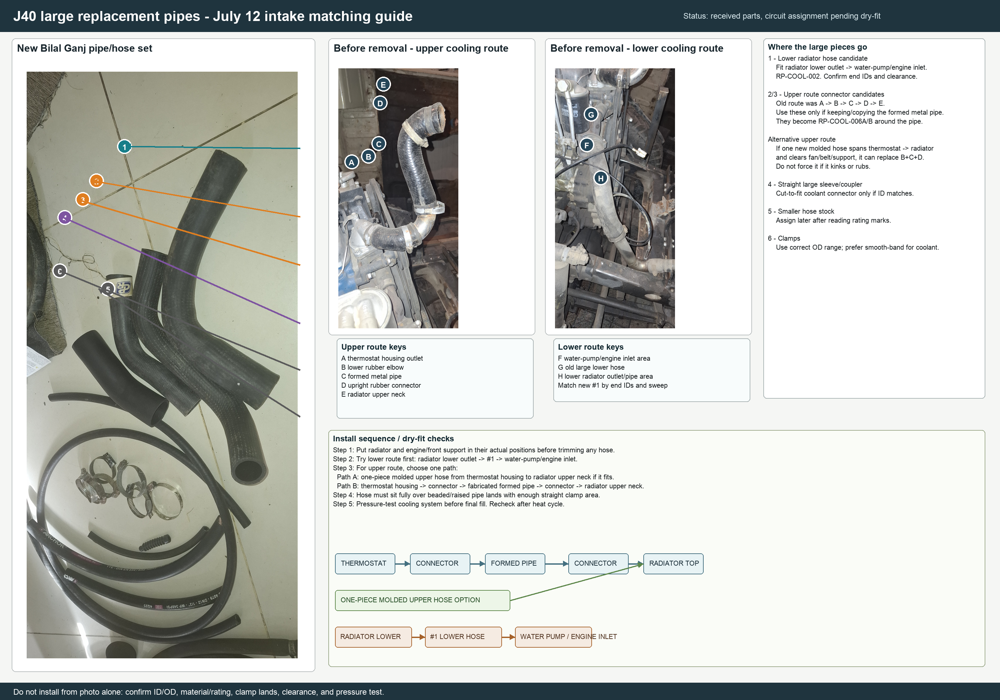

# Bilal Ganj Large Pipe Routing - 2026-07-12

This guide is for the large hose/pipe pieces in the July 12 Bilal Ganj intake.

## Assignment Position

The photo supports a first-pass assignment, not installation release. The large pieces are coolant-route candidates and must be dry-fitted before any trimming or tightening.

| Label | Purpose | Route | Status |
| --- | --- | --- | --- |
| `1` | Lower radiator hose candidate | Radiator lower outlet to water-pump / engine inlet | Medium-high confidence; confirm end IDs and sweep |
| `2` / `3` | Upper-route connector candidates | Around the formed metal pipe: thermostat outlet to pipe and pipe to radiator upper neck | Medium confidence; only if using the formed-pipe route |
| `4` | Straight large coupler | Cut-to-fit connector only if ID/rating and clamp lands match | Low-medium confidence |
| `5` | Smaller hose stock | Not part of large-pipe install decision | Assign later after reading rating marks |
| `6` | Loose clamps | Candidate coolant clamps only | Check OD range and band style |

## Upper Route Decision

Before removal, the upper route was:

`thermostat housing -> lower rubber elbow -> formed metal pipe -> upright rubber connector -> radiator upper neck`

There are two acceptable routes:

- Use one molded upper hose only if it cleanly spans thermostat housing to radiator upper neck with no kink, fan/belt rub, or front-support interference.
- If the one-piece hose does not fit, keep the formed-pipe solution: fabricate/copy the formed metal pipe and use two new connector hoses around it.

## Checks Before Install

- Radiator and engine/front support must be in their actual positions before trimming any hose.
- Hose must sit fully over beaded or raised pipe lands.
- Do not place clamps on a bend; leave straight clamp land.
- Use coolant-rated EPDM hose only.
- Pressure-test before final coolant fill and recheck after first heat cycle.

Source table: `data/manual/replacement_pipe_large_assignment_20260712.csv`.
