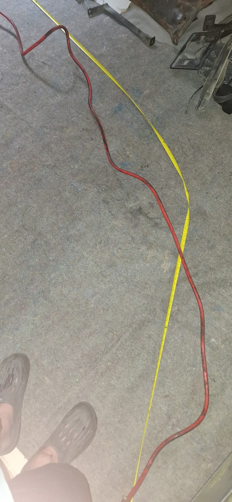
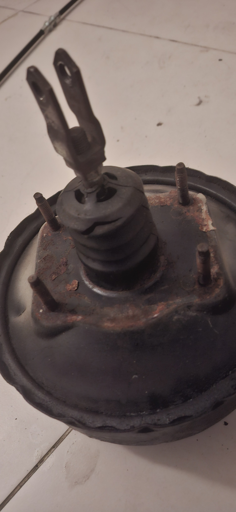
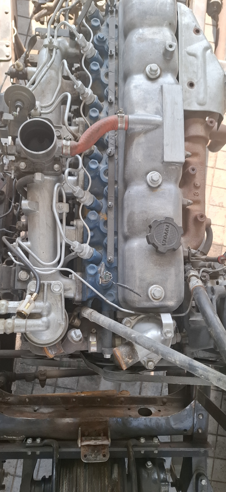
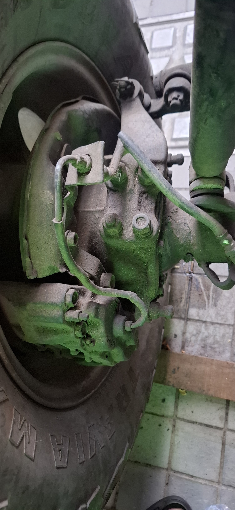
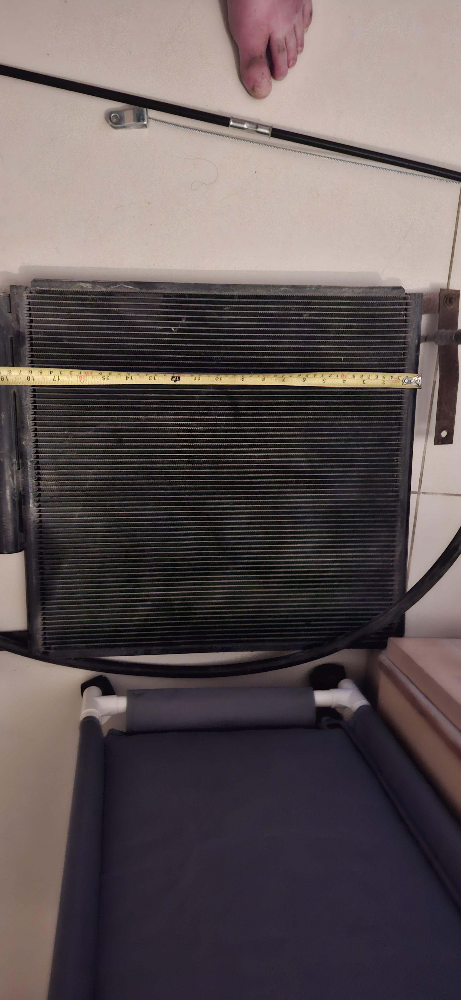
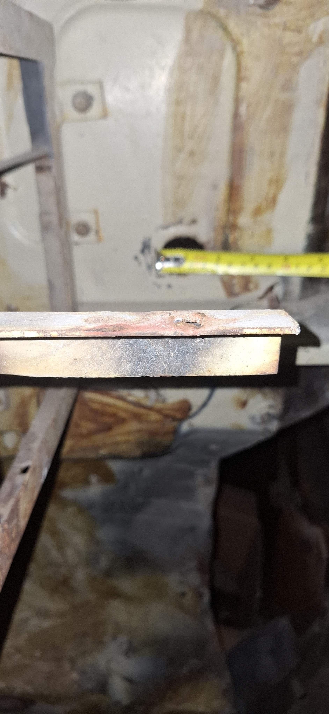

# Bilal Ganj Rubber Tubing Reproduction List - 2026-07-06

Purpose: send this rubber-only list with the old hose samples so Bilal Ganj / Montgomery Road shops can copy the J40/HJ47 routed rubber tubing and hose assemblies. Each row includes the best available project picture and an estimated order length. The removed sample and vehicle dry-fit control the final cut length, bends, fittings, clamp lands, and clocking.

Vehicle basis: Toyota Land Cruiser J40/HJ47-style build with Toyota 2H diesel, rebuilt electrical power corner, front disc/rear drum brake layout, and planned under-dash A/C.

Scope note: this list is rubber tubing only. Electrical wiring, control cables, metal coolant pipe, brake/fuel/clutch hard lines, P-clips, grommets, guards, and other non-hose items are deliberately excluded.

## Shop Rules For Copying Rubber Tubing

1. Tape-label every old hose before removal with the ID below, end A/end B, route direction, and installed side.
2. Photograph each hose in place before removal, then photograph the removed sample beside a tape measure.
3. Keep old hoses intact where possible. Do not cut a sample until the replacement has already been copied.
4. Record free length, inside diameter, outside diameter, wall thickness if visible, bend direction, molded offset, clamp land, and any clip/grommet position.
5. Coolant and heater hose must be EPDM coolant hose. Do not substitute fuel hose, vacuum hose, or soft water pipe.
6. Fuel hose must be diesel-rated. Do not use coolant hose, vacuum hose, clear PVC, washer pipe, or sharp perforated clamps.
7. Vacuum and breather hoses must be oil-resistant where oil mist is present and reinforced where collapse is possible.
8. Brake and clutch flex hoses must be new crimped hydraulic-rated assemblies only. Do not make these from roll hose.
9. A/C barrier hoses must not be crimped until compressor, condenser, drier, evaporator, and firewall pass-through positions are dry-fitted.
10. Final payment should wait until each new hose has been dry-fitted on the car with no kink, rub, stretch, or clamp misalignment.

## Priority Sample Bags

- Cooling/heater bag: upper radiator, lower radiator, overflow, heater inlet/outlet, and both formed-pipe connector hoses.
- Fuel bag: diesel feed, return/bleed, injector leak-off, filler neck, and vent hoses.
- Vacuum/breather/intake bag: brake-booster vacuum, crankcase breather, vacuum-pump oil outlet if fitted, and air-cleaner duct/couplers.
- Hydraulic hose bag: front-left, front-right, rear-center brake flex assemblies plus clutch flex assembly.
- A/C bag: barrier hose routes only after A/C hardware is positioned and fitting angles are known.

## Rubber Tubing Reproduction List

| ID | Rubber tube / hose | Picture | Estimated length / order length | Sample measurements | Remake instruction |
| --- | --- | --- | --- | --- | --- |
| `RPO-COOL-001` | Upper radiator hose |  | `355 mm` molded free length basis | Old upper hose if available; thermostat neck OD, radiator upper neck OD, clamp OD | New molded EPDM upper radiator hose for HJ47/2H route. Shape controls; do not replace with straight hose by length alone. |
| `RPO-COOL-002` | Lower radiator hose |  | `480 mm` molded free length basis | Old lower hose if available; radiator lower outlet OD, engine/water-pump inlet OD, clamp OD | New molded EPDM lower radiator hose for HJ47/2H route. Check lower bend clearance before coolant fill. |
| `RPO-COOL-003` | Radiator overflow hose |  | Buy `1000 mm`, OE reference `600 mm` | Radiator overflow nipple OD, bottle nipple OD, final route length | Small EPDM coolant/overflow hose, cut on vehicle with clips/clamps matched to OD. |
| `RPO-COOL-004A` | Heater inlet hose |  | `400 mm` cut from `1000 mm` stock | Engine heater nipple OD, heater-core nipple OD, clamp OD | `16 mm / 5/8 in` ID EPDM heater hose, SAE J20R3 or better; final ID by measured nipples. |
| `RPO-COOL-004B` | Heater outlet hose |  | `280 mm` cut from same `1000 mm` stock | Same as inlet; confirm no rear-heater branch | `16 mm / 5/8 in` ID EPDM heater hose, trimmed after dry-fit. |
| `RPO-COOL-006A` | Formed-pipe connector hose A |  | Buy `500 mm` blank | Old connector A, pipe-end OD/bead, mating spigot OD, final cut length, overlap | New `28-30 mm ID` EPDM radiator/coolant hose. Use straight only if it does not kink; otherwise match molded shape. |
| `RPO-COOL-006B` | Formed-pipe connector hose B |  | Buy `500 mm` blank | Old connector B, pipe-end OD/bead, mating spigot OD, final cut length, overlap | Same as connector A. Old hose is a pattern only, not reused. |
| `RPO-FUEL-001A` | Low-pressure diesel feed hose |  | Measured route about `1200 mm`; buy `1500 mm` | Tank/chassis end OD, filter or pump barb OD, final cut length | `8 mm ID` diesel-rated hose, SAE J30R9/J30R14T2/DIN 73379-3E or equivalent. Use rolled-edge fuel clamps. |
| `RPO-FUEL-001B` | Low-pressure diesel return/bleed hose |  | Buy `2000 mm` | Pump/filter return barb ODs, cut lengths, clamp OD | `6 mm ID` diesel-rated hose, cut on vehicle. |
| `RPO-FUEL-001C` | Injector leak-off hose |  | Buy `1000 mm` | Injector nipple OD and end/cap arrangement | `3.2-3.5 mm ID` braided diesel leak-off hose. No vacuum/coolant substitute. |
| `RPO-FUEL-003` | Filler neck and vent hoses |  | CAD route estimate `440 mm`; final by tank/body sample | Filler neck OD, tank neck OD, vent nipple ODs, body pass-through | Replace by old sample with diesel/fuel-compatible filler/vent hose and clamps. Dry-fit before body closeout. |
| `RPO-VAC-001A` | Brake-booster vacuum hose |  | Buy `2000 mm` | Pump/booster/check-valve barb ODs, route, check-valve direction | Reinforced oil-resistant vacuum hose, `10-12 mm ID`, that will not collapse. Confirm brake assist vacuum after install. |
| `RPO-VAC-001B` | Crankcase breather / oil-mist hose |  | Buy `1000 mm` | Breather spigot OD, route length, heat/oil exposure | Oil-resistant NBR or fuel/oil-rated hose, `16-19 mm ID`. Do not use coolant-only EPDM in oil mist. |
| `RPO-VAC-001C` | 2H vacuum pump oil outlet hose, if fitted |  | TBD from fitted sample | Confirm fitted presence, free length, end IDs, bend shape, fitting ODs | Buy/make new oil-compatible molded hose only if this engine actually has it. Toyota/OEM `90923-02079` is reference only. |
| `RPO-AIR-001` | Engine air-cleaner intake duct/couplers |  | TBD from old duct | Air-cleaner outlet OD, intake/manifold inlet OD, branch nipple OD, free length, offset | Match by sample using oil-mist-resistant intake duct rubber or reinforced air duct. No coolant/fuel/vacuum hose substitute. |
| `RPO-DRAIN-001` | A/C condensate drain |  | CAD route estimate `430 mm`; buy `1000 mm` | Evaporator drain nipple OD, floor/firewall exit, fall direction | `10-12 mm ID` drain hose with grommet/duckbill if suitable. Water-pour test must drain outside cabin. |
| `RPO-BRAKE-001A` | Brake flex hose assemblies |  | `3` complete assemblies, free length copied from old hose; CAD front flex sweep about `250 mm` each | Front left, front right, rear center old hoses; end thread/banjo/seat; bracket groove | New complete crimped DOT/SAE J1401 or OEM-equivalent brake hose assemblies only. No roll hose or used hose. |
| `RPO-CLUTCH-001A` | Clutch flex hose |  | Free length copied from old assembly | Master/slave end thread, seat, bracket retention, drivetrain movement | New crimped brake/clutch hydraulic-rated assembly only. |
| `RPO-AC-001` | A/C compressor discharge to condenser |  | CAD route estimate `680 mm`; stock includes `#8` discharge hose `1500 mm` | Compressor port, condenser port, fitting angle, service loop | R134a barrier hose only. Do not crimp until compressor/condenser positions are fixed. |
| `RPO-AC-002` | A/C condenser to receiver-drier liquid line |  | CAD route estimate `930 mm`; stock includes `#6` liquid hose `3000 mm` | Condenser port, drier port, switch/service access | R134a barrier hose with correct O-ring fittings. Dry-fit drier and switch before crimp. |
| `RPO-AC-003` | A/C drier to evaporator and suction return |  | CAD route estimate `650 mm`; stock includes `#10` suction hose `2000 mm` plus `#6` liquid allowance | Two firewall passages, bulkhead/grommet choice, TXV/compressor fittings | R134a barrier hose and protected firewall pass-through. Crimp only after evaporator and compressor fittings are identified. |
## Deliberately Excluded From This Rubber-Tubing List

- Electrical wires, battery cables, ground straps, loom sleeves, and connector work.
- Parking-brake, throttle, choke, fuel-stop, heater-control, and speedometer cables.
- Brake, fuel, and clutch rigid hard lines.
- Formed metal coolant/radiator pipe.
- P-clips, grommets, guards, and general line-support hardware.

## Final Fit Checks

- Cooling: pressure-test coolant hoses and connector hoses before final fill.
- Fuel: prime and leak-test feed, return, leak-off, filler, and vent hoses.
- Brake/clutch: pressure bleed, hold pedal pressure, and sweep steering/suspension/drivetrain movement.
- Vacuum/breather: confirm booster assist, check-valve direction, and no hose collapse.
- A/C: nitrogen leak-test after crimp; do not charge before leak and wiring tests.
- Drain: water-pour test must drain outside the cabin.

## Source Records

- `docs/replacement-pipes-workstream.md`
- `docs/engine-hose-tube-replacement-specs.md`
- `docs/rubber-ordering-spec-20260502.md`
- `docs/rubber-recreation-fabrication-spec-20260502.md`
- `docs/longman-rubber-order-spec-20260508.md`
- `docs/rubber-hose-component-readiness-audit-20260503.md`
- `docs/bilal-ganj-wire-pipe-reproduction-task-list-20260706.md`
