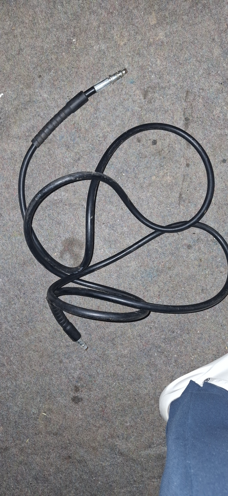
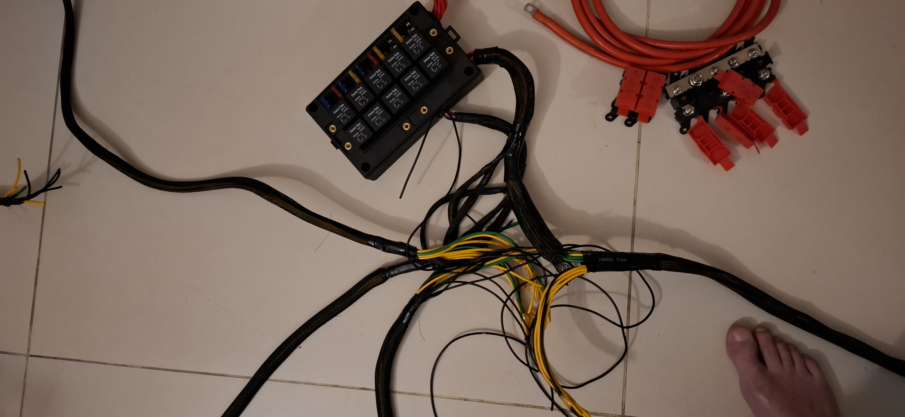
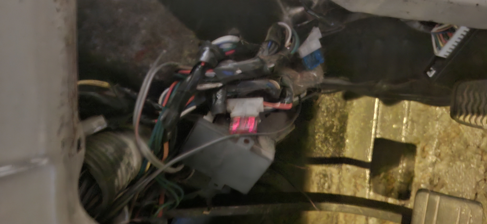
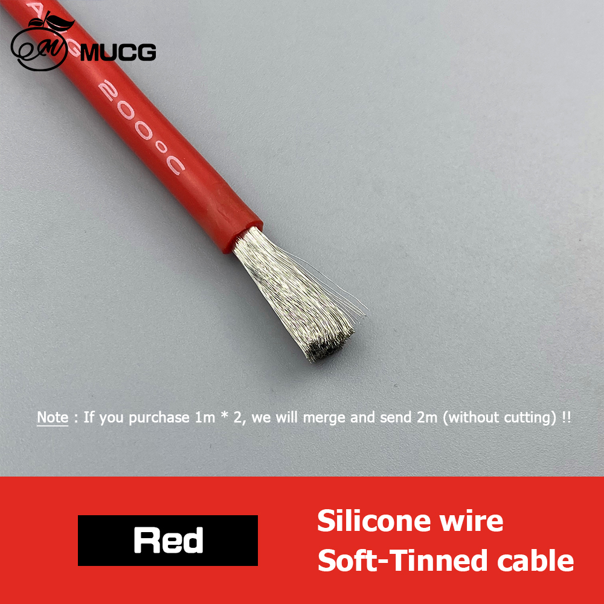

# Bilal Ganj Wire And Pipe Reproduction Task List - 2026-07-06

Purpose: send this with the old samples so Bilal Ganj / Montgomery Road shops can remake the J40/HJ47 routed parts by sample. The photo in each row is the best available project evidence. Lengths are estimate/order lengths only; the removed sample and vehicle dry-fit control the final cut, bends, fittings, and clocking.

Vehicle basis: Toyota Land Cruiser J40/HJ47-style build with Toyota 2H diesel, rebuilt electrical power corner, front disc/rear drum brake layout, and planned under-dash A/C.

## Non-Negotiable Shop Rules

1. Tag before removal: tape-label each old part with the ID below, end A/end B, route direction, and installed side.
2. Photograph each part in place before removal, then photograph the removed sample beside a tape measure.
3. Keep old hoses, hard lines, and wires intact where possible. Do not cut a sample unless the new part has already been copied.
4. For every hose or pipe, record free length, ID, OD, wall/thickness if metal, fitting size, bend direction, clamp land, and any clip or grommet position.
5. For every wire, record gauge, colour/marking, lug hole size, terminal type, route, protection sleeve, and support points.
6. Brake and clutch hydraulic parts must be new brake/clutch-rated parts. No used hose, generic roll hose, compression fittings, single flare unless sample-proven, or bare copper tube.
7. Fuel hose must be diesel-rated. No coolant hose, vacuum hose, clear PVC, washer pipe, or sharp perforated clamps.
8. Coolant/heater hose must be EPDM coolant hose. Do not substitute fuel hose or soft water pipe.
9. A/C barrier hoses must not be crimped until compressor, condenser, drier, evaporator, and firewall pass-through locations are dry-fitted.
10. High-pressure injector pipes are out of scope for generic fabrication. If any injector pipe is bad, source the correct 2H pipe by cylinder/sample.

## Priority Collection Pack

Collect and bag these first:

- Formed coolant pipe with both short connector hoses and clamps.
- Upper/lower radiator hose samples if present.
- Heater inlet/outlet hose samples.
- Diesel feed, return, and leak-off hose samples.
- Brake flex hoses: front left, front right, rear center, plus any extra front frame hose if fitted.
- One intact brake hard-line sample with flare nut for thread/seat/flare proof.
- Clutch flex hose and clutch hard line.
- Fuel hard-line sections if separate rigid feed/return lines exist.
- Battery/starter/alternator/ground heavy cables and all loose lugs.
- Front/rear/dash loom bundles only if a loom is being remade; otherwise keep built loom and verify.

## Pipes, Hoses, And Hard Lines

| ID | Part / Route | Picture | Estimated length | Collect / measure | Reproduction instruction |
| --- | --- | --- | --- | --- | --- |
| `RPO-COOL-001` | Upper radiator hose |  | `355 mm` molded free length basis | Old upper hose if available; thermostat neck OD, radiator upper neck OD, clamp OD | New molded EPDM upper radiator hose for HJ47/2H route. Shape controls; do not replace with straight hose by length alone. |
| `RPO-COOL-002` | Lower radiator hose |  | `480 mm` molded free length basis | Old lower hose if available; radiator lower outlet OD, engine/water-pump inlet OD, clamp OD | New molded EPDM lower radiator hose for HJ47/2H route. Check lower bend clearance before coolant fill. |
| `RPO-COOL-003` | Radiator overflow hose |  | Buy `1000 mm`, OE reference `600 mm` | Radiator overflow nipple OD, bottle nipple OD, final route length | Small EPDM coolant/overflow hose, cut on vehicle with clips/clamps matched to OD. |
| `RPO-COOL-004A` | Heater inlet hose |  | `400 mm` cut from `1000 mm` stock | Engine heater nipple OD, heater-core nipple OD, clamp OD | `16 mm / 5/8 in` ID EPDM heater hose, SAE J20R3 or better; final ID by measured nipples. |
| `RPO-COOL-004B` | Heater outlet hose |  | `280 mm` cut from same `1000 mm` stock | Same as inlet; confirm no rear-heater branch | `16 mm / 5/8 in` ID EPDM heater hose, trimmed after dry-fit. |
| `RPO-COOL-005` | Formed metal coolant/radiator pipe |  | Quote `1000 mm` tube stock; `750 mm` absolute minimum blank | Old formed pipe, tube OD, wall, centerline length, bend radii, bend clocking, bead height | Fabricate from physical sample in `28-30 mm OD`, `1.2-1.6 mm` wall coolant-compatible tube. Add beaded ends and `25-30 mm` clamp lands. Pressure-test before coating. |
| `RPO-COOL-006A` | Formed-pipe connector hose A |  | Buy `500 mm` blank | Old connector A, pipe-end OD/bead, mating spigot OD, final cut length, overlap | New `28-30 mm ID` EPDM radiator/coolant hose. Use straight only if it does not kink; otherwise match molded shape. |
| `RPO-COOL-006B` | Formed-pipe connector hose B |  | Buy `500 mm` blank | Old connector B, pipe-end OD/bead, mating spigot OD, final cut length, overlap | Same as connector A. Old hose is a pattern only, not reused. |
| `RPO-FUEL-001A` | Low-pressure diesel feed hose |  | Measured route about `1200 mm`; buy `1500 mm` | Tank/chassis end OD, filter or pump barb OD, final cut length | `8 mm ID` diesel-rated hose, SAE J30R9/J30R14T2/DIN 73379-3E or equivalent. Use rolled-edge fuel clamps. |
| `RPO-FUEL-001B` | Low-pressure diesel return/bleed hose |  | Buy `2000 mm` | Pump/filter return barb ODs, cut lengths, clamp OD | `6 mm ID` diesel-rated hose, cut on vehicle. |
| `RPO-FUEL-001C` | Injector leak-off hose |  | Buy `1000 mm` | Injector nipple OD and end/cap arrangement | `3.2-3.5 mm ID` braided diesel leak-off hose. No vacuum/coolant substitute. |
| `RPO-FUEL-002A` | Conditional rigid fuel feed hard line |  | Conditional `5000 mm` stock allowance | Confirm a separate rigid feed line exists beyond the flexible feed hose; copy bends, unions, clips | New `8 mm OD` automotive bundy steel or CuNi/Cunifer tube only where a rigid feed line exists. Do not duplicate the measured flexible feed hose. |
| `RPO-FUEL-002B` | Rigid fuel return hard line |  | `5000 mm` stock allowance | Old return hard-line route, union/end style, bends, clip points | New `6 mm OD` automotive bundy steel or CuNi/Cunifer tube. No bare copper or plumbing tube. |
| `RPO-FUEL-003` | Filler neck and vent hoses |  | CAD route estimate `440 mm`; final by tank/body sample | Filler neck OD, tank neck OD, vent nipple ODs, body pass-through | Replace by old sample with diesel/fuel-compatible filler/vent hose and clamps. Dry-fit before body closeout. |
| `RPO-VAC-001A` | Brake-booster vacuum hose |  | Buy `2000 mm` | Pump/booster/check-valve barb ODs, route, check-valve direction | Reinforced oil-resistant vacuum hose, `10-12 mm ID`, that will not collapse. Confirm brake assist vacuum after install. |
| `RPO-VAC-001B` | Crankcase breather / oil-mist hose |  | Buy `1000 mm` | Breather spigot OD, route length, heat/oil exposure | Oil-resistant NBR or fuel/oil-rated hose, `16-19 mm ID`. Do not use coolant-only EPDM in oil mist. |
| `RPO-VAC-001C` | 2H vacuum pump oil outlet hose, if fitted |  | TBD from fitted sample | Confirm fitted presence, free length, end IDs, bend shape, fitting ODs | Buy/make new oil-compatible molded hose only if this engine actually has it. Toyota/OEM `90923-02079` is reference only. |
| `RPO-AIR-001` | Engine air-cleaner intake duct/couplers |  | TBD from old duct | Air-cleaner outlet OD, intake/manifold inlet OD, branch nipple OD, free length, offset | Match by sample using oil-mist-resistant intake duct rubber or reinforced air duct. No coolant/fuel/vacuum hose substitute. |
| `RPO-BRAKE-001A` | Brake flex hose assemblies |  | `3` complete assemblies, free length copied from old hose; CAD front flex sweep about `250 mm` each | Front left, front right, rear center old hoses; end thread/banjo/seat; bracket groove | New complete crimped DOT/SAE J1401 or OEM-equivalent brake hose assemblies only. No roll hose or used hose. |
| `RPO-BRAKE-001B` | Brake hard lines |  | `7600 mm / 25 ft` brake-only coil; `10000-12000 mm` if brake+clutch combined | Remove one old line intact; confirm `4.75 mm / 3/16 in` OD, flare, thread, seat, bend template | New brake-rated bundy steel or CuNi/Cunifer tube. Working basis is Toyota-style double/inverted flare, but old sample controls. |
| `RPO-BRAKE-001C` | Front brake master/proportioning to crossmember run |  | CAD route estimate `920 mm` | Master/proportioning fittings, clips, steering/full-lock clearance | Cut from brake coil after flare/thread proof. Pressure bleed and full-lock clearance test before road use. |
| `RPO-BRAKE-001D` | Rear axle hard line, center flex, wheel-cylinder lines |  | CAD route estimate `1330 mm`; rear center flex length copied from sample | Rear T, axle hard lines, wheel-cylinder entries, clip points | New brake-rated hard lines and complete center flex assembly. Sweep axle/suspension before coating closeout. |
| `RPO-CLUTCH-001A` | Clutch flex hose |  | Free length copied from old assembly | Master/slave end thread, seat, bracket retention, drivetrain movement | New crimped brake/clutch hydraulic-rated assembly only. |
| `RPO-CLUTCH-001B` | Clutch hard line |  | `1500 mm` blank allowance | Master-to-slave route, `4.75 mm / 3/16 in` OD, flare/thread/seat | New brake/clutch-rated bundy steel or CuNi/Cunifer line, cut and flared after sample proof. |
| `RPO-AC-001` | A/C compressor discharge to condenser |  | CAD route estimate `680 mm`; stock includes `#8` discharge hose `1500 mm` | Compressor port, condenser port, fitting angle, service loop | R134a barrier hose only. Do not crimp until compressor/condenser positions are fixed. |
| `RPO-AC-002` | A/C condenser to receiver-drier liquid line |  | CAD route estimate `930 mm`; stock includes `#6` liquid hose `3000 mm` | Condenser port, drier port, switch/service access | R134a barrier hose with correct O-ring fittings. Dry-fit drier and switch before crimp. |
| `RPO-AC-003` | A/C drier to evaporator and suction return |  | CAD route estimate `650 mm`; stock includes `#10` suction hose `2000 mm` plus `#6` liquid allowance | Two firewall passages, bulkhead/grommet choice, TXV/compressor fittings | R134a barrier hose and protected firewall pass-through. Crimp only after evaporator and compressor fittings are identified. |
| `RPO-DRAIN-001` | A/C condensate drain |  | CAD route estimate `430 mm`; buy `1000 mm` | Evaporator drain nipple OD, floor/firewall exit, fall direction | `10-12 mm ID` drain hose with grommet/duckbill if suitable. Water-pour test must drain outside cabin. |
| `RPO-CLIP-001` | P-clips, grommets, guards for all hard lines and cables |  | On-hand assortment; buy only missing sizes | Match to `4.75`, `6`, `8`, `10`, `12`, `16`, `20`, `25`, `32 mm` OD/bundle sizes | Rubber-lined P-clips and edge/pass-through protection. No cable ties as permanent fuel/brake/clutch support. |

## Electrical Wires, Cables, And Looms

The built loom is mostly already assembled. Do not remake the small-wire looms unless a section is damaged or deliberately being rebuilt. For small looms, use the existing loom as the physical sample, label every connector, and continuity-test before final wrap.

| ID | Wire / Loom Route | Picture | Estimated length | Collect / measure | Reproduction / verification instruction |
| --- | --- | --- | --- | --- | --- |
| `HD1-PWR-04` | Battery positive to 100A breaker input |  | `25 mm2` red, `0.30 m` plus up to `50 mm` slack | Battery post terminal, breaker stud size, lug hole size | Separate cable with crimped lugs, adhesive heat-shrink, and ID label. Do not leave as part of one long run. |
| `HD1-PWR-05` | 100A breaker output to junction stud |  | `25 mm2` red, `0.60 m` plus slack | Breaker output stud, junction stud, route bend | Separate cable, labelled both ends, continuity and voltage-drop checked. |
| `HD1-PWR-06` | Junction stud to MIDI/ANL fuse block input |  | `25 mm2` red, `0.30 m` plus slack | Junction stud, fuse block input stud, grommet/guard | Separate cable with proper lug clocking and bend radius. |
| `HD1-PWR-10` | Fused output to glow plug feed |  | `25 mm2`, `1.00 m` | Glow feed endpoint, fuse rating, route heat clearance | Keep independent heavy branch. Fuse/load-test glow circuit before final wrap. |
| `HD1-PWR-11` | Fused output to EPS feed |  | `25 mm2`, `1.00 m` | EPS donor/controller endpoint when selected, pass-through, fuse rating | Keep `25 mm2` plan unless EPS load is deliberately re-specified. EPS route not closed until adapter/controller access is proven. |
| `HD1-PWR-13` | Junction to relay bank |  | `16 mm2`, `1.00 m` | Junction stud, relay bank input, protection sleeve | Independent feed with lugs/rings. Load test relay outputs before final wrap. |
| `HD1-PWR-09` | Fused output to amp/sub accessory |  | `16 mm2`, `5.00 m` | Actual accessory location, fuse rating, cabin pass-through | Route only if audio accessory remains in scope; otherwise hold as spare stock. |
| `HD1-PWR-14` | Junction to ignition relay |  | `10 mm2`, `1.50 m` | Junction stud, ignition relay input, fuse plan | Independent protected feed. Label both ends. |
| `HD1-PWR-15` | Junction to dash constant feed |  | `10 mm2`, `1.20 m` | Dash fuse carrier input, pass-through/grommet, fuse grouping | Supports under-dash constant feed group. Confirm rear terminal protection on fuse block. |
| `HD1-PWR-07` | Fused accessory area #1 |  | `6 mm2`, `1.50 m` | Accessory endpoint and fuse rating | Optional accessory feed. Only terminate when destination is named. |
| `HD1-PWR-08` | Fused accessory area #2 |  | `6 mm2`, `1.50 m` | Accessory endpoint and fuse rating | Optional accessory feed. Only terminate when destination is named. |
| `J40-RT-002` | Battery positive to cutoff / power-corner sweep |  | CAD route estimate `430 mm` | Cable centerline, lug clocking, cutoff entry/exit, guard/grommet | Use as-fitted route estimate for dry-fit only. Final cable follows installed cutoff/breaker layout. |
| `J40-RT-003` | Cutoff output to relay-box feed |  | CAD route estimate `430 mm` | Relay box input hole, service lid sweep, battery lift-out clearance | Dry-fit cable before final lugs. Protect with sleeve and P-clips. |
| `J40-RT-004` | Cutoff output to MIDI common feed |  | CAD route estimate `470 mm` | MIDI input hole, grommet size, holder spacing | Confirm lid hinge clearance and output fanout bend radius before final wrap. |
| `J40-RT-005` | MIDI five-output fanout |  | CAD route estimate `360 mm` fanout body; individual branches above | Five output destinations, fuse ratings, output hole sizes, bundle OD | Name every destination before closing the fuse bank. |
| `J40-RT-006A` | Battery negative to engine/chassis ground |  | CAD route estimate `520 mm` | Battery negative, engine block point, chassis point, lug holes | Fine-strand copper or braided ground strap. Clean metal, serrated hardware where suitable, torque, coat after voltage-drop test. |
| `J40-RT-006B` | Body-to-chassis ground strap |  | CAD route estimate `280 mm` | Body tab, chassis tab, movement allowance | Flexible braided/fine-strand ground strap. Do not paint contact faces before test. |
| `J40-RT-007A` | Starter main cable |  | CAD route estimate `550 mm` | Starter B+ lug, battery/fuse endpoint, exhaust and linkage clearance | Heavy copper cable sized by existing HD1/actual starter load, not diagram guess. Cranking voltage-drop test required. |
| `J40-RT-007B` | Starter solenoid trigger |  | CAD route estimate `460 mm` | Solenoid terminal marking, ignition/start endpoint, terminal type | Small automotive wire branch; do not assign by old colour alone. Continuity and key START test required. |
| `J40-RT-008` | Alternator B+, regulator/sense/exciter branch |  | CAD route estimate `590 mm` | Alternator terminal labels, charge output, warning/exciter, sense/regulator, ground | Replace taped/weak terminals. Confirm charging voltage and warning-lamp behavior after start. |
| `J40-RT-009` | Engine sender / injection-pump / fuel-stop branch |  | CAD route estimate `760 mm` | Fuel-stop/idle-up device identity, sender terminals, unknown connectors U-01/U-02 | `1.0-1.5 mm2` automotive copper sensor/control wire as needed. No blind reconnection. Prove each endpoint and key-state behavior. |
| `L2 / J40-RT-010` | Front trunk: headlamp, marker, horn, aux lamp branch |  | CAD front cross-loom estimate `1280 mm`; loom makeup `5 x 2.5`, `1 x 1.5`, `2 x 1.0 mm2` | Headlamp/indicator/horn/aux endpoints, earth points, grille/radiator clearance | Built/verify unless damaged. If remade, copy existing loom and connector map, then continuity/load-test lights, indicators, horn, fan/clutch feeds. |
| `J40-RT-011` | A/C clutch, pressure switch, condenser fan electrical branch |  | CAD route estimate `720 mm` | Compressor clutch, pressure switch, fan relay output, fan earth | Hold final routing until A/C hardware is dry-fitted. Use automotive copper wire and relay/fuse logic proof before charge. |
| `J40-RT-012` | Under-dash evaporator blower/control feed |  | CAD route estimate `520 mm` | Blower feed, control panel, thermostat/sensor, drain route | Keep clear of pedals/column and service access. Final after evaporator mock-up. |
| `J40-RT-013` | Firewall main pass-throughs and grommets |  | No wire length; pass-through assignment task | Hole diameter, bundle OD, grommet groove, edge condition, steering/pedal clearance | No wire or control cable through bare sheet metal. Reuse only with measured grommet/bulkhead, strain relief, and seal. |
| `L3 / J40-RT-014` | Rear body: tail lamp, number plate, fuel sender loom |  | CAD rear-body segment estimate `1160 mm`; loom makeup `2 x 2.5`, `3 x 1.5`, `8 x 1.0 mm2` | Tail lamps, brake/reverse, number plate, sender, body-to-chassis flex | Built/verify unless damaged. If remade, copy route and connector IDs; continuity-test rear lights and sender. |
| `L4` | Ignition loom |  | Length TBD by installed dash route; makeup `1 x 10`, `1 x 2.5`, `5 x 1.5 mm2` | Ignition switch, ACC/RUN/START, ignition relay, fuse inputs | Built/verify. Resolve ignition security and fuel-stop behavior before final wrap. |
| `L5A` | Left dash/column branch |  | Length TBD by installed dash/column route; makeup `1 x 2.5`, `3 x 1.5`, `4 x 1.0 mm2` | Column/stalk, left-dash controls, connector X3 | Built/verify; pin-by-pin continuity and retention pull check. |
| `L5B` | Right dash/cabin branch |  | Length TBD by installed dash/cabin route; makeup `2 x 2.5`, `3 x 1.5`, `4 x 1.0 mm2` | Right-dash/cabin devices, connector X4/X10 | Built/verify; update master if any field reroute changes. |
| `L6` | VC / gearbox service loom |  | Approx `1000 mm`; makeup `3 x 1.5`, `1 x 1.0 mm2` | VC service connectors X7/X8, gearbox/reverse/control endpoints | Built/verify after drivetrain route is clear. Protect from heat, linkage, and driveline movement. |
| `PK-RTE-WIRE-001` | Small automotive wire top-up stock |  | Top-up only: `2.5 mm2` red/blue/black `10 m` each; `1.5 mm2` mixed `10 m` each; `1.0 mm2` sensor colours as needed | Stock count before buying | Buy copper automotive wire only if on-hand stock is short. Reject CCA, house wire, all-one-colour unlabeled wiring. |
| `PK-RTE-SLEEVE-001` | Sleeve, split loom, heat-shrink for all wiring |  | Use on-hand first; top-up `12 mm x 10 m`, `16 mm x 6 m` only if short | Bundle OD and heat/chafe exposure | Final sleeve/clips/grommets happen after continuity and load tests, not before. |

## Related Control Cables And Service Lines

These are not generic pipe-shop items, but they run through the same risk areas and should be tagged while the car is apart.

| ID | Route | Picture | Estimated length | Action |
| --- | --- | --- | --- | --- |
| `J40-RT-017` | Parking-brake cables, equalizer, clips |  | CAD route estimate `980 mm` for shown equalizer-to-axle scope; full cable length by old sample | Buy/remake by old sample only, with clevises, springs, clips, and adjustment range. Sweep suspension/exhaust/prop shaft clearance. |
| `J40-RT-024` | Throttle, choke, fuel-stop, heater-control cables |  | CAD route estimate `560 mm` for engine-side control scope; final by sample | Copy retained controls by old sample: knob end, clevis, sheath length, mount thread, full travel. |
| `J40-RT-025` | Speedometer cable to transfer/gearbox |  | CAD route estimate `780 mm`; final by old cable | Match cluster end and fitted gearbox/transfer drive end by sample. Keep away from exhaust and prop shaft. |

## Final Verification Before Payment / Install Closeout

- Cooling: pressure-test formed pipe and coolant hoses before coating/final fill.
- Fuel: prime and leak-test feed, return, leak-off, and hard lines.
- Brake: pressure bleed, hold pedal pressure, check every flare/flex end, and sweep steering/suspension.
- Clutch: bleed and check no line tension through drivetrain movement.
- Vacuum: confirm booster assist and check-valve direction.
- A/C: nitrogen leak-test after crimp; do not charge before leak and wiring tests.
- Electrical: continuity-test every connector, retention-pull terminals, then voltage-drop/load-test starter, alternator, glow, EPS, fan/blower, lights, horn, and grounds.
- Protection: final P-clips, grommets, abrasion sleeve, heat shielding, and drip loops only after functional tests pass.

## Source Records

- `docs/replacement-pipes-workstream.md`
- `docs/engine-hose-tube-replacement-specs.md`
- `docs/pipe-fabrication-spec-20260502.md`
- `docs/wire-heavy-resize-cutlist.md`
- `docs/electrical-diagram-reconciliation-20260518.md`
- `docs/engine-electrical-inputs-reconciliation-20260517.md`
- `docs/cabin-engine-firewall-holes-survey-20260517.md`
- `docs/j40-digital-twin-as-fitted-cable-scope-20260531.md`
- `docs/j40-as-fitted-route-pakistan-purchase-bom-20260531.md`
- `data/manual/cad/j40_reference_model/05_reports/j40_as_fitted_route_model_coverage_20260531.csv`
- `data/manual/cad/j40_reference_model/04_exports/scaffold_rev_c/j40_full_vehicle_scaffold_rev_c_parts.csv`
