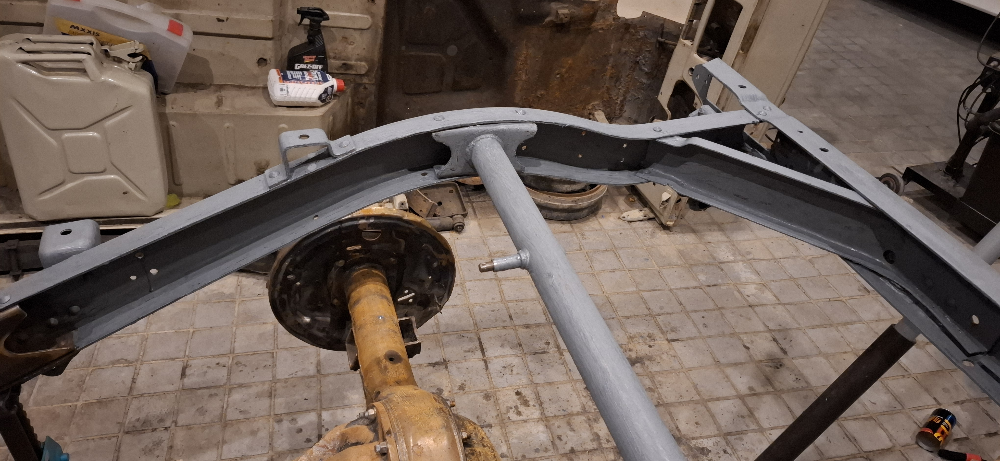
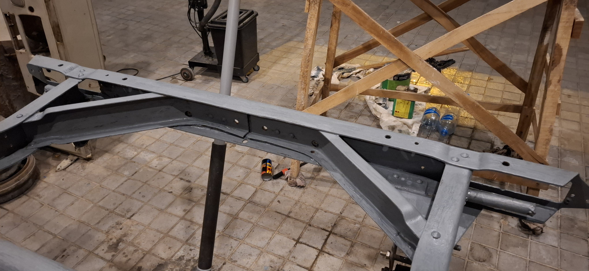
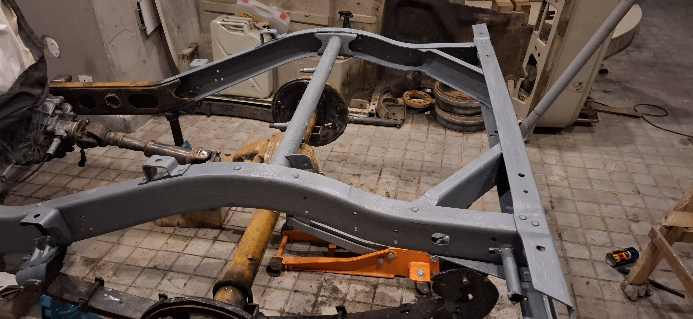
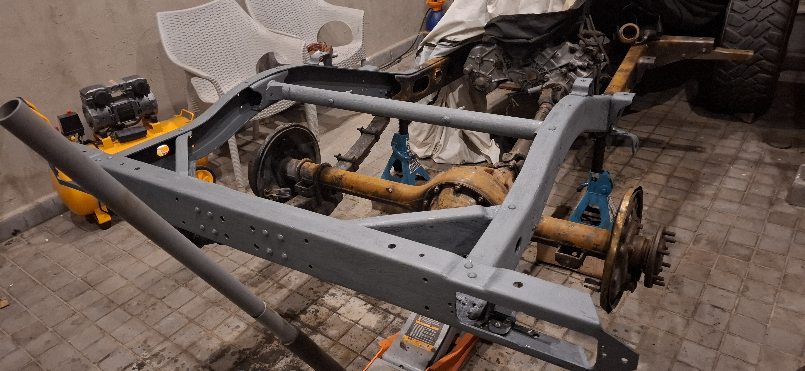
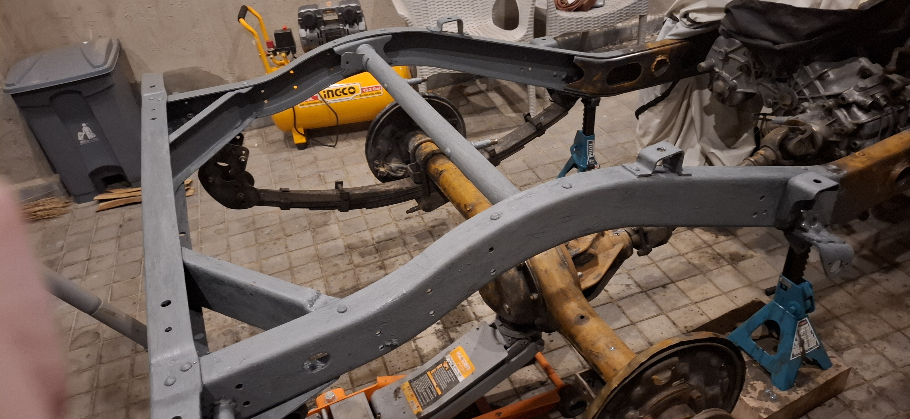
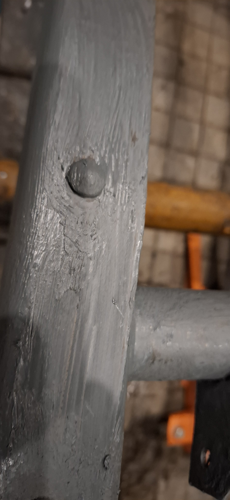

# Rear Half Chassis Primer Application - 2026-07-04

Evidence source: Google Photos picker import `20260704T021608`

Scope: rear/back-half chassis primer application only. This is partial coating evidence, not a full chassis coating or Raptor/topcoat release.

## Imported Evidence

| Photo | What it shows | Notes |
| --- | --- | --- |
|  | Rear rail, spring area, rear tube/crossmember, and upper bracket roots. | Grey primer is visible across the main rear-half structure; inner rail faces still read dark in shadow or existing coating. |
|  | Top and outer rail faces plus rear crossmember area. | Good top-face coverage; check hole lips and inner vertical faces before topcoat. |
|  | Rear frame overview from above. | Rear crossmember and rail surfaces are consistently covered; axle/brake assemblies remain outside this coating scope. |
|  | Rear half overview with rear rail, rear tube, and crossmember. | Confirms broad rear-half primer application and uncoated mechanical assemblies. |
|  | Opposite-side overview across rear half and transition toward drivetrain. | Coverage looks continuous on accessible outer faces; support/contact points need later touch-up. |
|  | Close-up of brushed primer texture around a hole/fastener area. | Primer is heavy/brush-marked here. After cure, check for loose edges, trapped dust, runs, and hole/thread buildup before topcoat. |

## Assessment

The rear/back half looks successfully moved from bare/prepped metal into primer on the main rail faces, rear crossmember/tube, and several bracket surfaces. The brushed texture is not automatically a problem on a chassis, especially if this is epoxy primer and it has wetted the metal well.

The main follow-up risks are local, not global:

- Dark inner rail faces are acceptable only if they are sound existing coating. If any dark area is bare steel, dusty old primer, rust, or loose coating, touch it in before sealing.
- Hole lips, drain holes, body-mount holes, and bracket roots need a small brush pass if primer did not wrap fully around the edges.
- Thick primer buildup around holes or threads should be cleared before it hardens into a fitment problem.
- Jack/stand contact points and areas hidden by support blocks will need touch-up after the chassis is safely moved.
- Do not treat this as axle, brake backing-plate, spring, or front-chassis coating evidence.

## Advice Before Next Coat

Respect the primer recoat window. If the next coat/Raptor goes on inside the product window, clean dust and proceed as the data sheet allows. If the window is missed, lightly scuff the primer first, remove dust, wipe with 3M Prep Solvent-70, let it flash off, then coat.

Before topcoat/Raptor, do a 10-minute close pass with a light:

1. Touch in hole edges, bracket roots, lower lips, and any shadowed inner faces.
2. Chase or protect threads and body-mount holes so the tub refit is not blocked by coating.
3. Knock down only obvious loose runs or heavy ridges after cure; do not sand through good primer just to make a chassis cosmetically smooth.
4. Keep ground/contact faces controlled. If a grounding point is needed later, reopen it to clean metal during final assembly and protect around the finished connection.
5. Leave cavity wax until after external primer/top protection is complete and fully dry.
