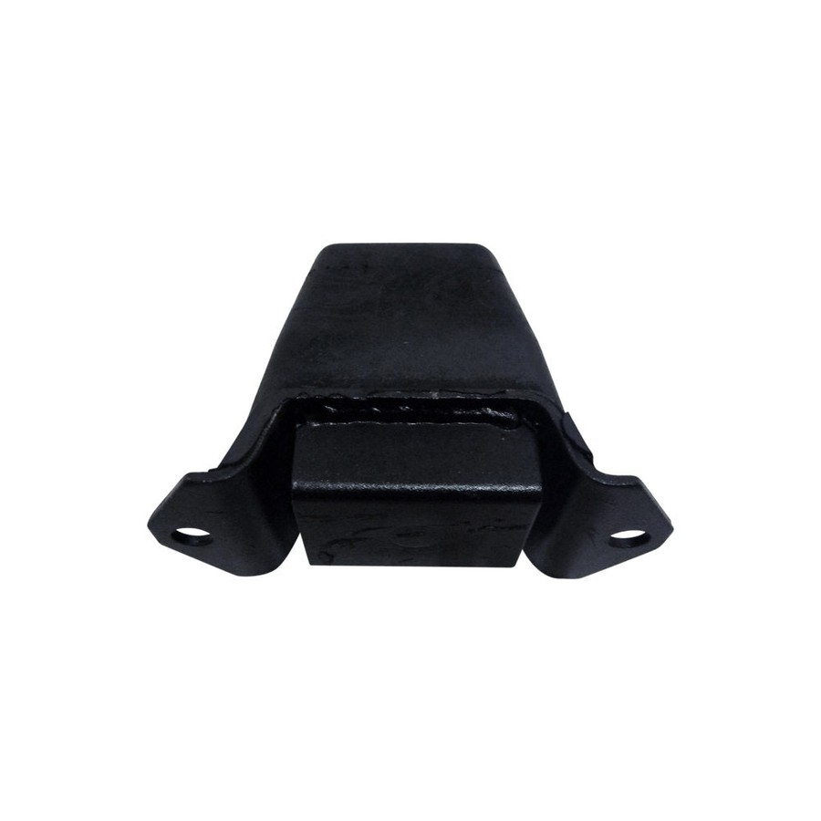
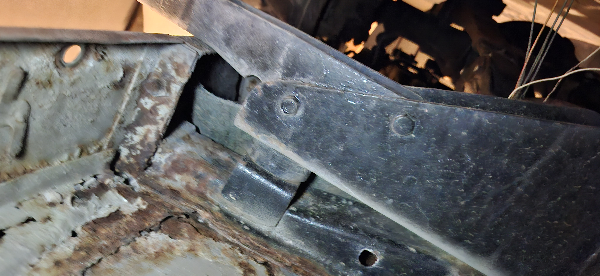
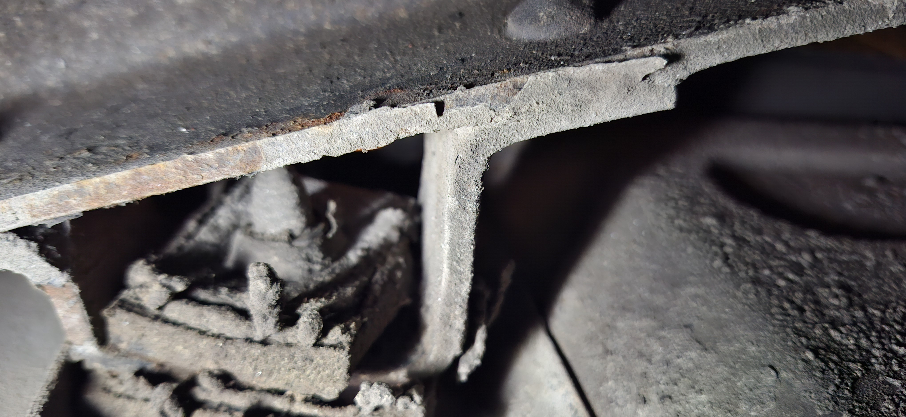

# Chassis Rubbers Fabricator Spec

Date: 2026-05-04

All dimensions are in `mm`. For body/front-support rubbers, use new black solid EPDM or NR/SBR automotive mount rubber, Shore A `60 +/-5`. Old rubbers and photos are measurement samples only, not reuse stock. Cups and shims must be new flat or formed steel, deburred and corrosion protected. For the exhaust holder, use Toyota `90917-08004` / `17572-92000` teardrop exhaust cushion style or a sample-matched new molded copy. For bump stops, buy OEM/manufacturer-style molded stops where available; fabricate only by exact sample and bracket match. Do not use tyre rubber, crumb rubber, sponge, mixed offcuts, salvage rubber, used rubber, unmarked compound, washer stacks, or universal bump stops that do not match the axle contact point.

## Machine Package

Send this folder with the job: [`data/manual/fabrication/rubber_recreation_rev_a/`](../data/manual/fabrication/rubber_recreation_rev_a/README.md).

Machine-readable controls:

- [`machine_definitions.csv`](../data/manual/fabrication/rubber_recreation_rev_a/machine_definitions.csv) / [`machine_definitions.json`](../data/manual/fabrication/rubber_recreation_rev_a/machine_definitions.json) - exact CNC/shop definitions, shim-pack controls, and non-CNC purchase controls.
- [`j40_rubber_recreation_rev_a_dimension_sheet.pdf`](../data/manual/fabrication/rubber_recreation_rev_a/j40_rubber_recreation_rev_a_dimension_sheet.pdf) - printable drawing sheet.
- [`fabricator_cut_list.csv`](../data/manual/fabrication/rubber_recreation_rev_a/fabricator_cut_list.csv) and [`inspection_checklist.csv`](../data/manual/fabrication/rubber_recreation_rev_a/inspection_checklist.csv).

## Exact Machine / Purchase Spec

| Image | ID | Part | Qty | Machine / Purchase Definition | CAD / Route | Notes |
| --- | --- | --- | ---: | --- | --- | --- |
|  | `BM-LG` | Large circular body-mount cushion | `2` | Origin lower-left of `78 x 78` top profile; centre `X39 Y39`; OD `78`; height `24`; through bore `32`; face A register/recess `46 x 2`; face B flat; outside load edge `R2-R3`; faces parallel `<=0.5`; concentricity `<=1.0`. | [`bm_lg_body_mount_cushion_rev_a.dxf`](../data/manual/fabrication/rubber_recreation_rev_a/bm_lg_body_mount_cushion_rev_a.dxf) / [`svg`](../data/manual/fabrication/rubber_recreation_rev_a/bm_lg_body_mount_cushion_rev_a.svg) | Make matched pair from one setup. |
|  | `BM-SM` | Small circular body-mount cushion | `10` | Origin lower-left of `64 x 64` top profile; centre `X32 Y32`; OD `64`; height `22`; through bore `32`; face A register/recess `46 x 2`; face B flat; outside load edge `R2-R3`; faces parallel `<=0.5`; concentricity `<=1.0`. | [`bm_sm_body_mount_cushion_rev_a.dxf`](../data/manual/fabrication/rubber_recreation_rev_a/bm_sm_body_mount_cushion_rev_a.dxf) / [`svg`](../data/manual/fabrication/rubber_recreation_rev_a/bm_sm_body_mount_cushion_rev_a.svg) | Make as one-piece cushion unless old sample proves split stack. |
|  | `BM-CUP-SM` | Small body-mount cup / seat washer | `10 working basis` | Cut/form ready steel cup washer for `BM-SM`; OD `64`; M10 clearance hole `11`; dish/register depth `2-3`; steel thickness `2.5-3.0`; final dish must match old cup before batch forming. | [`bm_cup_small_seat_washer_rev_a.dxf`](../data/manual/fabrication/rubber_recreation_rev_a/bm_cup_small_seat_washer_rev_a.dxf) / [`svg`](../data/manual/fabrication/rubber_recreation_rev_a/bm_cup_small_seat_washer_rev_a.svg) | Reuse originals only if flat, not thinned, and not cracked. |
|  | `BM-CUP-LG` | Large body-mount cup / seat washer | `2 working basis` | Cut/form ready steel cup washer for `BM-LG`; OD `78`; M10 clearance hole `11`; dish/register depth `2-3`; steel thickness `2.5-3.0`; final dish must match old cup before batch forming. | [`bm_cup_large_seat_washer_rev_a.dxf`](../data/manual/fabrication/rubber_recreation_rev_a/bm_cup_large_seat_washer_rev_a.dxf) / [`svg`](../data/manual/fabrication/rubber_recreation_rev_a/bm_cup_large_seat_washer_rev_a.svg) | Confirm the large-pair station and cup landing before forming. |
|  | `BM-SHIM-THIN` | Thin body-mount alignment shim pack | `1 pack` | New flat slotted steel shims for M10 body mounts: `1 mm x12`, `2 mm x12`, `3 mm x12`, `5 mm x12`; slot width `11-12`; plate footprint must fully support the original pedestal/contact patch. | [`machine csv`](../data/manual/fabrication/rubber_recreation_rev_a/machine_definitions.csv) / [`json`](../data/manual/fabrication/rubber_recreation_rev_a/machine_definitions.json) | No washer stacks inside the rubber sandwich. Preserve original shim stack by station. |
|  | `BM-SHIM-THICK` | Thick OE-style spacer control pack | `1 pack` | New flat steel spacer plates for controlled trial fit: `5 mm x4`, `10 mm x4`, `15 mm x4`. Record Toyota reference thicknesses `22.8` and `27.8`, but cut/buy those only if the original station map proves need. | [`machine csv`](../data/manual/fabrication/rubber_recreation_rev_a/machine_definitions.csv) / [`json`](../data/manual/fabrication/rubber_recreation_rev_a/machine_definitions.json) | Use only at original metal-to-metal shim locations, not as random height packing. |
|  | `FS-OVAL` | Front-support two-hole oval pad | `2` | Origin lower-left of `64 x 96` plan; outer capsule `64` wide x `96` long with `R32` ends; thickness `15`; through holes `12` at `X32 Y16` and `X32 Y80`; relief pocket `36 x 18 R3` at `X14 Y39`; insert/boss mark `29` at `X32 Y16`. | [`fs_oval_front_support_pad_rev_a.dxf`](../data/manual/fabrication/rubber_recreation_rev_a/fs_oval_front_support_pad_rev_a.dxf) / [`svg`](../data/manual/fabrication/rubber_recreation_rev_a/fs_oval_front_support_pad_rev_a.svg) | `INSERT_MARK` is not a through cut. Confirm if relief is blind pocket or through-cut. |
|  | `FS-STRIP-L` | Front-support left strip / liner | `1` | Stock envelope `165 x 40` with `R4` ends; base thickness `8`; raised/load pad height `14`; provisional slots `16 x 11` at centres `X20 Y20` and `X145 Y20` only if carrier confirms. | [`fs_strip_left_template_blank_rev_a.dxf`](../data/manual/fabrication/rubber_recreation_rev_a/fs_strip_left_template_blank_rev_a.dxf) / [`svg`](../data/manual/fabrication/rubber_recreation_rev_a/fs_strip_left_template_blank_rev_a.svg) | Final CNC cut requires physical left carrier trace. |
|  | `FS-STRIP-R` | Front-support right strip / liner | `1` | Stock envelope `165 x 40` with `R4` ends; base thickness `8`; raised/load pad height `14`; provisional slots `16 x 11` at centres `X20 Y20` and `X145 Y20` only if carrier confirms. | [`fs_strip_right_template_blank_rev_a.dxf`](../data/manual/fabrication/rubber_recreation_rev_a/fs_strip_right_template_blank_rev_a.dxf) / [`svg`](../data/manual/fabrication/rubber_recreation_rev_a/fs_strip_right_template_blank_rev_a.svg) | Final CNC cut requires physical right carrier trace. |
|  | `EXH-HGR-90917` | Exhaust pipe teardrop cushion | As fitted | Origin lower-left of `48 x 86` top profile; centreline `X24`; teardrop/paddle outline `48` wide x `86` high; lower bulb `R24` centred `X24 Y24`; mounting hole `9` at `X24 Y73`; hanger slot `16 x 22` capsule centred `X24 Y29`; raised boss/recess mark `36 x 42` at `X6 Y8`; rubber body thickness target `22` unless genuine sample proves otherwise. | [`exh_hgr_90917_08004_teardrop_rev_a.dxf`](../data/manual/fabrication/rubber_recreation_rev_a/exh_hgr_90917_08004_teardrop_rev_a.dxf) / [`svg`](../data/manual/fabrication/rubber_recreation_rev_a/exh_hgr_90917_08004_teardrop_rev_a.svg) | Buy Toyota `90917-08004` / `17572-92000` preferred. Do not use the previous round ring or generic two-hole strap. Local molding needs a genuine sample or intact original for side profile and metal insert. |
|  | `BUMP-F-L` | Front left spring bump stop | `1` | Not a CNC part. Buy Toyota/manufacturer-style `48304-60010` direct replacement. Local reproduction requires physical sample or 3D scan and a mold matching base footprint, bolt pattern/thread, free height, compressed height, progressive profile, and contact face. | [`machine csv`](../data/manual/fabrication/rubber_recreation_rev_a/machine_definitions.csv) / [`json`](../data/manual/fabrication/rubber_recreation_rev_a/machine_definitions.json) | Verify left-front bracket and axle contact point. |
|  | `BUMP-F-R` | Front right spring bump stop | `1` | Not a CNC part. Buy Toyota/manufacturer-style `48304-60020` direct replacement. This is the separate shorter/right-side front stop. Local reproduction requires physical sample or 3D scan and a mold. | [`machine csv`](../data/manual/fabrication/rubber_recreation_rev_a/machine_definitions.csv) / [`json`](../data/manual/fabrication/rubber_recreation_rev_a/machine_definitions.json) | Do not install left stop or universal stop here. |
|  | `BUMP-R` | Rear spring bump stops | `2` | Not a CNC part. Buy Toyota/manufacturer-style `48304-60010` direct replacement for rear pair. Local reproduction requires physical sample or 3D scan and a mold matching rear bracket/base, bolt pattern/thread, height, progressive profile, and contact face. | [`machine csv`](../data/manual/fabrication/rubber_recreation_rev_a/machine_definitions.csv) / [`json`](../data/manual/fabrication/rubber_recreation_rev_a/machine_definitions.json) | Replace as matched rear pair after suspension ride height is known. |

Tolerances: circular cushion OD/ID `+/-1.0`, height `+/-0.5`, bore/register concentricity `<=1.0`; cup OD `+/-1.0`, hole `+0.3/-0.0`, dish `2-3`; shim/spacer thickness `+/-0.1` after station trace; `FS-OVAL` outside `+/-1.0`, hole position `+/-0.5`, thickness `+/-0.5`; strip outline `+/-1.0`, holes `+/-0.5`, thickness `+/-0.5`. Bump stops are not simple cut rubber; OEM/manufacturer part or exact molded sample controls.

## Lower Holds

- `BM-SM`: if the old sample proves separate seat/spacer construction, replace the one-piece `22` definition with a split-stack drawing before production.
- `BM-SHIM-*`: trace and measure the preserved original shim or mount-station footprint before CNC/laser cutting the final outline.
- `FS-STRIP-L/R`: trace the physical metal carriers before final CNC cutting.
- `EXH-HGR-90917`: project photos show the exhaust bracket area but not an intact old cushion. Buy Toyota `90917-08004` / `17572-92000` if available; local molding needs a genuine sample or intact original to confirm side profile, insert depth, and exact thickness.
- `BUMP-*`: verify part numbers against the physical brackets and axle contact points before purchase.

## Extra Context Images

Circular cushion and cup references:

Shim and bump-stop references:

Strip rubber references:

Exhaust holder / bracket references:

External part controls: [ToyotaPartsDeal](https://www.toyotapartsdeal.com/oem/toyota~cushion~exhaust~tail~pipe~for~front~90917-08004.html) lists `90917-08004` as the front exhaust pipe center cushion replacing `17572-92000`; [CruiserParts](https://shop.cruiserparts.net/index.php?main_page=product_info&products_id=12770) identifies the pre-8/79 Land Cruiser 40/45 item as the teardrop-style `90917-08004`.

Original installed context:

