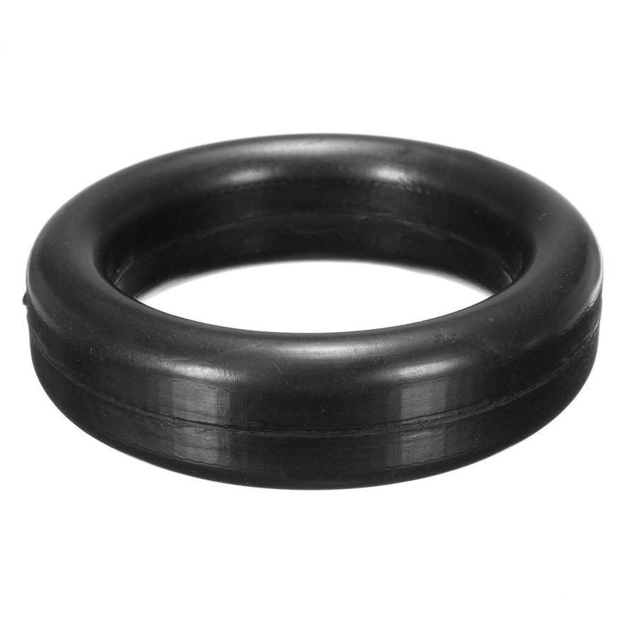

# Chassis Rubbers Fabricator Spec

Date: 2026-05-04

All dimensions are in `mm`. For body/front-support rubbers, use new black solid EPDM or NR/SBR automotive mount rubber, Shore A `60 +/-5`. For exhaust holders, use automotive exhaust-hanger rubber/EPDM suitable for heat and vibration. For bump stops, buy OEM/manufacturer-style molded stops where available; fabricate only by exact sample and bracket match. Do not use tyre rubber, crumb rubber, sponge, mixed offcuts, salvage rubber, unmarked compound, or universal bump stops that do not match the axle contact point.

## Rubber Spec

| Image | ID | Part | Qty | Exact Spec | Notes |
| --- | --- | --- | ---: | --- | --- |
|  | `BM-LG` | Large circular body-mount cushion | `2` | `78` OD x `24` high; `32` centre bore/register; `46` centre register OD x `2` deep; outside edge `R2-R3` | Make as matched pair. Faces flat/parallel. |
|  | `BM-SM` | Small circular body-mount cushion | `10` | `64` OD x `22` high; `32` centre bore/register; `46` centre register OD x `2` deep; outside edge `R2-R3` | Make all `10` from one batch. Faces flat/parallel. |
|  | `FS-OVAL` | Front-support two-hole oval pad | `2` | `96` long x `64` wide x `15` thick; two `12` holes on `64` centres; relief pocket `36 x 18` with `R3` corners; top boss/insert OD `29` | Make as matched pair. Punch or machine holes cleanly. |
|  | `FS-STRIP-L` | Front-support left strip / liner | `1` | `165` trace length; `38-42` width; `8` base thickness; `14` raised/load pad height; `11` M10 holes or `11 x 16` slots where the metal carrier shows slots | Final outline and hole centres must be traced from the physical left carrier. |
|  | `FS-STRIP-R` | Front-support right strip / liner | `1` | Same as `FS-STRIP-L` unless the right carrier proves different | Final outline and hole centres must be traced from the physical right carrier. |
|  | `EXH-HGR` | Exhaust pipe holder / hanger rubber | Count all exhaust support points | Buy by sample: measure hanger pin OD, hole centre spacing, rubber width/thickness, free length, and installed exhaust movement clearance | Replace only cracked, stretched, missing, or heat-damaged holders. Match all holders at the same support style. |
|  | `BUMP-F-L` | Front left spring bump stop | `1` | Prefer OEM/manufacturer-style Toyota `48304-60010` or direct replacement. If made locally, sample-match the molded profile, base footprint, mounting hole pattern/thread, free height, compressed height, contact face location, and axle contact clearance. | Verify by chassis/VIN and physical left-front bracket before ordering. Do not use a generic universal stop. |
|  | `BUMP-F-R` | Front right spring bump stop | `1` | Prefer OEM/manufacturer-style Toyota `48304-60020` or direct replacement. This is a separate RH/front part; match the shorter/right-side profile, base footprint, mounting hole pattern/thread, free height, compressed height, contact face location, and axle contact clearance. | Verify by chassis/VIN and physical right-front bracket before ordering. Do not install the left-side stop here. |
|  | `BUMP-R` | Rear spring bump stops | `2` | Prefer OEM/manufacturer-style Toyota `48304-60010` or direct replacement for both rear sides. If sourced locally, match the rear bracket/base, molded profile, bolt pattern/thread, free height, compressed height, contact face location, and loaded axle clearance. | Replace as a matched rear pair. Check with final suspension ride height and axle travel before purchase. |

Tolerances: circular cushion OD/ID `+/-1.0`, height `+/-0.5`, bore/register concentricity `<=1.0`; `FS-OVAL` outside `+/-1.0`, hole position `+/-0.5`, thickness `+/-0.5`; strip outline `+/-1.0`, holes `+/-0.5`, thickness `+/-0.5`. Bump stops are not simple cut rubber; OEM/manufacturer part or exact molded sample controls.

## Extra Context Images

Circular cushion and cup references:

Strip rubber references:

Original installed context:

