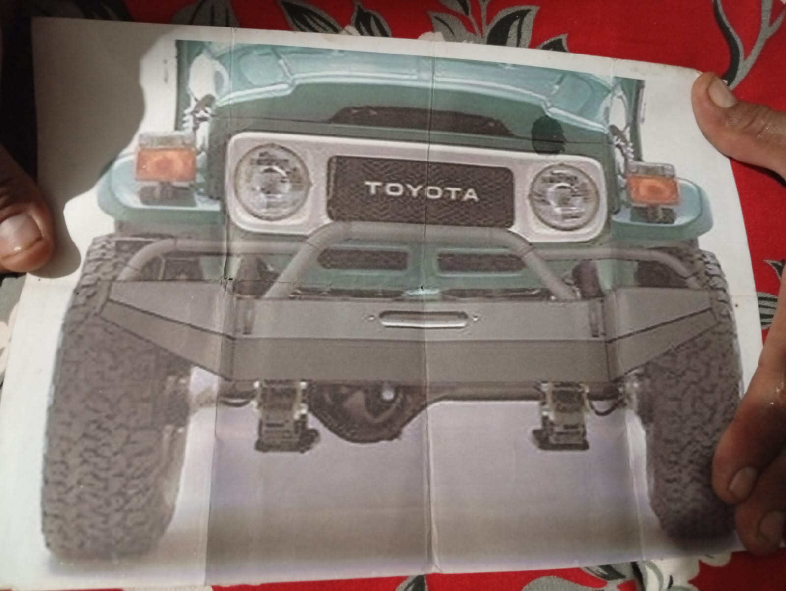
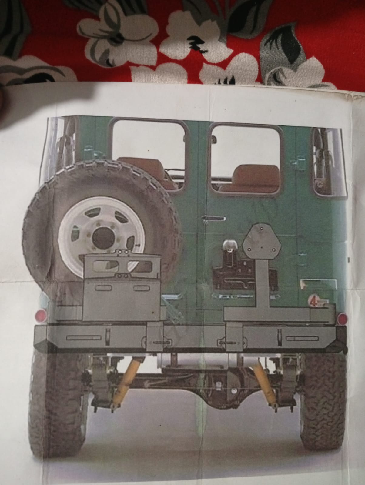

# Front And Rear Vehicle-Bumper Installation Control - 2026-07-22

Status update `2026-07-29`: the front vehicle bumper is reported added/installed. The rear bumper remains pending addition/installation. These are vehicle body/chassis bumpers and are separate from the suspension bump stops.

## Design References

The images communicate design intent only. They are not scaled fabrication drawings and do not prove winch, recovery-point, tow-hitch, carrier, hinge, latch, or chassis load ratings.

## Front Installation Checks

Physical installation is reported complete; retain these as installed-work closeout checks.

- Trial-fit to sound chassis pickups; do not use body sheet metal as the primary load path.
- Verify bumper width, symmetry, grille/headlamp access, radiator airflow, approach angle, tyre clearance at full steering lock, and bonnet/service access.
- Align any winch tray and fairlead opening to the actual winch and rope path; confirm motor/gearbox, clutch lever, cable, drainage, and fastener access.
- Treat hoop, tow eyes and recovery points as unrated until their material, welds, backing/load path and intended working load are documented.

## Rear Installation Checks

Addition/installation remains pending.

- Verify chassis pickups, body/door clearance, departure angle, exhaust clearance, lights/number-plate visibility, and access to service points.
- Cycle every carrier/arm through full travel; confirm hinge support, latch engagement, anti-rattle control, open-position stop and safe retention.
- Check spare-wheel and any can/carrier load against the hinge, latch, bumper and chassis load path.
- Treat the tow ball/hitch and recovery points as unrated until receiver geometry, material, welds, fasteners and chassis reinforcement are documented.

## Closeout Evidence

- Bare-metal fabrication and weld photos before coating.
- Installed front, rear, side and underside views with fasteners/pickups visible.
- Dimensions and symmetry checks, torque/retention record, door/carrier/access cycle, tyre/body clearance, and winch/tow/recovery classification.
- Primer, seam/cavity treatment where applicable, final coating, and post-install damage/touch-in photos.
