# J40 handbrake component photo retrieval index

**Review date:** 16 August 2026  
**Google Photos window:** 17 April–2 August 2026 (last four months available in the project import)  
**Coverage:** 632 Google Photos reviewed; 41 unchanged photo references filed into component folders. A photo is duplicated where it proves more than one component.

## Scope and decision rule

This index separates every handbrake-specific component that should be retrieved from the non-original installation before new inner cables and outer casing are made. It does **not** treat the recently purchased cable as the original pattern: the project expense record says its fit still requires verification, and the workshop plan says not to buy or copy a random catalogue cable.

Loose generic washers, nuts, circlips, ordinary clips and grommets are excluded. Captive or specially shaped hardware that establishes the cable geometry is included. The old inner cables and outer casing are not proposed for reuse, but must be retained intact as the fabrication pattern until the replacement works on the vehicle.

## Retrieval summary

| ID | Component to retrieve | Confidence | Retrieval instruction |
|---|---|---:|---|
| R01 | Control/hand-lever-end anchor or special terminal | Medium | Retain the complete anchor/terminal and the short old link; confirm its exact lever connection on the vehicle. |
| R02 | Primary threaded adjustment assembly and sheath abutment | High | Retrieve the complete shaped assembly. Loose ordinary nuts are outside this list. |
| R03 | Oval compensator/equalizer plate or stack | High | Retrieve intact and mark front/rear and cable paths. |
| R04 | Rear axle reaction/equalizer bracket | High | Retrieve intact and record its mounting face and installed orientation. |
| R05 | Special rectangular U-yoke/retainer | High | Retrieve. Although visually clip-like, it is special linkage geometry rather than a generic retaining clip. |
| R06 | All special swaged cable-end terminals | High | Preserve attached to the old cable where possible; otherwise label the exact cable and end. |
| R07 | Threaded, shouldered and flanged sheath interface fittings | High | Retrieve reusable fittings or duplicate them exactly after measuring threads, seats and shoulders. |
| R08 | Intermediate outer-casing locator sleeves/junction pieces | High | Retrieve and record their positions along the old casing. |
| R09 | Handbrake return/tension springs | High | Retrieve only springs proven to belong to the parking-brake linkage; label left/right/location. |
| R10 | LH and RH rear-drum parking-brake levers/actuator interfaces | High | Retrieve as separate side-labelled assemblies. The replacement cable must retain the standard J40 drum interface. |
| R11 | Other uniquely shaped handbrake mounting/reaction hardware | Medium | Retrieve only pieces whose cable-system role is confirmed; exclude hydraulic brake parts and generic fasteners. |

## Parts to retrieve — illustrated

### R01 — Control-end anchor / lever-side terminal

The loose old short link shows a rectangular eye at one end and a swaged stop at the other. The installed forward photo gives route context, but the exact hand-lever attachment still needs an on-vehicle confirmation before manufacture.

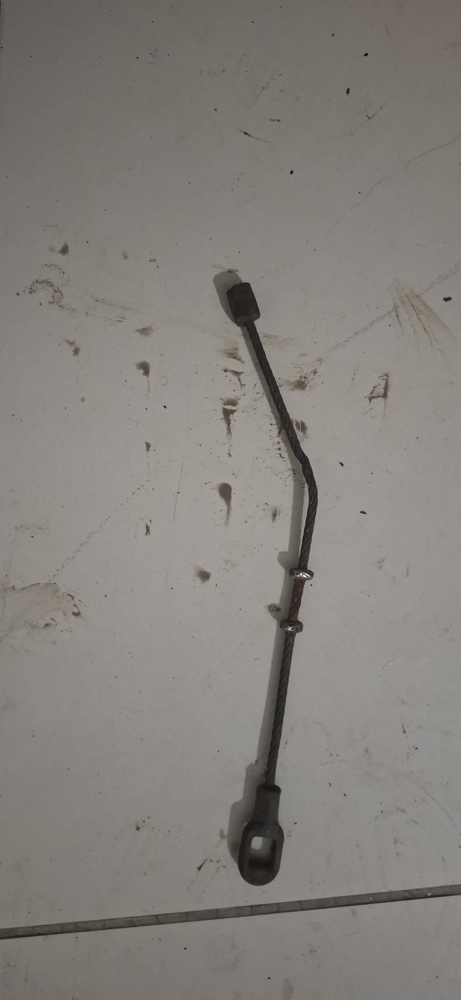

### R02 — Primary adjustment assembly

Retrieve the threaded adjuster, the shaped sheath abutment and any integral support piece as one labelled group. Ignore loose ordinary nuts when compiling the cable-parts bill.

### R03 — Oval compensator/equalizer

Retrieve the oval plate/stack intact. Mark its installed face, forward direction and which cable passes through each opening.

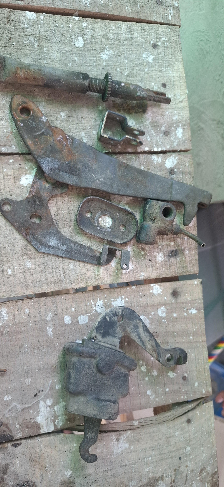

### R04 — Rear reaction/equalizer bracket

Retrieve the triangular/shaped axle-side reaction bracket. It establishes the relative positions of the front pull and both rear-wheel pulls.

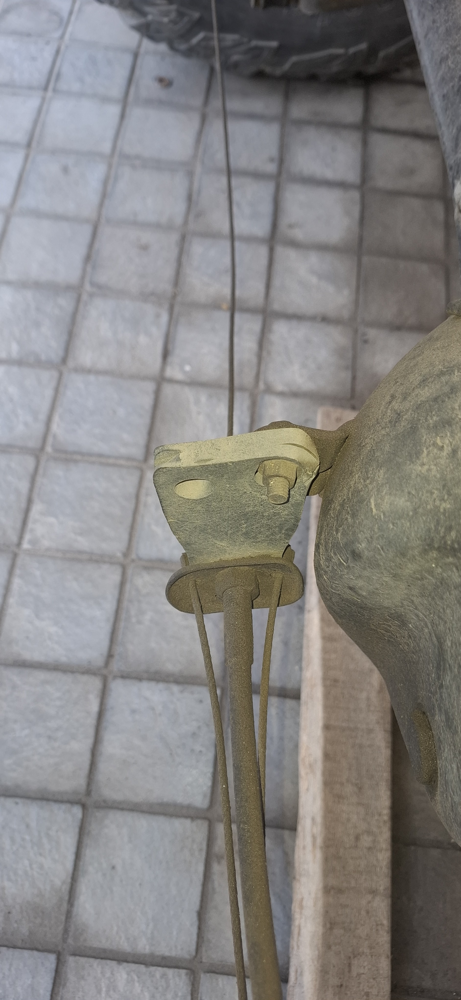

### R05 — Rectangular yoke/retainer

This unusual rectangular wire yoke is explicitly included because it is a formed linkage part, not an ordinary clip.

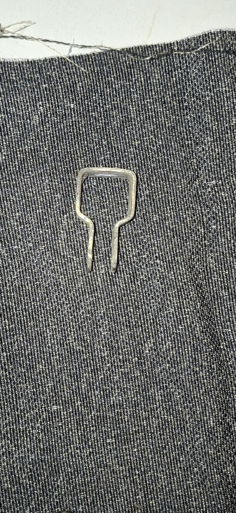

### R06 — Special cable-end terminals

Retrieve every shaped eye, loop, block and swaged stop. Keep them attached to the old inner cable until free length, terminal orientation and exposed-wire length have been recorded.

### R07 — Sheath interface fittings

Retrieve all threaded, flanged and shouldered ends that locate the outer casing at brackets or backing plates. These interfaces—not catalogue vehicle fitment alone—control whether a new cable will fit this modified system.

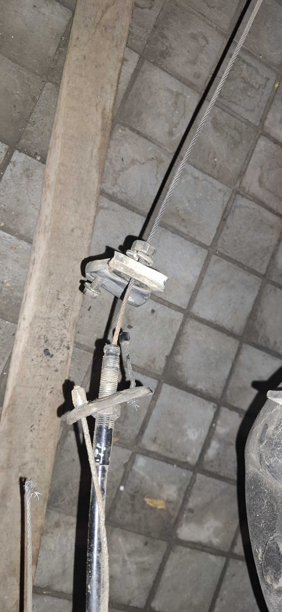

### R08 — Intermediate casing locators

Retrieve integral locator sleeves/joiners and record their installed positions before the old casing is cut or discarded.

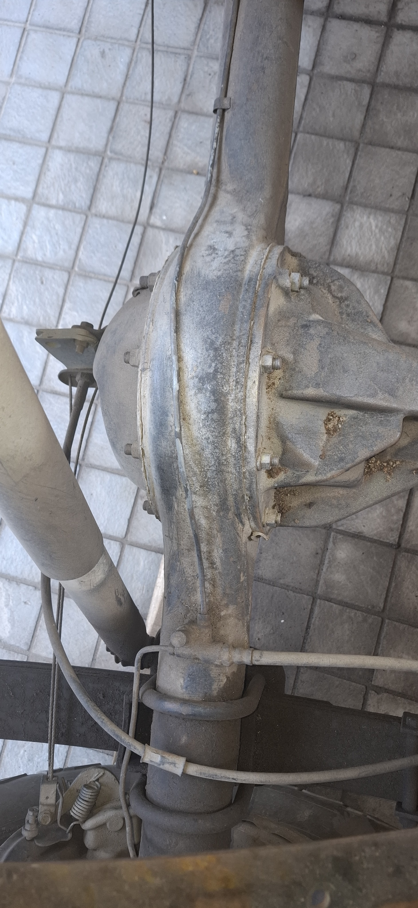

### R09 — Return/tension springs

Retrieve the installed parking-brake return springs and label their side/location. The removed spring assortment is reference only until each spring is traced to the handbrake.

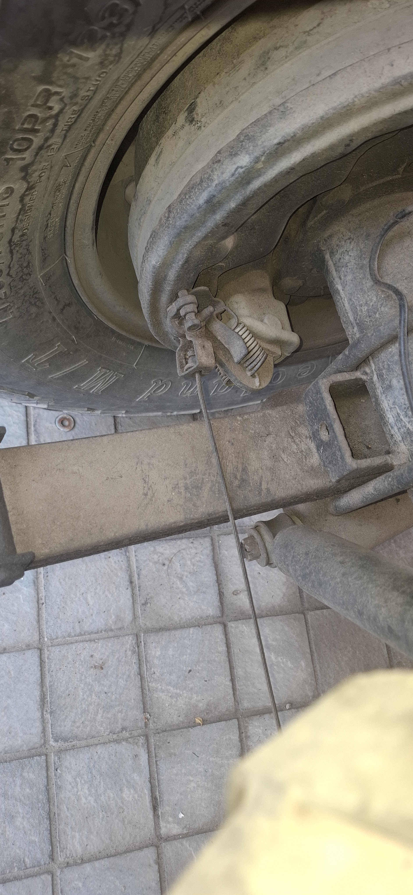

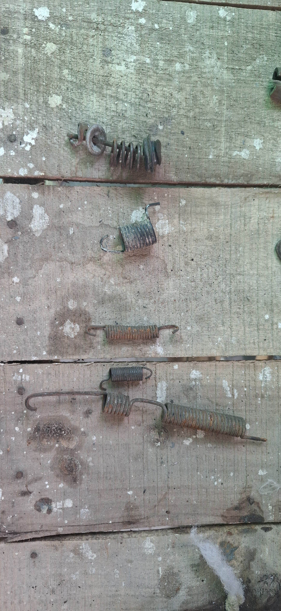

### R10 — Left and right rear-drum interfaces

Retrieve the parking-brake lever/actuator at each rear drum and label left and right immediately. These are the physical standards for the required standard J40 drum-end connection.

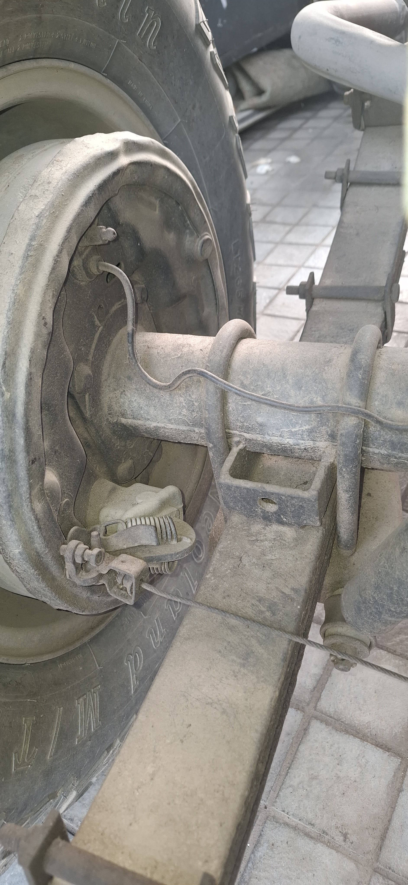

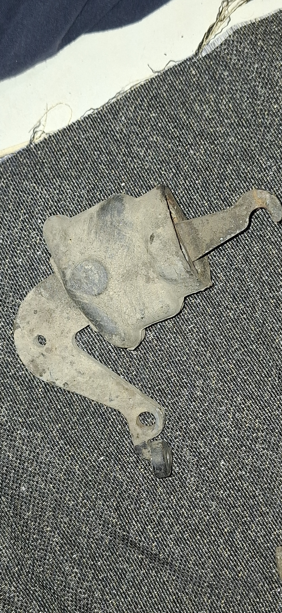

### R11 — Other special mounting hardware

The photographs include shaped brackets and levers mixed with hydraulic brake components. Retrieve only the handbrake-specific shaped pieces; the wheel cylinder, ordinary washers and loose general fasteners are not part of this list.

## Old cable and casing — preserve as the fabrication pattern

The July measurement sequence records an old full assembly at approximately **3,280–3,290 mm overall** when laid along the tape. This is photographic evidence, not a production dimension: endpoints, casing length, free inner-cable length, fitting datum points and routing allowance must be remeasured directly from the old assembly and vehicle. The five originals are in `90_old_cable_measurement_reference`.

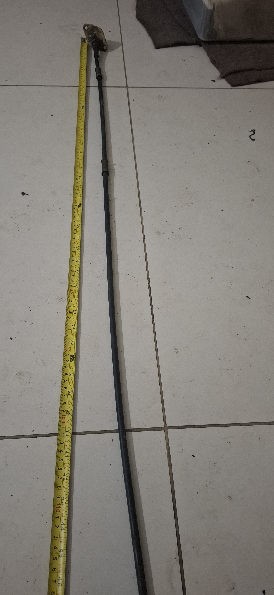

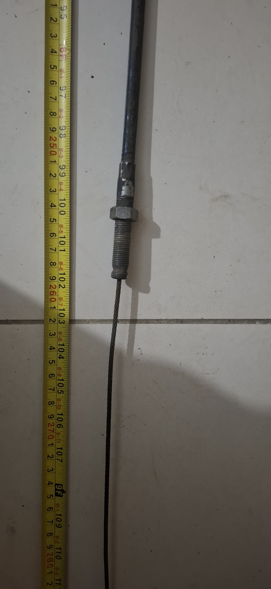

## Wrong or unverified replacement — do not use as the pattern

The clean replacement-looking assemblies are quarantined in `00_wrong_or_unverified_replacement_reference`. They are useful only for a later physical comparison. Their overall lengths, fitting positions and terminal details must not enter the fabrication specification unless an on-vehicle fit check proves them correct.

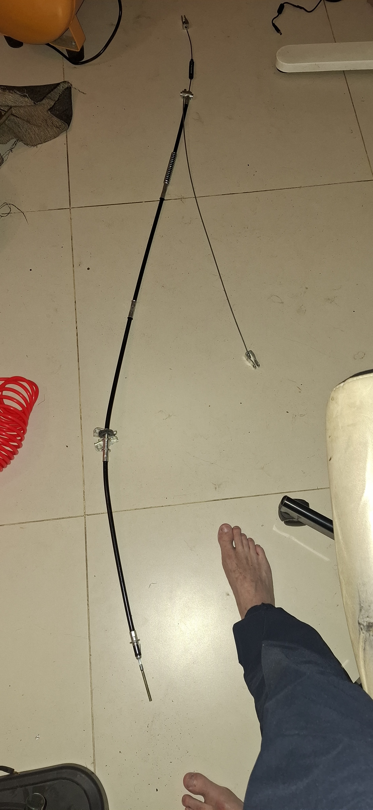

## Workshop retrieval procedure

1. Prepare eleven bags or trays labelled R01–R11, plus one long protected sleeve labelled `OLD CABLE/CASING — MASTER PATTERN`.
2. Before removal, photograph the installed orientation of R01, R02, R03, R04, R08 and both R10 assemblies; add left/right and forward arrows.
3. Remove the old cables without cutting them. If cutting is unavoidable, first mark the exact cut location and record every datum-to-datum length.
4. Place each special fitting in its matching R-number container. Do not mix left and right drum parts.
5. Keep the purchased/wrong replacement cable in a separate container marked `NOT ORIGINAL — FIT NOT PROVEN`.
6. Before fabrication, measure the original old assembly directly: inner-wire diameter and construction; outer-casing outside diameter; casing datum-to-datum lengths; exposed inner-cable lengths at rest; terminal dimensions/orientation; fitting threads and shoulders; locator positions; and required working travel.
7. Trial-fit the completed assembly, verify full release at both drums and adequate adjustment range, then retain the old sample until the vehicle passes a static hold and release test.

## Folder layout

- Component photos: `photos/handbrake_retrieval_components_20260816/R01_...` through `R11_...`
- Old cable measurement evidence: `photos/handbrake_retrieval_components_20260816/90_old_cable_measurement_reference`
- Wrong/unverified replacement reference: `photos/handbrake_retrieval_components_20260816/00_wrong_or_unverified_replacement_reference`
- Machine-readable classification: `photos/handbrake_retrieval_components_20260816/manifest.csv`

All filed photographs are byte-for-byte copies of the imported originals; no crop, enhancement or generative edit has been applied.
