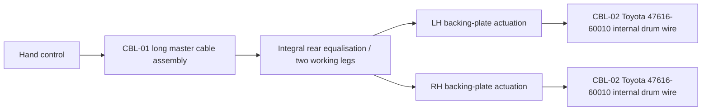

# J40 Rear-Wheel Handbrake Cables — Controlled Specification

**Document ID:** J40-HBL-SPEC-001  
**Revision:** C — 2026-08-16  
**Vehicle:** 1978 Toyota Land Cruiser J40, RHD project vehicle  
**Controlled configuration:** the non-original rear-wheel parking-brake conversion physically fitted to this chassis  
**Scope:** cable assemblies and their permanently attached cable-end fittings only; washers, clips, grommets, nuts, pins, brackets, levers and springs are excluded  
**Safety class:** brake-control system; final selection, fabrication, installation and road release require a competent automotive control-cable shop and brake mechanic

## 1. Released decision

The cable system has **two part types and three fitted pieces**:

| ID | Cable part | Qty | Release status |
|---|---|---:|---|
| CBL-01 | Long hand-control-to-rear-axle cable assembly, including its two rear working legs and all permanent casing ferrules/stops and cable terminals | 1 | `MASTER-CONTROLLED`: reproduce the known-fit removed assembly, or buy an OEM assembly only after every selector and dimensional gate in Section 5 passes |
| CBL-02 | Internal rear-drum parking-brake wire, Toyota `47616-60010` | 2, one per rear wheel | `RELEASED STANDARD PART`: buy off the shelf; do not fabricate |

This specification deliberately does **not** describe the system as an original 1978 J40 rear-cable setup. Toyota's 1978 arrangement used a transfer-case/propeller-shaft parking brake, whereas this vehicle has a later-style mechanical parking brake acting at the two rear drums. There is therefore no valid “standard 1978 handbrake-to-rear-axle cable length” to order.

The old, known-fit CBL-01 cable shown in the supplied measurement photographs is the dimensional master. The standard J40 wheelbase and rear-track dimensions in Section 4 are installation-envelope cross-checks, not cable cut lengths.

Daraz order `243701549680938`, advertised as an FJ40/BJ40 handbrake cable and received on 2026-05-26 for PKR 5,600 plus PKR 195 shipping, is owner-confirmed **wrong size**. Label it `REJECTED — WRONG SIZE — NOT MASTER — DO NOT INSTALL`. Toyota number `46410-60092` is only an archive catalogue/search reference; no marking connects that number to the rejected cable and it is not released by this document.

## 2. Controlled cable architecture

CBL-01 is controlled as one assembly because the photographs show a continuous long sheathed cable followed by a bare working-wire section and fixed guide/ferrule features. A supplier shall not redesign it as three unrelated universal cables.

The loose short wire in the supplied photograph is not a third external branch. Its rectangular stop, two guide rings and oval eye match the standard Toyota internal drum wire `47616-60010`. The photographed example is bent/frayed and is a reject sample only.

## 3. Exact cable-part specification

### CBL-01 — long master cable assembly, quantity 1

**Dimensional authority:** the complete known-fit removed cable, measured between functional load datums. The photographs provide the feature map and useful screening dimensions below, but do not show the far inner-cable terminal and therefore cannot release a fabricated end-to-end length on their own.

**Construction requirement:**

- automotive-grade flexible multistrand mechanical-control cable;
- weather-resistant, low-friction lined casing matching the master outside diameter and bend behaviour;
- all casing ferrules, stops, guide sleeves and cable terminals permanently swaged by an automotive control-cable shop;
- terminal forms, thread diameter/pitch/hand, usable adjustment and support-feature order copied from the physical master;
- no wire-rope clamps, screw blocks, knots, twists, wrapped repairs, solder-only terminations, cable splices or welded cable ends;
- new assembly shall follow the fitted route without becoming taut at full rear-axle droop or contacting the propeller shaft, exhaust, springs, tyres or hydraulic brake lines.

**Released manufacturing measurements:**

1. Seat the straightened master under a **20 N axial seating load**.
2. Record overall inner effective length between the two actual load-contact datums to 1 mm.
3. Record outer-casing length between its two load-bearing abutment faces to 1 mm.
4. Record every fixed ferrule/stop/guide from the control-end load datum to 1 mm.
5. Measure inner wire and casing outside diameters to 0.1 mm; identify every terminal and thread with a dimensioned photograph.
6. Reproduce inner effective length and casing length to **±1.0 mm**, and fixed feature positions to **±1.0 mm**. Threads and load-contact terminal forms are exact-match features.

The completed values belong in `j40_handbrake_line_master_measurements_20260816.csv`. CBL-01 remains on fabrication hold until records `PHY-01` through `PHY-05` are complete and signed.

### CBL-02 — standard rear-drum internal wire, quantity 2

**Released part:** Toyota `47616-60010`, `WIRE, PARKING BRAKE`, one identical part at each rear wheel. The Toyota electronic catalogue shows this part in both rear-wheel positions on the August 1980-on rear-drum system. Buy two genuine Toyota parts or a direct quality equivalent explicitly cross-referenced to `47616-60010`.

**Interfaces that define the standard part:**

- rectangular cable stop at the actuating end;
- two captive guide/locating rings in the standard positions;
- oval eye at the shoe-actuation end;
- complete wire supplied as one permanently terminated part.

Do not shorten, lengthen, re-swage or locally fabricate CBL-02. If either fitted backing plate cannot accept `47616-60010` without alteration, the drum actuation is not the required standard interface. Correct the backing-plate/actuator configuration rather than making a non-standard drum wire.

The fitted shoe evidence points to the early narrow K2221/`04494-60010` family, while CBL-02 belongs to the August 1980-on rear-wheel parking-brake architecture. Before final assembly, dry-fit one CBL-02 and prove that its rectangular stop, guide rings and oval eye seat in the fitted actuation without bind and that both shoes fully apply and release. This is an interface check, not permission to alter the standard cable.

## 4. Standard J40 geometry used for sizing control

| Datum | Controlled value | Use in this specification |
|---|---:|---|
| Short-wheelbase J40 wheelbase | 2,285 mm | Reference distance for the chassis route from the hand-control region to the rear axle |
| Standard J40 rear track used by the project reference model | 1,410 mm | Reference envelope for the working run across the rear axle |

These dimensions establish that the cable must span a standard short-wheelbase chassis and standard-width axle envelope. They do **not** equal a cable length. Casing bends, mounting offsets, terminal engagement, equaliser geometry, applied stroke, adjustment reserve and rear-suspension movement all add or subtract from a straight chassis dimension. An order or fabrication drawing that substitutes `2285 mm`, `1410 mm`, their sum, or the project's approximate `980 mm` CAD route value for the master measurements shall be rejected.

## 5. Photo-derived CBL-01 control dimensions

The tape photographs ending `b689…`, `907f…`, `af51…`, `9c47…` and `c8e…` are useful because they show successive portions of the long cable against one metric scale. Perspective, cable curvature and incomplete visibility limit their precision. The photographs ending `4478…` and `7840…` show a separate or partial cable/end assembly whose continuity with that long run is not proven; they are terminal-form evidence only and shall not supply a combined length. The following values are therefore controlled as **screening ranges/lower bounds**, not fabrication-release dimensions:

| Photo record | Feature from control-end flange datum | Photo-supported value | Status |
|---|---|---:|---|
| `PHO-01` | Fixed support/ferrule group | 1,430–1,490 mm | Candidate screening range |
| `PHO-02` | Next fixed guide/ferrule group | 1,625–1,665 mm | Candidate screening range |
| `PHO-03` | Later fixed guide/ferrule group | 2,110–2,150 mm | Candidate screening range |
| `PHO-04` | Outer-casing exit / beginning of exposed inner working wire | 2,590–2,610 mm | Candidate screening range; nominal photographic observation approximately 2.60 m |
| `PHO-05` | Inner wire continues past tape reading | greater than 3,300 mm | Lower bound only; far terminal is outside the photograph |

Consequences for purchasing:

- reject any advertised cable with an outer casing materially outside the approximately 2.60 m photographed master range;
- reject any advertised overall/effective cable length of 3,300 mm or less;
- do not approve a candidate that omits or reorders the fixed support features;
- do not infer the missing far-terminal length by extrapolating the photograph; measure the retained physical master.

## 6. Conditional OEM selector for CBL-01

Later RHD short-wheelbase 40-series Land Cruisers used different complete parking-brake cable assemblies according to rear axle construction and production period. These are **candidate assemblies**, not interchangeable supersessions:

| Rear axle and production application | Candidate Toyota cable | Release condition for this converted vehicle |
|---|---|---|
| RHD, full-floating rear axle, 1980.08–1982.10 application | `46410-60120` | Axle proven full-floating; control end, wheel ends, fixed supports, casing length and inner effective length all pass Sections 3 and 5 |
| RHD, full-floating rear axle, 1982.10–1984.10 application | `46410-60121` | Same gates; use only if its later interfaces match the physical master |
| RHD, semi-floating rear axle, 1980.08–1982.10 application | `46410-60160` | Axle proven semi-floating and every interface/dimensional gate passes |
| RHD, semi-floating rear axle, 1982.10–1984.10 application | `46410-60161` | Same gates; use only if its later interfaces match the physical master |

Selection procedure:

1. Identify the fitted rear axle as full-floating or semi-floating from the hub/axle construction; do not use the vehicle's 1978 model year because the rear-wheel system is a conversion.
2. Compare the candidate's control terminal, backing-plate interfaces and every fixed support with the old master before ordering.
3. Obtain supplier-confirmed casing and effective lengths and compare them with the signed `PHY-01` through `PHY-05` measurements.
4. Approve the OEM candidate only if all interfaces are identical and both lengths meet the master tolerances. A seller description containing only “FJ40/BJ40” is insufficient.
5. If no candidate passes, commission CBL-01 locally from the complete old master. This is the default safe procurement route and preserves the non-original fitted geometry.

## 7. Off-the-shelf availability and Pakistan delivery

Availability and delivery were checked on 2026-08-16. Prices and freight are snapshots and must be reconfirmed before checkout.

| Cable part | Off-the-shelf result | Pakistan delivery evidence | Purchase decision |
|---|---|---|---|
| CBL-02, Toyota `47616-60010`, qty 2 | Genuine Toyota listing at YoshiParts, US$17.16 each at check; MegaZip also lists the part from US$20.22 | YoshiParts returned live Pakistan quotes: Japan Post US$16.74, FedEx Priority US$43.55 and DHL Express US$92.12 | **Released to order, quantity 2**, subject only to seller stock recheck |
| CBL-01 candidate `46410-60120`, qty 1 | Genuine Toyota listing at YoshiParts, US$79.02 at check; also listed by FitinPart and eBay | YoshiParts returned live Pakistan quotes: Japan Post US$25.63, FedEx Priority US$48.21 and DHL Express US$92.12 | **Do not order yet**; Pakistan delivery is proven, fit is not. Complete the full-float and dimensional gates first |
| CBL-01 candidates `46410-60121`, `46410-60160`, `46410-60161` | Current/OEM catalogue identities established; `46410-60121` is listed through GR Heritage sellers | Pakistan delivery not independently confirmed in this review | Conditional alternatives only; request a destination quote after the applicable axle selector passes |
| CBL-01 sample-copy fabrication | Available through a competent automotive cable fabricator using the complete old master | Local Pakistan procurement route recorded in the project contact register | **Default route if no OEM candidate passes all gates** |

Counted by line item, **1 of 2 cable types is released off the shelf**, and the other is conditionally available. Counted by fitted pieces, **2 of 3 pieces can be ordered off the shelf now**; all 3 could be off the shelf only if the selected complete CBL-01 cable passes the axle, interface and dimensional gates.

## 8. Inspection and acceptance

CBL-01 bench release requires:

- signed physical-master measurements and dimensioned terminal photographs;
- every permanent swage straight and fully seated, with no cut strands, bird-caging, heat damage or movement under the cable fabricator's documented automotive proof load;
- free movement through full input/output travel and full return after 25 hand-operated cycles;
- useful adjustment remaining at both released and fully applied positions;
- no casing or fixed support dimension outside the signed master tolerance.

Installed release requires:

- service shoes adjusted before cable free play is set;
- both rear wheels begin application together and reach firm hold before the hand control or cable adjuster reaches its travel limit;
- both wheels return to the released-drag baseline after 10 full applications;
- no cable becomes taut or contacts another component at ride height, controlled full droop or controlled full bump;
- standard CBL-02 wires remain unmodified and correctly seated at both drums;
- a competent brake mechanic signs the static inspection and a controlled incline hold test before road use.

## 9. Evidence and source hierarchy

Dimensional authority, highest first:

1. complete known-fit cable removed from this vehicle;
2. the supplied tape-measure photographs and installed route photographs;
3. standard Toyota part identity and application data;
4. seller listings, used only for availability and delivery.

Controlled project records:

- [Cable-only component schedule](../data/manual/j40_handbrake_line_component_spec_20260816.csv)
- [Master measurement release sheet](../data/manual/j40_handbrake_line_master_measurements_20260816.csv)
- [Rear handbrake sourcing/fabrication record](../data/manual/rear_handbrake_buy_links_20260619.csv)
- [Rear-brake shoe fitment control](rear-brake-shoe-fitment-and-purchase-control-20260722.md)
- [Vehicle design specification](vehicle-design-spec.md)
- [Installed route map](annotated-photos/j40-handbrake-cable-map-20260525.jpg)

User-supplied measurement photographs retained as source evidence:

- long cable/tape sequence: `codex-clipboard-b689efe7-5b45-4d35-8721-6c03f91a4de6.png`, `codex-clipboard-907f902a-c2d3-423a-b95e-7d71d2fe4cb7.png`, `codex-clipboard-af51a9ee-5a75-49bc-9041-ba7ea2ece8a7.png`, `codex-clipboard-9c47a8e7-a831-42ca-a89d-58a7db00336d.png` and `codex-clipboard-c8e97dd6-36e6-40cc-80b3-8f89ad88b843.png`;
- separate/partial assembly and threaded-end evidence: `codex-clipboard-44782e84-91aa-4ef1-acc2-d0a03c47baa2.png` and `codex-clipboard-78406560-f816-43d6-af3e-d121ec580044.png`;
- standard drum-wire identification: `codex-clipboard-d9fa8222-5f1f-4ea6-9b8f-655aa78dff0e.png`.

External identity and geometry sources:

- [Toyota GR Heritage 40-series parts list](https://toyotagazooracing.com/pages/contents/jp/gr/heritage/pdf/2024/Landcruiser40_en.pdf) — official cable applications by axle type and production period
- [Toyota official Land Cruiser 40 history](https://global.toyota/en/mobility/toyota-brand/features/landcruiser/history/evolution/heavy-duty.html) — 2,285 mm short-wheelbase datum
- [MegaZip Toyota rear-drum catalogue](https://www.megazip.net/zapchasti-dlya-avtomobilej/toyota/land-cruiser-38286/fj40-55808/fj40lv-kcjk-917260/rear-drum-brake-wheel-cylinder-backing-plate-17813979) — `47616-60010` shown in both rear-wheel positions
- [YoshiParts `47616-60010`](https://yoshiparts.com/parts/toyota-4761660010) — genuine-part availability and live Pakistan delivery quote
- [YoshiParts `46410-60120`](https://yoshiparts.com/parts/toyota-4641060120) — genuine complete-cable availability and live Pakistan delivery quote
- [Imperial Cable catalogue](https://www.imperialcable.co.th/storage/config/catalogue.pdf) — aftermarket cross-references for the RHD 40-series cable families

## 10. Release sign-off

| Gate | Name/signature | Date | Result |
|---|---|---|---|
| Fitted rear axle classified full-floating or semi-floating |  |  | HOLD / PASS |
| CBL-01 records `PHY-01` through `PHY-05` complete |  |  | HOLD / PASS |
| CBL-01 OEM candidate passes all gates, or custom-copy drawing released |  |  | HOLD / PASS |
| Two CBL-02 parts dry-fit without modification |  |  | HOLD / PASS |
| CBL-01 fabricator bench release |  |  | HOLD / PASS |
| Installed static and controlled incline release |  |  | HOLD / PASS |
