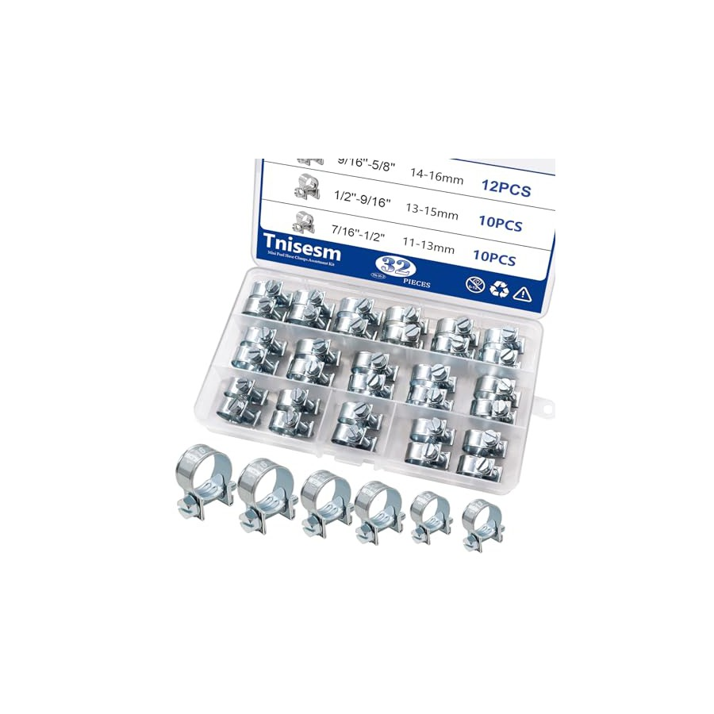
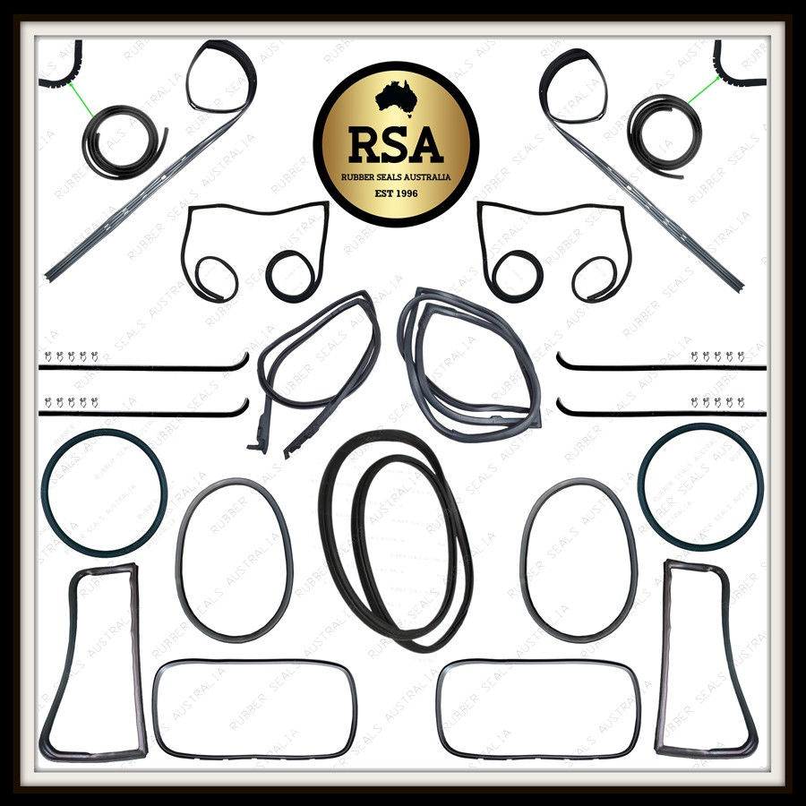

# Local Market Component Order Spec - 2026-05-04

Purpose: one sendable market pack that lists the actual new parts to quote or buy, with the working dimensions already pulled out. Take old samples and photos where noted; do not let the market turn this back into generic "rubber pipe" or "Land Cruiser part" shopping.

Scout position: braking, clutch hydraulic, hose, fuel/vacuum, hard-line, parking-brake cable, rubber/grommet/boot/pad, clamp, clip, fitting, terminal, and electrical wire/cable consumables are new replacement requirements. Old components are used only as samples for length, shape, fittings, routing, and connector identification.

New-only rule: do not buy used/salvage rubbers, hoses, hydraulic assemblies, hard lines, parking-brake cables, electrical wire/cable, terminals, clips, clamps, fittings, grommets, boots, pads, hangers, or similar consumables for final installation.

The dashboard Scout tables now show a photo thumbnail for every exact component row. This Markdown pack uses the same references, including the user-supplied actual compact fuse-box photo and a real bolt-down bench-vice photo.

## Photo References

| Component family | Photo reference |
| --- | --- |
| Compact cabin fuse box |  |
| Formed metal coolant pipe / connector hoses |  |
| Radiator and heater hoses |  |
| Fuel, vacuum, and breather hose stock |  |
| Brake and clutch hydraulic lines |  |
| Chassis/body rubbers |  |
| Brake booster |  |
| Workshop bench vice |  |

## Pipes And Hard Lines

| ID | Component | Qty | Exact market spec | Dimensions / ratings | Must match before final install | Reject |
| --- | --- | ---: | --- | --- | --- | --- |
| `PIPE-COOL-01` | Formed metal coolant/radiator pipe | `1` | Fabricate new from coolant-compatible tube and copy the physical formed coolant pipe sample for bends/clocking/offsets. Mild steel/aluminized steel or 304 stainless, beaded ends. | Buy/quote `1000 mm` tube stock if sold by meter; `750 mm` is the absolute minimum blank. Tube OD `28-30 mm`; wall `1.2-1.6 mm`; bead height `1.5-2.0 mm`; straight clamp lands `25-30 mm` each end. | Trim/bead from the sample, dry-fit, check fan/belt/body clearance, and pressure-test before coating. | Used pipe, no sample copy, no beading tool, no dry-fit before coating. |
| `PIPE-FUEL-01` | Low-pressure diesel feed hard line | Conditional coil/length only if a separate rigid feed line exists | New automotive bundy steel or CuNi/Cunifer tube to replace a confirmed old rigid feed line. Do not duplicate `HOSE-FUEL-01`, which is the measured flexible tank-to-engine feed route. | Conditional stock allowance: `8 mm OD x 5000 mm`; individual sections cut shorter from old rigid route. | Copy old route, unions/end style, clips, pass-through protection, leak test. | Bare copper, plumbing tube, used line, unknown fitting style, or no separate rigid feed line. |
| `PIPE-FUEL-02` | Low-pressure diesel return hard line | `1` coil/length | New automotive bundy steel or CuNi/Cunifer tube to replace the old return line. | Exact stock allowance: `6 mm OD x 5000 mm`; individual sections cut shorter from old route. | Copy old route, unions/end style, clips, pass-through protection, leak test. | Bare copper, plumbing tube, used line, unknown fitting style. |
| `PIPE-BRAKE-01` | Brake hard-line tube and fittings | `1` coil allowance | New brake-rated bundy steel or CuNi/Cunifer only; new brake-rated fittings after flare/thread identification. | `4.75 mm / 3/16 in OD x 7600 mm / 25 ft`. | Old line templates, flare type, fitting thread/seat, individual route lengths, clips, pressure/bleed test. | Bare copper, used line, non-brake fittings, shop cannot identify flare/thread standard. |
| `PIPE-CLUTCH-01` | Clutch hard-line blank | `1` blank allowance | New brake/clutch-rated bundy steel or CuNi/Cunifer. | `4.75 mm / 3/16 in OD x 1500 mm` blank allowance. | Master-to-slave route, port threads, flare/seat style, clips, drivetrain movement. | Bare copper, used line, or unknown flare/thread standard. |
| `CLIP-LINE-01` | Hard-line support clips | `20` mixed new clips plus fasteners | New rubber-lined plated or stainless P-clips plus edge/pass-through protection. | Clip IDs for `4.75 mm`, `6 mm`, and `8 mm` line OD; support every `300-400 mm`. | Match bracket holes, chafe points, and hard-line route. | Used clips, plain cable ties, or bare metal clips as permanent support. |

## Owner Fabrication Tool

This is not part of the hose/pipe shopping table. Add it only if the lines are made at home.

| ID | Tool | Exact requirement | Buy position |
| --- | --- | --- | --- |
| `TOOL-LINE-001` | Brake/fuel hard-line cutter, hand bender, deburrer, and flaring kit | Must cover `4.75 mm / 3/16 in` tube and preferably `6 mm` and `8 mm`; flare type remains held until the old fittings are identified. | Conditional purchase. Do not buy if the brake/hydraulic shop confirms it will cut, bend, deburr, flare, and fit the lines. |

## Hoses

| ID | Component | Qty / buy length | Exact market spec | Dimensions / ratings | Clamp/fitting spec | Reject |
| --- | --- | ---: | --- | --- | --- | --- |
| `HOSE-COOL-01` | Upper radiator hose | `1` new molded hose, `355 mm` | New HJ47/2H upper molded EPDM radiator hose; Toyota `16571-68020`, Dayco `DMH1342` / `CH1342` as accepted shape references. | Published molded free length `355 mm`; order as molded HJ47/2H upper hose because bend shape still controls. | `2` new smooth-band or constant-tension clamps by hose OD. | Used hose, universal straight hose, wrong bend, wrong coolant rating. |
| `HOSE-COOL-02` | Lower radiator hose | `1` new molded hose, `480 mm` | New HJ47/2H lower molded EPDM radiator hose; Toyota `16572-68020`, Dayco `DMH1343` / `CH1343` as accepted shape references. | Published molded free length `480 mm`; order as molded HJ47/2H lower hose because bend shape still controls. | `2` new smooth-band or constant-tension clamps by hose OD. | Used hose, straight hose that kinks, wrong neck size, no coolant rating. |
| `HOSE-COOL-03` | Radiator overflow hose | `1000 mm` | New EPDM coolant/overflow hose from radiator neck to reserve bottle. | Exact buy length `1000 mm`; finished route trims shorter. | New spring clips or smooth-band clamps by OD. | Used hose, clear PVC, washer hose, soft non-coolant hose. |
| `HOSE-COOL-04` | Heater hose stock | `1000 mm` | New EPDM heater hose, SAE J20R3 or better. | Exact buy length `1000 mm`; `16 mm / 5/8 in ID`; cut `400 mm` inlet plus `280 mm` outlet, with remainder as trim allowance. | `4` new smooth-band clamps by hose OD. | Used hose, generic water hose, wrong ID, route kinks. |
| `HOSE-COOL-05A` | Formed pipe connector hose A | `500 mm` | New EPDM radiator/coolant connector blank; straight only if dry-fit does not kink. | Exact blank `500 mm`; `28-30 mm ID`; trim shorter from sample. | `2` new smooth-band or constant-tension clamps. | Used hose or cannot grip beaded pipe/spigot with safe overlap. |
| `HOSE-COOL-05B` | Formed pipe connector hose B | `500 mm` | New connector blank for opposite pipe end. | Exact blank `500 mm`; `28-30 mm ID`; trim shorter from sample. | `2` new smooth-band or constant-tension clamps. | Used hose, straight hose kinks, or unsafe overlap. |
| `HOSE-FUEL-01` | Low-pressure diesel feed hose | `1500 mm` buy length; measured fitted route about `1200 mm` | New diesel-rated hose for the tank/chassis-to-engine feed route, SAE J30R9 preferred; SAE J30R14T2 / DIN 73379-3E acceptable. | `8 mm ID`. | New rolled-edge fuel-injection clamps matched to selected hose OD. | Used hose, no diesel/fuel markings, coolant/vacuum hose, unsupported chassis chafe, perforated clamp. |
| `HOSE-FUEL-02` | Low-pressure diesel return/bleed hose | `2000 mm` | New diesel-rated hose, same rating family as feed. | `6 mm ID`. | New rolled-edge fuel-injection clamps matched to selected hose OD. | Used hose, no fuel marking, washer hose, sharp clamp. |
| `HOSE-FUEL-03` | Injector leak-off hose | `1000 mm` | New braided diesel leak-off hose rated for diesel return service. | `3.2-3.5 mm ID`. | New small fuel clamps only if fitted arrangement requires. | Used hose, vacuum/washer/coolant/unmarked small hose. |
| `HOSE-VAC-01` | Brake-booster vacuum hose | `2000 mm` | New reinforced oil-resistant vacuum hose that will not collapse. | Exact buy length `2000 mm`; `10-12 mm ID`; trim to pump/check-valve/booster route. | New smooth-band clamps by hose OD; correct check-valve direction. | Used hose, thin soft washer hose, coolant hose, collapses under vacuum. |
| `HOSE-BREATHER-01` | Crankcase breather/oil-mist hose | `1000 mm` | New NBR/fuel/oil-rated or oil-mist-rated hose. | Exact buy length `1000 mm`; `16-19 mm ID`; trim to breather route. | New smooth-band clamps by hose OD. | Used hose or coolant-only EPDM where oil mist is present. |
| `HOSE-BRAKE-01` | Brake flex hose assemblies | `3` new complete assemblies | New front left, front right, and rear center frame-to-axle complete crimped brake hoses. | Free length copied from old samples; end threads/banjo/seats and bracket grooves copied exactly. | New DOT/SAE J1401 or OEM-equivalent assemblies only. | Used hose, hose cut from roll, unknown rating, unmatched ends. |
| `HOSE-CLUTCH-01` | Clutch flex hose | `1` new complete assembly | New complete crimped hydraulic clutch/brake hose assembly. | Free length/end threads/seat/bracket groove copied from sample. | New brake/clutch hydraulic-rated assembly. | Used hose, generic rubber hose, or wrong fitting. |

## Brake And Control Cables

Old cables are length/end samples only. Any cable bought for final installation must be a new assembly.

| ID | Component | Qty / buy length | Exact market spec | Dimensions / ratings | Must match | Reject |
| --- | --- | ---: | --- | --- | --- | --- |
| `CABLE-BRAKE-01` | Rear parking-brake / handbrake cable set | `1` left/right set | New rear parking-brake cable assemblies with corrosion-protected outer sheaths, plus new clevis pins, clips, return springs, and adjuster hardware as fitted. | Final length comes from removed old samples measured in `mm`: overall cable length, sheath length, backing-plate end, equalizer/intermediate end, bracket/clip positions, adjuster thread and travel. | Rear drum backing-plate levers, equalizer/intermediate linkage, original route, and support clips. | Used cable, frayed/seized cable, unknown end style, wrong sheath length, missing adjuster/clip hardware, or catalog-only match without the old sample. |

## Chassis And Body Rubbers

All fitted rubber parts in this section are new-only. Old rubbers and photos are measurement samples, not reuse stock.

| ID | Component | Qty | Exact spec | Dimensions | Material | Hold / reject |
| --- | --- | ---: | --- | --- | --- | --- |
| `BM-LG` | Large circular body-mount cushion | `2` | Matched pair from one setup. | OD `78`; free height `24`; bore/register `32`; center register OD `46 x 2` deep; outside load edge `R2-R3`; faces parallel `<=0.5`; concentricity `<=1.0`. | Black solid EPDM or NR/SBR automotive mount rubber, Shore A `60 +/-5`. | Caliper-confirm before full production; do not mix with OE kit route. |
| `BM-SM` | Small circular body-mount cushion | `10` | One-piece cushion unless old sample proves split-stack construction. | OD `64`; photo stack height `22`; bore/register `32`; center register OD `46 x 2` deep; outside load edge `R2-R3`; faces parallel `<=0.5`; concentricity `<=1.0`. | Same batch/type as `BM-LG`. | Split-stack decision must close from physical sample. |
| `BM-CUP-SM` | Small cup/seat washer blank | `10-12` as mapped | Formed seat/cup washer, not a thin flat washer. | OD `64`; M10 clearance `11`; steel `2.5-3.0` thick; dish/register depth `2-3`. | Deburred and corrosion protected steel. | Reuse originals if sound; confirm cup count by station. |
| `BM-CUP-LG` | Large cup/seat washer blank | `2` as mapped | Formed seat/cup washer for large cushion. | OD `78`; M10 clearance `11`; steel `2.5-3.0` thick; dish/register depth `2-3`. | Deburred and corrosion protected steel. | Confirm station before forming. |
| `BM-SLV` | Body-mount crush sleeves | `held` | Cut only after dry-stack height is confirmed. | ID `10.8-11.0` for M10 bolt; final length = released free stack height minus `3-4 mm` target compression. | Steel tube, deburred/corrosion protected. | Do not cut final sleeves from photo estimates. |
| `FS-OVAL` | Two-hole front-support oval pad | `2` | Capsule/oval pad with relief pocket. | Outer `64 x 96` with `R32` ends; thickness `15`; through holes `12`; hole centers `64` apart; relief `36 x 18 R3`; insert/boss mark OD `29`. | Same mount-grade rubber, Shore A `60 +/-5`. | Confirm blind pocket vs through relief before final production. |
| `FS-STRIP-L` | Front-support strip / liner, left | `1` | Trace physical left carrier before final CNC cut. | Stock envelope `165 x 40`; base thickness `8`; raised/load pad `14`; provisional holes/slots `11` or `11 x 16` at confirmed positions. | Same mount-grade rubber; bond to carrier only with proper rubber-to-metal process. | Do not final cut from photo alone. |
| `FS-STRIP-R` | Front-support strip / liner, right | `1` | Trace physical right carrier before final CNC cut. | Same envelope as left unless carrier proves asymmetry. | Same as left. | Do not assume mirror if carrier differs. |
| `EXH-HGR-90917` | Exhaust pipe teardrop cushion | as fitted | Buy Toyota `90917-08004` / `17572-92000` preferred; local molding only from genuine sample. | Teardrop outline `48 x 86`; lower bulb `R24`; top hole `9`; hanger slot `16 x 22`; thickness target `22` unless sample proves otherwise. | Exhaust-hanger rubber suitable for heat/vibration. | Reject generic round ring/two-hole strap if bracket needs teardrop style. |
| `BUMP-F-L` | Front left bump stop | `1` | Toyota/manufacturer-style molded stop preferred. | Toyota-style `48304-60010` basis; physical bracket/contact point controls final. | Molded automotive bump-stop rubber/PU. | Do not fabricate from simple cut block. |
| `BUMP-F-R` | Front right bump stop | `1` | Toyota/manufacturer-style molded stop preferred. | Toyota-style `48304-60020` basis; shorter/right-side front stop. | Same family as left. | Do not install left stop here. |
| `BUMP-R` | Rear bump stops | `2` | Toyota/manufacturer-style molded pair preferred. | Toyota-style `48304-60010` basis; rear bracket/contact point controls final. | Matched rear pair. | Check Ironman ride height before final stop decision. |

## Compact Cabin Fuse Protection

Current architecture: three isolated under-dash branch-fuse groups, not three random physical boxes.

Visual reference to send with the order: `deliverables/selling_site_images/images/manual_overrides/compact_cabin_fuse_box_user_photo_20260504.png`, the user-supplied actual compact old-OEM fuse box. The old `junction_block.png` line drawing is retained only as background and is not the control image.

| Group | Minimum fused outputs | Input behavior |
| --- | ---: | --- |
| `BATT` / constant battery | `6` | Live with key off. |
| `IGN/RUN` | `6` | Live in ignition/run, dead with key off. |
| `ACC` / part-way ignition | `6` | Live in accessory/part-way key position per ignition-switch plan. |

Preferred buy path:

1. Reuse the existing compact 12-fuse donor block for two `6`-fuse groups only if every rear terminal is clean/tight and continuity testing proves no hidden bus.
2. Buy one matching compact old-OEM add-on carrier for the third `6`-fuse group.
3. If the 12-way donor fails, buy one compact OEM cabin/junction box with three isolated input groups, or `3` matching compact old-OEM carriers.

Exact market request:

> Need one compact old-OEM under-dash blade-fuse carrier to match a small 12-way donor block. Preferred donor style: Suzuki Mehran / Maruti 800 passenger-compartment fuse box, or a similarly compact Daihatsu Cuore / old Alto / old Corolla / small Hyundai cabin fuse carrier. It can be 6/8/10/12-way, but six positions must be usable with clean rear terminals or pigtails. Need cover, mounting tabs, and at least `100 mm` serviceable pigtails if it is a used harness-cut donor. Donor pigtails are for connector/circuit identification only; final wiring uses new automotive cable, terminals, sleeving, and protection.

Target envelope and condition:

- Fuse type: standard medium ATO/ATC blade fuses.
- Physical target: compact under-dash carrier, roughly no larger than `130 x 70 x 45 mm` unless the electrician approves the mounting location.
- Rear terminals: 6.3 mm blade/Lucar style or clean pigtails, no melted plastic, no loose fuse clips; do not use an old cut loom as final wiring material.
- Donor priority: `1` Suzuki Mehran/Maruti 800 under-dash fuse carrier, `2` Daihatsu Cuore cabin fuse carrier, `3` old Suzuki Alto, `4` small old Toyota/Hyundai/Honda cabin box, `5` modern Picanto/Hyundai-style junction box only if three isolated buses can be mapped and the unit physically fits.
- Reject: engine-bay relay box, fuse-cover-only listing, loose fuse assortment, large marine/RV stud block, single-bus universal block that cannot be split safely.

## Brake Booster Decision

Short version: ask for the refurbished/remanufactured 1975-1987 Land Cruiser dual-diaphragm version, not a random used 1978 take-off.

1. **Preferred:** professionally refurbished/reman direct-fit Land Cruiser tandem/dual-diaphragm booster in the `44610-60050` / `BBN60050` family. Treat this as the 1975-1987 BJ4x/FJ4x/FJ55/FJ60-style disc-brake family where the supplier confirms fitment, not just a "1978 only" search.
2. **Acceptable local used/core:** Land Cruiser 40/55/60 dual-diaphragm booster only as a rebuild core unless it sample-matches and passes vacuum hold/leakdown test.
3. **Retrofit option:** complete FJ40 dual-diaphragm booster + master + proportioning valve kit designed for front disc/rear drum. This is cleaner than a random modern donor, but it changes plumbing details and may require new standard/inverted flare nuts and bracket/line changes.
4. **Avoid as first pass:** random Hilux/Prado/Corolla booster swap. It may be possible, but it becomes a fabrication/brake-balance project: firewall pattern, pedal ratio, pushrod depth, master bore, line threads, and proportioning all have to be engineered.

Exact booster measurements to capture before buying or adapting:

- Booster shell diameter and depth, plus clearance to clutch master, bonnet, and existing brake lines.
- Firewall stud pattern: horizontal and vertical spacing, stud diameter/thread, bracket offset/depth.
- Master-cylinder interface: stud spacing, pilot/center bore, pushrod hole/depth, gasket face.
- Pedal side: pushrod length, clevis thread, clevis width, clevis pin diameter, adjustment range.
- Vacuum side: check-valve grommet OD, check-valve direction, nipple/barb OD, hose ID.
- Hydraulic system: master bore, front/rear port threads, flare seat type, residual/proportioning valve layout.

Current supplier references checked:

- Cruiser Teq `BBN60050`: aftermarket booster, includes `44610-60050` family cross-reference coverage, fitment listed for `9/1975-1987 BJ4x/FJ4x/FJ60`.
- ToyotaPartsDeal `44610-60050`: genuine Toyota tandem booster reference, listed for `1975-1980 Land Cruiser`, dimensions `12.3 x 12.0 x 10.9 in`, but marked discontinued on the part page.
- Cruiser Solutions `BT-500`: complete dual-diaphragm booster/master kit for FJ40, includes proportioning valve/bracket/lines, described for disc front/drum rear; note says new standard inverted nuts are required and old metric inverted nuts should not be reused.
- [City Racer dual-diaphragm disc-brake booster](https://www.cityracerllc.com/products/new-dual-diaphragm-disc-brake-booster-for-land-cruiser-fj40-fj55-fj60) and [Cruiser Corps disc-brake booster](https://cruisercorps.com/collections/brakes/products/76-87) both list new dual-diaphragm disc-brake boosters for `10/1975+` Land Cruiser `FJ40/FJ45/FJ55/BJ40`, with `FJ60` also listed by the suppliers. This supports searching the local market by the wider disc-brake Land Cruiser 40/55/60 booster family rather than only by "1978 J40".

Market wording:

> First quote a professionally refurbished/remanufactured Land Cruiser 40/55/60 tandem dual-diaphragm brake booster in the `44610-60050` / `BBN60050` 1975-1987 family, not a raw used 1978 take-off. If unavailable locally, quote a complete FJ40 booster/master/proportioning kit for front disc/rear drum. Do not sell a random modern booster unless the workshop proves firewall fit, pushrod depth/free play, master bore/ports, and brake balance.

## Glow Plugs - Not A Used-Market Scout Item

Do not send glow/heat plugs to a donor-yard scout. These are a new-parts counter or verified Toyota/diesel supplier order after old-plug/system confirmation.

Exact order text:

> Need new Toyota-labelled glow plugs for Toyota 2H diesel. Primary target `19850-68030` x6 for the 12V/8.5V 2H setup. Use `19850-68060` x6 only if the old plug/system proves the later 24V/superglow arrangement. Confirm thread, reach, voltage, seat, and terminal before payment. Do not quote used, refurbished, 1C/2C, or PT-107 plugs.
