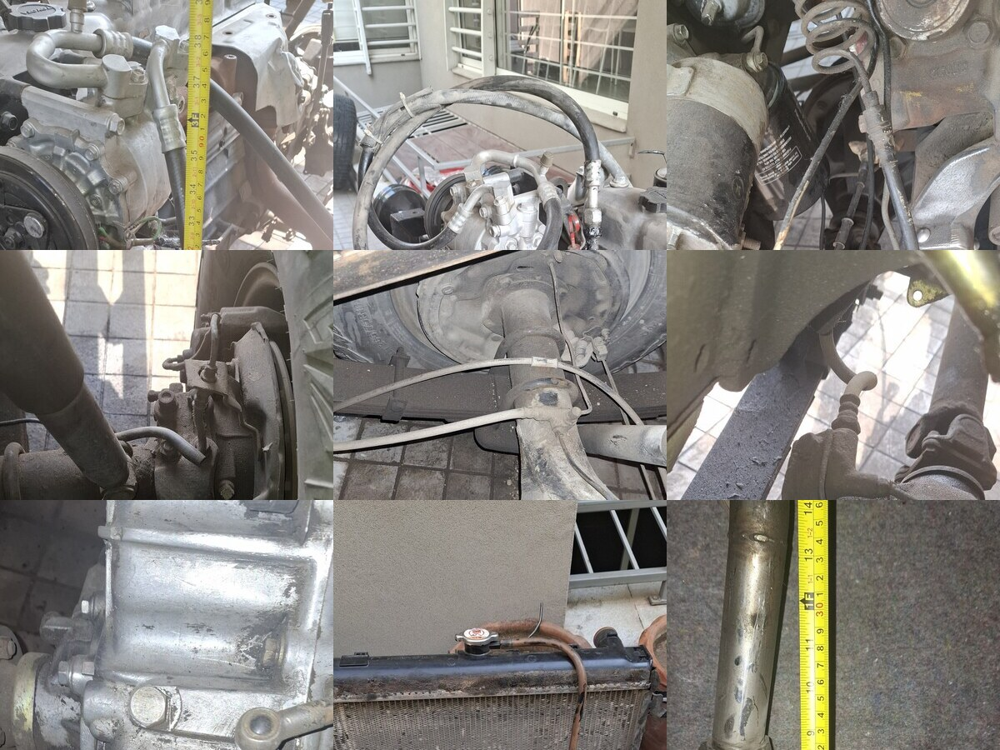

# Local Market Procurement Workstream

Date: 2026-05-04
Workstream id: `local_market_procurement`

Purpose: one short control list for parts that should be sourced in person from Bilal Ganj, Montgomery Road, local auto-electricians, rubber shops, fastener lanes, timber merchants, or machine/fabrication shops.

## Short List

| ID | Photo | Item | Market Ask | Gate |
| --- | --- | --- | --- | --- |
| LMP-01 |  | Compact cabin fuse add-on | Maruti/Mehran-style compact under-dash fuse carrier with cover/legend and pigtails | Same compactness as reusable 12-way donor; 6 clean usable fuse positions; final wiring/cable/terminals are new-only |
| LMP-02 |  | EPS donor kit | Complete 2005-2011 Toyota Vitz/Yaris SCP90/NCP90 column-assist EPS kit | ECU, pigtails, shafts, brackets, bench-test video, seller return terms |
| LMP-03 |  | Captive/clip/rivnut hardware | New plated M6/M8 captive nuts, clip nuts, weld nuts, rivnuts | Match old samples; no rusty reused spring clips |
| LMP-04 |  | Retaining clips/cotters | R-clips, hairpins, split pins, circlips/E-clips, small cotters | Sort old samples by pin diameter and location first |
| LMP-05 |  | Rubber/grommet smalls | New firewall grommets, wiper grommets, rubber/plastic bumpers, pads, isolators | Match ID/OD/height/hardness; reject used, brittle, or wrong-size stock |
| LMP-06 |  | Body-mount leftovers | Sleeves, cup washers, shim stock, captive-thread repair bits | Release only after dry-stack measurements and station closure |
| LMP-07 |  | Shoulder pins/spacers/brackets | Shoulder bolts, sleeves, stand-offs, retainer plates, small brackets | Measure sample geometry; machine/fabricate where no correct donor exists |
| LMP-08 |  | Brake-opening consumables | Line caps/plugs, clear bleed hose, bottle, brake cleaner, rags, gloves, catch tray | Must be on hand before opening hydraulics |
| LMP-10 |  | Mechanical new service-parts order | Oil/filter, fuel filter, radiator cap, belts, standard service consumables; glow plugs are a separate new Toyota/diesel parts-counter order (`19850-68030` x6 primary, `19850-68060` x6 only if 24V/superglow confirmed) | Buy after exact engine/sample confirmation; do not send glow plugs to a donor-yard scout |
| LMP-11 |  | Hose/pipe Longman pack | Moved out of local scouting. Send [Longman Pipe And Hose Order Spec](longman-pipe-hose-order-spec-20260512.md) to Longman Mills for radiator, heater, diesel fuel, vacuum, breather, formed pipe, hard-line support, brake, and clutch quote lines. | Longman quote by exact line ID, dimensions, material rating, sample requirement, and reject rule; brake/clutch flex hoses are complete certified sample-copied hydraulic assemblies only |
| LMP-12 |  | Brake booster / servo reman quote | Quote professionally refurbished/reman 1975-1987 Land Cruiser 40/55/60 dual-diaphragm `44610-60050` / `BBN60050` brake booster for front-disc/rear-drum J40 | Sample-match old booster; verify pushrod, master seat/depth, check valve/grommet, and bench vacuum hold before payment |
| LMP-13 |  | Toolbench / workbench | Stable steel-frame or heavy hardwood toolbench, minimum `1200 x 600 mm` top and `850-950 mm` working height | Must sit flat, not sway, and accept bolt-down vice plus pillar drill mounting |

## Ordered / Track Delivery

| Item | State | Receipt check |
| --- | --- | --- |
| Hardwood cribbing cut set | Ordered pending delivery | Confirm 8 dry dense hardwood blocks plus 4 blunt wedges, flat bearing faces, no wet/soft/board material, and capture merchant/price/ETA. |
| Total TDP133501 pillar drill | Paid, pending delivery | Confirm 350W / 13mm drill press, straight spindle/no visible wobble, locking table, depth stop, and safe 220-240V power. |
| Bench vice / workshop vice | Ordered pending delivery | Capture seller/price/ETA, then confirm bolt-down base, 100-150mm jaws, smooth screw, uncracked casting, and clean/replaceable jaws. |

## Easy Pakistan Leads Checked 2026-05-04

Use these as first-pass sourcing leads only. Confirm seller stock, packaging, ratings, and part numbers before payment.

| Basket / part rows | Easy local lead | Buy position | Source checked |
| --- | --- | --- | --- |
| `part_mech_engine_oil_filter_service` oil filter | `GDO-135` cross-references Toyota `15601-41010`, `15600-41010`, `15600-41020`, but 2H diesel references also point to Toyota `15601-68010`. | Do not buy from photo size alone. Buy `GDO-135` only if the old fitted filter or parts counter confirms the `15600/15601-41010` family. If the old filter/2H counter points to `15601-68010`, use that diesel filter family instead. | [Guard GDO-135](https://www.guardfilters.com.pk/shop/oil-filter-toyota-gdo-135/), [Automize GDO-135](https://automize.pk/products/guard-oil-filter-gdo-135), [Paracha ZC-604 / 15601-68010 local lead](https://paracha.co/catalog/zc-604/), [Toyota 2H diesel 15601-68010 reference](https://parts.elmhursttoyota.com/oem-parts/toyota-genuine-toyota-land-cruiser-diesel-2h-hj60-engine-oil-filter-1560168010) |
| `part_mech_fuel_filter` | Guard `GDF-223`, cross-referenced to Toyota `04234-68010`; this is the Land Cruiser diesel element route to check first. | Easy Pakistan buy through Guard dealer; confirm it is the element/kit required by the fitted filter head. | [Guard fuel filters](https://www.guardfilters.com.pk/guard-fuel-filters/), [HJ47/HJ60 04234-68010 reference](https://landcruisercomponents.com/product/fuel-filter-suitable-for-toyota-landcruiser-diesel-40-60-70-series-04234-68010/) |
| `part_mech_engine_oil_filter_service` engine oil | Choose one sealed heavy-duty diesel oil, not both. Prefer Caltex Delo 15W-40 as the normal first pick; use Liqui Moly Touring High Tech SHPD 20W-50 instead only if the mechanic wants thicker oil for a hot/worn old diesel. | Easy Pakistan buy. Do not mix brands/viscosities for the service. Buy enough sealed volume for one full oil change plus top-up. Reject unsealed/old stock. | [Caltex Delo 400 MGX Pakistan](https://www.caltex.com/pk/motorists/products/delo-400-mgx-sae-15w-40.html), [Automize Caltex Delo Gold Ultra 15W-40](https://automize.pk/collections/engine-oil/products/caltex-delo-gold-ultra-15w-40-multigrade-genuine-heavy-duty-diesel-engine-oil-4l), [Autohub Liqui Moly 20W-50 SHPD](https://autohub.pk/products/liqui-moly-touring-high-tech-shpd-20w-50-5-liter) |
| `part_mech_accessory_belt_set` | Automotive V-belts are easy locally, including Bando/Gates/Mitsuboshi-style stock, but exact 2H belt lengths were not proven online in this pass. | Easy local belt-shop buy after reading the old belt markings or measuring width and effective length. Do not buy by generic Land Cruiser listing alone. | [Daraz Bando belt availability example](https://www.daraz.pk/products/bando-fan-belt-toyota-corolla-xli-gli-1300-cc-2009-2019-made-in-japan-i118770480.html), [Daraz generic V-belt listing example](https://www.daraz.pk/products/v-belt-a-47-i411732817.html) |
| `part_brake_fluid_bleed_consumables` brake cleaner | Brake/parts cleaner cans are easy from Autohub or Daraz. | Easy online buy for cleaner only. Still buy caps, plugs, clear bleed hose, bottle, gloves, rags, and catch tray locally as a complete prep bundle. | [Autohub Liqui Moly brake cleaner](https://autohub.pk/products/liqui-moly-brakes-parts-cleaner-500-ml), [Autohub STP brake cleaner](https://autohub.pk/products/stp-pro-brakes-parts-cleaner-500ml), [Daraz brake cleaner](https://www.daraz.pk/products/brake-cleaner-450-ml-i386631013.html) |
| `part_cabin_compact_fuse_boxes` | Daihatsu Cuore used fuse box is a confirmed Pakistan online donor candidate; Mehran/old Alto/Maruti style remains preferred if found locally. | Easy local lead, but do not buy blind. Ask for rear terminal photos, cover, pigtails, dimensions, and bus isolation before payment. | [PakAutoParts Daihatsu Cuore fuse box](https://pakautoparts.pk/daihatsu-cuore-fuse-box) |
| `part_mech_radiator_hose_set`, `part_mech_heater_hose_set`, `part_mech_fuel_hose_and_clamps`, `part_mech_vacuum_hose_refresh` | Longman Mills is now the preferred quote route for this pack. Other links are fallback/reference only if Longman declines a specific capability. | Send `docs/longman-pipe-hose-order-spec-20260512.md`; demand printed hose rating and reject unmarked hose. Ask for EPDM coolant/heater hose, diesel-rated fuel hose, reinforced vacuum hose, oil-rated breather hose, smooth-band/rolled-edge clamps, and capability confirmation for any metal/hydraulic lines. | [Longman hose pipes](https://www.longman.com.pk/hose-pipes/), [Longman flexible hoses](https://www.longman.com.pk/flexible-hoses/), [Longman automobile parts](https://www.longman.com.pk/automobile-parts/) |
| `part_mech_fuel_hose_and_clamps` hard fuel lines | IPEC in Lahore is a Pakistan-local fuel injection/fuel tubing manufacturer; use only for quote/support, not as a release without sample route and end-style confirmation. | Good local specialist lead for formed/seamless diesel lines. Keep low-pressure hard-line end fittings and route sample-controlled. | [IPEC fuel injection tubing](https://ipec.pk/) |
| `part_body_retaining_clips_cotter_pin_pack` | R-clips/cotters are visible on Daraz and should also be common in fastener lanes. | Easy only for generic top-up packs. For final locations, buy by old sample diameter/length and corrosion finish. | [Daraz R-type cotter pin example](https://www.daraz.pk/products/30pcs-r-type-cotter-pin-galvanized-iron-retaining-pins-spring-clips-1220mm-i167942506.html) |
| `part_fastener_kit_c_captive_clip_nuts` | MBI covers local Pakistan nut manufacturing; rivnut tools are locally listed, but clip/captive nuts still need old-sample matching from fastener lanes. | Call/local market route. Do not assume online rivnut assortment replaces automotive captive/clip nuts. | [MBI fastener nuts](https://mbi-fasteners.com/products/nuts.html), [Imsons Harden nut gun](https://imsons.com.pk/product/harden-hand-nut-gun-16-610150/) |
| `part_firewall_grommet_set_small_medium`, `part_firewall_grommet_set_large_power` | Daraz has assorted grommet listings, but several are overseas/slow. Local rubber/electrical shops remain better for quick top-up. | Verify existing stock first. If still short, buy only the missing IDs: `6/8/10/12/16/20/25 mm`. | [Daraz 260pc grommet assortment](https://www.daraz.pk/products/260pcs-rubber-grommet-assortment-wiring-coil-wire-gasket-m3-m4-m5-m6-m8-m10-m12-i220665437.html), [Daraz 10pc large grommet options](https://www.daraz.pk/products/10-16-20-22-25-27-30-32-35-38-40-42-i631090854.html) |
| `part_mech_radiator_cap` | Exact Toyota `16401-41021` was not found as an obvious Pakistan-stocked online listing in this pass. | Ask Toyota/local radiator shop by `16401-41021` and old cap sample. Do not buy a generic cap unless pressure rating, seal depth, and neck type match. | [Toyota 16401-41021 reference](https://www.toyotapartsdeal.com/oem/toyota~cap~sub~assy~radiator~16401-41021.html) |
| `part_mech_heat_glow_plugs_set` | Exact `19850-68030` new set exists through overseas suppliers; no clean Pakistan-stocked online hit found in this pass. | Use verified Toyota/diesel parts counter first; import fallback if local counter cannot supply new HKT/Denso/Toyota-labelled plugs. Confirm voltage/thread/reach before payment. | [Mag Engines 19850-68030 2H set](https://magengines.com/product/19850-68030-heater-glow-plug-set-toyota-2h-12v-4-0-ltr/), [HKT catalog reference](https://www.hkt-jp.com/images/glow_plug_catalog.pdf) |

## Rules

- Bring old samples or phone photos for every sample-matched item.
- New-only final-install rule: rubbers, hoses, hydraulic assemblies, hard lines, parking-brake cables, electrical wire/cable, terminals, clips, clamps, fittings, grommets, boots, pads, hangers, and similar consumables must be bought new; old parts/photos are samples only.
- Record seller, price, photos, and reject reason if a part is declined.
- Do not substitute bulky universal fuse/relay boxes for compact OEM-style fuse carriers.
- Use the Longman pipe/hose order spec for hose and pipe runs; these are no longer first-pass local-scout items.
- Do not buy optional upgrades through this lane unless a separate workstream approves them.

## Hardwood Cribbing Receipt Check

Use this short table when the ordered wood arrives. Use [suspension-wood-cribbing-merchant-spec.md](suspension-wood-cribbing-merchant-spec.md) only if the merchant or workshop needs the backup drawing pack.

| Part | Qty | Ask | Image |
| --- | ---: | --- | --- |
| `SWC-BLOCK-001` | 8 | Dry hardwood block, `300 x 150 x 75 mm` |  |
| `SWC-CHOCK-001` | 4 | Dry hardwood wedge, `200 x 100 mm`, `75 mm` rear, `25 mm` nose |  |

Reject wet or soft wood, plywood/MDF/chipboard, cracked pieces, rocking faces, and feather-edge wedges.
