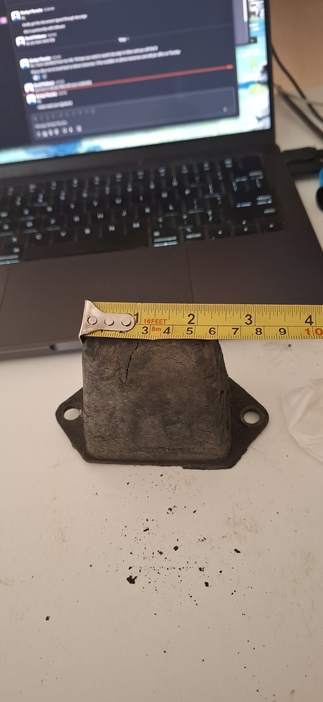
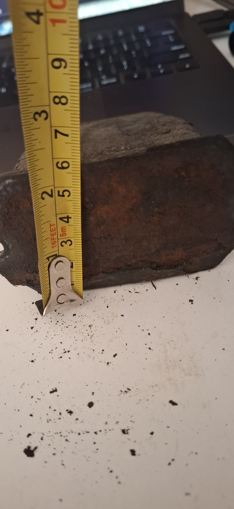
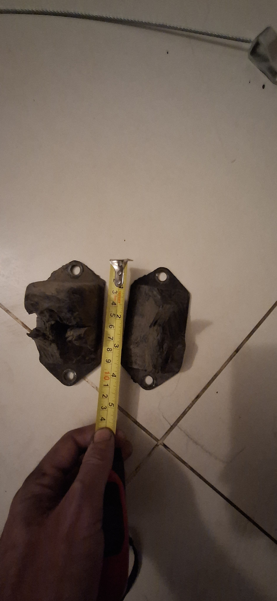
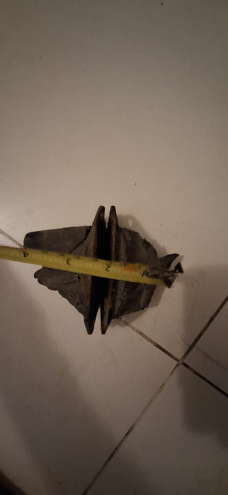

# Longman Rubber Order Spec - 2026-05-08

> **Superseded for supplier use on 2026-07-26.** Use
> `docs/rubber-manufacturer-order-spec-20260726.md`. The current supplier
> order contains only body pads, front-support oval pads, and underfloor
> strips. Hoses and bump stops are excluded.

Purpose: send one consolidated custom-rubber manufacturing request to Longman for the current J40 body/front-support/chassis rubber batch, with the bump-stop rubber updated to match the May 31 exact front-stop photos and the May 29 removed-fixture support photos.

Supplier fit: Longman Mills lists custom rubber parts, automobile parts, rubber-to-metal bonded parts, hose pipes, and rubber testing capability, so this pack asks them to quote the rubber pieces and advise what samples or steel inserts they need before final production.

Longman site references:

- https://www.longman.com.pk/
- https://www.longman.com.pk/products/
- https://www.longman.com.pk/about-us/
- https://www.longman.com.pk/automobile-parts/

## Release Position - 2026-05-29

The old-rubber photos and ruler measurements are accepted as the dimensional basis for quote and first articles. The remaining open items are station fit and stack-release checks, not missing rubber dimensions.

May 17 loose-strip ruler photos show the underfloor strip length at about `16.5 in` (`419 mm`), so the `FS-STRIP-L/R` first-article length is corrected to `420 mm`. Width and thickness remain `38 W x 8 T mm`; any end trim, holes, slots, bonding, or retainer remake still requires dry-fit or a direct retainer trace.

Use this distinction:

- `Released for quote / first article`: Longman can quote and make the part from the dimensions in this spec.
- `Station fit pending`: before full production or final trimming, the mechanic must map the part to its vehicle position and confirm footprint, sleeve/cup/shim stack, and dry-fit compression.
- `Hold`: do not quote or fabricate until a real sample, installed position, or full-length trace is identified.

For this Longman order, the single `80 x 80 x 24` body-pad line, `FS-OVAL`, `FS-STRIP-L`, and `FS-STRIP-R` are released for quote and first article. The smaller `BM-ISO-SM` / `22 mm` body-rubber line is removed. The two bump-stop families are released for first-article discussion using the usable May 31 front-stop construction: broad molded rubber body on a metal backing/fixture with two exposed mounting ears, central metal fixture/channel interface, rounded/asymmetric sides, and vehicle-measured strike position. Rear/back stops use the same front-stop shape made longer. `BODY-LINER-FULL-WIDTH-HOLD` and `EXH-HGR-90917` remain hold-only.

## Vehicle Location And Kit Check

The current Toyota GR Heritage 40-series list checked on 2026-05-28 does not expose a complete body/chassis rubber kit for this area. Toyota EPC-style body-mount rows and aftermarket suppliers do show normal NO.1-NO.5 body-mount cushion/spacer/shim families and early/late 40-series kit splits, but no checked source replaces the need to map this vehicle's stations, sleeves, cups, shims, and dry-stack height. Therefore the active route remains the single Longman custom rubber bundle unless the project deliberately switches to a complete matched OE/reproduction package.

Checked sources:

- Toyota GR Heritage Land Cruiser 40 parts list: https://toyotagazooracing.com/-/media/TMC/tgr/global/contents/gr/heritage/pdf/2024/Landcruiser40_en.pdf
- Toyota EPC-style BJ40 cab/body mounting row: https://toyota-general.epc-data.com/land_cruiser/bj40/8406/body/5251/52254/
- Toyota 90560-12009 body-mount spacer listing: https://www.toyotapartsdeal.com/oem/toyota~spacer~for~body~mount~no~2~cushion~90560-12009.html
- Example late-40 aftermarket body mount kit split: https://shop.cruiserparts.net/index.php?main_page=product_info&products_id=1821

Vehicle location controls:

- Single `80 x 80 x 24` body pad: main tub-to-chassis mount stations, ordered as a generous flat-square batch so any station that proves low can use a two-pad stack during dry-fit.
- `FS-OVAL`: separate front support / nose-extension isolator positions, left and right, not the main tub body-mount stack.
- `FS-STRIP-L/R`: left and right underfloor front-support/body-support strip landings beside the front support pickups.
- `BUMP-60010-LONG`: rear/back long-family axle-to-chassis bump-stop stations, plus any Toyota-controlled front-left long station if confirmed on this vehicle.
- `BUMP-60020-SHORT`: exact front/right-front axle-to-chassis bump-stop station.
- `BODY-LINER-FULL-WIDTH-HOLD`: unknown full-width body/panel liner path; hold until a real strip or installed path proves it.
- `EXH-HGR-90917`: exhaust tailpipe/rear support hanger reference; hold until sample or fitted support geometry proves it.

Location and complete drawing previews are included in the handoff:

- `data/manual/fabrication/rubber_recreation_rev_a/chassis_rubber_current_order_preview_rev_a.svg`
- `data/manual/fabrication/rubber_recreation_rev_a/chassis_rubber_location_map_rev_a.svg`
- `data/manual/fabrication/rubber_recreation_rev_a/chassis_rubber_all_drawings_preview_rev_a.svg`

## Copy/Paste Request

Need quote and manufacturing advice for custom new rubber parts for an older Toyota Land Cruiser J40 restoration. The body-to-chassis pieces are simple flat isolator pads, not precision socket-matched bushings. For the custom order, use square flat pads as the preferred shape because there is no visible molded chassis/tub socket that needs a round outside profile. The important controls are installed height, sleeve/hole fit, rubber firmness, flat bearing area, and no overhang onto bends, seams, weld lips, or thin/rusted edges.

Please quote the required rubber parts below, plus optional spares where listed. The measured old-rubber dimensions are the quote and first-article basis. Rubber must be new black solid automotive mount-grade compound. No tyre rubber, crumb rubber, sponge/foam, EVA, recycled offcuts, used rubber, or unknown old stock.

Keep the main body rubbers simple: one plain `80 x 80` square body-pad size only. The smaller `22 mm` body-rubber line is removed from the active order. Some stations may prove during dry-fit that they need two pads stacked, so quote `30` total `80 x 80 x 24` pieces now rather than creating new ribbed, sculpted, or station-specific body-rubber shapes.

For the body/front-support isolators, target hardness is Shore A 60 +/-5. For axle bump stops, target hardness is Shore A 70 +/-5 rubber using the May 31 exact front-stop shape and construction: metal-backed mounting ears, central metal fixture/insert interface, rounded/tapered sides, and a flat strike area. Rear/back stops use the same shape made longer.

Steel body-mount washers/cups, sleeves, shims, bolts, and fasteners are not part of this Longman order. Existing body-mount washers will be inspected separately. For bump stops, the user has provided front-stop measurement photos plus removed fixture-support photos. The usable photos give provisional nominals of `70 mm` long-family sample height, `110 mm` metal backing/fixture length, `65 mm` molded-rubber span along the mounting-hole axis, and `90 mm` metal mounting-hole pitch. These values are photo readings to roughly the nearest `5 mm`; hole diameter, thread, transverse width, plate thickness, fixture-channel detail, and vehicle offsets remain direct-measurement items. Copy the metal-backed mounting layout and central fixture/channel interface from the usable May 31 set, use the May 29 photos as fixture/interface support only, then trace or reuse the metal fixture separately. Exclude `20260531_171833_gp_Vw96I7Mg`, which is an unrelated laptop image.

## Three Things To Order

Ask Longman for three supplier-facing order groups. The detailed part IDs in the quote table remain the drawing, label, and first-article controls.

| Order thing | Contains | Qty to quote | Supplier note |
| --- | --- | --- | --- |
| 1. Simple `80 x 80` body pads | Single active body-pad size; smaller `22 mm` line removed | `30` pads at `80 x 80 x 24` | Plain square pads only. Batch includes enough extras for two-pad stacks, trimming, and test fitting where a station proves it needs them. |
| 2. Front support / body-support rubbers | `FS-OVAL` plus `38 x 8` strip stock for `FS-STRIP-L/R` | `2` oval pads; `2 m` of `38 x 8` strip stock, with two `420 mm` strips cut from it | Keep front support rubbers separate from main body pads. Extra strip stock is intentional because the strip run may not be perfectly straight and needs trim allowance. |
| 3. Bump stops | `BUMP-60010-LONG` and `BUMP-60020-SHORT` | `3` long stops; `1` short/front stop | Use the May 31 exact front-stop shape; rear/back stops are the same shape made longer. |

## Required Quote Table

| ID | Part | Required Qty | Optional Spare Qty | Rubber definition | 3D envelope | Edge/profile control | Hole / insert status | Material |
| --- | --- | ---: | ---: | --- | --- | --- | --- | --- |
| `BM-ISO-LG` | Single active `80 mm` main body isolator pad | `12 base pads` | `18 stacking/trim spares` | Square flat body isolator pad; flat parallel top and bottom bearing faces. Smaller `BM-ISO-SM` / `22 mm` line removed from order. Use a second identical pad only where dry-fit proves a station needs extra height. | `80 L x 80 W x 24 H mm`; production `18.0 mm` bore on centre. | Plan corners `R1.5`; top/bottom perimeter edge break or chamfer `1.0 mm` max; no ragged cut edges. | Production `18.0 mm` through bore for Toyota `90560-12009` style body-mount spacer. | Solid EPDM or NR/SBR, Shore A `60 +/-5`. |
| `FS-OVAL` | Two-hole front-support isolator pad | `2` | `0` | Oval/capsule front-support isolator pad. | `96 L x 64 W x 15 T mm`; capsule ends `R32`; two `12 mm` holes at `64 mm` centres; optional `36 x 18 R3` relief only if sample confirms. | Outer perimeter edge break `0.5-1.0 mm`; clean punched hole edges; relief edges `R3` if relief is released. | Confirm whether old insert/boss is bonded, loose, or just washer imprint before production. | Solid EPDM or NR/SBR, Shore A `60 +/-5`. |
| `FS-STRIP-L` | Underfloor body-support strip liner, left | `1 cut piece` | Shared `2 m` stock order | Plain flat underfloor body-support strip; no stepped section. | Cut `420 L x 38 W x 8 T mm` from the `38 x 8` strip stock after dry-fit because the installed run may not be perfectly straight. | Plan corners `R1.5`; top/bottom edge break `0.5-1.0 mm`; smooth cut edges; flat parallel faces. | No through-holes in rubber by default. Reuse or trace the slotted steel retainer separately if needed. | Solid EPDM or NR/SBR strip, Shore A `60 +/-5`. |
| `FS-STRIP-R` | Underfloor body-support strip liner, right | `1 cut piece` | Shared `2 m` stock order | Plain flat underfloor body-support strip; same blank as left unless dry-fit proves handed trim. | Cut `420 L x 38 W x 8 T mm` from the same `38 x 8` strip stock after dry-fit; allow handed/non-straight trim only if the vehicle proves it. | Plan corners `R1.5`; top/bottom edge break `0.5-1.0 mm`; smooth cut edges; flat parallel faces. | Same retainer rule as left; do not invent slot geometry in the rubber. | Same batch/type as left strip. |
| `BUMP-60010-LONG` | Rear/back bump stop using same front shape, longer | `3` | `0` | Usable May 31 front-stop molded rubber body, made longer: metal backing/fixture with two exposed mounting ears, central fixture/channel interface, broad rounded body, and flat strike area. | `70 H mm` external height; photo-survey screening values are `~110 mm` fixture length, `~65 mm` rubber span along the mounting-hole axis, and `~90 mm` mounting-hole pitch. Transverse width, hole diameter/thread, fixture channel, and strike-face `X/Y` remain direct-measurement controls. | Same rounded/asymmetric/tapered front-stop body stretched taller, not a sharp block. | Mounting pitch is provisional only; caliper the hole diameter and identify the holder thread before hardware release. Central fixture/interface, base footprint, and strike-face offset require sample/vehicle confirmation. | NR/SBR bump-stop rubber Shore A `70 +/-5`; reproduce any sample-proven insert/fixture retention method. |
| `BUMP-60020-SHORT` | Exact front/right-front axle-to-chassis bump stop | `1` | `0` | Same metal-backed front-stop molded rubber construction at the short height. | `60 H mm` external height remains the Toyota-family control; the photographed `~70 mm` sample does not release short-stop height. Shared footprint screening values are `~110 mm` fixture length, `~65 mm` rubber span, and `~90 mm` pitch pending direct verification. | Same rounded/tapered front-stop family at the short height. | Same metal mounting-ear, fixture/channel, base, and contact rules as long stop; right-front vehicle measurements control final contact offset. | Same compound family as long stops; reproduce any sample-proven insert/fixture retention method. |
| `BODY-LINER-FULL-WIDTH-HOLD` | Long/full-width flat body or panel liner strips | Hold | Hold | Not yet captured as orderable pieces. Quote only after the actual strips are found or the body/chassis station proves a continuous flat anti-squeak liner is required. | Hold: needs measured `L x W x T` and any holes/slots from actual piece or installed path. | Hold: edge radius/chamfer, end trim, and slot edges must come from actual trace. | Needs full-length trace, holes/slots, side/orientation labels, and installed location photos. | EPDM or NR/SBR flat strip, hardness by function after location is confirmed. |
| `EXH-HGR-90917` | Exhaust teardrop hanger cushion | Hold | Hold | Optional later teardrop rubber-metal exhaust cushion only if sample or installed geometry releases final shape. | Hold target `48 W x 86 H x 22 T mm`; top hole `9 mm`; lower hanger slot `16 x 22 mm` unless sample proves otherwise. | Radiused teardrop perimeter; clean radiused hole/slot edges; reinforcement/insert detail sample-controlled. | Needs old/genuine sample, installed support-point measurements, or a proper tracing before quoting production. | Heat/vibration-resistant exhaust-hanger rubber, Shore A `60 +/-5`. |

## Release Status Summary

| ID | Dimensional status | What can happen now | What must close before final production/install |
| --- | --- | --- | --- |
| `BM-ISO-LG` | Released as the single active `80 x 80 x 24` body-pad envelope. Smaller `BM-ISO-SM` line removed. | Quote `30` pieces total and make one first article or the quoted batch with extra dry-fit stacking spares. | Confirm station count, landing footprint, sleeve/cup/shim stack, any two-pad station, and dry-fit compression. |
| `FS-OVAL` | Released for quote/first article from the measured old front-support pad dimensions. | Quote and make one first article. | Caliper-check physical sample for hole centres, thickness, insert/boss, and whether the relief is real before making final pair. |
| `FS-STRIP-L/R` | Released for first article from May 17 measured old strips and installed-location photos. | Quote `2 m` of plain `38 x 8 mm` strip stock and cut two `420 mm` first articles from it. | Dry-fit on actual landings; allow for a non-perfectly-straight run; apply only proven end/edge trim; keep leftover stock for similar strip landings; trace/reuse steel retainers separately. |
| `BUMP-60010-LONG` | May 31 front-stop shape released as the visible master; rear/back is same shape longer; final dimensions/contact are not released. | Quote/advice and one long first article after sample/fixture caliper and vehicle bracket measurements. | Measure BL/BW/P/D/X-Y/G/F plus central fixture/channel values and pass compression/fit tests. |
| `BUMP-60020-SHORT` | Exact front-stop construction released from May 31 photos; right-front height/contact remain vehicle checked. | Quote/advice and one front/right-front first article after sample/fixture caliper and vehicle bracket measurements. | Measure right-front BL/BW/P/D/X-Y/G/F plus central fixture/channel values and pass compression/fit tests. |
| `BODY-LINER-FULL-WIDTH-HOLD` | Not released. | No supplier action. | Find the actual long/full-width strip or prove the installed path and dimensions. |
| `EXH-HGR-90917` | Reference shape only. | No Longman production unless a sample or installed support geometry is available. | Sample/trace thickness, insert/reinforcement, pin/slot geometry, and exhaust support alignment. |

## Body Isolator Rules

The body pads are not shape-matched to a molded chassis socket. The important controls are:

- Free height and installed compression.
- Matching hardness across the set.
- Central `18.0 mm` bore for Toyota `90560-12009` style body-mount spacer.
- Explicit 3D envelope (`L x W x H/T`) and edge profile for every released rubber line.
- Enough footprint to cover the tub/chassis landing faces.
- No overhang onto bends, seams, weld lips, captive nut repairs, or rust-thinned edges.
- Bolt clamps through the steel sleeve, not by crushing rubber until metal contact.

For initial quote, use the square dimensions in the table. If any station needs corner trimming or a relieved edge, release that exact trimmed shape after the landing-face photos are checked.

2D SVG/DXF controls for the current square body pads are `data/manual/fabrication/rubber_recreation_rev_a/bm_iso_sm_square_pad_rev_a.*` and `data/manual/fabrication/rubber_recreation_rev_a/bm_iso_lg_square_pad_rev_a.*`. The active-current preview is `data/manual/fabrication/rubber_recreation_rev_a/chassis_rubber_current_order_preview_rev_a.svg`, the complete dashboard preview is `data/manual/fabrication/rubber_recreation_rev_a/chassis_rubber_all_drawings_preview_rev_a.svg`, and the vehicle-use map is `data/manual/fabrication/rubber_recreation_rev_a/chassis_rubber_location_map_rev_a.svg`. 3D model files for the current quote geometry are in `data/manual/fabrication/rubber_recreation_rev_a/models_3d/`. The body-pad models default to `hole_d = 18.0`, based on Toyota `90560-12009` spacer evidence. Production release uses the 18.0 mm bore; `hole_d = 0` is a non-release CAD override only.

## Bump Stop Shape

The current controlling local photos are the May 31 exact front-stop measurement photos:

The May 29 removed-sample photos are supporting fixture/interface evidence after unscrewing from the metal fixture:

Supporting side/profile view:

Use the May 31 front-stop photos as the active shape master for both bump-stop heights. They show the front-stop body, metal mounting-ear layout, fixture plate, height/profile, and mould shape. Photo transcription gives approximately `70 mm` long-sample height, `110 mm` metal-fixture length, `65 mm` rubber-body span along the mounting-hole axis, and `90 mm` mounting-hole pitch. These are nearest-`5 mm` photo readings for identification and first-fit screening, not manufacturing tolerances. The May 29 photos remain supporting fixture/interface evidence after the metal fixture was unscrewed. Final hole diameter/thread, transverse width, fixture-channel dimensions, and strike-face offset still require calipers, a thread gauge, the removed fixture, and vehicle measurements.

Provisional Longman quote shape for bump stops:

| Feature | Long `48304-60010` family | Short `48304-60020` family |
| --- | --- | --- |
| Quantity | `3` total: front-left, rear-left, rear-right | `1` total: front-right |
| Free height | `70 +/-1 mm` | `60 +/-1 mm` |
| Mounting interface | Metal backing/fixture with two exposed mounting ears plus central fixture/channel interface copied from the usable May 31 front-stop photos; photo pitch `~90 mm c-c`, but caliper hole diameter and identify the threaded holder before hardware release | Same front-stop family; right-front bracket controls any local difference |
| Rubber profile | Broad low front-stop body with rounded/asymmetric plan, tapered/radiused sides, and cleaned-up sample strike area, stretched to `70 mm` for rear/back long family | Same front-stop profile at the `60 mm` height |
| Strike face | Flat rectangular lower face, centred on axle strike pad within `+/-5 mm` | Same |
| Production release | One `70 mm` first article first, fitted to the vehicle bracket | One `60 mm` first article first, fitted to the vehicle bracket |

Reference controls checked:

- ToJo `48304-60010` lists the long stop for left-front and rear axle positions and gives `Height = 70mm`.
- ToJo `48304-60020` lists the right-front stop and gives `Height = 60mm`; it also warns some aftermarket right-front stops are wrongly made at `70mm`.
- Cruiser Corps describes the long stop as fitting both rear positions and the left front; for the right front it notes the shorter factory-spec stop.
- City Racer lists the set mapping as front-left `48304-60010`, front-right `48304-60020` shorter, rear-left `48304-60010`, rear-right `48304-60010`.
- Nengun confirms `48304-60010` as a genuine Toyota spring bumper reference with Land Cruiser 40 fitment.

Links:

- https://www.tojo4wdcentre.com.au/part-shop/view/2008/201/parts-suitable-for-landcruiser/landcruiser-hj45-troop-4-79-7-80/48304-60010-bumper-stop-front-lh-rear-axle-to-chassis-suitable-for-landcruiser-40-45-55-series
- https://www.tojo4wdcentre.com.au/part-shop/view/2009/85/parts-suitable-for-landcruiser/landcruiser-bj40-9-77-7-80/48304-60020-bumper-stop-front-rh-front-axle-to-chassis-suitable-for-landcruiser-40-45-series
- https://cruisercorps.com/products/axle-bump-stop-long
- https://www.cityracerllc.com/products/spring-bump-stop-for-58-to-80-land-cruiser-fj40
- https://www.nengun.com/oem/toyota/48304-60010

## Required Measurements Before Final Production

These are the exact photos/measurements to collect and send with the old parts.

### Body Isolator Stations

For every body-mount station:

- Label station: front-left, front-right, middle-left, middle-right, rear-left, rear-right, plus any extra cowl/front-support point.
- Square-on photo of tub-side landing face with ruler.
- Square-on photo of chassis-side landing face with ruler.
- Maximum flat footprint available before bends, seams, weld lips, captive-nut repairs, or rust-thinned edges.
- Desired rubber free height at that station, or old rubber height if a best sample survives.
- Bolt size and whether the station uses captive nut or through-bolt.
- Old crush-sleeve OD/ID if available, only to confirm the Toyota `90560-12009` family or give a local machinist the OD to copy.
- Confirm the released `18.0 mm` Longman bore clears the sleeve without allowing stack wander.
- Confirm the released square `80 x 80` pad footprint fits, or record which exact corners/edges need trimming.

These are local vehicle checks only. They do not reopen the body-pad bore or sleeve
length spec: quote production pads with an `18.0 mm` bore for Toyota `90560-12009`
style spacers, and use `48.1 mm` sleeves.

### Front Oval Pads

- Top photo of each old oval pad with ruler.
- Caliper length, width, and thickness.
- Hole edge-to-edge or centre-to-centre measurement for the two holes.
- Hole diameter.
- Photo/measurement of any metal insert, boss, or relief.
- Confirmation whether the rectangular relief is functional or only deformation from the old stack.

### Underfloor Body-Support Strip Pair

- Order `2 m` of the same `38 x 8 mm` strip stock and cut the released `420 x 38 x 8 mm` left/right first articles from that stock after dry-fit, allowing for a non-perfectly-straight landing path.
- Mark orientation, side, and any local end trim only after the first dry-fit on the actual crossmember landing.
- Reuse the original slotted steel retainers if they are serviceable; if not, trace them directly before remaking steel.
- Do not punch holes or slots through the rubber unless the installed sample proves the original rubber itself was pierced.

### Long / Full-Width Flat Liners

These are not yet released for order. If the longer flat pieces are found, collect this set before asking Longman to quote them:

- Location photo showing the full installed path: tub-to-chassis, front apron/nose support, floor crossmember, rear sill, or panel-to-panel joint.
- Full-length photo with tape measure visible end to end.
- Close photos of both ends, any holes/slots/notches, and the contact face marks.
- Quantity, side, orientation, and whether each piece is handed or full body width.
- Length, width at several points, thickness, hole/slot size, hole centre distances, and edge radii.
- Whether the rubber was loose, bonded, clipped, trapped under bolts, or glued.
- Compression gap or witness marks showing whether it acts as a body isolator, anti-squeak liner, seal, or packing strip.

### Bump Stops

For each station, take a new close photo set after cleaning:

- Wide station photo: front-left, front-right, rear-left, rear-right.
- Square-on bracket photo with ruler/caliper.
- Bolt/stud hole photo with ruler across centres.
- Side photo showing bracket face, axle strike pad, and current gap.
- Loaded ride-height gap after suspension is fitted.
- Safe near-full-bump photo or measurement to confirm the stop contacts before shock bottoming, tyre/body contact, spring/shackle bind, brake-hose strain, or metal contact.

Record these bump-stop values:

| ID | Measurement | Use |
| --- | --- | --- |
| `BL` | Rubber body / fixture landing length | Rubber body outline, mould base, and fixture seat |
| `BW` | Rubber body / fixture landing width | Rubber body width and central fixture/channel clearance |
| `P` | Metal fixture-ear mounting-hole pitch centre-to-centre (`~90 mm` photo nominal), confirmed against vehicle bracket | Fixture alignment; direct measurement controls manufacture |
| `D` | Rubber through-hole diameter or stud/bolt thread, confirmed against vehicle bracket and fitted fastener | Rubber clearance and fixture fastener control |
| `X/Y` | Strike-pad centre offset from rubber-hole/fixture/bracket features | Contact face location |
| `G` | Loaded stop gap | Ride-height clearance |
| `F` | Near-full-bump clearance | Confirms stop acts before hard limits |

## Acceptance Requirements

For the Longman batch:

- Supplier provides material declaration: compound family and Shore A target.
- Make one first article of the single `80 x 80 x 24` body pad, one `FS-OVAL`, one `BUMP-60010-LONG`, and one `BUMP-60020-SHORT` before full batch if moulding/custom cutting is required.
- Body/front-support pieces average `55-65 Shore A`.
- Bump-stop rubber averages `65-75 Shore A`.
- Faces on body pads are flat and parallel within `0.5 mm`.
- Holes are drilled/punched cleanly; no burnt, torn, or cracked hole edges.
- Bump-stop first articles match the usable May 31 front-stop construction, the metal mounting holes align with the threaded holder/bracket without forcing or bolt bottoming, the central fixture/channel interface is captured without tearing or rocking, and the rubber passes 50 percent compression without cracking or permanent collapse; after 30 minutes unloaded, height recovers to at least 90 percent.
- Parts are bagged/labeled by ID and side/station.

## Excluded From This Longman Rubber Order

- Body-mount cup/seat washers.
- Body-mount crush sleeves.
- Body shims/spacers.
- Bolts, nuts, weld nuts, and captive-thread repairs.
- Any rubber outside this body/front-support/chassis custom-rubber subset unless `data/manual/rubber_ordering_specs.csv` explicitly moves that row into this supplier route.
- Brake hoses, fuel hoses, coolant hoses, and formed metal pipes. Those are now controlled separately in `docs/longman-pipe-hose-order-spec-20260512.md`.
- Grommets, pass-through seals, powertrain mounts, suspension bushes, steering bushes, intake ducting, floor/body plugs, pedal rubbers, HVAC hoses/ducts/O-rings, and other sealing rubber. Those are controlled in `data/manual/rubber_ordering_specs.csv` by rows `RUB-003` through `RUB-017` and `RUB-023` through `RUB-028`.
- Door/window/weatherstrip, hardtop/roof/tub seals, bonnet/apron bump rubbers, and rear ambulance/barn door seals. Those are now controlled separately in `data/manual/rubber_ordering_specs.csv` rows `RUB-018` through `RUB-021` and `RUB-029` through `RUB-032`.
- Exhaust hanger/cushion rubbers, unless a physical sample or installed support-point measurement set is available. Current exhaust rubber control is `RUB-022`; `EXH-HGR-90917` stays hold-only for this Longman batch.
