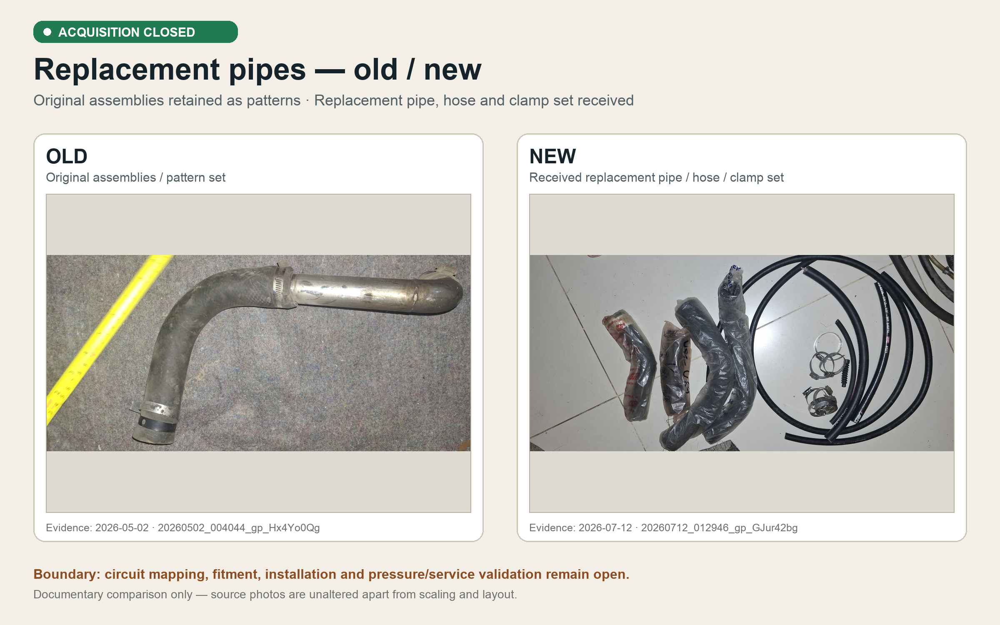

# Replacement pipes — old/new evidence comparison

## Status

The replacement-pipe ordering/acquisition job was marked closed on 2026-08-16. The original assemblies remain the physical patterns, and the replacement pipe, hose, and clamp set is recorded as received.

## Source evidence

- **Old / original pattern set:** [`20260502_004044_gp_Hx4Yo0Qg.jpg`](../photos/20260502_004044_gp_Hx4Yo0Qg.jpg), photographed 2026-05-02.
- **New / received replacement set:** [`20260712_012946_gp_GJur42bg.jpg`](../photos/20260712_012946_gp_GJur42bg.jpg), photographed 2026-07-12.
- **Supplementary received-set view:** [`20260712_163133_gp_KjVxhYfQ.jpg`](../photos/20260712_163133_gp_KjVxhYfQ.jpg), photographed 2026-07-12.

## Completion boundary

This closes the ordering/acquisition job only. It does not establish one-to-one circuit assignment, material or diameter suitability, routing, fitment, installation, or pressure/service validation. Those checks remain open under the replacement-pipes workstream.
